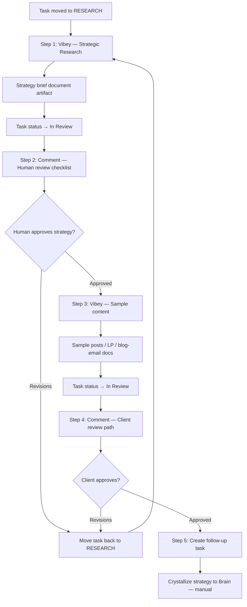

# Strategic Research Loop (Pre-built Flow)

**Template key:** `agency-strategic-research`  
**Display name:** Strategic Research  
**Category:** Agency preset (`agency_ops`)  
**Source:** Marketing space workflow (Sefi), added 2026-07-01

## What it does

This is a pre-built **Loop / Flow** automation for agency client work. When a Space task moves to the **Research** status, Vibey runs a full strategic research pipeline: brand research, audience definition, competitive analysis, ad-library research, and a strategy brief — then human review, sample content for the client, and a follow-up task to crystallize the approved strategy into Brain.

It installs as an **editable draft** (`is_draft: true`, `enabled: false`). You pick a Space, install from Browse, publish when ready.

## Where to find it

| Surface | Path |
|--------|------|
| Flows Browse tab | `/flows` → Browse → **Strategic Research** (badge: Agency preset) |
| API catalog | `GET /api/automations/templates` or `GET /api/spaces/:id/automations/templates` |
| Install | `POST /api/spaces/:id/automations/templates/agency-strategic-research/install` |
| Source of truth | `apps/api/src/modules/spaces/data/space-automation-template-catalog-agency.ts` |
| DB seed | `supabase/migrations/20260701120000_agency_strategic_research_template.sql` |

## Trigger

```json
{
  "type": "status_change",
  "to": "research"
}
```

**When it fires:** A task in the Space changes status to **Research** (`research` status option ID).

**Context available to all steps:** `{{task.title}}`, `{{task.description}}`, and other task fields from the triggering item.

---

## End-to-end pipeline



---

## Automation steps (5 actions)

The flow has **5 sequential automation actions**. Steps 1 and 3 are agent runs; steps 2 and 4 are review comments; step 5 creates a manual follow-up task.

### Step 1 — Strategic research (Vibey agent)

| Field | Value |
|-------|-------|
| Action type | `send_to_agent` |
| Agent | `vibey` |
| Priority | `high` |
| Output | `document_artifact` (strategy brief saved as Space Doc / deliverable) |
| Continuation | `after_task_completes` (flow waits for agent to finish) |
| On complete | Task moves to `in_review` |
| Collaboration | `agent_collaboration: allowed` (may delegate to other agents) |
| Brain context | `extended_brain_knowledge: true` (grounds run in User/Company/Customer/Agent Brain) |

**Prompt instructs Vibey to run five research phases:**

1. **Brand research** — What they sell: messaging pillars, offer positioning, proof points, tone, brand guidelines.
2. **Audience / ICP** — Who they sell to: customer avatars, pain points, desired outcomes, objections, buying triggers.
3. **Competitive research** — Similar brands, strengths, gaps, market patterns, unique opportunity for this client.
4. **Ad library research** — Meta, Google, TikTok, and other visible ads where available: hooks, angles, offers, creative patterns, gaps.
5. **Strategy compilation** — Document outline covering how it works, what it looks like, and talking points for funnels, ads, content, landing pages, blog, and email.

**Deliverable:** Concise strategy brief + recommended next steps for human review.

**Template tokens used:**
- `{{task.title}}` — client/task name
- `{{task.description}}` — scope from task notes/description

---

### Step 2 — Human review comment (strategy)

| Field | Value |
|-------|-------|
| Action type | `add_comment` |
| Runs | Immediately after Step 1 completes |

**Comment posted to the task:**

> Strategic Research is ready for human review.
>
> Review checklist:
> - Approve the overarching strategy, or request revisions.
> - If approved, use the sample-content step/task to demonstrate the strategy to the client.
> - If revisions are needed, add feedback here and move the task back to RESEARCH. The revision pass should combine feedback and return to Step 4: ad library and competitive research.
> - After final approval, crystallize the approved strategy to Brain manually as the overarching strategy.

**Human actions at this gate:**
- **Approve** → flow continues to Step 3 (sample content).
- **Request revisions** → add feedback on the task, move status back to **RESEARCH** → Step 1 re-runs (revision pass should focus on ad library + competitive research per the comment).

---

### Step 3 — Sample content (Vibey agent)

| Field | Value |
|-------|-------|
| Action type | `send_to_agent` |
| Agent | `vibey` |
| Priority | `high` |
| Output | `document_artifact` |
| Continuation | `after_task_completes` |
| On complete | Task moves to `in_review` |
| Collaboration | `allowed` |
| Brain context | `extended_brain_knowledge: true` |

**Prompt instructs Vibey to create client-facing samples:**

1. Sample social posts  
2. Sample landing page section or page copy  
3. Sample blog or email content  

Uses latest strategy context and review notes from the task. Purpose: demonstrate the strategic direction clearly to the client.

**Template tokens:**
- `{{task.title}}`

---

### Step 4 — Client review comment (samples)

| Field | Value |
|-------|-------|
| Action type | `add_comment` |
| Runs | After Step 3 completes |

**Comment posted:**

> Sample strategy content is ready for client review.
>
> Client review path:
> - If approved, crystallize the approved strategy to Brain manually as the overarching strategy.
> - If revisions are needed, add client feedback here and move the task back to RESEARCH. The revision pass should combine feedback and return to Step 4: ad library and competitive research.

**Human actions at this gate:**
- **Client approves** → proceed to Brain crystallization (Step 5 task + manual Brain save).
- **Revisions** → feedback + move to **RESEARCH** → re-enter research loop.

---

### Step 5 — Brain crystallization follow-up task

| Field | Value |
|-------|-------|
| Action type | `create_task` |
| Title | `Crystallize approved strategy to Brain: {{task.title}}` |
| Status | `todo` |
| Priority | `high` |

Creates a **separate todo task** reminding the team to manually save the approved strategy to Brain as the overarching client strategy.

> **Note:** Automated Brain write/crystallization is not compile-ready in the Flow engine today. The template intentionally uses a manual follow-up task rather than a `create_strategy_node` or Brain-write action.

---

## Revision loop behavior

The template is designed for **two review gates** with a shared revision path:

| Gate | Who reviews | On revision |
|------|-------------|-------------|
| After Step 1 | Internal team (strategy brief) | Comment + move task → RESEARCH |
| After Step 3 | Client (sample content) | Comment + move task → RESEARCH |

When status returns to **RESEARCH**, the trigger fires again and **Step 1 re-runs**. Revision guidance tells Vibey to incorporate feedback and **re-emphasize Step 4 (ad library) and Step 3 (competitive research)** from the original research prompt.

---

## Agent & artifact behavior

- **`document_artifact`** — Agent uses `save_document`; output appears in task activity and Deliverables & media.
- **`continuation: after_task_completes`** — Automation pauses until the agent run finishes; later steps do not run on partial output.
- **`completed_status: in_review`** — Status change is owned by the agent step (not a separate `change_status` action).
- **`extended_brain_knowledge`** — Injects searchable Brain context into the agent prompt for both Vibey runs.

---

## Install & publish checklist

1. Open `/flows` → Browse → install **Strategic Research** into target Space.
2. Confirm Space has a **Research** and **In Review** status (or map equivalents in the flow editor).
3. Review/edit prompts in the draft JSON if needed.
4. Publish the flow (`is_draft: false`, `enabled: true`).
5. Create or move a client task to **Research** to start the pipeline.

---

## Related agency presets

Same catalog family (`space-automation-template-catalog-agency.ts`):

| Template key | Title | Trigger |
|--------------|-------|---------|
| `agency-funnel-build` | Agency Funnel Build | `task_created` |
| `agency-funnel-build-slack` | Agency Funnel Build (Slack) | Slack DM |
| `agency-roas-ad-kit` | ROAS Ad Kit | (see migration) |
| `agency-strategic-research` | **Strategic Research** | `status_change` → `research` |

---

## Decision log

- **2026-07-01** — Added from Marketing space workflow; research → brief → sample content → Brain task pipeline made installable as agency preset.
- **2026-06-24** — Loop `flow-builder` skill documents `send_to_agent` output contract (`document_artifact`, `after_task_completes`, `completed_status`) used by this template.
