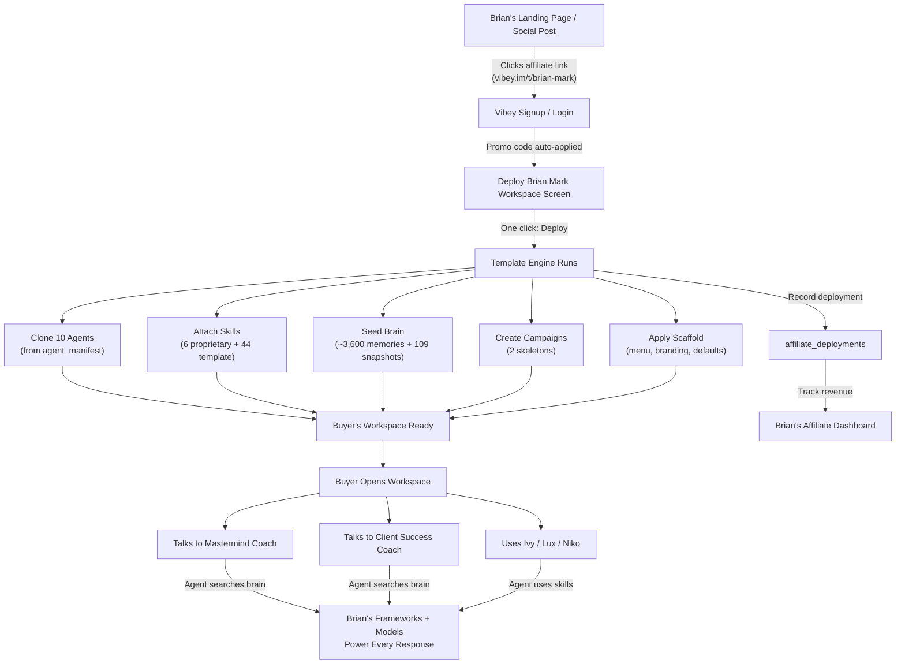

# Brian Mark Workspace Template — Deploy Spec & Blueprint

> Technical specification for the "Brian Mark Workspace" affiliate template. Defines exactly what ships, what doesn't, and what needs to be built.

---

## 1. Packaged Agents

The template deploys 10 agents into the buyer's workspace. Each agent is cloned from Brian's `agents_registry` with the same `agent_key`, `role`, `level`, `specialty`, and `config`.

### 1.1 Coaching Agents (The Core Product)

| Agent Key | Name | Role | Level | Specialty | Why Included |
|-----------|------|------|-------|-----------|-------------|
| `mastermind_coach` | Mastermind Coach | Million Dollar Mastermind Coach | employee | High-ticket coaching, mastermind facilitation, client transformation | Brian's flagship MDM coaching OS for $20K+/month coaches |
| `client_success` | Client Success Coach | Client Success Coach | employee | Client onboarding, proactive guidance, program navigation, retention | 25K Accelerator coaching for $3K-$25K/month coaches |
| `accelerator_25k_coach` | 25k Accelerator Coach | Million Dollar Mastermind Coach | employee | High-ticket coaching, mastermind facilitation, client transformation | Secondary coaching voice for the accelerator tier |

### 1.2 Marketing & Creative Team

| Agent Key | Name | Role | Level | Specialty |
|-----------|------|------|-------|-----------|
| `ivy` | Ivy | Senior Conversion Copywriter | employee | Headlines, ad copy, email sequences, blog posts, brand voice, persuasive writing |
| `lux` | Lux | Creative Director & Visual Designer | employee | Visual design, banners, brand identity, layout, image generation, presentation design |
| `niko` | Niko | Growth & Performance Analyst | employee | Ad performance, ROI analysis, audience targeting, data-driven growth recommendations |

### 1.3 System Agents

| Agent Key | Name | Role | Level | Specialty |
|-----------|------|------|-------|-----------|
| `vibey` | Vibey | CEO | c_level | Strategic leadership, campaign orchestration, cross-team coordination, growth strategy |
| `atlas` | Atlas | Brain Scholar & Knowledge Curator | system | Knowledge curation, research synthesis, memory organization, brain management |
| `hr` | Avery | Recruiter | system | Team hiring, agent design, onboarding, skill management |
| `viktor` | Viktor | Widget Experience Engineer | system | Workspace widgets, data-aware dashboards, theme-safe components |

### 1.4 Excluded from Template

| Agent Key | Name | Why Excluded |
|-----------|------|-------------|
| `orion` | Orion | Financial advisor — generic, buyer can hire through Avery if needed |
| `ledger` | Ledger | Duplicate of Orion's role — adds no template-specific value |
| `youtube_growth_analyst` | YouTube Growth Analyst | Brian-specific channel research, not universal to his audience |
| `reddit_research_analyst` | Reddit Research Analyst | Brian-specific research tool, not universal |

---

## 2. Packaged Skills

### 2.1 Brian-Proprietary Skills (source=user) — Cloned Per Deployment

These are Brian's original IP. Each deployment clones these into the buyer's `agent_skills` table with `source=affiliate_template` (new source type) to track provenance.

| Agent Target | Skill Key | Name | Chars | Content Summary |
|-------------|-----------|------|-------|----------------|
| `mastermind_coach` | `mastermind_core` | Million Dollar Mastermind Coach | 4,888 | Identity, executive voice, first-interaction protocol (name/revenue/90-day goal), 7-step diagnosis-first flow (acknowledge → ask → dig → confirm bottleneck → search brain → deliver ONE play → accountability), monthly check-in, behavioral rules |
| `accelerator_25k_coach` | `mastermind_core` | Million Dollar Mastermind Coach | 4,888 | Same skill — shared across both coaching tiers |
| `client_success` | `client_success_core` | 25K Accelerator Client Success Coach | 3,221 | Identity (direct, no-BS older brother), first-interaction protocol (name/revenue), brain-search-first answer protocol, monthly check-in, knowledge domains, rules |
| `client_success` | `client-intake-tracker` | Client Intake & Tracking Protocol | 4,016 | Mandatory intake gate (name + income before any value), client profile storage, returning client protocol, daily activity tracking, engagement scoring (daily/weekly/occasional/dormant), daily report generation |
| `ivy` | `instagram-outlier-analysis` | Instagram Outlier Analysis | 6,701 | Analyze competitor IG profiles, identify viral outliers (3x-10x baseline), decode hook/format/angle patterns, write scripts for Brian's 3 content categories: Sales, Content, Lead Generation |
| `lux` | `instagram-outlier-analysis` | Instagram Outlier Analysis | 5,203 | Visual variant — same methodology, visual execution focus |

### 2.2 Platform Template Skills — Re-Attached from skill_library

These are standard Vibey skills. They don't need cloning — they're attached from the global `skill_library` during deployment via `template_skill_assignments`.

**atlas:**
- `brain-operations` — Full brain management through chat
- `knowledge-curation` — Deduplicate, connect, quality-control brain entries
- `knowledge-extraction` — Extract entries from documents, videos, articles
- `knowledge-intake` — Pre-process content and save to target brain

**hr:**
- `agent-design`, `disc-profiling`, `hiring`, `team-building`

**ivy:**
- `avatar-builder`, `carousel-designer`, `content-strategy`, `direct-response-copy`
- `email-sequence-builder`, `email-sequence-copy`, `experimentation-system`
- `lead-magnet-builder`, `offer-builder`, `pdf-builder`, `social-intel`

**lux:**
- `ad-builder`, `brand-consistency`, `carousel-designer`, `conversion-design`
- `experimentation-system`, `lead-magnet-builder`, `social-content-builder`
- `social-intel`, `theme-builder`, `visual-design-systems`

**niko:**
- `competitive-intel`, `content-tracking`, `executive-reporting`
- `experimentation-system`, `social-intel`

**vibey:**
- `delegation`, `proactive-tasking`, `routing`, `strategy`

**viktor:**
- `github-workflow`, `web-app-development`

### 2.3 Mastermind Coach Brain Rules — Deployed as Agent-Brain Memories

The 5 operational rules in the `mastermind_coach Brain` must ship with the template:

1. Don't advise DM ads until 400+ new followers/day from follower campaigns
2. Change only one thing at a time — identify the #1 constraint
3. Generate daily report identifying students doing amazing vs. struggling
4. Don't give pricing advice unless specifically asked
5. Pricing constraint applies to all users including Telegram bot

These are deployed as seed memories in the buyer's mastermind_coach agent brain.

---

## 3. Packaged Brain — Include / Exclude / Reference

### 3.1 INCLUDE — Cloned Into Buyer's Default Brain

**Total estimated: ~3,600-4,000 memories + 109 snapshots**

#### Brian Mark Operating System (182 memories)
All 11 source documents — Brian's personal IP, no third-party concerns:
- Brian Mark Operating System — Business Architecture, Partnerships & Financial Control (17)
- Brian Mark Operating System — Communication Style, Coaching Approach & Personal Brand (17)
- Brian Mark Operating System — Marketing, Growth & Creative Strategy (17)
- Brian Mark Operating System — Decision-Making & Leadership Patterns (15)
- Brian Mark Operating System — Sales Methodology & Revenue Architecture (13)
- Brian Mark Operating System — Product Vision, Tech Strategy & AI Philosophy (12)
- Brian Mark — Building a $12M Business — Growth Frameworks & Scaling Playbook (18)
- Brian Mark — Agency Founders Keynote — Content Strategy, Virality & Attention Mechanics (17)
- Brian Mark — Auralis Magazine Interview — Mindset, Philosophy & Personal Operating Principles (18)
- Brian Mark — Fathom Call Recordings Part 1 — AI Strategy, Product Architecture & Team Vision (22)
- Brian Mark — Fathom Call Recordings Part 2 — Operations, Execution & Go-to-Market (16)

#### All 109 Crystallized Snapshots
83 Models + 25 Principles + 1 Rule. These are the highest-value artifacts — distilled frameworks that took months of brain crystallization to produce. They represent Brian's worldview condensed.

#### Hormozi Frameworks (2,438 memories) — IP DECISION NEEDED
**Option A: Include all** — Brian curated these from public sources (books, podcasts, YouTube). The memories are Brian's extraction/interpretation, not Hormozi's verbatim content.
**Option B: Include curated subset** — Only include Hormozi Master Indices and Synthesis docs (~500 memories), skip the deep layer-by-layer breakdowns.
**Option C: Exclude entirely** — Ship only Brian-authored content. Safer legally, but the brain loses 33% of its knowledge.

**Recommendation:** Option B. Include the master indices and syntheses as "Brian's curated framework library" — these are transformative enough to be Brian's work product.

#### Dean Jackson Frameworks (573 memories) — Same IP Decision
Publicly available frameworks (BreakthroughDNA, 8 Profit Activators, etc.) but curated and interpreted by Brian. Include the "PT Dom Application Bridge" docs — these explicitly adapt Dean Jackson to Brian's methodology.

**Recommendation:** Include the PT Dom Application Bridge docs and core framework overviews (~200 memories). Exclude the deep granular breakdowns.

#### Dan Martell Frameworks (432 memories) — Same IP Decision
Buyback Principle, DRIP Scorecard, etc. Public frameworks, Brian's curation.

**Recommendation:** Include the comprehensive libraries and master syntheses (~150 memories). Skip the raw framework parts.

#### Coaching Program Content (~1,200 memories)
Memories sourced from: 100k Club Call, Podchats in the Academy, Podchats 25k Accelerator, Follower Ad Training, Higher Quality Leads, The Content Mistake article.

**Recommendation:** Include — this is Brian's coaching content delivered to groups. It's the same material his audience would get in a course.

### 3.2 EXCLUDE — Never Ships

| Source | Memories | Why Excluded |
|--------|----------|-------------|
| VIP 1-1 recordings (Abram, Akanni, Alia, Chloe/Harry, Cody, Coen, Doug x2, Hailey, Jesse, Jenn, John, Jon/Paola, Jram, Marcus/Satya, Mark/Jess, Maximus, Sage, Seth, Tara) | ~376 | **Client PII + confidential coaching sessions**. Contains personal revenue numbers, business details, and private conversations. |
| Convos w/ B MDM | 887 | **Internal operational conversations**. Brian's private strategy discussions. |
| Internal meetings (#PTD ALL-TEAM, PTD Executive Leadership, SALES MEETING, AI Setter Meeting, DomDm's AI Meeting, Dom's DM's Office Hours) | ~370+ | **Internal team operations**. Not distributable. |
| 1-1 w/ B Britzy (Apr 25, Dec 27) | ~120 | **Internal leadership meetings**. |
| Brian /w Sefy [Vibey] | varies | **Internal vendor meeting**. |
| Impromptu Zoom Meeting | 235 | **Unstructured internal call content**. |
| Chat sessions (Mar 16-23) | varies | **Brian's personal chat interactions with agents**. May contain personal business data. |
| null source_title entries | 1,116 | **Unattributed content**. Cannot verify safety for distribution. |

### 3.3 REFERENCE (Optional) — "Brian Live Updates" Shared Brain

A separate brain owned by Brian, shared read-only via `org_brain_sharing` to all deployed workspaces. When Brian adds new frameworks or crystallizes new models, they propagate automatically.

**Architecture:**
- Brian creates a new brain called "Brian Updates" (or we create it during template setup)
- New frameworks/models go into this brain
- All template-deployed workspaces get read-only access
- Agents in buyer workspaces can search this brain alongside their own

**Depends on:** `org_brain_sharing` already exists in schema. Needs a mechanism to share across unrelated orgs (currently scoped to org members). May need a `public_brain_share` or `affiliate_brain_share` extension.

---

## 4. Workspace Scaffolding

### 4.1 Campaign Skeletons

Deploy two pre-configured campaign shells (empty but named, typed, and ready):

| Campaign Name | Type | Modeled On |
|--------------|------|------------|
| PT Dom Growth | get-more-leads | Brian's "PT Dom 2M/Month" campaign |
| Client Coaching | get-more-leads | Brian's "PT DOM COACH" campaign |

These give buyers a starting structure. Agents can populate strategy and tasks from brain knowledge.

### 4.2 Branding Defaults

- Pull Brian's branding theme (if set in `branding_themes`) and apply as default
- If no theme is set, use a clean default with PT Domination-adjacent colors
- Agent avatars: use Brian's agent avatar URLs if set, or Vibey defaults

### 4.3 Workspace Configuration

- `menu_config`: Pre-configured sidebar with coaching-relevant sections
- Default brain: Pre-named "Brian Mark Knowledge Base" instead of generic "Default Brain"

---

## 5. Deploy Mechanics — What Exists vs. What Needs Building

### 5.1 Already in Place (Schema Exists)

| Table | Purpose | Status |
|-------|---------|--------|
| `agent_templates` | Template definitions for agent roles | Has data — core agent archetypes exist |
| `agent_employee_templates` | Template definitions for employee agents | Has data |
| `skill_library` | Global skill definitions shared across users | Has data — all template skills stored here |
| `template_skill_assignments` | Maps skills to agent templates | Has data |
| `org_brain_sharing` | Share brains across org members | Schema exists — currently org-scoped |
| `org_shared_skills` | Share skills across org members | Schema exists |
| `team_brain_permissions` | Brain access control | Schema exists |
| `direct_invite_codes` | Invite codes for onboarding | Schema exists |
| `promo_codes` | Promo/attribution codes | Schema exists |
| `promo_redemptions` | Track code usage | Schema exists |

### 5.2 GAP: Workspace Template Bundle (Primary Engineering Work)

**What's missing:** A first-class `workspace_templates` entity that bundles all the pieces into one deployable unit.

**Proposed schema:**

```
workspace_templates
├── id (uuid)
├── name ("Brian Mark Workspace")
├── slug ("brian-mark-workspace")
├── description
├── author_id (Brian's user_id)
├── template_type ("affiliate" | "system" | "marketplace")
├── agent_manifest (jsonb) — list of agent_keys + configs to deploy
├── skill_manifest (jsonb) — list of skill_keys per agent + source
├── brain_manifest (jsonb) — brain seed config: source brain ID, include/exclude filters
├── campaign_manifest (jsonb) — campaign skeletons to create
├── scaffold_config (jsonb) — menu_config, branding, defaults
├── pricing (jsonb) — one_time_fee, rev_share_percent, subscription_tier
├── affiliate_code (text) — maps to promo_codes
├── is_active (boolean)
├── deploy_count (integer)
├── created_at, updated_at
```

**Deploy function:** A new backend service that:
1. Reads the workspace_template by slug
2. Creates agents from agent_manifest (using agent_templates + overrides)
3. Attaches skills from skill_manifest (clones user skills, attaches template skills)
4. Seeds brain from brain_manifest (copies filtered memories + snapshots from source brain)
5. Creates campaigns from campaign_manifest
6. Applies scaffold_config to workspace
7. Records deployment in tracking table

### 5.3 GAP: Affiliate Tracking (Secondary Engineering Work)

**Proposed schema:**

```
affiliate_partners
├── id (uuid)
├── user_id (Brian's user_id)
├── template_id (workspace_template FK)
├── affiliate_code (text, unique)
├── rev_share_percent (decimal)
├── one_time_fee_cents (integer)
├── status ("active" | "paused" | "terminated")
├── total_deploys (integer)
├── total_revenue_cents (integer)
├── created_at, updated_at

affiliate_deployments
├── id (uuid)
├── affiliate_partner_id (FK)
├── template_id (FK)
├── deployed_user_id (buyer's user_id)
├── deployed_workspace_id (FK)
├── promo_code_used (text)
├── one_time_fee_paid_cents (integer)
├── subscription_plan
├── status ("active" | "churned" | "cancelled")
├── deployed_at
├── last_active_at
```

### 5.4 GAP: Cross-Org Brain Sharing (If Live Updates Chosen)

Currently `org_brain_sharing` is scoped to org members. For the "Brian Live Updates" brain to propagate to unrelated users:

**Option A:** Add an `affiliate_brain_shares` table that links a brain to all deployments of a template
**Option B:** Extend `org_brain_sharing` with a `share_type` column (`org_member` | `affiliate_template`) and relax the org-scoping for affiliate shares
**Option C:** Skip live updates at launch, ship static snapshots. Add live updates in v2.

**Recommendation:** Option C. Ship static. Validate demand first.

---

## 6. End-to-End Buyer Flow



---

## 7. Open Decisions for Sefy x Brian

### 7.1 Revenue Model

| Model | Pros | Cons |
|-------|------|------|
| **Revenue share (% of monthly subscription)** | Recurring income for Brian, aligns incentives long-term | Lower upfront $, complex tracking |
| **One-time deployment fee ($97-$297)** | Simple, immediate cash for Brian | No recurring incentive, Brian may lose interest after launch |
| **Hybrid (one-time + rev share)** | Best of both — immediate + recurring | Most complex to implement |

### 7.2 Pricing Tier

| Option | Description |
|--------|-------------|
| **Standalone SKU** | "Brian Mark Workspace" at a specific price, includes Vibey subscription |
| **Add-on** | Any Vibey subscriber can deploy the template for an additional fee |
| **Premium tier** | "Vibey Pro — Brian Mark Edition" at a higher monthly price |
| **Free with subscription** | Template is free, Brian earns rev share on the underlying Vibey subscription only |

### 7.3 IP Boundary

| Content | Include? | Risk Level |
|---------|----------|------------|
| Brian Mark Operating System (11 docs, 182 memories) | YES — his original IP | None |
| 109 Crystallized Snapshots | YES — derived from his full brain | Low (derivative works) |
| Coaching program content (100k Club, Podchats, Training) | YES — his delivered coaching | Low |
| Hormozi frameworks (2,438 memories) | PARTIAL — master indices only | Medium (public IP, Brian's interpretation) |
| Dean Jackson frameworks (573 memories) | PARTIAL — PT Dom bridges + overviews | Medium (same reasoning) |
| Dan Martell frameworks (432 memories) | PARTIAL — syntheses only | Medium (same reasoning) |
| VIP 1-1 recordings (376 memories) | NO — client PII | High if included |
| Internal meetings (~1,700 memories) | NO — operational | High if included |

### 7.4 Update Policy

| Option | Description | Engineering |
|--------|-------------|-------------|
| **Static snapshot** | Brain cloned at deploy time. Frozen. | Zero — works today with a copy query |
| **Manual pushes** | Brian can trigger "push update to all workspaces" periodically | Medium — batch update job |
| **Live sync** | Shared brain that auto-propagates | High — cross-org brain sharing extension |

**Recommendation:** Launch with static snapshot. Add manual push in v2 if demand proves out.

### 7.5 Co-Branding

| Option | Feel |
|--------|------|
| **"Brian Mark Workspace" powered by Vibey** | Brian's brand leads. Vibey is infrastructure. Best for his audience. |
| **"Vibey x Brian Mark Edition"** | Equal billing. Good for joint marketing. |
| **"PT Domination OS"** | His brand entirely. Strongest for his existing community. |
| **"Vibey Pro for Coaches"** | Generic. Allows future coaches to be added. Weakest for Brian specifically. |

**Recommendation:** "Brian Mark Workspace" powered by Vibey. His name sells it. Vibey benefits from the distribution.

---

## 8. Implementation Phases

### Phase 1: Proof of Concept (1-2 weeks)
- Manually export Brian's brain subset (SQL query with source_title filters)
- Create a second Vibey account, manually import brain + set up agents + attach skills
- Demo to Brian: "This is what your audience gets"

### Phase 2: Template Engine (2-4 weeks)
- Build `workspace_templates` table + deploy function
- Build template deployment UI ("Deploy Brian Mark Workspace" screen)
- Wire promo_codes to template deployment for attribution

### Phase 3: Affiliate Infrastructure (1-2 weeks)
- Build `affiliate_partners` + `affiliate_deployments` tables
- Build affiliate dashboard (deploy count, revenue, active users)
- Wire Stripe for deployment fees if applicable

### Phase 4: Launch
- Brian creates landing page / email / social content
- Vibey hosts `/t/brian-mark` deployment page
- Track, measure, iterate

---

## 9. Summary — What Ships in the Template

| Category | Count | Notes |
|----------|-------|-------|
| Agents | 10 | 3 coaching + 3 marketing/creative + 4 system |
| Proprietary Skills | 6 assignments (4 unique) | Cloned per deployment |
| Template Skills | 44 assignments | Attached from skill_library |
| Brain Memories | ~3,600-4,000 | After include/exclude filtering |
| Brain Snapshots | 109 | 83 Models, 25 Principles, 1 Rule |
| Agent Brain Rules | 5 | Mastermind coach behavioral guardrails |
| Campaign Skeletons | 2 | Pre-named, typed, ready for strategy |
| Engineering Work | 3 gaps | workspace_templates, affiliate tracking, (optional) cross-org brain sharing |
