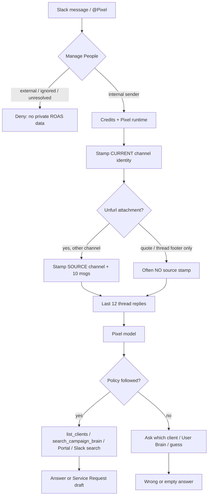
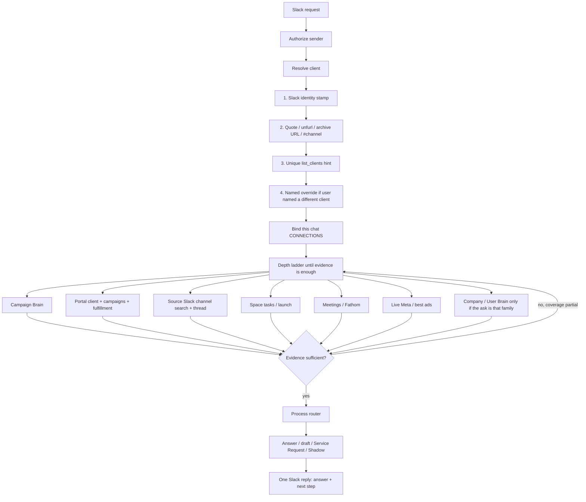

# Pixel Slack North Star — Resolve, Retrieve, Deliver

Last Modified: 2026-08-18

## Architect Summary

Pixel already has the pieces to answer almost every agency Slack ask: client channel → Portal client stamps, Campaign Brain, The ROAS Portal, tasks, meetings, Meta, Slack search, and Service Request drafts. The product fails when those pieces are not run in a fixed order. Today a Slack ask can land in a group DM or quote, skip the mapped `#roas-*` client, search the wrong Brain, and ask “Andy or Krista?” even though `#roas-1ds-collective-llc-939` is already 1DS Collective.

The North Star: **every Slack request gets a correct, evidence-backed output at the cheapest token path that still looked deep enough.** Assume the answer exists. The only question is whether Pixel resolved the client, retrieved the right stores, and stopped when evidence was sufficient.

This plan does four things:

1. Names the Slack and agency processes that already exist in code.
2. Shows the current Slack → answer path versus the proposed spine.
3. Turns Dylan’s example asks plus production-stamped client channels into a request catalog (user set + 25 audit-derived) and 10 proposed processes.
4. Gives file-level build work, stress tests, and risks. It does not invent new tables or actions unless an existing contract is missing.

### Missing evidence (live Slack)

This cloud workspace has no `scripts/roas/roas-secrets.env`, no `apps/api/.env`, and no Slack/Supabase MCP. A live crawl of every client channel was therefore **not** run from this VM.

What stands in for that crawl, with sources:

- Production channel→client stamps in `apps/api/src/modules/slack/services/__tests__/slack-pixel-scenario-matrix.test.ts` (`LIVE_CHANNEL_STAMPS`, comment: “Live stamps from slack_observation_events”).
- The 1DS quoted-thread ask from 2026-08-17: `@Pixel - need this edited VSL style asap` quoting `#roas-1ds-collective-llc-939`, Pixel asking Andy Elliott vs Krista.
- Policy and inbound code listed in the Evidence Pack.

**Smallest experiment to finish a live audit:** with production secrets, run a read-only query of `slack_observation_channels` + last-14-day `slack_observation_events` grouped by channel, plus Slack `search.messages` for `@Pixel` in those channels. Risk if skipped: request wording in §8 is grounded in stamps and known incidents, not a fresh 14-day message histogram.

---

## Evidence Pack

- `packages/agent-policy/src/platform-tools-template.ts` — named-client lookup, Slack channel identity, retrieve-then-draft, Service Request routing, Brain family rules, meeting retrieval, Slack voice.
- `apps/api/src/modules/slack/services/slack-service-events.base.ts` — inbound `app_mention` / `message` / reaction.
- `apps/api/src/modules/slack/services/slack-service-auth.base.ts` — `resolveSlackAskClientStamp` from `slack_observation_channels` + `slack_observation_events.metadata.page_grader_client_id`.
- `apps/api/src/modules/slack/services/slack-ask-identity-context.ts` — `[Slack channel identity]` prompt block; unique `list_clients` hint; do not ask which client.
- `apps/api/src/modules/slack/services/slack-forwarded-message-context.ts` — parses Slack **unfurls** (`is_msg_unfurl` / archive URL / “Posted in #”). Does not parse a Slack **quote** whose only human text is “From a thread in #channel”.
- `apps/api/src/modules/slack/services/slack-service-conversation.base.ts` — thread reply context (last 12); forwarded identity + source-channel history when `channelId` differs.
- `apps/api/src/modules/slack/services/__tests__/slack-pixel-scenario-matrix.test.ts` — 11 live client channels + 15 Pixel scenarios.
- `docker/agents/atlas/skills/page-grader-operator/SKILL.md` — Portal fulfillment, `page_grader_create_fulfillment_request`.
- `docker/agents/vibey/skills/slack-signal-operator/SKILL.md` — Team Intelligence / Shadow.
- `docker/agents/vibey/skills/post-call-delivery/SKILL.md` — post-call Slack recap contract.
- `docker/agents/atlas/skills/vibey-api/SKILL.md` + `references/brain.md`, `integrations.md`, `meta.md`, `mcp.md` — action catalog.
- `documentation/features/integration-connections.md` — Slack fail-closed access, Team Intelligence, CONNECTIONS, Fathom, Drive docs.
- `documentation/features/page-grader-mcp-bridge.md` — Portal vs Brain, Service Request draft + reminders.
- `apps/api/src/modules/work-requests/services/work-request.service.ts` — 24h review token; 3h then expiry Slack reminders.
- `apps/api/src/modules/integrations/page-grader/services/page-grader-qc-follow-up.ts` — Launch/QC Slack thread follow-up.

---

## 1. What Pixel already specializes in

### 1.1 Slack-specialized processes (exist today)

| # | Process | What happens | Owner in code |
| --- | --- | --- | --- |
| S1 | **Inbound Pixel turn** | Slack event → fail-closed Manage People (`internal` only) → credits/runtime → prompt with channel identity + optional forward + last-12 thread → OpenClaw Pixel | `slack-service-events.base.ts`, access control |
| S2 | **Channel → client stamp** | Observation metadata `page_grader_client_id` / name + ROAS campaign ids injected as `[Slack channel identity]` | `slack-ask-identity-context.ts`, `resolveSlackAskClientStamp` |
| S3 | **Forwarded unfurl inherit** | Unfurl of another channel loads that channel’s stamp + 10 recent messages | `slack-forwarded-message-context.ts`, `buildForwardedMessageContext` |
| S4 | **Service Request (Portal fulfillment)** | Any client deliverable (design/copy/funnel/ghl/ad/video/other/general) → Portal MCP `page_grader_create_fulfillment_request` → review URL in-thread, not `create_task` | `page-grader-operator`, platform-tools |
| S5 | **Review follow-ups** | Unreviewed draft: Slack nudge at 3h, then ~22h (“expires in 2 hours”), thread + channel broadcast (PR 296) | `work-request.service.ts` / reminders helper |
| S6 | **Team Intelligence** | `observe_slack_team`: ledger `slack_observation_events` → analyzer → Shadow or Active DM digest (max 5 briefing items); 12h follow-ups thread on the digest | spaces automation + slack-team-loop |
| S7 | **Personal moment** | Separate Active DM for high-confidence personal/team moments; not mixed into the numbered digest | integration-connections §55 |
| S8 | **Meeting follow-up Slack** | Call follow-ups → Shadow draft → admin approve → Slack DM/channel | `meeting-follow-up-slack-confirm*` |
| S9 | **Post-call delivery** | Recap JSON + owned next steps; Shadow until approve | `post-call-delivery` skill |
| S10 | **Launch / QC Slack** | Portal QC/launch findings post or thread-follow-up on the same Slack parent (8h cooldown) | `page-grader-qc-follow-up.ts` |
| S11 | **Slack Brain import** | Mapped channels → Person / Campaign Brain memories; 90-day backfill is admin-gated | integration-connections §34, §48 |
| S12 | **Named-client CONNECTIONS bind** | `list_campaigns` / `search_campaign_brain` with `campaign_name` binds **this** portal chat, not the whole Slack identity | `artifact-brain-search-actions.service.ts` |
| S13 | **Slack search** | User search token when present; else 120-day named-channel history with coverage complete/partial | Slack agent tools |
| S14 | **Access / Slack Connect** | Sender-only Internal authorization (PR 295). External still denied. Group DMs are not auto-client-channels. | `slack-access-control.service.ts` |

### 1.2 Agency processes (not Slack-only, Pixel uses them from Slack)

| # | Process | Typical trigger | Stores / tools |
| --- | --- | --- | --- |
| A1 | Campaign Brain retrieve | Named client facts, offer, webinar, voice | `search_campaign_brain` |
| A2 | Portal reads | Clients, campaigns, fulfillment, intel, Meta cache | `list_mcp_tools` → Page Grader MCP |
| A3 | Live ads | Spend, CPL, purchases, creatives | `get_meta_ads_insights`, Portal best-ads table |
| A4 | Space / tasks | AM risk, my list, launch timeline | `list_spaces`, task list/get (via `vibey_backend`) |
| A5 | Meetings | Recaps, promises, recordings | Fathom/Fireflies `use_integration`, `ingest_fathom_meeting` |
| A6 | Calendar | “How many calls today”, reminders | `list_calendar_events`, `get_person_agenda`, `create_calendar_event` |
| A7 | User Brain | Bios, content ideas, write-as-me | `search_user_brain` — **not** for client package facts |
| A8 | Company Brain | Agency operating rules, Friday update standard | `search_company_brain` |
| A9 | Customer Brain | Avatar / objection / interview | `search_customer_brain` |
| A10 | Docs | “Make a doc and give me the link” | Drive `create_google_doc` / `save_document` |
| A11 | Media | Image edit, video ads | `generate_image`, `generate_video`, Higgsfield MCP |
| A12 | Browser QC | Click through funnel, test lead | browser tool (org Pixel may still lack it — follow-up log) |
| A13 | Skills craft | Webinar, ads, copy, design, pre-call strategy | `docker/agents/templates/{copywriter,ads_manager,designer,strategist}` |
| A14 | Missions | Long strategy / pre-onboarding form | `create_mission` when user wants tracked async work |
| A15 | Delegation Desk | Batch Space intake → Pixel | `delegation-desk` skill (Vibey) |

---

## 2. Current Slack → answer flow

**What went wrong on 1DS (2026-08-17):** Dylan @Pixel in a Slack Connect group DM quoted a thread from `#roas-1ds-collective-llc-939`. Access control now lets the Internal sender talk (S14). Identity stamp is for the **group DM**, not 1DS, unless Slack sent a parseable unfurl. Quote text “From a thread in #roas-1ds-collective-llc-939” is not handled by `parseSlackForwardedMessage`. Pixel then asked Andy vs Krista — the exact failure S2/S4 policy forbids when a client channel uniquely maps.

Token waste today: clarifying questions, User Brain first, duplicate searches, two Slack handlers on mapped channels (fixed for mentions), Team Intelligence re-digest (still logged).

---

## 3. Proposed spine (one path, many processes)

**Rule:** Do not ask the human for a fact the platform can know. Ask only on true forks (zero or multiple clients after lookup; publish/spend; missing asset the ladder returned empty).

**Token rule:** One resolve, one bind, one search per store, stop at first sufficient evidence. Do not open User Brain for “what’s 1DS spend.” Do not list every MCP tool narratively.

### How stores interact

| Store | When to hit | When not to |
| --- | --- | --- |
| Slack channel identity / CONNECTIONS | Always first on Slack | Never treat group DM as the client if a quoted `#roas-*` exists |
| Campaign Brain | Client package, strategy, webinar, voice, prior decisions | Not for “how many calls do I have today” |
| Portal MCP | Clients, campaigns, SR status, intel, cached Meta, best ads | Not a replacement for live Meta if user asked “right now” |
| Slack search / channel history | Quoted thread, “where is the Drive folder”, digest verify | Not instead of Brain for durable strategy |
| Space tasks | AM risk, my list, launch timeline | Not for Portal fulfillment create |
| Meetings / Fathom | Promises, recaps, recordings, “last call” | Not for ad spend |
| Meta | Spend, CPA, on/off track, creatives | Not before client is bound |
| Company Brain | Agency cadence (Friday notes, launch rules) | Not client offer facts |
| User Brain | My bio, content ideas, write-as-me | Not client lookup |
| Customer Brain | Avatar / objections | After client is known |
| Drive / docs | “Give me a live doc link” | After retrieve, so the doc is not empty brackets |

---

## 4. Consolidation for the North Star

Do **not** add a second Pixel. Collapse into three layers that already exist:

1. **Resolve** — extend quote parsing so S2/S3 always fire. Cheap (no model).
2. **Retrieve ladder** — make the ordered stores in platform-tools a hard protocol (same text already exists, Pixel skips it). Cheap vs wrong answers.
3. **Act** — one of: answer, Service Request draft, Shadow recap, calendar event, doc, mission. Skills only after retrieve.

Remove / stop:

- Asking which client when stamp or unique hint exists (already policy; enforce with scenario tests + quote fixtures).
- Native `create_task` for client fulfillment (already forbidden).
- User Brain / Agent Brain first on named-client facts (already forbidden).
- Duplicate Slack analysis of empty 5-minute windows (already skipped).
- Extra “I have full context” acks (fork-chat work elsewhere).

Keep Team Intelligence, QC follow-ups, and Service Request reminders as **outbound** processes. They feed the same Resolve → Retrieve spine when a human replies.

---

## 5. Ten proposed processes (from stamps + 1DS + Dylan’s list)

Each process is a named ladder. Existing S1–S14 stay; these are the **product** processes operators should expect.

### N1 — Client Resolve Spine
**Why:** 1DS quote in a group DM; S13 internal `#ads-launches` still may ask which client.
**Steps:** current stamp → parse unfurl **and** “From a thread in #x” / archive URL / `<#C…>` → `list_clients` with channel hint → bind CONNECTIONS → only then ask if 0 or N matches.
**Files:** `slack-forwarded-message-context.ts`, `slack-ask-identity-context.ts`, scenario matrix S02/S08/S14 + new quote fixture.

### N2 — Depth Ladder (retrieve-then-answer)
**Why:** Policy exists; Pixel still asks for screenshots/dates.
**Steps:** Campaign Brain → Portal → source Slack channel (until `coverage.complete` or a hit) → Space tasks → meetings if the ask is temporal → Meta if the ask is performance → then answer. Placeholders only if those returned empty.
**Files:** `platform-tools-template.ts` (numbered ladder), page-grader-operator, tests that a mock “which client” reply fails S08.

### N3 — Performance Pulse
**Why:** S04, S07, Dylan spend/CPA asks.
**Steps:** N1 → `search_campaign_brain` light → Portal campaigns → `get_meta_ads_insights` for the named range → Portal best-ads table → 4-bullet Slack pulse (spend, result, CPA, on/off track) + creative links if present.

### N4 — Account Manager Risk Sweep
**Why:** “Open work across my clients, what’s at risk.”
**Steps:** N1 for each mapped client the user owns (or `list_campaigns`) → Portal open SRs → Space tasks due/overdue → launch dates from Brain/Portal → Slack: at-risk only, by client.

### N5 — Call Memory / Promises
**Why:** “What did we agree / what did I promise.”
**Steps:** N1 → Fathom list + transcript/action_items → Campaign Brain “decision” query → Slack channel last meeting thread → list owners/dates. Never invent an owner.

### N6 — Client Update Writer (SOW / midweek / EOW)
**Why:** Send-ready updates; policy already bans `[brackets]`.
**Steps:** N1 → N3 for the time range → N4 open work → Company Brain Friday-note rule → draft in Dylan/Nefi voice from User Brain only for **tone**, not facts.

### N7 — Launch Asset QC Walk
**Why:** Dylan QC example; Launch/QC already posts to Slack.
**Steps:** N1 → Brain + Slack launch channel + tasks for funnel URLs → browser or `web_fetch` → dates/prices vs campaign Brain → findings. If browser missing, say so (do not fake a click-through).

### N8 — Webinar Campaign Planner
**Why:** Yasir/Impact/Dunamis/Trade webinar work in the scenario matrix.
**Steps:** N1 → Brain webinar + prior calls (N5) → Portal: campaign exists? → if no, **suggest** draft campaign / SR, do not publish ads → recap topics + open links.

### N9 — Meeting Prep / Onboarding
**Why:** Agenda prep + “pre-onboarding form.”
**Steps:** Calendar event (N1 if client named) → Brain strategy + form if present → if form missing, **ask once** whether to run the pre-call strategy mission → share result. `create_mission` only if they say yes.

### N10 — Creative / Fulfillment Router
**Why:** VSL edit, statics, copy, GHL, video — all SRs.
**Steps:** N1 (this is the 1DS fix) → retrieve Drive/Slack assets → `page_grader_create_fulfillment_request` with `task_type` + assignee + `conversation_id` → review URL. Never `create_task`.

---

## 6. Request catalog

Convention: **General** = operator wording. **Specific** = one real-shaped ask using a stamped client. **Ladder** = agent steps. **Process** = N# / S#.

### 6.1 Dylan’s set (R01–R30)

**R01 — Campaign performance**
- General: What’s X client’s campaign performance right now?
- Specific: What’s 1DS Skool campaign performance right now — on track or off, and cost per purchase?
- Process: N3
- Ladder: N1 on 1DS (`#roas-1ds-collective-llc-939` / list_clients `1ds collective`) → bind → Portal campaigns named Skool → `get_meta_ads_insights` today/7d → result action purchase → compare to Brain target CPA → four bullets. If Skool campaign missing, say so and list campaigns that **do** exist.

**R02 — Build a campaign for a webinar next week**
- Specific: Can you build a campaign for Impact Elite to launch a webinar next week?
- Process: N8 then N10
- Ladder: N1 Impact (`roas-impact-elite-coaching-820`) → Brain webinar dates/offer → Portal campaign exists? → if no, draft Portal campaign / SR (do not publish) → ask only for missing date/budget if Brain empty.

**R03 — Onboarding call date**
- Specific: What’s the date of the Christian Osgood onboarding call?
- Process: N9 / A6+A5
- Ladder: N1 Christian → `list_calendar_events` + Fathom title match “onboarding” → return date/time/link. If none, say sources checked.

**R04 — My task list today**
- Specific: What’s on my task list today?
- Process: A4 (no client)
- Ladder: `list_spaces` / tasks due today for the Slack user → not Portal SRs unless they also asked clients.

**R05 — Calls today**
- Specific: How many calls do I have today, and when’s the first one?
- Process: A6
- Ladder: `get_person_agenda` or `list_calendar_events` for today → count + first start. Mine calendar only.

**R06 — Prep meeting agenda**
- Specific: Prep the agenda for the White Picket Fence strategy call.
- Process: N9
- Ladder: N1 WPF → calendar event → Brain + last Fathom + open tasks → write agenda doc (`save_document` or Space doc) → Slack link.

**R07 — Open tasks across my clients**
- Specific: Find all open tasks for my clients across the team, not just mine, and what’s at risk for missing launch.
- Process: N4
- Ladder: `list_campaigns` in scope → each: Portal SRs + Space tasks + launch date from Brain → at-risk only.

**R08 — Outstanding promises from last week’s calls**
- Specific: Any outstanding promises from my calls last week?
- Process: N5
- Ladder: Fathom last 7d → action_items / Next Steps → unmatched vs tasks → list.

**R09 — Calls last week + recordings**
- Specific: Give me my calls last week with recording links.
- Process: A5
- Ladder: Fathom `list_meetings` week window → title, date, recording URL. No Brain substitute.

**R10 — What I promised X last call**
- Specific: What did I promise Yasir last call?
- Process: N5
- Ladder: N1 Yasir → latest Fathom with Yasir → action_items owned by Dylan.

**R11 — What we agreed**
- Specific: What did me and Nick Sakha agree to?
- Process: N5 + Campaign Brain
- Ladder: N1 Sakha → last meeting + Brain “decision” query → Slack: decisions vs open.

**R12 — Set a reminder**
- Specific: Remind me tomorrow 9am to send the 1DS VSL review.
- Process: A6
- Ladder: `create_calendar_event` on caller calendar. Not a Space task unless they asked for a task.

**R13 — Active client count**
- Specific: How many active clients do I have right now?
- Process: A2
- Ladder: Portal `list_clients` (or mapped campaigns) → count. Don’t invent churned.

**R14 — Prep onboarding call**
- Specific: Prep me for the onboarding call with Trade Launch. If we don’t have the pre-call form, ask if I want that mission run.
- Process: N9
- Ladder: N1 Trade → Brain/form → if missing, **one** question → optional `create_mission` pre-call strategy skill.

**R15 — Live doc link**
- Specific: Make a doc for Dunamis webinar recap and give me the live link.
- Process: A10 after N5
- Ladder: Retrieve first → Drive `create_google_doc` with real content → URL. No empty template.

**R16 — Team work at risk**
- Specific: Check all team work across all clients and tell me what’s at risk.
- Process: N4 org-wide (admin)
- Ladder: Same as R07 without “my clients” filter; cap listing to at-risk.

**R17 — Five content ideas from my brain**
- Specific: Check my brain and give me 5 content ideas.
- Process: A7
- Ladder: `search_user_brain` identity/offer queries — **not** campaign Brain. Five ideas grounded in memories.

**R18 — Rewrite a client message**
- Specific: Help me rewrite this Slack message to Yasir about the webinar delay.
- Process: N6 tone + N1 facts
- Ladder: N1 → facts from Brain/tasks → rewrite send-ready. User Brain for Dylan voice only.

**R19 — Midweek / SOW / EOW update**
- Specific: Draft this week’s EOW update for Above It.
- Process: N6
- Ladder: N1 Above It → N3 7d → open SRs/tasks → Company Brain cadence → send-ready Slack.

**R20 — Spend this week + top creatives**
- Specific: How much has Multifamily Strategy spent this week, plus top creatives from the Portal best-ads table.
- Process: N3
- Ladder: N1 Christian → week-to-date insights → Portal best-performing ads + links/screenshots if the MCP returns them.

**R21 — Post-call recap**
- Specific: Give a post-call recap for White Picket Fence.
- Process: S9 / N5
- Ladder: Latest Fathom → post-call-delivery JSON → Shadow unless user said “just draft here”.

**R22 — Recap all my calls today + open tasks**
- Specific: Recap today’s calls and the open task items.
- Process: A5 + A4
- Ladder: Today’s Fathom + today’s tasks. No client bind required.

**R23 — Kick off a strategy plan**
- Specific: Kick off a strategy plan for Master Your Kraft.
- Process: N8/N9 + mission
- Ladder: N1 Kraft → Brain + last calls → if heavy, `create_mission` with strategist skill; else a Space doc.

**R24 — Plan the webinar**
- Specific: Help me plan the webinar for Yasir / Speak Like a CEO.
- Process: N8
- Ladder: N1 Yasir → Brain + calls + existing campaign? → topics, dates, open links → suggest campaign create if missing.

**R25 — Create ad creatives**
- Specific: Create ad creatives for Dunamis webinar retargeting.
- Process: N10 `ad`
- Ladder: N1 → Brain angles → SR `task_type=ad` assignee if named → review URL.

**R26 — Video ad or series**
- Specific: Make a series of video ads for 1DS.
- Process: N10 `video` + A11
- Ladder: N1 1DS → Brain → SR video and/or `generate_video` only if they asked Pixel to render, not Portal production.

**R27 — Workflow sequence**
- Specific: Write a GHL workflow sequence for Master Your Kraft post-webinar.
- Process: N10 `ghl` + copywriter skill
- Ladder: N1 Kraft → Brain nurture → SR `ghl` (not silent native sequence send).

**R28 — Video ad scripts**
- Specific: Write video ad scripts for Sakha / Insurance Creators.
- Process: copywriter `roas-video-ad-scripts` after N1+Brain
- Ladder: Retrieve → draft scripts in Slack or doc. SR only if they want production.

**R29 — Copy**
- Specific: Help me write landing copy for Standard Plumbing.
- Process: copywriter skill + N1
- Ladder: Brain offer → draft. SR `copy` if fulfillment.

**R30 — QC all assets**
- Specific: Check the Impact webinar campaign and QC all assets — funnels, dates, launch Slack, tasks.
- Process: N7
- Ladder: N1 Impact → collect URLs from Brain/Slack/tasks → fetch/browser → report mismatches.

### 6.2 Audit-derived set (R31–R55)

Grounded in `LIVE_CHANNEL_STAMPS`, scenario matrix S01–S15, and the 1DS group-DM quote.

**R31 — Quoted client thread in a group DM (incident)**
- General: Need this [deliverable] from that client thread ASAP.
- Specific: `@Pixel - need this edited VSL style asap` quoting `#roas-1ds-collective-llc-939`.
- Process: N1 + N10 `video`
- Ladder: Parse “From a thread in #roas-1ds-collective-llc-939” → stamp 1DS Collective LLC (`ca82655a-…`) → **do not ask Andy vs Krista** → Slack/Drive for 9x16/16x9 → SR video “Edited VSL for 1DS” + review URL.

**R32 — In-channel Yasir redesign (S01)**
- Specific: In `#roas-yasir-khan-coaching-ltd-955`, redesign speaklikeaceo.com into the post-webinar page.
- Process: N10 `funnel`/`design`
- Ladder: Stamp Yasir → Brain testimonials/offer → SR with client id `b17dcee8-…`.

**R33 — Forwarded Yasir task (S02)**
- Specific: From another channel, “Create the redesign request from this” with Yasir unfurl.
- Process: N1 + N10
- Ladder: Unfurl stamp **source** channel, not current.

**R34 — Impact VSL funnel SR (S03)**
- Specific: Build a funnel request for the new VSL page (Impact).
- Process: N10 `funnel`

**R35 — Christian weekly blockers (S04)**
- Specific: Latest campaign status / blockers this week in `#roas-christian-osgood`.
- Process: N3 + N4 (single client)

**R36 — Sakha open design SRs (S05)**
- Specific: Any open Service Requests still waiting on design for Sakha?
- Process: A2 Portal fulfillment list after N1

**R37 — Dunamis 5 statics (S06)**
- Specific: Ads request for 5 new statics for webinar retargeting.
- Process: N10 `ad`

**R38 — Above It Meta 7 days (S07)**
- Specific: How are Meta ads performing last 7 days?
- Process: N3

**R39 — 1DS offer page hero (S08)**
- Specific: Design request for new offer page hero + mobile.
- Process: N10 `design`

**R40 — WPF post-call tasks (S09)**
- Specific: Draft post-call recap tasks from yesterday’s strategy call.
- Process: S8/S9 + N5

**R41 — Plumbing headlines (S10)**
- Specific: Copy request for landing page headline options.
- Process: N10 `copy` or in-Slack draft if they said “write,” SR if “request.”

**R42 — Trade Launch replay edit (S11)**
- Specific: Video request for webinar replay edit + captions.
- Process: N10 `video`

**R43 — Kraft GHL nurture (S12)**
- Specific: GHL automation request for post-webinar nurture.
- Process: N10 `ghl`

**R44 — Internal ops, no client (S13)**
- Specific: In `#ads-launches`, “Create a Service Request for the new static pack.”
- Process: N1
- Ladder: No stamp → **one** client question (allowed). After they name Dunamis, continue N10.

**R45 — Unmapped but unique channel name (S14)**
- Specific: Channel named `roas-yasir-khan-coaching-ltd-955` without metadata stamp.
- Process: N1 `list_clients` “yasir khan coaching” → unique → no ask.

**R46 — Explicit override (S15)**
- Specific: Standing in Yasir channel: “this is for Impact Elite.”
- Process: N1 override
- Ladder: Honor named Impact; keep Yasir stamp visible as conflict resolved.

**R47 — Verify a Team Intelligence digest item**
- Specific: Pixel digest said Yasir asked about payment; “is that still open?”
- Process: S6 + S13
- Ladder: Do not answer from digest text. Search `#roas-yasir-khan-coaching-ltd-955` + reactions; then yes/no.

**R48 — Launch QC follow-up thread**
- Specific: Pixel QC’d Impact funnel dates; “did we fix the timezone yet?”
- Process: N7 + S10
- Ladder: Same Slack parent thread → live page check → update.

**R49 — Bind CONNECTIONS from a Slack DM**
- Specific: In Pixel DM, “pull Speak Like a CEO webinar stats.”
- Process: S12 + N3
- Ladder: `search_campaign_brain` `campaign_name=Speak Like a CEO` binds chat → insights. Not User Brain.

**R50 — Drive folder from Slack history**
- Specific: 1DS VSL “I have a 9x16 and 16x9” + Drive link in `#roas-1ds-collective-llc-939`.
- Process: S13 + N10
- Ladder: Channel search Drive/folder → attach URLs on the SR. Don’t ask for the link if search coverage is complete and the URL is there.

**R51 — Portfolio compare**
- Specific: Compare Above It vs Dunamis spend this week.
- Process: N3 ×2
- Ladder: Resolve both campaigns → two pulses → one table-as-bullets (Slack has no tables).

**R52 — Who owns Portal work**
- Specific: Who is assigned on Sakha’s open design SRs?
- Process: A2
- Ladder: Portal fulfillment for client → assignee_name.

**R53 — New channel mapping**
- Specific: `#roas-new-client` has no Portal stamp.
- Process: N1
- Ladder: `list_clients` hint → 0 matches → one question + offer to map in CONNECTIONS. Don’t guess Andy/Krista.

**R54 — Slack Connect partner in the thread**
- Specific: Group DM with The Shift Social external; Internal Dylan @Pixel about 1DS.
- Process: S14 then N1
- Ladder: Allow Dylan; still resolve 1DS from quote; never dump ROAS data because an external can see it unless policy says Internal-only replies. **Unknown:** whether Pixel should reply in mixed group DMs with client data. Smallest experiment: product decision. Default: Internal sender authorized (PR 295); consider moving client data to an internal channel if externals are present.

**R55 — Fulfillment reminder reply**
- Specific: Pixel 3h nudge on Carol Garcia–D/C, Pixel channel; Dylan replies “approve.”
- Process: S5 + review chat
- Ladder: Thread context → continue Service Request steps, not a new SR.

---

## 7. Stress-test plan

Extend `PIXEL_SCENARIOS` from prompt-shape tests into **tool-trace tests** (fixture in, ordered actions out). One case per request id above is too many for a single PR; gate in waves.

### Wave 0 — Identity (blocks everything)
Fixtures: R31 quote-without-unfurl, R33 unfurl, R44 ops channel, R45 unique hint, R46 override, R54 Slack Connect.
Assert: prompt contains resolved client **or** a single allowed ask; never Andy-vs-Krista when 1DS stamp exists.
Commands: `pnpm --filter @vibey/api test -- src/modules/slack/services/__tests__/slack-pixel-scenario-matrix.test.ts`

### Wave 1 — Fulfillment
R32, R34, R37, R39, R42, R43. Assert MCP tool `page_grader_create_fulfillment_request` with `client_ref` / campaign id, `task_type`, `conversation_id`; no `create_task`.

### Wave 2 — Retrieve
R01, R20, R35, R38, R49. Assert order: bind/search_campaign_brain before Meta; no User Brain.

### Wave 3 — Meetings / calendar
R03–R06, R08–R11, R21, R22. Assert Fathom/calendar actions; no invented owners.

### Wave 4 — AM / updates / QC
R07, R16, R19, R30, R47, R48. Assert at-risk filter; digest verify searches Slack.

### Live harness (after secrets)
For each Wave 0–1 specific: post in a **private internal test channel** mapped to a non-prod client, or dry-run against observation stamps. Record: tools used, tokens, whether Pixel asked a forbidden question.

Pass/fail for every request:
- Correct client id from stamp/hint
- Ladder stores actually called
- No forbidden ask
- Slack reply has the answer or a review URL
- Token budget: ≤ N tool rounds (propose 8 for retrieve, 12 for SR+retrieve). Tune after Wave 2 traces — **unknown** until measured.

---

## 8. Implementation plan (file-level)

Recommended approach: **harden Resolve (N1) first** — that is the 1DS class of failure — then encode the Depth Ladder as tests + a short protocol, then add process-specific skills only where the ladder is not enough.

1. `apps/api/src/modules/slack/services/slack-forwarded-message-context.ts`
   - Change: parse “From a thread in #channel”, archive URLs in text, and quote attachments that lack `is_msg_unfurl`.
   - Why: R31 does not hit S3 today.
   - Tests: new cases in `slack-forwarded-message-context.test.ts` + scenario `R31`.

2. `apps/api/src/modules/slack/services/slack-service-conversation.base.ts`
   - Change: `buildForwardedMessageContext` also runs on quote-parsed channel names; load source stamp like unfurls.
   - Contract: group DM + 1DS quote → `[Slack channel identity]` for 1DS.

3. `apps/api/src/modules/slack/services/__tests__/slack-pixel-scenario-matrix.test.ts`
   - Change: add LIVE stamp usage for quote-in-mpim; assert `forbidAskWhichClient` for 1DS.

4. `packages/agent-policy/src/platform-tools-template.ts`
   - Change: Depth Ladder as an ordered list (Brain → Portal → Slack source → tasks → meetings → Meta). Keep existing forbids.
   - Tests: `platform-tools-template.test.ts` string contains the ladder and 1DS example.

5. `docker/agents/atlas/skills/page-grader-operator/SKILL.md` + vibey copy
   - Change: same quote rule; “quoted `#roas-1ds-*` is 1DS.”
   - Requires agent-sync migration if production skills are DB-backed (same pattern as prior policy migrations).

6. `apps/agent-api/.../artifact-brain-search-actions.service.ts`
   - Change: none unless bind fails on Slack org chats; verify Slack session still binds on `campaign_name`.
   - Tests: existing bind tests; add Slack-org session fixture if missing.

7. Docs: `documentation/features/page-grader-mcp-bridge.md` + `integration-connections.md` — quote inherit + reminder cadence.
   - Changelog + this plan.

Out of scope until Wave 0 ships: new MCP tools, new DB tables, a separate “process engine” service.

### Data / contract map (N1)

- Input: Slack event text + attachments + channel id
- Validation: Internal sender; quote/unfurl parser
- AuthZ: existing Manage People
- Storage: none (prompt stamp only); CONNECTIONS bind on first `search_campaign_brain`/`list_campaigns`
- Output: identity block + Pixel reply
- Side effects: SR create only on N10
- Idempotency: existing Slack event claim + SR `idempotency_key`

---

## 9. Risks and how they are managed

| Risk | Management |
| --- | --- |
| Quote parser false-positives map the wrong `#channel` | Require `roas-` client channel pattern or a resolved observation row; if 0/N clients, ask once |
| Client data in Slack Connect group DMs with an external present | S14 allows Internal **sender**. Product decision R54: prefer internal channel for Portal data if mixed; do not change fail-closed for External senders |
| Depth ladder increases tokens | Stop at first sufficient hit; one search per store; skip User Brain on client asks. Measure Wave 2 |
| Org Pixel missing CEO/webinar skills / browser | Already in follow-up log. N7 must admit browser absence. N8 uses copywriter/ads_manager skills if Pixel lacks them via `ask_agent` **only when those skills are not on Pixel** — do not silently no-op |
| Live Slack audit not run | Wave 0 fixtures from stamps + R31; live histogram when secrets exist |
| Mixing this plan into unrelated PRs | Ship N1 on its own branch after PR 296 (reminders) and PR 295 (access) |

---

## 10. Rollout

1. Merge/deploy API N1 (quote inherit) — unblocks 1DS-class asks without waiting for the full ladder.
2. Policy + skill sync for N2.
3. Scenario waves 1–4 in CI.
4. Live audit experiment → adjust R-list wording.
5. Only then add process-specific skill files if traces show Pixel still skipping N3–N10.

Rollback: revert parser; identity falls back to current-channel stamp (today’s behavior).

---

## Quality gate

- User asked for current processes, proposed processes, visual flows, request catalog with general/specific/steps, architecture, risks, stress tests: covered.
- No new APIs invented; actions named from `vibey-api` / Portal skill.
- Live channel histogram listed as missing evidence.
- Old code to remove: none until quote parser replaces ad-hoc asking (behavior change, not a deleted module).
