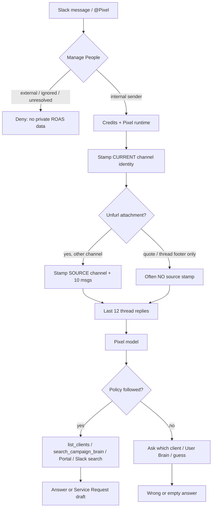
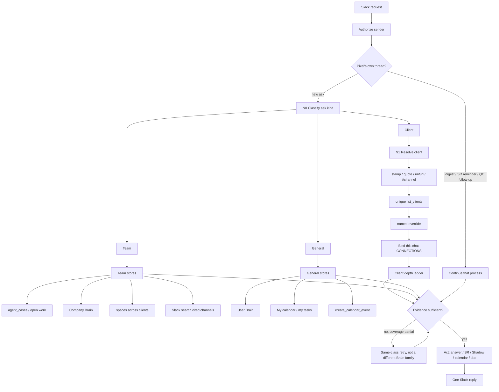

# Pixel Slack North Star — Classify, Retrieve, Deliver (Brain / Agent rework)

Last Modified: 2026-08-18 (§11.10 asset links; §11.11 client context bundle)

## Architect Summary

Pixel already has the pieces to answer almost every agency Slack ask. The product fails when those pieces are not run in a fixed order. The first version of this plan started the spine at **client resolve**. That is wrong for a large share of real asks. “What’s on my task list?”, “How many calls do I have today?”, and “Give me 5 content ideas from my brain” are not client lookups. Forcing client resolve first wastes tokens and overwrites the retrieve-then-draft work we already shipped to match Viktor.

The spine starts by classifying **what the message means**:

1. **Client** — a named or stamped client’s work, performance, Service Request, campaign, or call.
2. **Team** — across clients or internal ops: at-risk work, digest verify, `#ads-launches`, “what did the team promise.”
3. **General** — the operator’s own world: my calendar, my tasks, my User Brain, a reminder, rewrite-as-me with no client facts required.

Only **client-class** asks then run Client Resolve (N1). Team and general skip Portal client matching.

The North Star is unchanged: **every Slack request gets a correct, evidence-backed output at the cheapest token path that still looked deep enough.** Assume the answer exists. The question is whether Pixel classified the ask, retrieved the right stores for that class, and stopped when evidence was sufficient.

This is an expansion of the Viktor-parity work already on main (voice pack, retrieve-then-draft, CONNECTIONS bind, Team Intelligence composer, `agent_cases`). It does not replace those contracts.

This plan is now also the single home for the Brain / Agent rework: §11 folds in Auto-quality regression, CONNECTIONS + Campaign Brain preload, Brain ingestion coverage (incl. the personal Brain 500 and empty user brains), Pixel operator skills, QC health, and the live Slack audit that was never run.

This plan does five things:

1. Names Slack and agency processes that already exist in code — including what is already Viktor-parity.
2. Shows the current Slack → answer path versus the proposed **classify → (optional client resolve) → retrieve → act** spine.
3. Turns Dylan’s example asks plus production-stamped client channels into a request catalog and 10 processes, each tagged with ask class.
4. States what is already shipped so we do not rebuild it.
5. Gives file-level build work, stress tests, and risks. It does not invent new tables or actions unless an existing contract is missing.

### Missing evidence (live Slack)

This cloud workspace has no `scripts/roas/roas-secrets.env`, no `apps/api/.env`, and no Slack/Supabase MCP. A live crawl of every client channel was therefore **not** run from this VM.

What stands in for that crawl, with sources:

- Production channel→client stamps in `apps/api/src/modules/slack/services/__tests__/slack-pixel-scenario-matrix.test.ts` (`LIVE_CHANNEL_STAMPS`, comment: “Live stamps from slack_observation_events”).
- The 1DS quoted-thread ask from 2026-08-17: `@Pixel - need this edited VSL style asap` quoting `#roas-1ds-collective-llc-939`, Pixel asking Andy Elliott vs Krista.
- Policy and inbound code listed in the Evidence Pack.

**Smallest experiment to finish a live audit:** with production secrets, run a read-only query of `slack_observation_channels` + last-14-day `slack_observation_events` grouped by channel, plus Slack `search.messages` for `@Pixel` in those channels. Risk if skipped: request wording in §8 is grounded in stamps and known incidents, not a fresh 14-day message histogram.

---

## 0. Keep the Viktor work — expand it, do not rebuild it

“Viktor” in this plan is the **Slack coworker Pixel is mapping toward** (evidence-rich retrieve, one digest, follow-through), not the Spaces project agent `widget_builder`.

We are **not** at full Viktor parity. We are past the “rebuild Slack Pixel from scratch” stage. Most of N2–N10 in the first draft of this plan already exist as policy, skills, or loops. The remaining product miss is **skipping** those contracts (wrong Brain, ask-which-client, no quote inherit) and **starting every turn at client resolve**.

### Already shipped (do not overwrite)

| Work | What it is | Where | Status |
| --- | --- | --- | --- |
| Retrieve-then-draft | Named/misspelled client → `list_campaigns` / `search_campaign_brain` **before** asking or drafting; no `[bracket]` Mad Libs | PR 288, `PLATFORM_TOOLS_NAMED_CLIENT_LOOKUP_BLOCK` | On main |
| CONNECTIONS bind | `campaign_name` binds **this** portal chat, not the whole Slack DM | `artifact-brain-search-actions.service.ts`, meeting-follow-up-slack decision 2026-08-17 | On main |
| Slack channel identity | `[Slack channel identity]` stamp; unique `list_clients` hint; do not ask which client | `slack-ask-identity-context.ts` | On main; **fails on Slack quotes** (1DS) |
| Service Request routing | Client deliverables → Portal MCP, never `create_task` | `PLATFORM_TOOLS_DELEGATION_GUIDANCE_BLOCK`, page-grader-operator | On main |
| User Brain vs client Brain | First-person fill / “check my brain” is User Brain, not Campaign Brain | `PLATFORM_TOOLS_FIRST_PERSON_FILL_BLOCK` | On main — this **is** the general-class path |
| Meeting retrieval | Call/recording/transcript → Fathom/Fireflies before asking for a paste | platform-tools meeting block | On main |
| Pixel Slack voice | Shared Viktor-style voice pack for **live replies and** proactive DMs | `PIXEL_SLACK_VOICE_BLOCK` | On main |
| Team Intelligence composer | LLM digest + one spec-shaped offer; deterministic fallback | `slack-team-message-composer.service.ts` | On main (Viktor plan Phase 1) |
| Personal moments | Day-of / belated; not mixed into numbered digest | routing + composer | On main |
| Open-item / cases | `slack_open_items` → unified `agent_cases`; 24h breach, EOD reconcile | Viktor Phase 2 + 2026-08-13 consolidation | Ledger on main; keep `slack_open_items` as rollback |
| Offer follow-through | Offer → accept → deliverable in-thread (recap / case study / spend) | `slack-pending-offers.service.ts` | On main (Viktor Phase 3) |
| Cadence | EOD / weekend / Sunday check-in shaping | Team Intelligence delivery | On main (Viktor Phase 4) |
| One digest + 12h threads | Viktor-style Active DM, not one post per signal | integration-connections | On main; digest **repetition** still logged |
| QC / Launch one thread | Measure once; later webhooks reply in-thread | `page-grader-qc-follow-up.ts` | On main |
| Sender-only Slack Connect | Internal sender may use Pixel in mixed/group DM | PR 295 | Production API |
| SR review reminders | 3h then 22h, thread + broadcast | PR 296 | Merged |

Canonical plans this document **extends**: `.docs/plans/pixel-viktor-parity-plan-2026-08-10.md` (Phases 0–4 mostly landed per `pixel-next-wave-goal-2026-08-11.md` W1/W4), `.docs/plans/unified-slack-agent-consolidation-2026-08-13.md` (one `agent_cases` loop), `documentation/features/meeting-follow-up-slack.md` Slack agent roadmap.

### Still not Viktor-parity (real gaps — this plan)

| Gap | Class | What to do |
| --- | --- | --- |
| No ask-kind gate | Architecture | Put client / team / general **before** client resolve. Policy blocks exist; the spine and tests do not. |
| Slack **quote** does not inherit `#roas-*` | Client identity | N1 quote parse — 1DS Andy-vs-Krista. Does not touch retrieve-then-draft. |
| Pixel still skips retrieve | Behavior | Encode N2 as tool-trace tests on the **existing** named-client + first-person + meeting blocks. Do not write a second TOOLS.md. |
| Team Intelligence digest still repeats | Proactive | Already in follow-up log. Out of scope for inbound classify. |
| Org Pixel missing some skills / browser | Runtime | Follow-up log. N7 admits browser absence. |
| Mixed Slack Connect + client data | Product | R54. Do not loosen External deny. |

### How this maps to Viktor

Viktor in Slack does three things Pixel is already built to do:

1. **Understand the ask** (personal vs team vs a client thread) before searching.
2. **Look it up** (retrieve-then-draft) instead of interviewing the human.
3. **Follow through** (one digest, aged open items, offer → artifact).

This plan’s job is (1) as a first-class step, plus quote inherit so (2) runs on the right client. It is not a new Pixel, not a new classifier service, and not a rewrite of the composer, voice pack, CONNECTIONS bind, or Service Request path.

---

## Evidence Pack

- `packages/agent-policy/src/platform-tools-template.ts` — named-client lookup, Slack channel identity, retrieve-then-draft, Service Request routing, Brain family rules, meeting retrieval, Slack voice.
- `apps/api/src/modules/slack/services/slack-service-events.base.ts` — inbound `app_mention` / `message` / reaction.
- `apps/api/src/modules/slack/services/slack-service-auth.base.ts` — `resolveSlackAskClientStamp` from `slack_observation_channels` + `slack_observation_events.metadata.page_grader_client_id`.
- `apps/api/src/modules/slack/services/slack-ask-identity-context.ts` — `[Slack channel identity]` prompt block; unique `list_clients` hint; do not ask which client.
- `apps/api/src/modules/slack/services/slack-forwarded-message-context.ts` — parses Slack **unfurls** (`is_msg_unfurl` / archive URL / “Posted in #”). Does not parse a Slack **quote** whose only human text is “From a thread in #channel”.
- `apps/api/src/modules/slack/services/slack-service-conversation.base.ts` — thread reply context (last 12); forwarded identity + source-channel history when `channelId` differs.
- `apps/api/src/modules/slack/services/__tests__/slack-pixel-scenario-matrix.test.ts` — 11 live client channels + 15 Pixel scenarios.
- `docker/agents/atlas/skills/page-grader-operator/SKILL.md` — Portal fulfillment, `page_grader_create_fulfillment_request`.
- `docker/agents/vibey/skills/slack-signal-operator/SKILL.md` — Team Intelligence / Shadow.
- `docker/agents/vibey/skills/post-call-delivery/SKILL.md` — post-call Slack recap contract.
- `docker/agents/atlas/skills/vibey-api/SKILL.md` + `references/brain.md`, `integrations.md`, `meta.md`, `mcp.md` — action catalog.
- `documentation/features/integration-connections.md` — Slack fail-closed access, Team Intelligence, CONNECTIONS, Fathom, Drive docs.
- `documentation/features/page-grader-mcp-bridge.md` — Portal vs Brain, Service Request draft + reminders.
- `apps/api/src/modules/work-requests/services/work-request.service.ts` — 24h review token; 3h then expiry Slack reminders.
- `apps/api/src/modules/integrations/page-grader/services/page-grader-qc-follow-up.ts` — Launch/QC Slack thread follow-up.

---

## 1. What Pixel already specializes in

### 1.1 Slack-specialized processes (exist today)

| # | Process | What happens | Owner in code |
| --- | --- | --- | --- |
| S1 | **Inbound Pixel turn** | Slack event → fail-closed Manage People (`internal` only) → credits/runtime → prompt with channel identity + optional forward + last-12 thread → OpenClaw Pixel | `slack-service-events.base.ts`, access control |
| S2 | **Channel → client stamp** | Observation metadata `page_grader_client_id` / name + ROAS campaign ids injected as `[Slack channel identity]` | `slack-ask-identity-context.ts`, `resolveSlackAskClientStamp` |
| S3 | **Forwarded unfurl inherit** | Unfurl of another channel loads that channel’s stamp + 10 recent messages | `slack-forwarded-message-context.ts`, `buildForwardedMessageContext` |
| S4 | **Service Request (Portal fulfillment)** | Any client deliverable (design/copy/funnel/ghl/ad/video/other/general) → Portal MCP `page_grader_create_fulfillment_request` → review URL in-thread, not `create_task` | `page-grader-operator`, platform-tools |
| S5 | **Review follow-ups** | Unreviewed draft: Slack nudge at 3h, then ~22h (“expires in 2 hours”), thread + channel broadcast (PR 296) | `work-request.service.ts` / reminders helper |
| S6 | **Team Intelligence** | `observe_slack_team`: ledger `slack_observation_events` → analyzer → Shadow or Active DM digest (max 5 briefing items); 12h follow-ups thread on the digest | spaces automation + slack-team-loop |
| S7 | **Personal moment** | Separate Active DM for high-confidence personal/team moments; not mixed into the numbered digest | integration-connections §55 |
| S8 | **Meeting follow-up Slack** | Call follow-ups → Shadow draft → admin approve → Slack DM/channel | `meeting-follow-up-slack-confirm*` |
| S9 | **Post-call delivery** | Recap JSON + owned next steps; Shadow until approve | `post-call-delivery` skill |
| S10 | **Launch / QC Slack** | Portal QC/launch findings post or thread-follow-up on the same Slack parent (8h cooldown) | `page-grader-qc-follow-up.ts` |
| S11 | **Slack Brain import** | Mapped channels → Person / Campaign Brain memories; 90-day backfill is admin-gated | integration-connections §34, §48 |
| S12 | **Named-client CONNECTIONS bind** | `list_campaigns` / `search_campaign_brain` with `campaign_name` binds **this** portal chat, not the whole Slack identity | `artifact-brain-search-actions.service.ts` |
| S13 | **Slack search** | User search token when present; else 120-day named-channel history with coverage complete/partial | Slack agent tools |
| S14 | **Access / Slack Connect** | Sender-only Internal authorization (PR 295). External still denied. Group DMs are not auto-client-channels. | `slack-access-control.service.ts` |

### 1.2 Agency processes (not Slack-only, Pixel uses them from Slack)

| # | Process | Typical trigger | Stores / tools |
| --- | --- | --- | --- |
| A1 | Campaign Brain retrieve | Named client facts, offer, webinar, voice | `search_campaign_brain` |
| A2 | Portal reads | Clients, campaigns, fulfillment, intel, Meta cache | `list_mcp_tools` → Page Grader MCP |
| A3 | Live ads | Spend, CPL, purchases, creatives | `get_meta_ads_insights`, Portal best-ads table |
| A4 | Space / tasks | AM risk, my list, launch timeline | `list_spaces`, task list/get (via `vibey_backend`) |
| A5 | Meetings | Recaps, promises, recordings | Fathom/Fireflies `use_integration`, `ingest_fathom_meeting` |
| A6 | Calendar | “How many calls today”, reminders | `list_calendar_events`, `get_person_agenda`, `create_calendar_event` |
| A7 | User Brain | Bios, content ideas, write-as-me | `search_user_brain` — **not** for client package facts |
| A8 | Company Brain | Agency operating rules, Friday update standard | `search_company_brain` |
| A9 | Customer Brain | Avatar / objection / interview | `search_customer_brain` |
| A10 | Docs | “Make a doc and give me the link” | Drive `create_google_doc` / `save_document` |
| A11 | Media | Image edit, video ads | `generate_image`, `generate_video`, Higgsfield MCP |
| A12 | Browser QC | Click through funnel, test lead | browser tool (org Pixel may still lack it — follow-up log) |
| A13 | Skills craft | Webinar, ads, copy, design, pre-call strategy | `docker/agents/templates/{copywriter,ads_manager,designer,strategist}` |
| A14 | Missions | Long strategy / pre-onboarding form | `create_mission` when user wants tracked async work |
| A15 | Delegation Desk | Batch Space intake → Pixel | `delegation-desk` skill (Vibey) |

---

## 2. Current Slack → answer flow



**What went wrong on 1DS (2026-08-17):** Dylan @Pixel in a Slack Connect group DM quoted a thread from `#roas-1ds-collective-llc-939`. Access control now lets the Internal sender talk (S14). Identity stamp is for the **group DM**, not 1DS, unless Slack sent a parseable unfurl. Quote text “From a thread in #roas-1ds-collective-llc-939” is not handled by `parseSlackForwardedMessage`. Pixel then asked Andy vs Krista — the exact failure S2/S4 policy forbids when a client channel uniquely maps.

Token waste today: clarifying questions, User Brain first, duplicate searches, two Slack handlers on mapped channels (fixed for mentions), Team Intelligence re-digest (still logged).

---

## 3. Proposed spine (classify first, then retrieve)

Client resolve is a **branch**, not the start. The first question is what the message **means**.



### N0 — Ask Kind (before any client lookup)

Cheap, deterministic signals first. No extra model call. Policy already has the three families as **separate blocks** (`NAMED_CLIENT_LOOKUP`, first-person fill, meeting/calendar, Team Intelligence verify). N0 makes that order unskippable.

| Kind | Meaning | Cheap signals | Then | Do not |
| --- | --- | --- | --- | --- |
| **Continuation** | Reply to Pixel’s own digest, SR nudge, or QC thread | Same `thread_ts` as Pixel parent; “approve”; digest “is that still open?” | S5 / S6 / S10 | New SR, new client ask |
| **Client** | Work, facts, or performance for one client | Quoted/stamped `#roas-*`; named/misspelled client; client-channel + deliverable/performance/update | N1 → client ladder (Brain, Portal, source Slack, tasks, meetings, Meta) | User Brain first; ask Andy vs Krista |
| **Team** | Across clients or internal ops | “my clients” / “the team” / “all clients” / “at risk”; `#ads-launches` with no client; digest item without a new client name | `agent_cases`, Space tasks, Company Brain, Slack search of cited channels | Bind one Portal client as if it were the whole ask |
| **General** | Operator’s own world | “my task list”, “my calls today”, “check my brain”, “remind me”, first-person bio/fill with no client | User Brain, calendar, my tasks | `list_clients`, Campaign Brain, CONNECTIONS bind |

Mixed asks (“rewrite this Slack to Yasir about the webinar delay”) are **client** for facts + **general** for voice. Run N1 for Yasir, User Brain only for tone (already PR 288).

Ambiguous after cheap signals: **one** question naming the fork (“this your calendar, or a client?”). Do not default to client.

**Rule:** Do not ask the human for a fact the platform can know. Ask only on true forks (ask kind unclear; zero or multiple clients after client-class lookup; publish/spend; ladder returned empty).

**Token rule:** Classify once (cheap). For client-class: one resolve, one bind, one search per store. For general: do not open Portal. For team: do not bind a single campaign unless they named one. Stop at first sufficient evidence.

### How stores interact

| Store | When to hit | When not to |
| --- | --- | --- |
| Ask kind (N0) | Every new Slack ask | Not a second LLM classifier |
| Slack channel identity / CONNECTIONS | Client-class only, or mixed client+voice | Never treat a group DM as the client if a quoted `#roas-*` exists; never on pure general asks |
| Campaign Brain | Client package, strategy, webinar, voice, prior decisions | Not for “how many calls do I have today” |
| Portal MCP | Client-class clients, campaigns, SR status, intel, cached Meta, best ads | Not a replacement for live Meta if user asked “right now”; not for general calendar |
| Slack search / channel history | Quoted thread, Drive folder, digest verify | Not instead of Brain for durable strategy |
| Space tasks | Team AM risk, general “my list”, client launch timeline | Not for Portal fulfillment create |
| Meetings / Fathom | Client promises/recaps; general “my calls today” | Not for ad spend |
| Meta | Client spend, CPA, on/off track, creatives | Not before client is bound; not on team/general |
| Company Brain | Team cadence (Friday notes, launch rules) | Not client offer facts; not User Brain |
| User Brain | General: my bio, content ideas, write-as-me | Not client lookup |
| Customer Brain | Client-class avatar / objections | After that client is known |
| `agent_cases` | Team open asks, 24h breaches, EOD | Not a substitute for Campaign Brain facts |
| Drive / docs | “Give me a live doc link” | After retrieve, so the doc is not empty brackets |

---

## 4. Consolidation for the North Star

Do **not** add a second Pixel. Do **not** add a classifier microservice. Collapse into four layers that already exist:

0. **Classify (N0)** — client vs team vs general vs Pixel-thread continuation. Cheap signals + existing platform-tools blocks. **New as a spine step; not new architecture.**
1. **Resolve (N1)** — **client-class only.** Extend quote parsing so S2/S3 fire on forwarded quotes. Cheap (no model).
2. **Retrieve ladder (N2)** — make the ordered stores already in platform-tools a hard protocol (same text exists, Pixel skips it). Different store set per ask kind. Cheap vs wrong answers.
3. **Act** — one of: answer, Service Request draft, Shadow recap, calendar event, doc, mission. Skills only after retrieve.

Remove / stop:

- Starting every Slack turn at client resolve (this plan’s first-draft miss).
- Asking which client when stamp or unique hint exists (already policy; enforce with scenario tests + quote fixtures).
- Native `create_task` for client fulfillment (already forbidden).
- User Brain / Agent Brain first on named-client facts (already forbidden).
- Duplicate Slack analysis of empty 5-minute windows (already skipped).
- Extra “I have full context” acks (fork-chat work elsewhere).
- Rebuilding the voice pack, composer, CONNECTIONS bind, or Service Request path.

Keep Team Intelligence, QC follow-ups, and Service Request reminders as **outbound** processes. A human reply on those threads is **Continuation**, not a new client lookup.

What looked “not done” in the first draft of this plan was mostly **already done** as policy/loops (N2 retrieve-then-draft, N6 send-ready drafts, N10 SR routing, N5 meeting retrieval, N9 agenda). The build is: N0 as tests + a short protocol heading, N1 quote inherit, then traces that Pixel cannot skip the existing blocks.

---

## 5. Ten proposed processes (from stamps + 1DS + Dylan’s list)

Each process is a named ladder. Existing S1–S14 stay; these are the **product** processes operators should expect. **N0 runs first.** N1–N10 only after the matching ask kind.

### N0 — Ask Kind Router
**Kind:** all new asks
**Why:** Not every Slack message is a client request. Client-first lookup is the wrong first move for calendar, User Brain, and team-wide risk.
**Steps:** continuation? → cheap signals (channel, quote, named client, first-person operator phrases, “the team” / “all clients”) → client | team | general. One clarifying question only if still forked.
**Already exists as:** separate platform-tools blocks. **Missing:** a required first step + fixtures that a general ask must not call `list_clients`.
**Files:** `platform-tools-template.ts` (short “classify before named-client lookup” heading), scenario matrix: R04/R05/R17 must not contain Portal client resolve; R01/R31 must.

### N1 — Client Resolve Spine
**Kind:** client only
**Why:** 1DS quote in a group DM; S13 internal `#ads-launches` still may ask which client.
**Steps:** current stamp → parse unfurl **and** “From a thread in #x” / archive URL / `<#C…>` → `list_clients` with channel hint → bind CONNECTIONS → only then ask if 0 or N matches.
**Does not replace:** PR 288 retrieve-then-draft. Quote inherit feeds that path the right client.
**Files:** `slack-forwarded-message-context.ts`, `slack-ask-identity-context.ts`, scenario matrix S02/S08/S14 + new quote fixture.

### N2 — Depth Ladder (retrieve-then-answer)
**Kind:** client (stores differ for team/general — see N0)
**Why:** Policy exists (PR 288); Pixel still asks for screenshots/dates.
**Steps:** Campaign Brain → Portal → source Slack channel (until `coverage.complete` or a hit) → Space tasks → meetings if the ask is temporal → Meta if the ask is performance → then answer. Placeholders only if those returned empty.
**Already exists:** `PLATFORM_TOOLS_NAMED_CLIENT_LOOKUP_BLOCK`. Do not replace that block. Add N0 “classify before this block” + tool-trace tests.
**Files:** `platform-tools-template.ts` (numbered ladder), page-grader-operator, tests that a mock “which client” reply fails S08.

### N3 — Performance Pulse
**Kind:** client
**Why:** S04, S07, Dylan spend/CPA asks.
**Steps:** N0 client → N1 → `search_campaign_brain` light → Portal campaigns → `get_meta_ads_insights` for the named range → Portal best-ads table → 4-bullet Slack pulse (spend, result, CPA, on/off track) + creative links if present.

### N4 — Account Manager Risk Sweep
**Kind:** team
**Why:** “Open work across my clients, what’s at risk.”
**Steps:** N0 team → `list_campaigns` / `agent_cases` in scope (no single-client bind unless they named one) → Portal open SRs → Space tasks due/overdue → launch dates from Brain/Portal → Slack: at-risk only, by client.

### N5 — Call Memory / Promises
**Kind:** client if a client is named; general if “my calls last week”
**Why:** “What did we agree / what did I promise.”
**Steps:** N0 → if client: N1 then Fathom + Campaign Brain “decision” + Slack meeting thread. If general: Fathom last 7d for the caller only. Never invent an owner.

### N6 — Client Update Writer (SOW / midweek / EOW)
**Kind:** client
**Why:** Send-ready updates; PR 288 already bans `[brackets]`.
**Steps:** N0 client → N1 → N3 for the time range → N4 open work → Company Brain Friday-note rule → draft in Dylan/Nefi voice from User Brain only for **tone**, not facts.

### N7 — Launch Asset QC Walk
**Kind:** client
**Why:** Dylan QC example; Launch/QC already posts to Slack.
**Steps:** N0 client → N1 → Brain + Slack launch channel + tasks for funnel URLs → browser or `web_fetch` → dates/prices vs campaign Brain → findings. If browser missing, say so (do not fake a click-through).

### N8 — Webinar Campaign Planner
**Kind:** client
**Why:** Yasir/Impact/Dunamis/Trade webinar work in the scenario matrix.
**Steps:** N0 client → N1 → Brain webinar + prior calls (N5) → Portal: campaign exists? → if no, **suggest** draft campaign / SR, do not publish ads → recap topics + open links.

### N9 — Meeting Prep / Onboarding
**Kind:** client if a client is named; general if “prep me for my next call” with no name
**Why:** Agenda prep + “pre-onboarding form.”
**Steps:** N0 → calendar event → if client-class, N1 + Brain strategy + form; if form missing, **ask once** whether to run the pre-call strategy mission. `create_mission` only if they say yes.

### N10 — Creative / Fulfillment Router
**Kind:** client
**Why:** VSL edit, statics, copy, GHL, video — all SRs. Already S4.
**Steps:** N0 client → N1 (this is the 1DS fix) → retrieve Drive/Slack assets → `page_grader_create_fulfillment_request` with `task_type` + assignee + `conversation_id` → review URL. Never `create_task`.
**Already exists:** Service Request policy. Do not add a parallel native-task path.

---

## 6. Request catalog

Convention: **Kind** = client | team | general | continuation. **General wording** = operator phrasing. **Specific** = one real-shaped ask. **Ladder** always starts with N0. Client-class ladders then run N1. Team/general must not.

| Kind | Examples |
| --- | --- |
| Client | R01–R03, R06, R10–R11, R14–R15, R18–R21, R23–R43, R45–R46, R48–R52 |
| Team | R07, R13, R16, R44, R47, R53 |
| General | R04, R05, R08 (no client named), R09, R12, R17, R22 |
| Mixed | R18 (client facts + User Brain tone), R12 (general reminder about a client task — calendar first, client only if they asked to draft the VSL) |
| Continuation | R48, R55 |

R08 is **general** when they say “my calls last week”; it becomes **client** if they name Yasir. R13 “how many active clients do I have” is **team/portfolio**, not N1 on one client — Portal `list_clients` count, no Campaign Brain.

### 6.1 Dylan’s set (R01–R30)

**R01 — Campaign performance**
- Kind: client
- General: What’s X client’s campaign performance right now?
- Specific: What’s 1DS Skool campaign performance right now — on track or off, and cost per purchase?
- Process: N3
- Ladder: N0 client → N1 on 1DS (`#roas-1ds-collective-llc-939` / list_clients `1ds collective`) → bind → Portal campaigns named Skool → `get_meta_ads_insights` today/7d → result action purchase → compare to Brain target CPA → four bullets. If Skool campaign missing, say so and list campaigns that **do** exist.

**R02 — Build a campaign for a webinar next week**
- Specific: Can you build a campaign for Impact Elite to launch a webinar next week?
- Process: N8 then N10
- Ladder: N1 Impact (`roas-impact-elite-coaching-820`) → Brain webinar dates/offer → Portal campaign exists? → if no, draft Portal campaign / SR (do not publish) → ask only for missing date/budget if Brain empty.

**R03 — Onboarding call date**
- Specific: What’s the date of the Christian Osgood onboarding call?
- Process: N9 / A6+A5
- Ladder: N1 Christian → `list_calendar_events` + Fathom title match “onboarding” → return date/time/link. If none, say sources checked.

**R04 — My task list today**
- Kind: general
- Specific: What’s on my task list today?
- Process: A4 (no client)
- Ladder: N0 general → `list_spaces` / tasks due today for the Slack user → not Portal SRs unless they also asked clients. **Forbidden:** `list_clients`, `search_campaign_brain`.

**R05 — Calls today**
- Kind: general
- Specific: How many calls do I have today, and when’s the first one?
- Process: A6
- Ladder: N0 general → `get_person_agenda` or `list_calendar_events` for today → count + first start. Mine calendar only. **Forbidden:** Portal client resolve.

**R06 — Prep meeting agenda**
- Specific: Prep the agenda for the White Picket Fence strategy call.
- Process: N9
- Ladder: N1 WPF → calendar event → Brain + last Fathom + open tasks → write agenda doc (`save_document` or Space doc) → Slack link.

**R07 — Open tasks across my clients**
- Kind: team
- Specific: Find all open tasks for my clients across the team, not just mine, and what’s at risk for missing launch.
- Process: N4
- Ladder: N0 team → `list_campaigns` / `agent_cases` in scope → each: Portal SRs + Space tasks + launch date from Brain → at-risk only. Do not bind one client as the whole ask.

**R08 — Outstanding promises from last week’s calls**
- Specific: Any outstanding promises from my calls last week?
- Process: N5
- Ladder: Fathom last 7d → action_items / Next Steps → unmatched vs tasks → list.

**R09 — Calls last week + recordings**
- Specific: Give me my calls last week with recording links.
- Process: A5
- Ladder: Fathom `list_meetings` week window → title, date, recording URL. No Brain substitute.

**R10 — What I promised X last call**
- Specific: What did I promise Yasir last call?
- Process: N5
- Ladder: N1 Yasir → latest Fathom with Yasir → action_items owned by Dylan.

**R11 — What we agreed**
- Specific: What did me and Nick Sakha agree to?
- Process: N5 + Campaign Brain
- Ladder: N1 Sakha → last meeting + Brain “decision” query → Slack: decisions vs open.

**R12 — Set a reminder**
- Specific: Remind me tomorrow 9am to send the 1DS VSL review.
- Process: A6
- Ladder: `create_calendar_event` on caller calendar. Not a Space task unless they asked for a task.

**R13 — Active client count**
- Specific: How many active clients do I have right now?
- Process: A2
- Ladder: Portal `list_clients` (or mapped campaigns) → count. Don’t invent churned.

**R14 — Prep onboarding call**
- Specific: Prep me for the onboarding call with Trade Launch. If we don’t have the pre-call form, ask if I want that mission run.
- Process: N9
- Ladder: N1 Trade → Brain/form → if missing, **one** question → optional `create_mission` pre-call strategy skill.

**R15 — Live doc link**
- Specific: Make a doc for Dunamis webinar recap and give me the live link.
- Process: A10 after N5
- Ladder: Retrieve first → Drive `create_google_doc` with real content → URL. No empty template.

**R16 — Team work at risk**
- Specific: Check all team work across all clients and tell me what’s at risk.
- Process: N4 org-wide (admin)
- Ladder: Same as R07 without “my clients” filter; cap listing to at-risk.

**R17 — Five content ideas from my brain**
- Kind: general
- Specific: Check my brain and give me 5 content ideas.
- Process: A7
- Ladder: N0 general → `search_user_brain` identity/offer queries — **not** campaign Brain. Five ideas grounded in memories. **Forbidden:** `list_clients`.

**R18 — Rewrite a client message**
- Specific: Help me rewrite this Slack message to Yasir about the webinar delay.
- Process: N6 tone + N1 facts
- Ladder: N1 → facts from Brain/tasks → rewrite send-ready. User Brain for Dylan voice only.

**R19 — Midweek / SOW / EOW update**
- Specific: Draft this week’s EOW update for Above It.
- Process: N6
- Ladder: N1 Above It → N3 7d → open SRs/tasks → Company Brain cadence → send-ready Slack.

**R20 — Spend this week + top creatives**
- Specific: How much has Multifamily Strategy spent this week, plus top creatives from the Portal best-ads table.
- Process: N3
- Ladder: N1 Christian → week-to-date insights → Portal best-performing ads + links/screenshots if the MCP returns them.

**R21 — Post-call recap**
- Specific: Give a post-call recap for White Picket Fence.
- Process: S9 / N5
- Ladder: Latest Fathom → post-call-delivery JSON → Shadow unless user said “just draft here”.

**R22 — Recap all my calls today + open tasks**
- Specific: Recap today’s calls and the open task items.
- Process: A5 + A4
- Ladder: Today’s Fathom + today’s tasks. No client bind required.

**R23 — Kick off a strategy plan**
- Specific: Kick off a strategy plan for Master Your Kraft.
- Process: N8/N9 + mission
- Ladder: N1 Kraft → Brain + last calls → if heavy, `create_mission` with strategist skill; else a Space doc.

**R24 — Plan the webinar**
- Specific: Help me plan the webinar for Yasir / Speak Like a CEO.
- Process: N8
- Ladder: N1 Yasir → Brain + calls + existing campaign? → topics, dates, open links → suggest campaign create if missing.

**R25 — Create ad creatives**
- Specific: Create ad creatives for Dunamis webinar retargeting.
- Process: N10 `ad`
- Ladder: N1 → Brain angles → SR `task_type=ad` assignee if named → review URL.

**R26 — Video ad or series**
- Specific: Make a series of video ads for 1DS.
- Process: N10 `video` + A11
- Ladder: N1 1DS → Brain → SR video and/or `generate_video` only if they asked Pixel to render, not Portal production.

**R27 — Workflow sequence**
- Specific: Write a GHL workflow sequence for Master Your Kraft post-webinar.
- Process: N10 `ghl` + copywriter skill
- Ladder: N1 Kraft → Brain nurture → SR `ghl` (not silent native sequence send).

**R28 — Video ad scripts**
- Specific: Write video ad scripts for Sakha / Insurance Creators.
- Process: copywriter `roas-video-ad-scripts` after N1+Brain
- Ladder: Retrieve → draft scripts in Slack or doc. SR only if they want production.

**R29 — Copy**
- Specific: Help me write landing copy for Standard Plumbing.
- Process: copywriter skill + N1
- Ladder: Brain offer → draft. SR `copy` if fulfillment.

**R30 — QC all assets**
- Specific: Check the Impact webinar campaign and QC all assets — funnels, dates, launch Slack, tasks.
- Process: N7
- Ladder: N1 Impact → collect URLs from Brain/Slack/tasks → fetch/browser → report mismatches.

### 6.2 Audit-derived set (R31–R55)

Grounded in `LIVE_CHANNEL_STAMPS`, scenario matrix S01–S15, and the 1DS group-DM quote.

**R31 — Quoted client thread in a group DM (incident)**
- Kind: client (identity from quote, not from the group DM)
- General: Need this [deliverable] from that client thread ASAP.
- Specific: `@Pixel - need this edited VSL style asap` quoting `#roas-1ds-collective-llc-939`.
- Process: N1 + N10 `video`
- Ladder: Parse “From a thread in #roas-1ds-collective-llc-939” → stamp 1DS Collective LLC (`ca82655a-…`) → **do not ask Andy vs Krista** → Slack/Drive for 9x16/16x9 → SR video “Edited VSL for 1DS” + review URL.

**R32 — In-channel Yasir redesign (S01)**
- Specific: In `#roas-yasir-khan-coaching-ltd-955`, redesign speaklikeaceo.com into the post-webinar page.
- Process: N10 `funnel`/`design`
- Ladder: Stamp Yasir → Brain testimonials/offer → SR with client id `b17dcee8-…`.

**R33 — Forwarded Yasir task (S02)**
- Specific: From another channel, “Create the redesign request from this” with Yasir unfurl.
- Process: N1 + N10
- Ladder: Unfurl stamp **source** channel, not current.

**R34 — Impact VSL funnel SR (S03)**
- Specific: Build a funnel request for the new VSL page (Impact).
- Process: N10 `funnel`

**R35 — Christian weekly blockers (S04)**
- Specific: Latest campaign status / blockers this week in `#roas-christian-osgood`.
- Process: N3 + N4 (single client)

**R36 — Sakha open design SRs (S05)**
- Specific: Any open Service Requests still waiting on design for Sakha?
- Process: A2 Portal fulfillment list after N1

**R37 — Dunamis 5 statics (S06)**
- Specific: Ads request for 5 new statics for webinar retargeting.
- Process: N10 `ad`

**R38 — Above It Meta 7 days (S07)**
- Specific: How are Meta ads performing last 7 days?
- Process: N3

**R39 — 1DS offer page hero (S08)**
- Specific: Design request for new offer page hero + mobile.
- Process: N10 `design`

**R40 — WPF post-call tasks (S09)**
- Specific: Draft post-call recap tasks from yesterday’s strategy call.
- Process: S8/S9 + N5

**R41 — Plumbing headlines (S10)**
- Specific: Copy request for landing page headline options.
- Process: N10 `copy` or in-Slack draft if they said “write,” SR if “request.”

**R42 — Trade Launch replay edit (S11)**
- Specific: Video request for webinar replay edit + captions.
- Process: N10 `video`

**R43 — Kraft GHL nurture (S12)**
- Specific: GHL automation request for post-webinar nurture.
- Process: N10 `ghl`

**R44 — Internal ops, no client (S13)**
- Specific: In `#ads-launches`, “Create a Service Request for the new static pack.”
- Process: N1
- Ladder: No stamp → **one** client question (allowed). After they name Dunamis, continue N10.

**R45 — Unmapped but unique channel name (S14)**
- Specific: Channel named `roas-yasir-khan-coaching-ltd-955` without metadata stamp.
- Process: N1 `list_clients` “yasir khan coaching” → unique → no ask.

**R46 — Explicit override (S15)**
- Specific: Standing in Yasir channel: “this is for Impact Elite.”
- Process: N1 override
- Ladder: Honor named Impact; keep Yasir stamp visible as conflict resolved.

**R47 — Verify a Team Intelligence digest item**
- Specific: Pixel digest said Yasir asked about payment; “is that still open?”
- Process: S6 + S13
- Ladder: Do not answer from digest text. Search `#roas-yasir-khan-coaching-ltd-955` + reactions; then yes/no.

**R48 — Launch QC follow-up thread**
- Specific: Pixel QC’d Impact funnel dates; “did we fix the timezone yet?”
- Process: N7 + S10
- Ladder: Same Slack parent thread → live page check → update.

**R49 — Bind CONNECTIONS from a Slack DM**
- Specific: In Pixel DM, “pull Speak Like a CEO webinar stats.”
- Process: S12 + N3
- Ladder: `search_campaign_brain` `campaign_name=Speak Like a CEO` binds chat → insights. Not User Brain.

**R50 — Drive folder from Slack history**
- Specific: 1DS VSL “I have a 9x16 and 16x9” + Drive link in `#roas-1ds-collective-llc-939`.
- Process: S13 + N10
- Ladder: Channel search Drive/folder → attach URLs on the SR. Don’t ask for the link if search coverage is complete and the URL is there.

**R51 — Portfolio compare**
- Specific: Compare Above It vs Dunamis spend this week.
- Process: N3 ×2
- Ladder: Resolve both campaigns → two pulses → one table-as-bullets (Slack has no tables).

**R52 — Who owns Portal work**
- Specific: Who is assigned on Sakha’s open design SRs?
- Process: A2
- Ladder: Portal fulfillment for client → assignee_name.

**R53 — New channel mapping**
- Specific: `#roas-new-client` has no Portal stamp.
- Process: N1
- Ladder: `list_clients` hint → 0 matches → one question + offer to map in CONNECTIONS. Don’t guess Andy/Krista.

**R54 — Slack Connect partner in the thread**
- Specific: Group DM with The Shift Social external; Internal Dylan @Pixel about 1DS.
- Process: S14 then N1
- Ladder: Allow Dylan; still resolve 1DS from quote; never dump ROAS data because an external can see it unless policy says Internal-only replies. **Unknown:** whether Pixel should reply in mixed group DMs with client data. Smallest experiment: product decision. Default: Internal sender authorized (PR 295); consider moving client data to an internal channel if externals are present.

**R55 — Fulfillment reminder reply**
- Specific: Pixel 3h nudge on Carol Garcia–D/C, Pixel channel; Dylan replies “approve.”
- Process: S5 + review chat
- Ladder: Thread context → continue Service Request steps, not a new SR.

---

## 7. Stress-test plan

Extend `PIXEL_SCENARIOS` from prompt-shape tests into **tool-trace tests** (fixture in, ordered actions out). One case per request id above is too many for a single PR; gate in waves.

### Wave 0 — Ask kind + identity (blocks everything)
Fixtures:
- General must not resolve a client: R04, R05, R17.
- Team must not bind one client as the whole ask: R07, R44.
- Client identity: R31 quote-without-unfurl, R33 unfurl, R45 unique hint, R46 override, R54 Slack Connect.
Assert: general/team traces do not call `list_clients` / `search_campaign_brain` unless a client was named. Client traces contain resolved client **or** a single allowed ask; never Andy-vs-Krista when 1DS stamp exists.
Commands: `pnpm --filter @vibey/api test -- src/modules/slack/services/__tests__/slack-pixel-scenario-matrix.test.ts` plus `platform-tools-template.test.ts` classify-before-lookup heading.

### Wave 1 — Fulfillment
R32, R34, R37, R39, R42, R43. Assert MCP tool `page_grader_create_fulfillment_request` with `client_ref` / campaign id, `task_type`, `conversation_id`; no `create_task`.

### Wave 2 — Retrieve
R01, R20, R35, R38, R49. Assert order: bind/search_campaign_brain before Meta; no User Brain. This is **existing PR 288 policy**, not a new retrieve stack.

### Wave 3 — Meetings / calendar
R03–R06, R08–R11, R21, R22. Assert Fathom/calendar actions; no invented owners. Split: R04/R05/R09/R22 stay general (no N1).

### Wave 4 — AM / updates / QC
R07, R16, R19, R30, R47, R48. Assert at-risk filter; digest verify searches Slack. R47/R48 are continuation or team, not a new client resolve unless the item names one.

### Live harness (after secrets)
For each Wave 0–1 specific: post in a **private internal test channel** mapped to a non-prod client, or dry-run against observation stamps. Record: tools used, tokens, whether Pixel asked a forbidden question.

Pass/fail for every request:
- Correct ask kind
- Correct client id from stamp/hint **only if kind=client**
- Ladder stores for that kind actually called; forbidden stores not called
- No forbidden ask
- Slack reply has the answer or a review URL
- Token budget: ≤ N tool rounds (propose 4 for general, 8 for client retrieve, 12 for SR+retrieve). Tune after Wave 2 traces — **unknown** until measured.

---

## 8. Implementation plan (file-level)

Recommended approach: **do not rebuild retrieve-then-draft, voice, composer, or Service Request routing.** Add N0 as a required heading + tests. Ship N1 quote inherit for client-class identity (1DS). Then encode the existing Depth Ladder as traces Pixel cannot skip.

0. `packages/agent-policy/src/platform-tools-template.ts`
   - Change: add a short **Classify before lookup** heading in front of `NAMED_CLIENT_LOOKUP` and first-person fill. Client vs team vs general vs continuation. Keep every existing named-client, SR, and User Brain rule verbatim.
   - Tests: general phrases (“my task list”, “check my brain”, “how many calls do I have today”) appear in the classify block; named-client block still required.

1. `apps/api/src/modules/slack/services/slack-forwarded-message-context.ts`
   - Change: parse “From a thread in #channel”, archive URLs in text, and quote attachments that lack `is_msg_unfurl`.
   - Why: R31 does not hit S3 today.
   - Tests: new cases in `slack-forwarded-message-context.test.ts` + scenario `R31`.

2. `apps/api/src/modules/slack/services/slack-service-conversation.base.ts`
   - Change: `buildForwardedMessageContext` also runs on quote-parsed channel names; load source stamp like unfurls.
   - Contract: group DM + 1DS quote → `[Slack channel identity]` for 1DS.

3. `apps/api/src/modules/slack/services/__tests__/slack-pixel-scenario-matrix.test.ts`
   - Change: quote-in-mpim + general/team fixtures; assert `forbidAskWhichClient` for 1DS; assert R04/R17 prompts are not client-stamped as the work to do.

4. `packages/agent-policy/src/platform-tools-template.ts` (same file as 0)
   - Change: Depth Ladder as an ordered list for **client-class** (Brain → Portal → Slack source → tasks → meetings → Meta). Keep existing forbids.
   - Tests: `platform-tools-template.test.ts` string contains the ladder and 1DS example.

5. `docker/agents/atlas/skills/page-grader-operator/SKILL.md` + vibey copy
   - Change: same quote rule; “quoted `#roas-1ds-*` is 1DS.” Do not rewrite retrieve-then-draft.
   - Requires agent-sync migration if production skills are DB-backed (same pattern as prior policy migrations).

6. `apps/agent-api/.../artifact-brain-search-actions.service.ts`
   - Change: none unless bind fails on Slack org chats; verify Slack session still binds on `campaign_name`.
   - Tests: existing bind tests; add Slack-org session fixture if missing.

7. Docs: `documentation/features/page-grader-mcp-bridge.md` + `integration-connections.md` — quote inherit + reminder cadence + classify-before-client.
   - Changelog + this plan.

Out of scope until Wave 0 ships: new MCP tools, new DB tables, a separate “process engine” or “intent classifier” service, any rewrite of `PIXEL_SLACK_VOICE_BLOCK`, the Team Intelligence composer, or CONNECTIONS bind.

### Data / contract map (N1)

- Input: Slack event text + attachments + channel id
- Validation: Internal sender; quote/unfurl parser
- AuthZ: existing Manage People
- Storage: none (prompt stamp only); CONNECTIONS bind on first `search_campaign_brain`/`list_campaigns`
- Output: identity block + Pixel reply
- Side effects: SR create only on N10
- Idempotency: existing Slack event claim + SR `idempotency_key`

---

## 9. Risks and how they are managed

| Risk | Management |
| --- | --- |
| Forcing client resolve on every Slack ask | N0 first; general/team fixtures forbid `list_clients` |
| Overwriting PR 288 / voice / composer | Expand policy headings and quote inherit only; no second TOOLS.md or composer |
| Quote parser false-positives map the wrong `#channel` | Require `roas-` client channel pattern or a resolved observation row; if 0/N clients, ask once |
| Client data in Slack Connect group DMs with an external present | **Decided 2026-08-18:** Internal/admin sender → share in place; External sender → deny (fail-closed unchanged). See 11.12 |
| Depth ladder increases tokens | Classify first so general asks stay cheap; stop at first sufficient hit; one search per store; skip User Brain on client asks. Measure Wave 2 |
| Org Pixel missing CEO/webinar skills / browser | Already in follow-up log. N7 must admit browser absence. N8 uses copywriter/ads_manager skills if Pixel lacks them via `ask_agent` **only when those skills are not on Pixel** — do not silently no-op |
| Live Slack audit not run | Wave 0 fixtures from stamps + R31; live histogram when secrets exist |
| Mixing this plan into unrelated PRs | Ship N0 policy tests + N1 quote inherit on their own branch after PR 296 (reminders) and PR 295 (access) |

---

## 10. Rollout

1. Policy N0 (classify-before-lookup heading + tests) — no runtime identity change.
2. Merge/deploy API N1 (quote inherit) — unblocks 1DS-class **client** asks without waiting for the full ladder.
3. Keep existing retrieve-then-draft / voice / composer; add tool-trace tests so Pixel cannot skip them.
4. Scenario waves 1–4 in CI.
5. Live audit experiment → adjust R-list wording.
6. Only then add process-specific skill files if traces show Pixel still skipping N3–N10.

Rollback: revert parser; identity falls back to current-channel stamp (today’s behavior). Revert N0 heading independently if it causes routing confusion — named-client and first-person blocks remain.

---

## 11. Brain / Agent rework — consolidated workstreams (added 2026-08-18)

Everything below was raised in the 2026-08-17/18 Cursor sessions, diagnosed, and then either shipped on a branch that never got a PR, or dropped when the next message arrived. It all serves the same North Star, so it lives here instead of in five separate plans. Each workstream states **what we know**, **what is unknown**, the **smallest first step**, and **status**.

### 11.0 Corrections to §3–§8 (from review 2026-08-18)

Three structural adjustments to the spine above, so the rest of this section builds on the right foundation:

1. **N0 is a per-turn stamp computed in `apps/api`, not only a TOOLS.md heading.** `PLATFORM_TOOLS_DEFAULT_MD` is a static guide synced to the agent; a heading there is still the model classifying itself, which is the "policy exists, Pixel skips it" failure. Compute `[Ask kind: client|team|general|continuation]` from cheap signals (channel stamp, quote presence, first-person phrases, thread parent = Pixel) in `slack-service-events.base.ts` and inject it next to `[Slack channel identity]`. On a **general** ask in a client channel, soften the identity stamp so it stops pushing "what's on my task list" toward Portal. Keep the TOOLS.md heading as the ladder-per-kind the stamp points at.
2. **Add per-turn telemetry before Wave 2.** Nothing records ask kind, ordered tool calls, tokens, or forbidden-ask flags today. Without a `slack_pixel_turns`-style row (or `slack_observation_events.metadata` extension), §7 pass/fail and the §10 metrics are unmeasurable. This is a prerequisite, not a follow-up.
3. **Two test tiers, stated honestly.** Prompt-shape unit tests (N0 stamp, N1 parser, identity block) run in CI. True fixture-in → ordered-actions-out traces need the model; run them as a **manual / nightly eval harness** over R01–R55 in a private test channel, scored from the telemetry in (2). Do not pretend the second tier is deterministic CI.

### 11.1 Auto chat quality regression (July cost cut)

- **Known.** July 15 (`19decf25`) Auto was Sonnet 4.6 for the whole turn. Jul 26 `1a5df22c` cut runaway tokens (no model change). Jul 26 `3cfaaa0a` moved Auto to Opus 5 (more expensive). Jul 28 `a6981fd3` split Auto into Terra research + one write pass from a ≤12k-char packet. Jul 29 `41605de0` wrote on Sonnet. **Jul 30 `b1d67559`** put Auto research **and** write on discounted GPT-5.6 Terra — this is the "Brain got dumber" moment; August spend collapse (~$7–20/day) is that commit. Aug 5 made User Brain preload work in org chat.
- **What it took away.** The writer never sees the live tool loop, only a truncated packet; Terra is worse at picking `search_campaign_brain` on General; a Terra refusal ("couldn't find a saved report") is honest about an empty packet, not an empty Brain.
- **Fix, status.** Terra tools + **Sonnet 4.6 write**, Power stays Opus 5: **PR #310** (`cursor/auto-sonnet-write`, opened 2026-08-18 — was pushed on 08-17 and never PR'd). Missions / non-staged Auto are still Terra — measure before changing.
- **Verify after merge.** AI Usage dashboard shows Sonnet on `auto_chat_write`; re-run the "last webinar stats" ask on a bound client chat.

### 11.2 CONNECTIONS binding + Campaign Brain preload

- **Known.** Home / new chat defaults to the General campaign. `search_campaign_brain` auto-injects `CAMPAIGN_ID` when CONNECTIONS is a real client and rejects General. Named lookup (PR 288) binds only when a client is *typed*; "their last webinar" on General never binds. The platform preload (`brain-context.service.ts` → `[BRAIN CONTEXT]`) covers **user / agent / company / customer** families and deliberately excludes campaign — so a bound chat is still one Terra tool-choice away from "I couldn't find it".
- **Unknown.** Whether implied-client detection (pronoun + recent client mention, channel stamp, Slack thread) can bind safely without wrong-client bleed; the retrieval budget for a campaign preload.
- **First steps.** (a) Slack: bind CONNECTIONS from the channel stamp / N1 result at turn start, not only after a named tool call. (b) Studio: when CONNECTIONS ≠ General, add Campaign Brain to the preload packet under the same limits as User Brain (`brain-context-support.service.ts`). (c) Fixture: bound-client chat, "what were their last webinar stats" → Campaign Brain hit before any User Brain call.
- **Status.** Shipped in PR #321 (Slack sends `campaign_id`; channel-chat binds before the turn; `buildFullContext` campaign lane; fixture "what were their last webinar stats" → Campaign Brain before User Brain).

### 11.3 Brain ingestion coverage ("everything should be recognizable by the Brain")

- **Known paths.** Meetings: `apps/api/src/modules/brain/services/meeting-ingestion.service.ts` (Fathom → memories). Conversations: `apps/agent-api/src/modules/brain/services/conversation-processing.service.ts`. Slack: `slack-brain-mapping.service.ts` → Person / Campaign Brain (90-day backfill admin-gated), Slack-managed person brains (`20260720220000_slack_managed_person_brains.sql`). Personal-vs-org routing: `.docs/architecture/personal-vs-org.md`. Semantic-first cross-object search (May 21 spec) is **not shipped**.
- **Unknown (must audit against production `lhfgtsjetcardinpgouq`).** (1) Are Fathom meetings actually landing as memories per campaign, and how stale? (2) Do tasks / Space docs feed Brain at all — no task→memory ingest path was found. (3) Company Brain: what is in it, who writes to it. (4) **User brains not populating** — is `ensureUserBrain`/default-brain creation running for every org member, and is `conversation-processing` writing to user scope? (5) Personal Brain page **500** — entry points `graph.controller.ts` → `graph.service.ts` → `find_connections_for_brain` / `MEMORY_GRAPH_SELECT`; footer stats work (2,803 memories) so data exists and the graph query/edge build is what fails. Get the API log line for the 500 first.
- **Audit findings (2026-08-18, read-only against prod, brains/memories tables).**
  1. **Personal Brain 500 = payload size, not the DB.** Every graph RPC (`find_connections_for_brain`, legend/counts) returns in <200 ms for Dylan's brain (`8d5822bd…`, 3,099 memories). The web "full load" asks for `limit=10000`; the memory-field payload for that brain alone is ~3.5 MB before JSON/node overhead — the largest brain in prod by 2× — and `roas-api` runs on Vercel, whose response cap (~4.5 MB) yields a generic 500. Campaign brains (≤1.9 MB) load. **Fix:** cap the graph memory window server-side and trim `MEMORY_GRAPH_SELECT` for graph nodes (drop `metadata`, truncate `content`); page the rest.
  2. **User brains are not empty — there are almost no users.** ROAS org has **2 members** (`dylan@dylanvanas.com` owner, `carol@roas.co`). Nefi, Rafay, Aaron, Caleb, etc. are Slack identities / Person Brains, not portal users, so they have no user brain to populate. Carol's is empty (0). Dylan's personal brain gets **only** `fathom_meeting` (1,046/30d) and `slack_period` (317/30d); conversation-derived memories are negligible (91 all-time). Dylan also has 92 user-scope brains, mostly April/May imports/tests — clutter, not a runaway creator (2 new on 08-18, person brains).
  3. **Company Brain is stale.** 84 memories, all `google_drive`, all created 2026-07-20; nothing since. No Slack, meetings, or decisions flow to it. `slack_brain_mappings` has 25 rows, **all `target_kind='campaign'`** — no company/user targets.
  4. **Campaign brains are healthy and the Yasir stats WERE there.** 24k memories, 131 brains; last 30d: `page_grader_slack` 14.6k, `page_grader_google_drive` 3.3k, `page_grader_clickup` 2.9k. Nefi's Aug 7 breakdown ("Ad Spend: $10,875.58 / Registrations: 1687 / VIP: 12…") is in Yasir's Campaign Brain (`page_grader_slack`, imported 08-16) **and** in `slack_observation_events` (channel `C0B5MKP7Y30`). Pixel's DM turn searched User Brain on General and never scoped Slack search to that channel → **retrieval, not ingestion.** Confirms 11.2 + 11.11 as the fix.
  5. **Meetings land in the wrong house.** `fathom_meeting` memories go to Dylan's **user** brain (1,046) and `fathom_call` to Customer Brain (101); only 17 `page_grader_call_transcript` + 4 `page_grader_calls` reach **campaign** brains. So "what did I promise Yasir last call" (R10) searched on the client brain misses. **Fix:** route Fathom meetings with a resolved client to that client's Campaign Brain (dual-write user + campaign).
  6. **Tasks/docs.** ClickUp tasks do reach campaign brains (`page_grader_clickup`). ROAS Space tasks do not; Space docs only via 167 `document` memories. Not urgent given ClickUp is the system of record.
- **Revised first steps for 11.3.** (a) graph payload cap/trim (small PR); (b) Fathom → Campaign Brain dual-write; (c) Company Brain feeds: mapped Slack channels + meeting decisions + Company Cortex; (d) non-portal team members = **shadow Person Brains** (11.12 Q10) — verify Slack-managed person brains are being created and fed for the active team, not only Georgette.

- **Status.** Audit done 2026-08-18; fixes not started.

### 11.4 Pixel operator skill kit (why Pixel only has carousel/theme skills)

- **Known.** Live org Pixel's skill list is a Lux-shaped snapshot (carousel-designer, theme-builder, ad-builder). Hired agents get `dylans-super-voice` by default; system agents (Pixel) are skipped by the seeder. Post-call delivery + meeting follow-up Slack live on **Vibey**, not Pixel. Nate's launch-brief skills exist but Nate is not hired in this org. Slack Pixel's runtime **denies the browser tool** while TOOLS policy tells it to click through funnels. Most "Pixel" policy migrations only updated `agent_key = vibey`.
- **Decision (Dylan, 08-17).** Pool as Pixel *modes*, not extra agents: retrieve → then draft / route (Portal SR, Nate, Lux) / do / ask-once. Leave carousel/theme on Lux.
- **First steps.** (a) Assign to org Pixel: `dylans-super-voice`, post-call-delivery, a weekly/Monday client-update skill, slack-signal-operator; sync. (b) Patch Pixel **and** Vibey together in any TOOLS/skill migration. (c) Either enable browser for Slack Pixel or make N7 say it cannot click through — never fake a QC. (d) Launch brief: Pixel owns the Slack ask, delegates to strategist via `ask_agent`.
- **Status.** PR #323. Prod audit showed the global vibey skill set already includes page-grader-operator / post-call-delivery / slack-signal-operator / dylans-super-voice; the real gaps were the browser deny (allowance targeted `pixel` = library designer, not `vibey`), the weekly-update mode, and launch-brief routing.

### 11.5 QC agent health

- **Known.** QC and Launch share one webhook path (`PageGraderQcSlackBridgeService`, `page-grader-qc-follow-up.ts`); Launch was clearly firing hourly; measure-once + in-thread follow-up shipped in PR 288. QC only appears when Page Grader sends a `quality_control` payload.
- **Unknown.** Whether Page Grader has sent any `quality_control` webhooks recently (producer stopped?) or whether they arrived and were buried under Launch noise.
- **First step.** Query `agent_cases` for `case_type = 'quality_control'` (last 30 days) and the Page Grader webhook log; if zero, the producer is the bug, not Slack.
- **Finding (2026-08-18, prod read-only).** `agent_cases` has zero `page_grader_qc` rows ever, while the ROAS bot posted 53 hourly "Launch Agent Check-in" DMs in 7 days. Cause: the only Page Grader connection is personal (`user_integrations.org_id NULL`) and every ledger/anchor call in the QC bridge was gated on `connection.orgId` — so PR 288's measure-once dedup never engaged. Producer is fine. Fix: PR #322 resolves the org from the finding's campaign / the user's single org membership.
- **Status.** Root-caused; fix open (#322). Follow-up: reconnect Page Grader org-scoped.

### 11.6 Slack identity: 1DS "Andy or Krista?" (= N1)

- Already specified in §5 N1 / §8 items 1–3. Adding here for completeness: before writing the parser, **capture the raw `event.attachments`** of a real forwarded thread-reply (log it or replay one into a test channel). The assumption "footer says *From a thread in #…* and no `channel_id`" is unverified; if `channel_id`/`from_url` *were* present, the bug is elsewhere (e.g. attachment stripped for Slack Connect). Also needs a name→`channel_id` lookup in `resolveSlackAskClientStamp` (today keyed by id only).
- **Product decision still open (R54):** client data in mixed Slack Connect group DMs. Recommendation: Internal sender may ask anywhere; if any External member is present, post Portal/Brain/spend content to the mapped `#roas-*` channel and link it.

### 11.7 Live Slack audit + eval harness (the part of the original ask that was skipped)

- Cursor could not reach production from its VM, so R31–R55 are grounded in `LIVE_CHANNEL_STAMPS` fixtures + the 1DS incident, **not** real channel traffic. This is the "use the app to search thru our slack and audit all the client slack channels" ask.
- **First step (read-only, prod DB + Slack search token):** `slack_observation_channels` + last-14-day `slack_observation_events` grouped by channel; Slack `search.messages` for `@Pixel`; histogram of ask kinds; adjust R-list wording. Then run the R01–R55 harness in a private test channel and score from 11.0(2) telemetry.

### 11.8 Already shipped from these sessions (do not redo)

| Item | PR | State |
| --- | --- | --- |
| Named-client retrieve-then-draft, fuzzy names, per-chat CONNECTIONS bind, Launch/QC measure-once thread | #288 | merged |
| Internal sender in group DM / Slack Connect | #295 | merged, `api.roas.io` live |
| SR follow-ups in-thread + channel at 3h / 22h | #296 | merged |
| North Star plan (client-first, then intent-first) | #297, #301 | merged |
| Auto write back on Sonnet 4.6 | #310 | merged |
| Forked chat context restore | #311 | merged |
| Brain graph payload cap (personal Brain 500) — 11.3(1) | #315 | open |
| Fathom → client Campaign Brain dual-write — 11.3(5) | #316 | open |
| N0 ask-kind stamp + `slack_pixel_turns` telemetry — 11.0 (+ live-audit signals) | #317 | open (apply migration first) |
| Client Context Bundle + client-scoped `SLACK_SEARCH_MESSAGES` — 11.11 | #318 | open |
| N1 quote inherit: forwarded thread replies → quoted channel's client — 11.6 | #319 | open (stacked on #318) |
| Direct asset links on SRs / ClickUp — 11.10 | #320 | open (stacked on #319) |
| CONNECTIONS bind from Slack + Campaign Brain preload (+ bundle from `<#C…>` refs) — 11.2 | #321 | open (stacked on #320) |
| QC/Launch ledger disabled by personal Page Grader row — 11.5 root cause | #322 | open |
| Browser for real Pixel (vibey) + `client-weekly-update` skill + launch-brief routing — 11.4 | #323 | open |
| Live ask audit + nightly harness runner (channel `2`) — 11.7 | #324 | open |

### 11.10 Asset links on Service Requests (added 2026-08-18)

- **Incident.** Dylan forwarded a `#roas-christian-osgood` thread containing `MFS_Elite.pdf` to Pixel; Pixel created the SR and the ClickUp task correctly, but the task's "Source PDF and Slack thread" is a **Slack archive URL**. Slack files are gated by workspace/channel membership, so the assignee (Rafay) may not be able to open the actual PDF from the task.
- **Rule.** When the ask carries assets (Slack file upload, Drive/Docs/Sheets link, Figma, Loom, any URL), the SR / task must carry the **direct asset**, not only the thread: for Slack files, download via the bot token and re-host in ROAS storage (or attach to the SR) and link that; for Drive/Docs, the direct file URL (and flag if not shared org-wide); for other URLs, the URL itself. Keep the Slack thread link as provenance, secondary.
- **Where.** Same path as N10 / S4: `page_grader_create_fulfillment_request` payload + the ClickUp sync (`_Synced from ROAS portal Workload tracker_`). Slack file download uses the existing `slack-file` handling in `slack-service-events.base.ts` (`event.files`) and forwarded attachments (`slack-forwarded-message-context.ts`).
- **First step.** Fixture: forwarded message with one Slack PDF + one Drive link → SR `attachments[]` has a ROAS-hosted PDF URL and the Drive URL; ClickUp description lists them under "Assets"; Slack permalink stays under "Source thread". Test both a Slack-native file and a Slack Connect file (different token scope).
- **Status.** Shipped in PR #320 (`[Assets]` block, forwarded-unfurl files, assets → SR description/ClickUp, `source_url` in agent-api doc context, skill/TOOLS migration). Deferred: Drive-folder copy, storage lifetime, Portal `/work` `attachments[]`.

### 11.11 Client Context Bundle + channel-scoped Slack search (added 2026-08-18)

- **Incident.** Pixel DM: "What was stats for Yasir's last webinar on Aug 6." Pixel found the pre-webinar plan in Campaign Brain, could not find Nefi's results post in Slack, and finally said it *could not confirm Yasir's Slack channel* and guessed Impact Elite. `#roas-yasir-khan-coaching-ltd-955` is stamped to Yasir in `slack_observation_channels`.
- **Root cause (code, not policy).** (1) The channel→client map is only applied *inbound* (`[Slack channel identity]` when posting in the channel); there is **no tool that returns a client's Slack channels**, so from a DM the model cannot know. (2) `search_slack_messages` takes only `query` — no `channel_ids` — so it cannot search one client's channel end-to-end and report coverage. (3) Whether Nefi's post was ever imported into Campaign Brain is the 11.3 ingestion question.
- **Fix — one deterministic step, not model discovery.** When N1 resolves a client (stamp, quote, name, or bind), `apps/api` builds and injects a **client context bundle**: Portal client id + name, Campaign Brain id, ROAS campaign ids, **Slack channel ids/names**, Drive folder, Space id, last N Fathom meetings. Then: `search_slack_messages` gains `channel_ids` (and `client_id` sugar) and searches those channels first, full history, `coverage.complete|partial`; the identity block lists the channels; 11.2 preload and CONNECTIONS bind read from the same bundle; every N2 ladder step reads the bundle so a new source is one field, not ten prompt edits.
- **Why this is the class fix.** Every "Pixel didn't look deep enough" report so far (Master Your Kraft, 1DS, Yasir) reduces to *the model had to guess where the client's data lives*. The bundle removes the guess; 11.0 telemetry + 11.7 nightly harness surface the next miss on a scoreboard instead of in Dylan's DMs.
- **First step.** Bundle builder from existing rows (`slack_observation_channels`, observation event metadata `page_grader_client_id`, campaigns, `ns_brains`, drive mapping); `channel_ids` on `search_slack_messages` with coverage; fixture: DM "Yasir Aug 6 webinar stats" → bundle has `#roas-yasir…` → channel-scoped search → results post found or coverage complete.
- **Status.** Shipped in PR #318 (bundle + client-scoped search) and #321 (bundle from `<#C…>` references, CONNECTIONS bind, preload). Drive folder + recent meetings deferred (follow-up log).

### 11.12 Decisions from Dylan (2026-08-18)

| # | Question | Decision |
| --- | --- | --- |
| 1 | Client data in mixed Slack Connect DMs (R54) | **Admin or any Internal sender → share in place.** External sender → do not share (unchanged fail-closed). No redirect to `#roas-*` needed. |
| 2 | Where re-hosted Slack files live (R56 / 11.10) | Attach to reliable ROAS storage **and** copy into the client's Drive folder when one is mapped. Watch large files; either alone is acceptable if size is a problem. |
| 3 | Browser for Slack Pixel (N7) | **Yes.** Slack Pixel must have everything Vibey/Pixel has — same agent, same tools, same skills. No capability gap between Slack Pixel and app Pixel. |
| 4 | Launch briefs / other agents (N8) | Do **not** require hiring a separate agent. Add all agents to the org so Pixel can reach them; if a capability is better on Pixel, put it on Pixel; only add a separate agent when that is genuinely better. |
| 5 | Nightly harness test channel (11.7) | Use the existing Slack channel named **`2`** (literally "2"). |
| 6 | "My calls" (R08/R09/R22) | **Fathom recordings only.** |
| 7 | "Active clients" (R13) | **Portal client status**, not ROAS mapped campaigns. |
| 8 | Token budgets | Placeholders (4 general / 8 team / 8 client / 12 SR+retrieve) are fine for the first week of telemetry; propose real numbers after. |
| 9 | Build order (§11.9) | Accepted as written. |
| 10 | Team members without portal accounts (Nefi, Rafay, Aaron, Caleb…) | **Shadow brains.** Do not invite. Build a Person Brain around each of them from Slack/meetings; the brain exists whether or not they ever get an account. Portal-less people are expected. |

### 11.9 Build order (supersedes §10 sequencing where they differ)

```text
merge #310 (Sonnet write) + #311 (fork context)
  → 11.3 prod audit: Brain 500, user-brain population, ingest coverage   ← data, not policy
  → 11.0 telemetry row + N0 stamp in apps/api
  → 11.11 client context bundle + channel-scoped Slack search   ← the class fix
  → N1 quote inherit (11.6) after capturing a real payload
  → 11.10 direct asset links on SRs / ClickUp (Slack file re-host, Drive URLs)
  → 11.2 CONNECTIONS bind from stamp + Campaign Brain preload
  → 11.4 Pixel skill kit + Pixel/Vibey co-migration
  → 11.5 QC producer check
  → 11.7 live Slack audit → R-list adjust → nightly harness
  → only then extra process skills (N3–N10) if traces still skip
```

Each line is its own branch/PR. Nothing here rewrites the voice pack, composer, CONNECTIONS bind mechanics, or the Service Request path.

---

## Quality gate

- User asked for current processes, proposed processes, visual flows, request catalog with general/specific/steps, architecture, risks, stress tests: covered.
- Spine now starts at ask kind (client / team / general), not client resolve.
- Viktor-parity work listed as keep/expand, not rebuild.
- No new APIs invented; actions named from `vibey-api` / Portal skill.
- Live channel histogram listed as missing evidence.
- Old code to remove: none until quote parser replaces ad-hoc asking (behavior change, not a deleted module).
