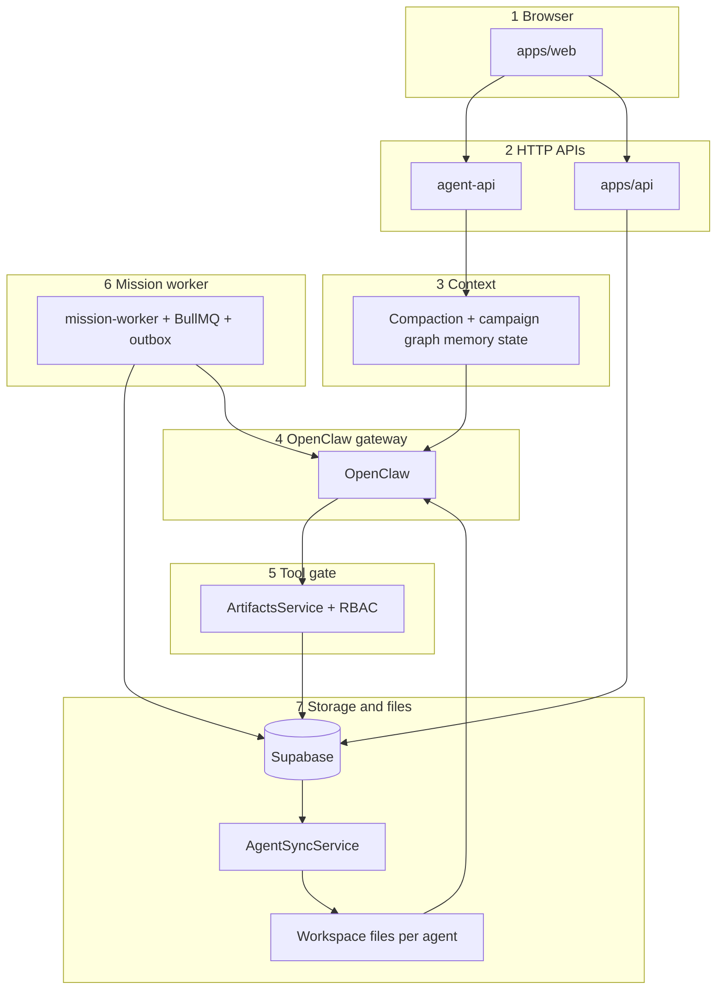

# Vibey Harness — end-to-end

This document explains **how the Vibey harness works**, from the moment a user acts in the product down to the database, background workers, and the OpenClaw gateway. It is written to stand alone: you do not need other docs to understand the architecture, though file paths point to code when you need to change behavior.

---

## Part 0 — What “harness” means

**The harness is not one deployable.** It is the **combined behavior** of:

- **`apps/web`** — the UI (Studio chat, tasks / Mission Control, campaigns).
- **`apps/agent-api`** — chat streaming, OpenClaw proxy, artifact tool execution (`vibey_backend`), agent definition sync, context compaction.
- **`apps/api`** — product REST APIs the dashboard uses for missions, tasks, campaigns, billing-adjacent flows, etc.
- **`apps/mission-worker`** — BullMQ workers + schedulers that advance **missions** (plan → execute → review) from **database state**.
- **OpenClaw** (in-repo under `apps/openclaw`, deployed with the agent stack) — the **gateway** that runs the embedded agent: sessions, tools, skills, workspace files.
- **Supabase (Postgres + RLS)** — source of truth for users, agents, missions, conversations, skills, definitions, integrations metadata, etc.

The **LLM** only reasons inside OpenClaw. The harness decides **which user and agent** that run belongs to, **what text and context** are passed in, **whether each tool call is legal**, and **how long-running missions move forward** when no one is typing in chat.

---

## Part 1 — Top of the stack: the browser

Users interact through **`apps/web`**. Two harness paths matter:

1. **Synchronous / conversational** — Studio (or similar) sends messages to **`agent-api`**. The user sees streaming tokens and tool progress. This path is **request-driven**: one HTTP request (often long-lived SSE) per turn.
2. **Structured / asynchronous** — Mission Control (Kanban tasks) mutates **`tasks`** and **`missions`** via **`apps/api`**. The browser does **not** call OpenClaw directly. Instead, **`mission-worker`** notices state in the database and enqueues work. This path is **event- and poll-driven**.

The same human may use both: chat with Vibey for strategy, and move a task card that triggers a multi-step mission handled by employees and a manager agent.

---

## Part 2 — `agent-api` versus `apps/api`

| Concern                                                            | Primary app     | Why                                                                                             |
| ------------------------------------------------------------------ | --------------- | ----------------------------------------------------------------------------------------------- |
| Chat turns, streaming UX, OpenClaw `/v1/responses` proxy           | **`agent-api`** | Needs service-role / VM identity, `x-session-key` semantics, and tight coupling to the gateway. |
| Listing and mutating missions, tasks, campaigns from the dashboard | **`apps/api`**  | Standard product API with user auth; writes rows the worker reads.                              |
| Executing `vibey_backend` tool actions                             | **`agent-api`** | **`ArtifactsService.executeAction`** runs here; every action is RBAC-checked.                   |

**Rule of thumb:** if OpenClaw or the artifact tool surface is involved, you are usually in **`agent-api`**. If the UI is doing CRUD on missions/tasks for the Kanban, you are usually in **`apps/api`**.

---

## Part 3 — Studio chat: one turn from HTTP to OpenClaw

### 3.1 Entry

Chat is handled in **`apps/agent-api`** (e.g. `ChatService` + **`OpenClawProxyService`** in `apps/agent-api/src/modules/chat/services/`). The proxy calls the gateway with **`POST /v1/responses`** and **`stream: true`** so the HTTP response is **SSE** (server-sent events), which the service maps into the Studio timeline events (status, tool\_\*, content_delta, done, error). Compaction summarization uses **`POST /v1/chat/completions`** on the same gateway (see `ContextWindowService`).

### 3.2 What gets sent

Roughly:

- **`input`** — an array of **messages** (and similar items) built from recent conversation + optional images. OpenClaw’s gateway merges **system/developer** items into extra system context; **user/assistant** items become the conversational thread the model sees.
- **`instructions`** — a **separate string** merged into OpenClaw’s **extra system prompt** (credentials, IDs, static guardrails). Vibey keeps volatile narrative in user-role content and stable identifiers in `instructions`.
- **`model`** — resolved to either `openclaw:<agentId>` or `openrouter/<model>` depending on overrides.
- **`sessionKey`** — passed through so tool calls from the gateway include the same key (tenant + agent + conversation scope).

### 3.3 Streaming back to the browser

**`OpenClawProxyService`** normalizes gateway SSE into a **small set of client events** (e.g. status, tool_start / tool_update / tool_end, content_delta, error, done). Tool names like **`vibey_backend`** get human-readable labels for the timeline.

### 3.4 Chat session keys (agent-api)

**`AgentRuntimeService`** in **`apps/agent-api/src/modules/shared/agent-runtime.service.ts`** builds the chat session key:

- Base: `agent:<agentKey>:<agentKey>-<userId>-<conversationId>`
- If the conversation is tied to a campaign: append `::campaign:<campaignId>`

**Gateway agent id for chat** is resolved as: `level === 'system'` → `'vibey'`; **otherwise the literal `agentKey`** (so `copywriter`, `hr`, etc. route to distinct OpenClaw agent ids when configured).

That differs from **mission-worker** routing (below): there, `c_level` and `manager` map to gateway id **`manager`**, and **`employee`** to **`employee`**.

---

## Part 4 — Context window and compaction (chat)

Long threads cannot be sent in full forever. **`ContextWindowService`** (`apps/agent-api/src/modules/chat/services/context-window.service.ts`):

1. Keeps the **last N messages** verbatim (configured `RECENT_COUNT`, e.g. 8).
2. Estimates **tokens** (tiktoken `cl100k_base`) and compares to a **fraction of the model context window** (e.g. 80%) plus hard caps on older message count.
3. When over budget, summarizes **older unsummarized messages** via **`POST /v1/chat/completions`** on the **same OpenClaw gateway** (cheap model), with a structured markdown summary prompt.
4. Persists each summary in **`conversation_compactions`** (from/to message ids, `summary_md`, token estimates, metadata).
5. Injects up to **`MAX_COMPACTIONS_IN_CONTEXT`** compaction blocks (capped by **`MAX_COMPACTION_TOKENS_IN_CONTEXT`**) into the **system-side story** of the next turn so the model “remembers” without replaying every token.

If summarization fails, a **fallback** truncates snippets of older turns so the pipeline still returns.

---

## Part 5 — Missions: data model and how the UI ties in

### 5.1 Tasks and missions

- **`tasks`** — Kanban cards (status, priority, `mission_id`, assignee display fields, etc.).
- **`missions`** — execution record: `status`, `assigned_agent_key`, `current_agent_key`, `campaign_id`, `plan_id`, `correlation_id`, retry/error fields, JSON `input`, etc.

For mapped statuses, a **database trigger** (`sync_task_to_mission` in migrations) keeps **`tasks.status`** and **`missions.status`** aligned so moving a card updates the mission the worker observes.

### 5.2 Plans and subtasks

- **`missions_plans`** — the manager-produced blueprint (title, summary, approach, JSON subtasks with ids, assignees, dependencies).
- **`mission_subtasks`** — one row per unit of work: `assigned_agent_key`, `depends_on` (UUID array), `status` (`pending` / `in_progress` / `done` / `revision` / `blocked`), `output`, `feedback`, link to deliverables, etc.
- **`mission_deliverables`** — artifacts produced (documents, images, etc.).
- **`missions_logs`** — timeline (`event_type`, agent, payload, status transitions). User comments land here (e.g. `user.comment`) and are **re-injected into mission prompts** so “please make this a PDF” on a card is seen on the next plan/execute/review call.

### 5.3 Mission statuses (high level)

Typical happy path:

`inbox` → `planning` → `todo` → `in_progress` → `review` → `done`

Rejections send subtasks back to `pending` / `revision` and the mission toward `todo` again. There are also **`blocked`**, **`error`**, **`failed`**, etc., with retry and watchdog behavior.

Subtask statuses include **`cancelled`** (set by manager-driven replan; excluded from scheduling, review, and "all done" checks).

### 5.4 Manager scope changes (incremental + replan)

During review, the manager can amend the mission beyond simple approve/reject:

- **`missionUpdates`** patches mission title/brief. Logged as `mission.scope.amend`.
- **`addSubtasks`** appends up to 5 new subtasks (with intent packets). Logged as `mission.scope.append_subtasks`. Root subtasks (no deps) are auto-enqueued for execution.
- **`fullReplan`** cancels all non-done subtasks (status → `cancelled`), sets mission to `planning`, and enqueues a new plan job. Logged as `mission.scope.replan`. The plan phase receives `[REPLAN CONTEXT]` with the reason, user comments, and completed subtask summaries.

Gated by env `MISSION_MANAGER_SCOPE_AMEND_ENABLED` (default `false`). Internal routes: `POST internal/missions/manager/mission-fields`, `POST internal/missions/manager/append-subtasks`, `POST internal/missions/manager/prepare-replan`.

---

## Part 6 — Mission-worker: outbox, BullMQ, scheduler

### 6.1 No “LLM scheduler intelligence”

**`MissionsService.processMission`** (`apps/mission-worker/src/modules/missions/services/missions.service.ts`) is a **switch** on `job.data.phase`: **`plan`**, **`execute`**, **`review`**. The worker does not plan work itself; it **calls OpenClaw** with prompts prepared for each phase.

### 6.2 Outbox pattern

Work is queued by inserting rows into **`mission_outbox`** with `event_type` such as:

- `mission.plan.requested`
- `mission.execute.requested`
- `mission.subtask.execute.requested` (payload includes `subtask_id`)
- `mission.review.requested`

**`MissionsOutboxDispatcherService`** maps each row to a **BullMQ job** (`missions.processor.ts` consumes jobs). Dedupe keys reduce double execution.

### 6.3 Scheduler loop

**`MissionsScheduler`** (`missions.scheduler.ts`) runs on an interval (default **`MISSIONS_WATCHDOG_MS`** = **900000** ms = **15 minutes** unless overridden). Each tick can:

- Run **stalled-work detection** for items stuck **`in_progress`** longer than **`missions.stalledMinutes`** (default **10** minutes): it reconstructs the **expected OpenClaw session key** and probes the gateway; if that session is not active, it resets work so BullMQ can retry.
- **Auto-retry** missions in **`failed` / `error`** after a cooldown, with a small cap on automatic retries stored in `missions.input._auto_retries`.
- Optionally run **CEO operational loop**, **signal intelligence** / awareness runners, and **daily digest** jobs (gated by env such as `AWARENESS_LOOP_ENABLED`).

Eligible **subtasks** (`pending` with all `depends_on` done) enqueue **`mission.subtask.execute.requested`** via **`MissionStateRepository.enqueueReadySubtaskEvents`**.

### 6.4 Mission session keys (mission-worker)

**`AgentRuntimeService`** in **`apps/mission-worker/src/modules/missions/services/agent-runtime.service.ts`**:

- **`resolveGatewayAgentId(level)`** — `system` → `vibey`; **`c_level` or `manager`** → **`manager`**; else **`employee`**.
- **Mission (plan/review):**  
  `agent:<gatewayAgentId>:mission:<agentKey>:<userId>:<missionId>`  
  optional `::campaign:<campaignId>`
- **Subtask (execute):**  
  `agent:<gatewayAgentId>:subtask:<agentKey>:<userId>:<subtaskId>`
- **State tools:**  
  `agent:<gatewayAgentId>:state:<agentKey>:<userId>`

These keys **isolate OpenClaw sessions** per mission/subtask so parallel missions do not corrupt each other’s tool context.

### 6.5 Calling OpenClaw from missions

**`MissionOpenclawGateway`** (`mission-openclaw.gateway.ts`):

- Builds **static `instructions`** lines: `AGENT_TOKEN`, `USER_ID`, `CAMPAIGN_ID`, `MISSION_ID` (service token + tenancy for tools).
- Builds **`input`** as a short scripted thread: optional `[CONTEXT]` user message + assistant ack, then the real task user message — so campaign text lands predictably in the prompt shape OpenClaw expects.
- Uses **non-streaming** Open Responses against **agent-api’s** proxied gateway path (same ecosystem as chat, different consumer).

**Plan phase** loads **campaign-assigned workers** (or org-wide if allowed), their **skills names**, mission brief, user comments, and **`MissionContextService.buildCampaignContext`** output so the manager proposes subtasks and assignments grounded in who exists.

**Execute phase** runs the **assigned employee** agent with subtask prompt + dependency outputs + campaign context (with **employee-reduced** offer/strategy detail — see `MissionContextService`: employees skip some offer/deliverable queries).

**Review phase** runs the **manager** with each subtask’s output, expects structured approval JSON; on approve it may update **`agents_registry.stats`** (rolling **quality** and related dimensions from `qualityScore` and revision counts).

---

## Part 7 — Campaign and graph context (missions)

**`MissionContextService.buildCampaignContext`** (`mission-context.service.ts`):

- Always tries **agent identity** (registry, DISC, role text).
- If `campaign_id` is set, loads **campaign** row (name, `context`, resources, priorities, config).
- **Managers** see richer **offers**, **recent deliverables**, strategy fields, **off-limits** lists.
- **Employees** get **avatars**, brand voice / theme flavor, **knowledge graph** snippets (embedding search with threshold ~**0.58**, domain filters per agent), and **per-campaign agent memory** (`campaign_agents.memory.learned` notes).
- Graph query text defaults from **mission brief/title** unless overridden.

This string is what becomes `[CONTEXT]` in mission OpenClaw calls.

---

## Part 8 — Tool execution and RBAC (the enforcement core)

### 8.1 `vibey_backend`

The OpenClaw tool plugin **`docker/tools/vibey-backend`** registers **`vibey_backend`** with a large **`SUPPORTED_ACTIONS`** list (campaign, ads, funnels, GitHub, missions, memory, integrations, etc.). Descriptions teach the model what exists; **they are not authorization**.

### 8.2 `ArtifactsService.executeAction`

Every tool invocation is **`executeAction(action, data, sessionKey)`** (`apps/agent-api/src/modules/artifacts/services/artifacts.service.ts`):

1. **`ArtifactAuthorizationService.authorizeAction`** → **`ArtifactLegacyRuntimeCoreService.authorizeAction`** (legacy core holds the real logic).
2. Parse **`sessionKey`** → **`userId`** and **caller `agent_key`** (must not be missing; `'default'` normalizes to **`vibey`**).
3. Load **`agents_registry`** row for that user + agent.
4. **`resolveCapabilityPolicy`** → `{ profile, level, domain }` (`artifact-capability.policy.ts`). Uses explicit `config.capability_profile` / `config.capability_domain` when set; otherwise infers from `agent_key` / `level` / legacy profiles (`managed_*` → `managed_domain` + domain mapping).
5. **`isArtifactActionAllowed`** — if the action is not in the resolved **allowlist**, return **`{ success: false, error: … }`** without running a handler.
6. If action is **`use_integration`**, **`authorizeIntegrationSubAction`** runs **`isIntegrationSubActionAllowed`**. Today: **`system_hr`** denied; **`vibey_*`** profiles allowed; **`managed_domain`** requires **non-empty** `service` and `integration_action` strings (tighter per-toolkit rules may exist in Composio execution paths — still assume **server** is authoritative).
7. **Skill write** actions (`create_agent_skill`, etc.) can target another `agent_key`; **employees** may only touch self; **managers** only **employee-level** targets; **`c_level`** broader.
8. **`CEO_ONLY_ACTIONS`** (e.g. `update_campaign_context`) require `config.archetype === 'ceo'`.
9. If allowed, dispatch from **`actionRegistry`** — a merge of many **`Artifact*Service.getHandlers`** modules (offers, funnels, missions, integrations, state, GitHub, brain scholar, etc.).

**Fail-closed:** unknown agent, invalid session key, or unresolved policy → **deny**.

### 8.3 Capability profiles (conceptual)

Implemented in **`artifact-capability.policy.ts`**:

- **`vibey_closed`** — main product Vibey: broad marketing/tooling surface but **explicitly blocked** from **`create_agent` / `list_team`** and from **skill mutation** actions; integrations allowed at top level subject to nested check.
- **`vibey_ceo` / `vibey_coo`** — promoted Vibey variants with expanded allowlists.
- **`system_hr`** — **only** org actions: `create_agent`, `list_team`, campaign assign/unassign, `list_agent_skills`; **no** campaign artifacts; **no** `use_integration`.
- **`system_brain`** — Brain Scholar (**Atlas**): brain ingest/search/crystallization-style actions + limited integration reads; not general marketing execution.
- **`managed_domain`** — all hired **team** agents: union of **baseline** actions (documents, state, memory, skills, custom objects, …) plus **domain packs**:
  - **`marketing`** — offers, ads, funnels, sequences, media, Meta reads, `get_capabilities` / `use_integration`, etc.; **`publish_ad_to_meta`** escalated to manager/c_level.
  - **`analyst`** — read-heavy campaign views, Meta reads, integrations.
  - **`developer`** — widgets/projects/GitHub read on employees; **writes** escalated to manager/c_level in domain.
- **Level** **`c_level` + domain `shared`** (CEO/COO) — **read-mostly** cross-domain + **mission management** + campaign staffing + integrations; **not** the main direct writer of marketing deliverables (delegation model).
- **Level `manager` + domain `shared`** (campaign PM) — **broad write** across domains **for execution**, mission management, manager escalations (Meta publish, GitHub writes).
- **Domain-scoped `c_level` / `manager`** — full power **inside** that domain only.

**Team actions** (`create_agent`, `list_team`) are **HR-only** at the policy layer for managed profiles.

---

## Part 9 — Agent identity on disk (AgentSync)

OpenClaw agents read **workspace files**: `AGENTS.md`, `ROLE.md`, `SOUL.md`, `TOOLS.md`, **`skills/<skill_key>/SKILL.md`**, workflows, etc.

**`AgentSyncService`** (`apps/agent-api/src/modules/agent-sync/services/agent-sync.service.ts`):

1. On startup (when `USER_ID` is a UUID), loads **`agent_definitions`**, **`agent_skills`**, **`agent_skill_resources`**, **`agent_workflows`**, **`agents_registry`** from Supabase (user rows + global templates as designed).
2. Writes definition files under **`AGENTS_BASE_DIR/<agent_key>/`** (Docker default `/app/agents`, local often `.local/agents`).
3. Writes each enabled skill to **`skills/<skill_key>/`** including **`SKILL.md`** and resource files.
4. For every agent, generates **`skills/vibey-api/`** from **`generateScopedVibeyApiSkill`**: embeds **`ALLOWED_ACTIONS.json`** derived from the **same** `resolveCapabilityPolicy` + `resolvePolicyActionAllowlist` as runtime RBAC — so the **text the model sees** matches what the **server will accept**.
5. Calls **`OpenClawGatewayService.ensureAgent`** so the gateway registers the workspace path and enabled skill ids for that **`agentKey`**.

**Archetype filters** on definitions/skills/workflows narrow what syncs for Vibey when `agents_registry.config.archetype` is set.

---

## Part 10 — Putting it together: two full journeys

### Journey A — User sends a chat message in Studio

1. Browser → **`agent-api`** chat endpoint with conversation id, campaign id (optional), agent key.
2. **`ContextWindowService.buildContext`** may compact old messages; recent messages stay raw.
3. **`AgentRuntimeService`** resolves level + **chat session key** + gateway **agent id** (`vibey` vs `agentKey`).
4. **`OpenClawProxyService`** streams **`/v1/responses`** to the gateway with `input`, `instructions`, `sessionKey`, model.
5. OpenClaw runs the agent; it may call **`vibey_backend`** with an **action** and payload.
6. Gateway forwards to **`agent-api` artifacts** with the same **session key**.
7. **`authorizeAction`** runs; on allow, handler executes against **user-scoped Supabase** (or calls other internal services).
8. Result returns through OpenClaw → SSE → browser.

### Journey B — User creates or moves a Mission Control task

1. Browser → **`apps/api`** creates/updates **`tasks`** / **`missions`** (and comments → **`missions_logs`**).
2. Trigger / service logic transitions **mission status** (e.g. into **`inbox`** or **`todo`**).
3. **`mission_outbox`** gains events; **dispatcher** enqueues **BullMQ** jobs.
4. **`MissionsService`** runs **plan** (manager OpenClaw call) → persists **plan + subtasks** → mission to **`todo`**.
5. Scheduler / outbox enqueue **execute** jobs per ready subtask; **execute** calls OpenClaw for the **employee** session key.
6. Subtasks → **`done`** drive mission to **`review`**; **review** calls OpenClaw for **manager**; approvals → **`done`** and optional **stats** update; rejections re-open execution.

Throughout, **tool calls** from those OpenClaw runs use **mission/subtask session keys**, so **`authorizeAction`** resolves the same **user** and **calling agent** and enforces the same **RBAC**.

---

## Part 11 — Operational and safety properties

- **Authorization is server-side** — the model cannot bypass RBAC by wording; denied actions return structured errors to the tool layer.
- **Session keys carry tenancy** — parsing extracts **user id** and **agent key**; mission keys also tie to **mission/subtask ids** for context resolution (`ArtifactLegacyRuntimeCoreService.resolveMissionIdForSession`).
- **Mission-worker chat parity** — **level → gateway id** mapping matches the **team** model (manager gateway for leadership runs, employee gateway for workers), while **Studio chat** uses **per-agent keys** for direct 1:1s with named agents.
- **Stall recovery** — watchdog + outbox stale job cleanup (see **`missions.stalledMinutes`**) prevents missions stuck forever after gateway crashes.
- **Awareness / CEO loops** (optional) — same scheduler can wake **c-level** agents for housekeeping; that is still **harness**: DB + worker + OpenClaw, not user HTTP.

---

## Part 12 — Diagram (same stack, visual)

---

_This file is the narrative source of truth for the harness. When code and this document disagree, treat **code** as authoritative and **update this document** in the same change._
