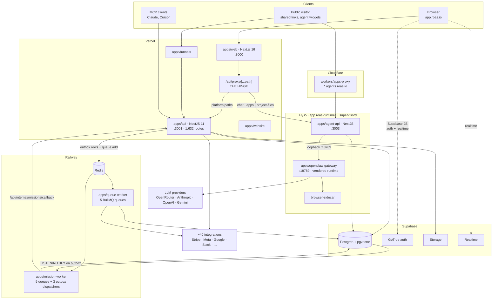
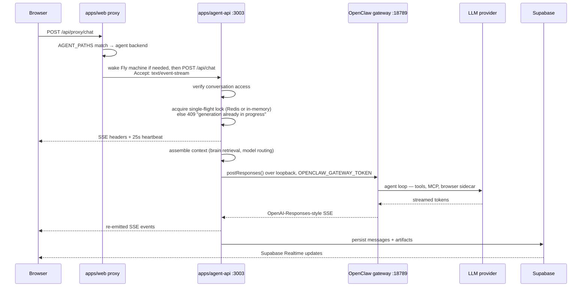
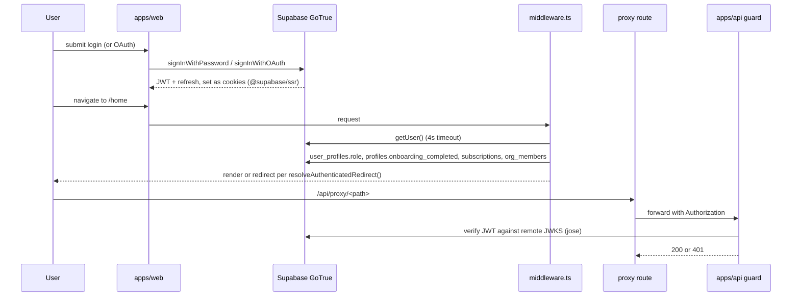

# System Architecture

> Reverse-engineered read-only on **2026-09-05**. Tags: **CONFIRMED** (read in code / observed at runtime), **LIKELY** (strong inference), **UNKNOWN**.
> Deeper detail lives in the sibling documents; this file is the map that ties them together.

---

## The One-Paragraph Version

ROAS is an **agent-driven marketing platform**. A Next.js app (`apps/web`) is the only thing users touch. It talks to almost nothing directly — instead, nearly every call funnels through a **single catch-all proxy route** in the Next app, which decides whether the request is _platform_ work (CRUD, billing, contacts, integrations → `apps/api`, a NestJS modular monolith with 1,632 routes on Vercel) or _agent_ work (chat, apps, project files → `apps/agent-api`, a second NestJS app on Fly.io that in turn drives a **vendored third-party agent runtime called OpenClaw** over loopback). Durable async work — "missions", email sending, social publishing — goes through Postgres outbox tables and BullMQ queues consumed by two Railway workers. Supabase is the database, the auth provider, the file store, and the realtime bus.

The architecture is genuinely multi-tier and mostly coherent. Its main structural problems are that **the security boundary is inconsistent** (see [`08-auth-security.md`](./08-auth-security.md)), **some queues have no live consumer**, and **the same domain concept is modelled two or three times** (see [`07-dependency-map.md`](./07-dependency-map.md)).

---

## High-Level Architecture



### The four tiers, in the order a request meets them

| Tier                   | What it is                                                     | Where it runs                |
| ---------------------- | -------------------------------------------------------------- | ---------------------------- |
| 1. **Presentation**    | `apps/web` — Next.js 16, React 19, Zustand                     | Vercel                       |
| 2. **Proxy / routing** | one catch-all Next.js route handler                            | Vercel (same app)            |
| 3. **Platform**        | `apps/api` — NestJS modular monolith, 59 modules, 1,632 routes | Vercel serverless            |
| 4. **Agent runtime**   | `apps/agent-api` → OpenClaw gateway → LLM                      | Fly.io, one box, supervisord |

Async work hangs off tier 3 via Postgres outbox + Redis/BullMQ into the two Railway workers.

---

## The Proxy Layer — the single most important routing fact

**CONFIRMED.** `apps/web/src/app/api/proxy/[...path]/route.ts` is a catch-all handler exporting all five HTTP verbs. Nearly all frontend data access goes through it.

```text
Frontend calls:   /api/proxy/billing/status
Proxy rewrites:   {BACKEND_URL}/api/billing/status     ← the literal "/api" is inserted by the proxy
```

The proxy decides the destination by inspecting the first path segment:

```ts
// apps/web/src/app/api/proxy/[...path]/route.ts:34
const AGENT_PATHS = ['chat', 'apps', 'project-files']
```

- **`chat` / `apps` / `project-files`** → the agent backend (`AGENT_BACKEND_URL`, default `http://localhost:3003`). For `POST /api/chat` it may first **wake the user's Fly machine** before forwarding, and sets `Accept: text/event-stream` to stream the response back.
- **everything else** → the platform API (`BACKEND_URL`).

Why this matters for a newcomer: NestJS controllers declare paths _without_ `/api`, but every route in [`05-api-map.md`](./05-api-map.md) is written _with_ it, because the proxy adds it. If you search the backend for the literal string a frontend calls, you will not find it.

**Nine other Next.js route handlers bypass the proxy** and do their own work (`/api/chat`, `/api/spaces/*`, `/api/tsx-repair`, `/api/preview-docx`, `/api/ig-thumbnail`, `/api/social-thumbnail`, `/api/feature-updates`, `/api/auth/*`, `/api/freeze-debug`). These are a real source of confusion — some duplicate backend capability.

---

## Frontend Architecture (`apps/web`)

| Concern        | Implementation                                                                  | Notes                                                            |
| -------------- | ------------------------------------------------------------------------------- | ---------------------------------------------------------------- |
| Framework      | Next.js 16 App Router, React 19                                                 | Turbopack in dev                                                 |
| Entry          | `apps/web/src/app/layout.tsx` + route groups `(auth)` / `(dashboard)`           |                                                                  |
| **Gatekeeper** | `apps/web/src/middleware.ts`                                                    | runs on nearly every request — see below                         |
| Routing        | file-system; 19 dashboard sections, 17 auth pages, 6 public pages               |                                                                  |
| State          | **Zustand — 25 stores**                                                         | **No react-query, no SWR**                                       |
| Server state   | hand-rolled `fetch` + `useEffect`                                               | the root cause of most perf complaints                           |
| Data access    | `/api/proxy/*`                                                                  | plus direct Supabase JS for auth & realtime (~43 realtime hooks) |
| Auth client    | `@supabase/ssr` — `apps/web/src/lib/supabase/{client,server}.ts`                |                                                                  |
| Styling        | Tailwind + a strict design-token system in `globals.css`                        | tokens enforced by convention, see `AGENTS.md` §5                |
| Feature layout | `src/features/<name>/{components,containers,hooks,services,store,types,config}` | 35 feature folders                                               |
| Rich content   | TipTap (docs), `@xyflow/react` (flow canvas), Framer Motion                     |                                                                  |

### The middleware is doing far too much

**CONFIRMED** — `apps/web/src/middleware.ts` runs on every non-static path and, for an authenticated user hitting any dashboard route, performs **up to four Supabase round-trips before the page renders**:

1. `supabase.auth.getUser()` (falls back to `getSession()`)
2. `user_profiles` → `role`
3. `profiles` → `onboarding_completed`, `account_mode`, machine columns
4. `user_subscriptions` + `org_members` in parallel

Each is wrapped in `withTimeout(..., 4000)`. Then `resolveAuthenticatedRedirect()` decides where you actually land.

Two things stand out:

- **`user_profiles` and `profiles` are two different tables**, both queried on the same request. Repo-wide there are 103 `from('profiles')` and 26 `from('user_profiles')` references. This is a confirmed domain-model duplication, not an alias.
- **Latency**: this is serialised auth + authorization + onboarding + billing state resolution on the edge, on every navigation. It is the most likely cause of the "app feels slow" class of complaints.

---

## Backend Architecture (`apps/api`)

**CONFIRMED at runtime** — booted successfully, `Found 0 errors` from tsc, **1,632 routes mapped**.

```text
Express server
  └─ enforceApiSurface middleware        ← runs BEFORE Nest; 404s anything outside /api + 4 allowed paths
      └─ NestFactory (ExpressAdapter)
          ├─ global prefix "api"          (2 exclusions for OAuth discovery)
          ├─ body parser 15 MB, rawBody
          ├─ request trace middleware     (surface: 'api', service: 'platform-api')
          ├─ CORS origin:true, credentials, 12 custom x-vibey-* headers
          └─ GlobalExceptionFilter        (DI-resolved, from @vibey/api-shared)
```

Entry: `apps/api/src/main.ts` — `bootstrap()` → `createNestApp()`. The same `createNestApp()` is reused by the Vercel serverless entry, which is why bootstrap is factored out of `listen()`.

| Layer        | Reality                                                                                                   |
| ------------ | --------------------------------------------------------------------------------------------------------- |
| Modules      | 59 under `apps/api/src/modules/`                                                                          |
| Controllers  | 339                                                                                                       |
| Guards       | **Per-controller `@UseGuards(...)`. There is NO global `APP_GUARD`.** 20 of 336 controllers declare none. |
| Repositories | 239, of which 75 use the service-role client (bypassing RLS)                                              |
| Validation   | per-controller; no global `ValidationPipe` in `apps/api` (unlike `agent-api`, which has one)              |
| Scheduling   | `@nestjs/schedule`, **enabled only when `VERCEL !== '1'`** — see below                                    |

### Route distribution — where the mass actually is

| Group          |  Routes |     | Group                                  |  Routes |
| -------------- | ------: | --- | -------------------------------------- | ------: |
| `integrations` | **546** |     | `org`                                  |      42 |
| `spaces`       |     151 |     | `email`                                |      28 |
| `brain`        |      82 |     | `funnels`                              |      27 |
| `internal`     |      77 |     | `billing`                              |      23 |
| `campaigns`    |      61 |     | `leads` / `conversations` / `channels` | 22 each |
| `agents`       |      55 |     | `media` / `agent-teams`                | 21 each |
| `admin`        |      54 |     | `canvas`                               |      18 |
| `missions`     |      52 |     | everything else                        |    < 17 |

**One third of the entire platform API is integration plumbing.** That is the clearest single signal of what this product actually is.

### The inverted cron switch

```ts
// apps/api/src/cron-runtime-policy.ts
export function shouldEnableInProcessScheduling(vercel = process.env.VERCEL): boolean {
  return vercel !== '1'
}
```

On Vercel, in-process timers are off and crons fire via `vercel.json`. **Everywhere else — including a developer laptop — they are on.** `cron.service.ts` registers 10 jobs, the most frequent every 30 seconds. Combined with a `.env` pointing at a live Supabase project, starting the API locally mutates real data. Documented as CRITICAL in [`02-how-to-run.md`](./02-how-to-run.md).

---

## Agent Runtime Architecture

This is the part that makes the product what it is, and it is the least conventional.



Key facts, all **CONFIRMED**:

- **It is SSE end to end over one held-open HTTP request.** Not websockets, not polling, and — by default — **not a queue**.
- `apps/agent-api` and the OpenClaw gateway run **on the same Fly machine**, talking over `127.0.0.1:18789`. They are two processes under supervisord, alongside a `browser-sidecar`.
- Fly app `roas-runtimes` runs in `AGENT_RUNTIME_MODE = "shared"` with `min_machines_running = 1` and `auto_stop_machines = "off"`. **In shared mode, users do not get their own machine** — agent identity is namespaced logically as `user-<uuid>-<key>` or `org-<orgId>-<key>`.
- Stall watchdog on the gateway stream: warn at 20 s, abort at 120 s, abort-if-empty at 300 s.
- **Redis is not required for chat.** If Redis is down the lock acquisition `.catch(() => true)` assumes success and falls back to an in-process registry. Chat keeps working; missions and email do not.
- There is an **in-progress migration** to queue-based execution: `enqueueChatShadowRun` / `enqueueChatRun` exist behind `AGENT_RUNTIME_QUEUE_SHADOW` / `AGENT_RUNTIME_QUEUE_EXECUTION` flags, both default off, and the mission-worker's shadow processor currently just measures claim latency and returns.

### OpenClaw is vendored third-party code

`apps/openclaw` is a large vendored agent runtime (it accounts for roughly 700k of the repo's ~2.1M lines). It is **not** a NestJS app — it is a `node:http` server with a chain-of-responsibility dispatcher. It has its own `package.json` with its own `pnpm.overrides`. Treat it as a dependency you happen to have the source of, not as first-party code.

---

## Queue & Worker Architecture

See [`10-background-processes.md`](./10-background-processes.md) for the full inventory. The shape:

```text
apps/api  ──writes──▶  Postgres outbox tables  ──pg_notify──▶  mission-worker dispatcher  ──▶  BullMQ
apps/api  ──queue.add──▶  Redis/BullMQ  ──▶  queue-worker
```

| Worker                | Queues                   | Owns                                                                  |
| --------------------- | ------------------------ | --------------------------------------------------------------------- |
| `apps/queue-worker`   | 5                        | email sending, social publishing, CRM sync, Drive sync, Slack→Brain   |
| `apps/mission-worker` | 5 + 3 outbox dispatchers | missions, Brain Ops, Dream Ops, chat-runtime shadow, provider billing |

**Structural problem (CONFIRMED):** several BullMQ `@Processor` classes are registered **inside `apps/api`**, which on Vercel is a serverless function. Workers need a live process; serverless functions freeze between invocations. `agent-runtime-queue-automation` has both its producer and its only consumer inside `apps/api` and is gated on `VERCEL !== '1'` — so **in production nothing produces it and nothing durably consumes it**. Two more queues (`agent-runtime-queue-artifact`, `agent-runtime-queue-subagent`) are declared and never used at all.

---

## Database Architecture

Supabase Postgres with pgvector. ~937 migration files, no migration runner in the repo, no `supabase/config.toml`. Full detail in [`06-database-map.md`](./06-database-map.md).

The important architectural point: **RLS is not the primary security boundary.** 75 of 239 repositories in `apps/api` use the service-role client, which bypasses RLS entirely, while 223 files use the user-scoped client. The boundary is therefore _split and inconsistent per endpoint_ — application-layer guards are what actually protect most data.

---

## File / Object Storage

Supabase Storage, accessed from `apps/api` and `apps/agent-api`. Media handling lives in the `media` module (21 routes). Generated artifacts (docs, funnels, presentations, images) are persisted as rows plus storage objects and surfaced through the artifacts feature.

---

## Authentication Flow

Summary here; full treatment in [`08-auth-security.md`](./08-auth-security.md).



**Identity is Supabase GoTrue.** Tokens are asymmetric JWTs verified against the project's JWKS endpoint using `jose` + `createRemoteJWKSet` — **not** a shared `SUPABASE_JWT_SECRET` (that variable appears only in docs, templates, and one stale compiled `.js` artifact). This is the strongest part of the auth stack.

---

## Authorization / Permission Flow

| Level          | Mechanism                                        | Enforced where                                                                         |
| -------------- | ------------------------------------------------ | -------------------------------------------------------------------------------------- |
| Platform admin | `user_profiles.role ∈ {admin, superadmin}`       | `middleware.ts` for `/admin` routes; guards in `apps/api`                              |
| Org membership | `org_members.status = 'active'`                  | middleware access gate + `OrgRoleGuard`                                                |
| Org role       | `org_members.role`                               | `OrgRoleGuard` (**note: passes through when `x-org-id` is absent** — see security doc) |
| Subscription   | `user_subscriptions.status ∈ {active, trialing}` | middleware access gate                                                                 |
| Row level      | Postgres RLS                                     | only on the 223 user-scoped-client paths; bypassed by service-role paths               |
| Agent scopes   | MCP OAuth scopes (20 advertised)                 | `VibeyMcpOAuthGuard`                                                                   |

---

## Request Lifecycle — a concrete trace

Loading the billing status panel:

```text
apps/web/src/features/billing/…/<component>.tsx        user opens Settings → Billing
  → feature hook/service issues fetch('/api/proxy/billing/status')
    → apps/web/src/middleware.ts                        session + access gate (up to 4 Supabase queries)
      → apps/web/src/app/api/proxy/[...path]/route.ts   'billing' ∉ AGENT_PATHS → platform tier
        → GET {BACKEND_URL}/api/billing/status          Authorization forwarded
          → apps/api/src/main.ts  enforceApiSurface     path starts with /api → pass
            → NestJS router → BillingController
              → @UseGuards(AuthGuard)                   jose verifies JWT against Supabase JWKS
                → BillingService
                  → billing repository → Supabase Postgres
                ← rows
              ← DTO
            ← 200 JSON
          ← proxy re-streams response
        ← component sets Zustand state → UI renders
```

And the agent path, which is the one that behaves differently:

```text
Chat input component
  → POST /api/proxy/chat
    → proxy: 'chat' ∈ AGENT_PATHS → wake Fly machine → POST {AGENT_BACKEND_URL}/api/chat
      → apps/agent-api ChatStreamHttpService.sendMessage
        → single-flight lock → SSE headers → 25s heartbeat
          → OpenClawGatewayRequestService → http://127.0.0.1:18789
            → OpenClaw agent loop → LLM provider
          ← SSE tokens ← re-emitted to browser
        → messages/artifacts persisted to Supabase
      ← Supabase Realtime pushes the persisted rows to other open tabs
```

---

## Architecture That Exists Only In Name

Honest assessment of where the folder names promise more than the code delivers. Detail and counts in [`07-dependency-map.md`](./07-dependency-map.md).

| Named abstraction               | Reality                                                                                                                                 |
| ------------------------------- | --------------------------------------------------------------------------------------------------------------------------------------- |
| `repositories/` in `apps/api`   | Real and widely used (239 of them) — but a third bypass RLS via service-role, so they are not a uniform data-access boundary.           |
| Global auth guard               | **Does not exist.** Security is per-controller opt-in; forgetting a decorator ships a public endpoint.                                  |
| `packages/db`                   | Not an ORM and not a data layer. Do not expect Prisma-style models.                                                                     |
| Feature isolation in `apps/web` | Undermined by cross-feature imports; the LOC/architecture gate currently fails with 25 violations including a new cross-feature import. |
| Queue-based agent execution     | Scaffolding exists, flags default off, one consumer is a latency harness. It is a migration in progress, not a working path.            |
| Domain modelling                | Duplicated: `profiles`/`user_profiles`, `team`/`team-2`, and overlapping `projects`/`spaces`/`campaigns`.                               |

---

## Deployment Topology

| Surface                                       | Provider                                   | Trigger                                            |
| --------------------------------------------- | ------------------------------------------ | -------------------------------------------------- |
| `apps/web`                                    | Vercel                                     | push → preview; merge to `main` → production       |
| `apps/api`                                    | Vercel (project `roas-api`, `api.roas.io`) | same                                               |
| `apps/agent-api` + OpenClaw + browser sidecar | Fly.io app `roas-runtimes` (supervisord)   | manual: `bash scripts/roas/deploy-fly-runtimes.sh` |
| `apps/queue-worker`, `apps/mission-worker`    | Railway project `roas-workers`             | auto-deploy on merge to `main`                     |
| `workers/apps-proxy`                          | Cloudflare Workers                         | manual script                                      |

**There are no CI workflow files in this repository.** Nothing automated verifies a build, a test, or the architecture gate before code reaches production. Given that the entire `apps/web` test suite cannot currently execute, this is the highest-leverage gap in the whole system.
