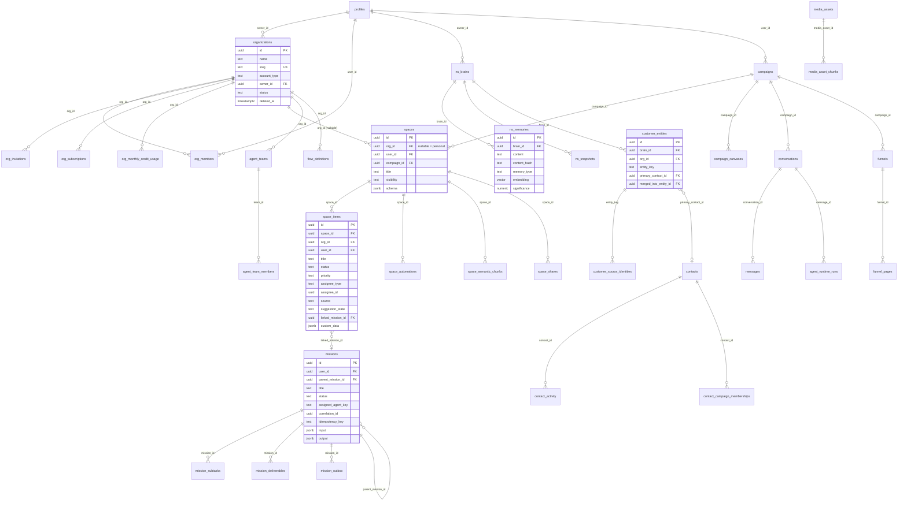

# Database Map

> Reverse-engineered read-only from files on disk. No Supabase MCP was available in this session, so
> every claim below is sourced from repo artifacts (migrations, SQL scripts, application code).
> Evidence markers: **CONFIRMED** (multiple on-disk sources agree), **LIKELY** (single/indirect source),
> **UNKNOWN** (cannot be determined without querying the live DB).

## Summary

| Fact                         | Value                                                     | Evidence                                                                                                                                |
| ---------------------------- | --------------------------------------------------------- | --------------------------------------------------------------------------------------------------------------------------------------- |
| Engine                       | Supabase Postgres, single `public` schema                 | `supabase/schema.sql` header: "Single Supabase project, all tables in `public` schema"                                                  |
| Production project           | `lhfgtsjetcardinpgouq` only                               | `CLAUDE.md`, `AGENTS.md` §8                                                                                                             |
| Migration files              | **937**                                                   | `ls supabase/migrations \| wc -l`                                                                                                       |
| Live tables (best estimate)  | **~328**                                                  | 355 distinct `CREATE TABLE` all-time, minus 30 drops, minus 6 renames — computed across `supabase/migrations/*` + `supabase/schema.sql` |
| Tables created all-time      | 355                                                       | same scan                                                                                                                               |
| Tables explicitly dropped    | 30                                                        | `DROP TABLE` scan                                                                                                                       |
| Tables renamed               | 6                                                         | `ALTER TABLE … RENAME TO` scan                                                                                                          |
| RLS policies                 | **1684** `CREATE POLICY` statements                       | regex scan of all migrations + schema.sql                                                                                               |
| Indexes                      | 1526 `CREATE INDEX` statements                            | regex scan                                                                                                                              |
| Triggers                     | 176 `CREATE TRIGGER` statements                           | regex scan                                                                                                                              |
| Functions                    | 334 `CREATE FUNCTION` statements / **213 distinct names** | regex scan                                                                                                                              |
| `SECURITY DEFINER` functions | 187 occurrences                                           | regex scan                                                                                                                              |
| Views                        | 5                                                         | see [Views](#views-and-materialized-views)                                                                                              |
| Materialized views           | **0**                                                     | no `CREATE MATERIALIZED VIEW` anywhere                                                                                                  |
| Native enum types            | **0**                                                     | no `CREATE TYPE` / `AS ENUM` anywhere — all enums are `CHECK` constraints                                                               |

**Extensions** (CONFIRMED, `supabase/migrations/000_enable_extensions.sql` + later):

- `uuid-ossp` — UUID generation (though most tables use built-in `gen_random_uuid()`)
- `vector` (pgvector) — embeddings, 768 dimensions throughout
- `pg_trgm` — trigram/lexical search, paired with the `*_lexical` search functions
- `pg_cron` — 3 scheduled jobs (see [Scheduled SQL](#functions-triggers-and-scheduled-sql))

No `pgmq` and no `pg_net` usage found. Queueing is done in application-level BullMQ/Redis plus
Postgres **outbox tables** with `pg_notify` (see below).

---

## Where the Schema Lives

There are four candidate sources. They disagree, and **none of them is complete**.

| Source                                             | What it is                                                        | Trust                                         |
| -------------------------------------------------- | ----------------------------------------------------------------- | --------------------------------------------- |
| `supabase/migrations/*.sql` (937 files)            | The real, incrementally-applied history                           | **Highest available, but incomplete**         |
| `supabase/schema.sql` (773 lines, 26 tables)       | A V1 "unified schema" baseline that predates the migration series | **Historical only** — do not treat as current |
| `packages/db/src/types.ts` (1291 lines)            | Hand-written `Database` TS interface                              | **Stale — do not trust**                      |
| `scripts/roas/roas-drift-recovery.sql` (308 lines) | Reconstruction of tables that only ever existed in prod           | **Evidence of drift**                         |

**Verdict: trust the migrations, but know they are missing tables.** Evidence:

1. **No generated types exist.** A full-tree search for `database.types.ts` / `supabase.types.ts` /
   `db.types.ts` returns exactly one 95-line file
   (`apps/api/src/modules/integrations/supabase/types/supabase.types.ts`), a hand-written module
   type, not a generated schema. The highest-signal source normally available is absent. CONFIRMED.

2. **`packages/db` is abandoned.** Three source files; `client.ts` is a 6-line `createClient`
   wrapper. `types.ts` opens with _"Manually authored to match supabase/schema.sql. Replace with
   `supabase gen types` output once project is live."_ It covers 26 tables (~8% of the schema),
   still names `lists`/`list_items` (renamed to `spaces`/`space_items` in April 2026), and its
   `Views`, `Functions`, `Enums` are all `Record<string, never>`. CONFIRMED.

3. **`supabase/schema.sql` is the V1 baseline, yet still load-bearing.** Some of its 26 tables were
   dropped (`agent_configs`) or superseded (`brains`/`snapshots` → `ns_brains`/`ns_snapshots` in
   `047_brain_consolidation.sql`). But `campaigns`, `contacts`, `funnels`, `funnel_pages`,
   `conversations`, `messages` and `profiles` are created **only** here and nowhere in the 937
   migrations, while receiving 55, 13, 18, 10, 15, 8 and 49 inbound FK references from them. A
   clean `supabase db reset` over `migrations/` alone would fail. CONFIRMED.

4. **Some production tables were never checked in at all.** `scripts/roas/roas-drift-recovery.sql`
   line 1: _"ROAS drift recovery: tables created directly on Vibey live, never checked into
   migrations. Reconstructed from app contracts, seed migrations, and dependent ALTER migrations."_
   It reconstructs 10 actively-used tables (`user_notifications` in 18 files, `social_posts` in 7,
   `skill_library` in 6, plus `skill_library_resources`, `template_skill_assignments`,
   `social_post_schedules`, `agent_channels`, `app_errors`, `billing_health_checks`,
   `billing_health_log`). CONFIRMED.

**Practical rule:** the live database is the only true schema of record. Answer schema questions
that matter by querying `lhfgtsjetcardinpgouq`, not by reading this repo.

---

## Multi-Tenancy Model

**The tenant key is `org_id UUID REFERENCES public.organizations(id)`.** CONFIRMED.

`organizations` is the tenant root (`20260327100000_create_organizations_foundation.sql`), with
`org_members(org_id, user_id, role, status)` as the membership join (roles
`owner | admin | creator | editor | viewer`, status `active | suspended | pending`). It is the
**most referenced table in the schema** — 164 inbound `REFERENCES organizations`, ahead of `spaces`
(55), `campaigns` (55), `ns_brains` (50), `profiles` (49). The canonical RLS predicate is the
`is_org_member(org_id)` helper plus an `auth.role() = 'service_role'` bypass policy.

**Naming is consistent; application is not.** Of 355 parsed table bodies:

| Pattern                                            | Count   |
| -------------------------------------------------- | ------- |
| Has `org_id` (at create time)                      | 125     |
| Gained `org_id` via later `ADD COLUMN`             | 65      |
| **Has `org_id` at all**                            | **190** |
| Has `user_id`                                      | 179     |
| Has **both** `org_id` and `user_id`                | 129     |
| Has `user_id` but **no** `org_id`                  | **50**  |
| Has neither (join tables, config, global catalogs) | 119     |

`organization_id` and `workspace_id` have **0 occurrences** as column definitions — the name is
always `org_id`. CONFIRMED.

The 65 tables that gained `org_id` via a later `ADD COLUMN` are the retrofit tail: the product
started user-scoped (every V1 `schema.sql` table is `user_id`) and orgs were bolted on in March 2026. The 50 `user_id`-only tables are the part of that retrofit that never finished, including V1
survivors `contacts`, `funnels`, `conversations`, `media_assets`, `email_sends`,
`user_integrations`. LIKELY these resolve `user_id → org` in application code instead.

**`org_id` was overloaded as a "personal org" sentinel.**
`20260508123331_normalize_personal_org_scope.sql` runs
`update public.spaces set org_id = null where org_id = user_id` — previously a user's own UUID was
written into `org_id` to mean personal (non-team) scope, with no FK integrity to `organizations`.
That migration makes `org_id` nullable on `spaces`, `space_items`, `space_drive_folder_mappings`
and `space_drive_push_channels`, and nulls the sentinel rows. **`org_id IS NULL` now means
"personal scope"** — every tenant-scoped query must handle the null branch, and `org_id` is not a
blanket `NOT NULL` isolation guarantee. CONFIRMED.

---

## Core Domain Tables

`org_id` is the tenant key. `space_id`, `campaign_id`, `brain_id` are secondary scoping keys.
`campaigns` and `spaces` coexist: `spaces` carries a nullable `campaign_id`, so a Space may or may
not belong to a Campaign.

### Identity, orgs & access

| Table             | Purpose                            | Key columns                                                                             | Key relationships                                                      |
| ----------------- | ---------------------------------- | --------------------------------------------------------------------------------------- | ---------------------------------------------------------------------- |
| `profiles`        | User profile, mirrors `auth.users` | `id` (=`auth.users.id`), `email`, `plan`, `stripe_customer_id`, `onboarding_completed`  | parent of nearly everything; 49 inbound FKs                            |
| `organizations`   | Tenant root                        | `id`, `name`, `slug`, `account_type` (team\|agency), `owner_id`, `status`, `deleted_at` | → `profiles`; **164 inbound FKs, most-referenced table in the schema** |
| `org_members`     | Membership + role                  | `org_id`, `user_id`, `role`, `status`, `invited_by`; `UNIQUE(org_id,user_id)`           | → `organizations`, `auth.users`                                        |
| `org_invitations` | Email invites                      | `org_id`, `email`, `role`, `token` (unique), `status`, `expires_at`                     | → `organizations`                                                      |

### Agents & runtime

| Table                | Purpose                         | Key columns                                                           | Key relationships                          |
| -------------------- | ------------------------------- | --------------------------------------------------------------------- | ------------------------------------------ |
| `agent_definitions`  | Agent markdown definition files | `user_id`, `agent_key`, `file_name`, `content`                        | keyed by `agent_key` (text, **not** an FK) |
| `agent_skills`       | Per-agent skill markdown        | `user_id`, `agent_key`, `skill_key`, `markdown_content`, `is_enabled` | text-keyed                                 |
| `agent_teams`        | Team hierarchy root             | `org_id`, `user_id`, `parent_team_id`, `is_system`                    | self-referencing tree                      |
| `agent_runtime_runs` | Run state & resume              | `message_id`, `status`                                                | → `messages`                               |

### Spaces & campaigns

| Table                   | Purpose                                             | Key columns                                                                                                                                                            | Key relationships                                |
| ----------------------- | --------------------------------------------------- | ---------------------------------------------------------------------------------------------------------------------------------------------------------------------- | ------------------------------------------------ |
| `spaces`                | Workspace container (**renamed from `lists`**)      | `org_id` (nullable = personal), `user_id`, `title`, `campaign_id`, `is_template`, `visibility`, `schema` JSONB                                                         | → `organizations`, `campaigns`; 55 inbound FKs   |
| `space_items`           | Rows inside a Space (**renamed from `list_items`**) | `space_id`, `org_id`, `user_id`, `title`, `status`, `priority`, `assignee_type`, `assignee_id`, `source`, `suggestion_state`, `linked_mission_id`, `custom_data` JSONB | → `spaces`, `missions`; 24 inbound FKs           |
| `campaigns`             | Campaign root (V1 baseline)                         | `user_id`, `name`, `campaign_type`, `status`, `goal`, `config`, `metrics`                                                                                              | 55 inbound FKs; **defined only in `schema.sql`** |
| `space_automations`     | Automation rules                                    | `space_id`, `org_id`, `trigger` JSONB, `actions` JSONB, `enabled`, `is_draft`                                                                                          | → `spaces`                                       |
| `space_semantic_chunks` | Space RAG index                                     | `embedding vector(768)`, `scope_type`, `space_id`, `campaign_id`, `org_id`                                                                                             | → `spaces`                                       |

### Contacts & CRM

| Table               | Purpose                            | Key columns                                                                                                 | Key relationships                                         |
| ------------------- | ---------------------------------- | ----------------------------------------------------------------------------------------------------------- | --------------------------------------------------------- |
| `contacts`          | Contact record (V1 baseline)       | `user_id`, `email`, `first_name`, `last_name`, `phone`, `tags[]`, `source`, `custom_fields`                 | 13 inbound FKs; **only in `schema.sql`**; **no `org_id`** |
| `customer_entities` | Customer Brain identity graph node | `brain_id`, `owner_id`, `org_id`, `entity_key`, `primary_contact_id`, `merged_into_entity_id`, `confidence` | → `ns_brains`, `contacts`                                 |
| `leads`             | Inbound leads (pre-contact)        | —                                                                                                           | 8 inbound FKs                                             |

### Content, artifacts & funnels

| Table           | Purpose                                       | Key columns                                                                     | Key relationships                    |
| --------------- | --------------------------------------------- | ------------------------------------------------------------------------------- | ------------------------------------ |
| `media_assets`  | Uploaded/generated media                      | `user_id`, `file_path`, `bucket_name`, `mime_type`, `asset_type`, `campaign_id` | 11 inbound FKs                       |
| `funnels`       | Funnel root (V1 baseline)                     | `user_id`, `campaign_id`, `offer_id`, `domain_id`, `slug`, `published_url`      | 18 inbound FKs; only in `schema.sql` |
| `funnel_pages`  | Page within a funnel                          | `funnel_id`, `org_id`, `sections` JSONB, `theme_config`, `generated_html`       | 10 inbound FKs                       |
| `presentations` | Slide decks (**renamed from `lead_magnets`**) | `user_id`, `org_id`, `space_id`, `slides`, `slug`, `published_url`              | → `media_assets`                     |

### Email

| Table                          | Purpose                               | Key columns                                                                                    | Key relationships |
| ------------------------------ | ------------------------------------- | ---------------------------------------------------------------------------------------------- | ----------------- |
| `email_sends`                  | Per-message send log                  | `user_id`, `domain_id`, `lead_id`, `sequence_id`, `status`, `sendgrid_message_id`, `opened_at` | 6 inbound FKs     |
| `email_events`                 | Provider webhooks (open/click/bounce) | —                                                                                              | → `email_sends`   |
| `sequences`, `sequence_emails` | Drip sequences (V1 baseline)          | —                                                                                              | 5 / 4 inbound FKs |
| `email_domains`                | Domain auth/DNS                       | —                                                                                              | 8 inbound FKs     |

### Integrations

Core (12): `integrations_available` (catalog, text `id`), `user_integrations` (**OAuth token
store**: `access_token`, `refresh_token`, `token_expires_at` — see risks),
`integration_capabilities`, `campaign_integration_connections`, `composio_toolkits`,
`project_composio_toolkit_config`, `project_mcp_servers`, `github_repos`, `project_repos`,
`cursor_webhook_events`, `vault_secrets`, `conversation_connections`.

**Slack (10):** `slack_brain_mappings`, `slack_pixel_turns`, `slack_shadow_actions`,
`slack_open_items`, `slack_pending_offers`, `slack_signal_playbook_rules`, plus four
`slack_observation_*` tables.

**Meetings (6):** `meeting_recordings`, `meeting_snippets`, `meeting_actions`,
`meeting_context_links`, `meeting_workspaces`, `org_person_calendar_identities`.

### Billing & credits

| Table                                                    | Purpose                                                    | Key columns                                                                                                                   |
| -------------------------------------------------------- | ---------------------------------------------------------- | ----------------------------------------------------------------------------------------------------------------------------- |
| `user_subscriptions` / `org_subscriptions`               | Stripe subscription state (**parallel user + org tracks**) | `stripe_customer_id`, `stripe_subscription_id`, `status`, `current_period_end`, `discount_percent`                            |
| `monthly_credit_usage` / `org_monthly_credit_usage`      | Credit ledger rollup (parallel pair)                       | `month`, `base_allowance`, `total_credits_used`, `rollover_credits`; `UNIQUE(org_id, month)`                                  |
| `user_credit_auto_recharge` / `org_credit_auto_recharge` | Auto-recharge config (parallel pair)                       | `threshold_credits`, `recharge_amount`, `max_monthly_recharges`                                                               |
| `ai_usage_events`                                        | Per-call token/cost audit                                  | `feature`, `provider`, `model_name`, `input_tokens`, `output_tokens`, `cache_read_tokens`, `computed_cost`, `credits_charged` |

### Missions & tasks

| Table              | Purpose                                   | Key columns                                                                                                                                                  | Key relationships                |
| ------------------ | ----------------------------------------- | ------------------------------------------------------------------------------------------------------------------------------------------------------------ | -------------------------------- |
| `missions`         | Long-running agent job                    | `user_id`, `parent_mission_id`, `title`, `brief`, `status`, `assigned_agent_key`, `correlation_id`, `idempotency_key`, `retry_count`, `input`/`output` JSONB | self-referencing; 18 inbound FKs |
| `mission_subtasks` | Subtask / DAG node                        | `mission_id`, `status`, `assigned_agent_key`, `depends_on`, `assignee_type`, `assigned_user_id`, `deliverable_id`                                            | → `missions`                     |
| `mission_outbox`   | Transactional outbox + `pg_notify` wakeup | `mission_id`, `status`                                                                                                                                       | → `missions`                     |

### Brain, memory & vectors

The `ns_*` prefix is the **NeuralSnap** lineage, consolidated in `047_brain_consolidation.sql`.

| Table                                                                              | Purpose                            | Key columns                                                                                                 |
| ---------------------------------------------------------------------------------- | ---------------------------------- | ----------------------------------------------------------------------------------------------------------- |
| `ns_brains`                                                                        | Brain container                    | `owner_id`, `name`, `is_default`, `agent_id`, `snapshot_count`; **50 inbound FKs**                          |
| `ns_memories`                                                                      | Atomic memory                      | `brain_id`, `content`, `content_hash`, `memory_type`, `embedding vector(768)`, `confidence`, `significance` |
| `ns_snapshots` + `ns_snapshot_edges`                                               | Structured knowledge nodes + graph | `embedding`                                                                                                 |
| `brain_episodes`                                                                   | Episodic memory                    | 10 inbound FKs                                                                                              |
| `company_cortex_objects` + `_object_edges`, `_signals`, `_settings`, `_dream_runs` | Company Brain graph                | `embedding`                                                                                                 |

**Legacy, dropped** by `015_remove_legacy_brain_tables.sql` and `047_brain_consolidation.sql`:
`memories`, `memory_connections`, `memory_sessions`, `memory_versions`, `neural_snapshots`,
`brain_belief_patterns`, `brain_emotional_responses`, `brain_perspectives`.

### Long tail by domain (counts)

The tables above are the significant ones. The remainder, by domain:

| Domain                       | Long-tail tables | Notable members                                                                                                                                                                     |
| ---------------------------- | ---------------- | ----------------------------------------------------------------------------------------------------------------------------------------------------------------------------------- |
| Identity & orgs              | 10               | `user_profiles` (overlaps `profiles`), `user_roles`, `org_campaign_permissions`, `superadmin_audit_log`                                                                             |
| Agents & runtime             | ~30              | `agents_registry`, `vb_agent_traces`, `agent_improvement_candidates`/`_jobs`/`_proposals` (**renamed** from `skill_recommendation_*`), 5 machine/browser infra, 5 `mcp_oauth_*`     |
| Spaces & campaigns           | ~38              | `campaign_canvases`, `campaign_nodes`, `campaign_edges`, 7 automation-runtime/webhook, 4 sharing, 3 templates, 2 Drive sync, 3 canvas, 4 programs/projects                          |
| Contacts & CRM               | 15               | `contact_identifiers`, `contact_activity`, `customer_avatars`, `segments`, `audiences`, `crm_sync_jobs`                                                                             |
| Content, artifacts & funnels | ~25              | `media_asset_chunks` (embedding), 9 funnel internals incl. `funnel_blocks`/`funnel_block_assets` (**dropped and recreated**), `posts`, `blog_posts`, `forms`, `themes`, `templates` |
| Email                        | 13               | 4 queue/batch, 3 sender config, `email_provider_capabilities`, `email_provider_recipes`, 2 scheduling, `email_suppressions`                                                         |
| Billing & credits            | 19               | `subscription_plans`, 3 top-up, 3 seat-cap, 3 price-book, 6 commerce (`products`, `orders`, `order_items`, …), 6 promo/trial                                                        |
| Missions & tasks             | 8                | `mission_deliverables`, `missions_plans`, `missions_logs`, `mission_shares`                                                                                                         |
| Brain & memory               | ~31              | 6 embedding-bearing reasoning layers, 5 `ns_sk_*`, 6 ingest/dedup, 7 NeuralSnap ops, 5 sharing/import, 4 "dream ops" outbox                                                         |

### Ads, flows, chat & remaining groups

- **Ads (7):** `ad_campaigns`, `ad_sets`, `ads`, `ad_creative_canvases`, `ad_creative_nodes`,
  `space_ad_searches`, `space_topic_searches`.
- **Flows (9):** `flow_definitions`, `flow_definition_versions`, `flow_installations`, plus six
  `project_flow_*` blueprint/build tables.
- **Chat/messaging (15):** `conversations`, `messages`, five `conversation_*` tables
  (`_documents`, `_shares`, `_reads`, `_compactions`, `_response_chain`), five `channel*` tables,
  and three `human_dm_*` tables.
- **Skills organisation (6):** `skill_folders`, `skill_folder_memberships`, `skill_tags`,
  `skill_tag_memberships`, `agent_skill_resources`, `org_shared_skills`.
- **Widgets/objects (5):** `user_widgets`, `user_widget_folders`, `user_object_types`,
  `user_object_records`, `feature_updates`.
- **Backup/debris (5):** `agent_skills_ad_backup_`, `agent_skill_resources_ad_backup_`,
  `system_agent_cleanup_backup_definitions`/`_resources`/`_skills` — see risks.

---

## Entity Relationship Diagram

The ~25 highest-connectivity entities, using real column names.

Columns are shown for the six hub entities only; the rest appear as relationships, with their
columns listed in the domain tables above.

---

## Enums / Custom Types

**There are zero native Postgres enum types.** CONFIRMED — a scan for `CREATE TYPE` and `AS ENUM`
across all 937 migrations and `schema.sql` returns nothing.

Every enumerated value is a `TEXT` column with an inline `CHECK (col IN (...))` constraint.
Representative sets:

| Column                            | Allowed values                                                 | Source                                               |
| --------------------------------- | -------------------------------------------------------------- | ---------------------------------------------------- |
| `organizations.account_type`      | `team`, `agency`                                               | `20260327100000_create_organizations_foundation.sql` |
| `organizations.status`            | `active`, `suspended`                                          | same                                                 |
| `org_members.role`                | `owner`, `admin`, `creator`, `editor`, `viewer`                | same                                                 |
| `org_members.status`              | `active`, `suspended`, `pending`                               | same                                                 |
| `org_invitations.status`          | `pending`, `accepted`, `expired`, `revoked`                    | same                                                 |
| `org_member_credit_limits.period` | `daily`, `weekly`, `monthly`, `uncapped`                       | same                                                 |
| `spaces.visibility`               | `private`, `team`                                              | `20260413100000_lists_mvp.sql`                       |
| `space_items.status`              | `todo`, `in_progress`, `in_review`, `done`                     | same                                                 |
| `space_items.priority`            | `low`, `medium`, `high`, `urgent`                              | same                                                 |
| `space_items.assignee_type`       | `human`, `agent`, `unassigned`                                 | same                                                 |
| `space_items.source`              | `manual`, `agent_suggested`, `template`, `fathom`              | same                                                 |
| `space_items.suggestion_state`    | `pending`, (accepted), `dismissed`                             | `20260422120000_spaces_rename_and_schema.sql`        |
| `missions.status`                 | incl. `pending_approval`, `blocked`, `done`, `failed`, `error` | `030`/`032`/`038`                                    |
| `profiles.plan`                   | `free`, `pro`, `business`, `enterprise`                        | `schema.sql`                                         |

**Consequence:** allowed values can drift per table because the same conceptual enum is re-declared
in many `CHECK` constraints, and widening one requires a `DROP CONSTRAINT` / `ADD CONSTRAINT` pair
(e.g. `032_missions_blocked_status.sql`, `036_tasks_expand_status.sql`,
`038_status_cleanup_and_rename.sql`). This is the single largest source of migration churn.

---

## Views and Materialized Views

**5 views, 0 materialized views.** CONFIRMED.

| View                            | Purpose                                                                                                                                                                                             | Notes                                                                                                                                                                                                                       |
| ------------------------------- | --------------------------------------------------------------------------------------------------------------------------------------------------------------------------------------------------- | --------------------------------------------------------------------------------------------------------------------------------------------------------------------------------------------------------------------------- |
| `your_turn_items`               | Unified "my inbox": 4-way `UNION ALL` over `mission_subtasks` (human-assigned), `space_items` (assigned to me), `space_items` (pending agent suggestions), `missions` (`status='pending_approval'`) | `WITH (security_invoker = true)` + `auth.uid()` filter in every branch; `GRANT SELECT TO authenticated`. Dropped and recreated at least twice. Source: `20260422120000_spaces_rename_and_schema.sql`                        |
| `team_roster`                   | Combined human + agent roster                                                                                                                                                                       | Deliberately **not** recreated during the spaces rename — the migration comment says it "has additional columns added by newer migrations in some environments", an explicit admission of per-environment schema divergence |
| `customer_brain_units`          | Customer Brain unified read                                                                                                                                                                         | `20260624110423_customer_brain_identity_graph.sql`                                                                                                                                                                          |
| `customer_memory_identity_view` | Memory ↔ identity join                                                                                                                                                                              | same lineage                                                                                                                                                                                                                |
| `action_recommendation_quality` | Recommendation scoring                                                                                                                                                                              | `20260829173000_action_recommendation_quality.sql`                                                                                                                                                                          |

No materialized views means no refresh jobs — all aggregation is live or application-side.

---

## Functions, Triggers, and Scheduled SQL

**213 distinct function names** across 334 `CREATE OR REPLACE FUNCTION` statements (functions are
frequently redefined by later migrations). **187 `SECURITY DEFINER`** occurrences.

### Function families

1. **Vector search RPCs (~24)** — the main RAG data path: `search_ns_memories`,
   `search_brain_evidence_chunks`, `search_space_semantic_chunks`, `search_company_cortex_objects`,
   `search_customer_avatars`, `search_media_asset_chunks`, `search_public_docs_chunks`,
   `match_snapshots`, `campaign_match_nodes`, and others. Most exist in **paired form** — a
   `vector` function and a `_lexical` (pg_trgm) sibling, i.e. hybrid semantic + keyword retrieval.
2. **`updated_at` triggers** — four competing implementations of identical behaviour:
   `update_updated_at` (60 bindings), `public.update_updated_at` (23),
   `public.update_updated_at_column` (21), `update_updated_at_column` (6), plus per-table one-offs.
   See risks.
3. **Cross-model sync triggers** — `sync_task_to_mission`, `sync_mission_to_task`,
   `sync_task_delete_to_mission`, `sync_slack_managed_person_brain_profile`, and
   `sync_mission_status_to_space_item` (fires `AFTER UPDATE ON missions` when status changes and
   writes `space_items.status`). Mission and Space-item state are coupled at the DB layer.
4. **Auth/tenancy helpers** — `handle_new_user` (on `auth.users`), `is_org_member(org_id)`,
   `prevent_personal_dashboard_sharing`, `default_space_item_suggestion_state`.
5. **Advisory locks** — `try_acquire_space_items_recurrence_lock()` /
   `release_space_items_recurrence_lock()` wrap `pg_try_advisory_lock(hashtext(...))` to serialise
   recurring-item generation across worker replicas.
6. **Cleanup/reconcile** — `cleanup_soft_deleted_campaigns()`, `cleanup_stale_media_assets()`,
   `reconcile_stale_agent_traces()`.

### Scheduled SQL (pg_cron) — CONFIRMED, 3 live jobs

| Job name                       | Schedule       | Command                                           | Migration                                                                                                                                                                     |
| ------------------------------ | -------------- | ------------------------------------------------- | ----------------------------------------------------------------------------------------------------------------------------------------------------------------------------- |
| `campaign-retention-cleanup`   | `0 3 * * *`    | `SELECT public.cleanup_soft_deleted_campaigns();` | `20260304154000_campaign_soft_delete_retention_pg_cron.sql` **and** `20260304155000_enable_pg_cron_campaign_cleanup.sql` (registered twice under the same name — see hygiene) |
| `media-assets-cleanup`         | `0 * * * *`    | `SELECT public.cleanup_stale_media_assets();`     | `20260319123000_media_presign_and_cleanup.sql`                                                                                                                                |
| `agent-traces-stale-reconcile` | `*/15 * * * *` | `SELECT public.reconcile_stale_agent_traces();`   | `20260506101600_reconcile_stale_agent_traces.sql`                                                                                                                             |

Run history lands in `campaign_retention_cleanup_runs`.

### Outbox + LISTEN/NOTIFY

Five outbox/notify pipelines bridge Postgres commits to the BullMQ/Redis workers so a worker wakes
on commit instead of polling. CONFIRMED (`pg_notify` in 5 migrations): `mission_outbox` →
mission-worker wakeup (`20260301091500_mission_outbox_notify_wakeup.sql`); `brain_ops_outbox` →
brain ingest/consolidation (`20260407100000_brain_ops_outbox.sql`); `dream_ops_outbox` → shared
background consolidation (`20260624203000_shared_dream_ops.sql`); space automations → trigger
dispatch (`20260423200100_space_automation_notify.sql`); agent policy → cache-invalidation
broadcast (`20260514123500_agent_policy_invalidate_notify.sql`).

---

## Vector / Embedding Storage

**Uniformly `vector(768)`.** CONFIRMED — every embedding column in the repo is 768-dimensional
(23 `embedding vector(768)` column definitions, plus 3 `query_embedding vector(768)` and
2 `p_query_embedding vector(768)` function parameters, and 1 `content_embedding VECTOR(768)`).
768 dims is consistent with a Gemini/`text-embedding-004`-class or `nomic-embed`-class model.

Embedding-bearing tables (~19, LIKELY complete): **Brain/NeuralSnap** — `ns_memories`,
`ns_snapshots`, `ns_perspectives`, `ns_belief_patterns`, `ns_brain_evidence_chunks`,
`ns_narrative_pages`, `ns_sk_entries`; **Spaces retrieval** — `space_semantic_objects`,
`space_semantic_chunks`; **Company Brain** — `company_cortex_objects`, `company_cortex_signals`;
**Customer Brain** — `customer_avatars`, `avatar_discriminator_axes`; **media/docs** —
`media_asset_chunks`, `public_docs_chunks`, `source_map_artifacts`; **campaign graph** —
`campaign_nodes`; **integrations** — `composio_toolkits`, `integration_capabilities`.

**Index types — inconsistent (see risks).** Both `USING hnsw (embedding vector_cosine_ops)`
(including a partial `... WHERE embedding IS NOT NULL` variant) and
`USING ivfflat (embedding vector_cosine_ops)` are in use, always with `vector_cosine_ops`. One
index qualifies the operator class as `extensions.vector_cosine_ops` while others use the bare
name, implying the `vector` extension lives in different schemas across environments — another
divergence signal. No `lists`/`m`/`ef_construction` tuning is specified anywhere, so all vector
indexes run on pgvector defaults. **UNKNOWN:** row counts, hence whether the `ivfflat` indexes are
selective enough to help.

---

## Row Level Security

| Metric                                               | Value                     |
| ---------------------------------------------------- | ------------------------- |
| `CREATE POLICY` statements                           | **1684**                  |
| `ENABLE ROW LEVEL SECURITY` statements               | 387 (312 distinct tables) |
| Live tables with ≥1 policy                           | **297 of ~328 (91%)**     |
| Live tables with **no** policy                       | **31**                    |
| — of those, RLS enabled but no policy (**deny-all**) | 13                        |
| — of those, **no RLS at all**                        | **18**                    |

The dominant pattern is sound: per-table `USING (auth.uid() = user_id)` or
`USING (is_org_member(org_id))`, plus an explicit
`FOR ALL USING (auth.role() = 'service_role')` bypass so backend services work.

**RLS enabled but zero policies (13) — deny-all to `anon`/`authenticated`:**
`admin_enterprise_audit_log`, `admin_skill_builder_messages`, `admin_skill_builder_sessions`,
`brain_ops_outbox`, `cursor_webhook_events`, `mcp_oauth_authorization_codes`,
`mcp_oauth_authorization_requests`, `mcp_oauth_tokens`, `media_asset_chunks`, `public_docs_chunks`,
`request_trace_events`, `source_map_artifacts`, `work_request_drafts`. Mostly **intentional and
correct** — service-role-only tables (OAuth token store, outbox, audit logs, traces). Worth noting
only because a client-side read returns zero rows silently rather than erroring.

**No RLS at all (18) — RISK:** `addon_products`, `agent_skill_resources_ad_backup_`,
`agent_skills_ad_backup_`, `campaign_retention_cleanup_runs`, `comments`, `composio_toolkits`,
`integration_capabilities`, `meeting_actions`, `meeting_context_links`, `meeting_recordings`,
`meeting_snippets`, `meeting_workspaces`, `order_items`, `orders`, `products`,
`project_composio_toolkit_config`, `projects`, `social_post_templates`.

Of those, `products`, `addon_products`, `composio_toolkits`, `integration_capabilities` and
`social_post_templates` are global read-only catalogs and defensible. The rest are not: `orders`
and `order_items` are commercial records, the six `meeting_*` tables hold customer recordings and
transcript excerpts, and `projects` and `comments` are user data.

**Caveat:** RLS only governs paths using the anon/authenticated key. Backend services use the
service role and bypass it entirely, so real exposure depends on whether these tables are reachable
via PostgREST from the browser — **UNKNOWN** without querying live grants.

---

## Migration Hygiene

**Naming — two incompatible conventions coexist.** CONFIRMED.

- 61 files use a legacy 3-digit ordinal: `000_enable_extensions.sql` … `070_google_drive_integration.sql`
- 876 files use a Supabase 14-digit UTC timestamp: `20260221165157_030_missions_mvp.sql` …
  `20260830120000_named_campaign_canvases.sql`
- 0 files use anything else.

Since Supabase orders migrations lexicographically, all 61 legacy `0NN_` files sort **before** every
`2026…` file. That happens to match intent here, but it means the legacy block can never be
interleaved with a timestamped fix.

**Duplicated migration history — 20 pairs.** CONFIRMED. Stripping the `^[0-9]{14}_` prefix reveals
20 basenames present twice: the same migration exists both as a legacy ordinal file and as a
re-stamped timestamped copy. Examples: `030_missions_mvp`, `047_brain_consolidation`,
`049_agent_skills`, `026_ads_table`, `org_members_rls_recursion_fix`,
`atomic_space_template_instantiation`, `funnel_blocks_composition`.

Both copies remain on disk, so a fresh `db reset` executes each twice. They survive only because of
pervasive `IF NOT EXISTS` / `DROP … IF EXISTS` / `DO $$ IF EXISTS … $$` guards — the corpus is
written defensively precisely because history is replayed. This is unmistakable evidence of
**hand-edited migration history** (a `supabase migration repair`-style re-stamp where the originals
were never deleted).

**Colliding ordinals within the legacy block.** Seven ordinals are each used by two different
migrations — `021`, `022`, `026`, `027`, `036`, `049`, `050` (e.g. `049_agent_skills` vs
`049_agent_stats`). Relative order falls to an alphabetical tiebreak, not intent.

**Duplicate cron registration.** `campaign-retention-cleanup` is scheduled by two migrations
(`20260304154000` and `20260304155000`) with identical name and schedule. `cron.schedule` upserts by
name, so this is idempotent — but it is a redundant pair.

**Drop-and-recreate patterns.** 30 `DROP TABLE` statements. Notable: `015_remove_legacy_brain_tables.sql`
plus `047_brain_consolidation.sql` drop the entire V1 brain model (8 tables) in favour of `ns_*` —
a clean replacement; `funnel_blocks`, `funnel_block_assets` and `contact_tags` are dropped and
recreated in place, which is destructive against populated data; the `team_*` family (6 tables) is
dropped in favour of `org_*` / `agent_team_*`; `tasks` / `task_prds` are dropped after being bridged
into `missions`; and `DROP TABLE loop_schema_alignment_definition_rows` is a scratch table dropped
**without `IF EXISTS`**, unlike essentially every other drop in the corpus.

**Out-of-band schema changes.** Schema is also applied by ad-hoc scripts outside
`supabase/migrations/`: `roas-drift-recovery.sql`, `roas-social-scheduling-complete.sql`, and six
`apply-*.sh` runners (`apply-drift-recovery.sh`, `apply-migrations-resilient.sh`,
`apply-via-supabase-api.sh`, `apply-roas-recovery-via-api.sh`, `apply-lovable-migrations.sh`,
`apply-social-scheduling.sh`), all under `scripts/roas/`. The existence of a hand-maintained
`scripts/roas/migration-order.txt` confirms that lexicographic filename order is not sufficient to
replay this history.

**Seeders.** Only two are wired into root `package.json` (lines 34–35): `seed:system-agents` and
`seed:yc-demo`. Four more exist with **no npm script** and must be run by hand
(`seed-roas-ad-skills.ts`, `seed-strategist-skills.ts`, `seed-webinar-pipeline-skills.ts`,
`seed-agency-automation-templates.ts`). Five `generate-*-migration.{ts,mjs}` scripts emit migration
files from TypeScript sources, so part of the corpus is machine-generated and must not be
hand-edited.

---

## Suspicious Database Issues

### CRITICAL

1. **The repo cannot rebuild the database.** At least 10 actively-used tables have no `CREATE TABLE`
   in `supabase/migrations/`: `user_notifications` (18 files), `social_posts` (7), `skill_library`
   (6), `agent_channels` (6), `skill_library_resources` (5), `template_skill_assignments` (5),
   `app_errors`, `billing_health_checks`, `billing_health_log`, `social_post_schedules`.
   `scripts/roas/roas-drift-recovery.sql` line 1 documents why: _"tables
   created directly on Vibey live, never checked into migrations."_ That file is a _reconstruction_
   ("Reconstructed from app contracts…"), not the original DDL, so even it is not authoritative.
   Additionally, 7 foundational tables (`campaigns`, `contacts`, `funnels`, `funnel_pages`,
   `conversations`, `messages`, `profiles`) exist only in `supabase/schema.sql`, which is not part
   of the migration series. A clean `supabase db reset` over `migrations/` alone would fail on the
   first FK to `profiles`.

2. **`user_integrations` stores OAuth tokens in plaintext columns.** `access_token TEXT`,
   `refresh_token TEXT`, `token_expires_at` (`018_ghl_integrations.sql`). A separate `vault_secrets`
   table exists and `AGENTS.md` documents a `VAULT_ENCRYPTION_KEY` that must match between
   `apps/api` and `apps/agent-api` — so an encryption path exists, but the `user_integrations`
   columns are untyped text with no encryption enforced at the schema level. **UNKNOWN** whether
   application code encrypts before insert; worth confirming before treating this as a live finding.

### HIGH

3. **Customer meeting data has no RLS.** `meeting_recordings`, `meeting_snippets`,
   `meeting_actions`, `meeting_context_links`, `meeting_workspaces` — recordings and transcript
   excerpts of customer conversations — never receive `ENABLE ROW LEVEL SECURITY` nor any policy.
   `orders` and `order_items` (commercial records) are in the same state.

4. **Duplicated migration history (20 pairs) plus 7 colliding legacy ordinals.** Every reset
   executes these twice; correctness depends entirely on `IF NOT EXISTS` guards holding. Any future
   migration author who omits a guard breaks `db reset` for everyone.

5. **Parallel user-scoped and org-scoped billing tables.** Four unmerged pairs:
   `user_subscriptions`/`org_subscriptions`, `monthly_credit_usage`/`org_monthly_credit_usage`,
   `credit_purchases`/`org_credit_purchases`, `user_credit_auto_recharge`/`org_credit_auto_recharge`,
   plus three overlapping seat-limit tables (`org_member_credit_limits`, `team_member_credit_limits`,
   `team_member_credit_log`). Credit balance for a given actor requires reading from two ledgers and
   reconciling. The existence of `billing_health_checks` / `billing_health_log` (drift-recovery
   tables) suggests this has already caused reconciliation problems.

6. **`org_id` is nullable and was historically overloaded with a user UUID.**
   `20260508123331_normalize_personal_org_scope.sql` backfills `org_id = NULL WHERE org_id = user_id`.
   Any query written before that migration that assumed `org_id` is a valid `organizations.id`, or
   that assumed it is `NOT NULL`, is now wrong. `org_id IS NULL` = personal scope is an
   easy-to-miss branch in every tenant filter.

7. **170 foreign-key columns have no leading index.** Examples: `conversation_documents.conversation_id`
   and `conversation_reads.conversation_id` (both on hot chat paths), `agent_runtime_runs.message_id`,
   `agent_cases.campaign_id`/`.space_id`, `canvas_connectors.source_item_id`/`.target_item_id`,
   `campaign_workflow_layouts.workflow_id`, `channel_user_state.channel_id`, `comments.post_id`,
   `company_cortex_object_edges.target_object_id`, `action_recommendation_events.org_id`. Unindexed
   FKs turn every parent `DELETE` into a sequential scan of the child table and slow the common
   "fetch children of X" query. This counts only inline `col UUID … REFERENCES` declarations, so the
   true number may be higher.

### MEDIUM

8. **Orphan backup tables left in the schema.** `agent_skills_ad_backup_` and
   `agent_skill_resources_ad_backup_` (the trailing underscore is a truncated date suffix, so a
   templated script created them), plus `system_agent_cleanup_backup_definitions`/`_resources`/`_skills`.
   Zero code references for all five. The three `system_agent_cleanup_backup_*` are dropped by a
   later migration; the two `*_ad_backup_` are **not dropped and have no RLS**.

9. **Four competing `updated_at` trigger functions.** `update_updated_at` (60 bindings),
   `public.update_updated_at` (23), `public.update_updated_at_column` (21),
   `update_updated_at_column` (6), plus per-table one-offs. Identical behaviour, four names — new
   tables get whichever the author copy-pasted.

10. **Mixed vector index strategy.** `hnsw` and `ivfflat` are both used with no stated rationale, one
    index references `extensions.vector_cosine_ops` while others use bare `vector_cosine_ops`
    (implying the extension is installed in different schemas across environments), and no index
    is tuned (`lists`, `m`, `ef_construction` all left at defaults).

11. **45 live tables have no code access path.** Matching every `.from('…')` call in
    `apps`/`packages`/`scripts` against the live table set leaves 45 tables never read or written.
    Three groups: **V1 leftovers never dropped** (14: `agent_tasks`, `campaign_tasks`,
    `campaign_plans`, `brains`, `snapshots`, `brain_connections`, `audiences`, `templates`,
    `api_keys`, `api_usage`, `posts`, `products`, `orders`, `order_items` — all from
    `supabase/schema.sql`, superseded by `missions`/`ns_brains`/`ns_snapshots`); **NeuralSnap ops**
    (8: `ns_api_usage`, `ns_usage`, `ns_errors`, `ns_jobs`, `ns_connections`, `ns_meeting_imports`,
    `ns_sk_curriculum`, `ns_sk_evolution`); **built-but-unused** (incl. `flow_definitions` and
    `flow_definition_versions` from `20260624175438`, `agent_improvement_jobs`,
    `email_provider_capabilities`, `email_provider_recipes`, `email_pending_sends`,
    `conversation_compactions`, `conversation_response_chain`, `slack_open_items`,
    `org_shared_skills`, `org_brain_sharing`). Caveat: tables reached only via an
    RPC/`SECURITY DEFINER` function rather than PostgREST would be false positives —
    `org_brain_sharing` and the `ns_sk_*` tables are plausible cases. LIKELY, not CONFIRMED, there.

12. **Conflicting naming for the same concept.** `agent_user_state` vs `user_agent_state` (both
    live). `channel_members` vs `channel_memberships` (both live). `profiles` vs `user_profiles`
    (both live). `campaigns` vs `spaces` (a Space has a nullable `campaign_id`, and the product now
    says "Campaign" in the UI while the DB says both — `20260830120000_named_campaign_canvases.sql`
    is titled "per Campaign" but operates on `campaign_canvases`, which hangs off `campaigns`, not
    `spaces`).

13. **Circular / self-referential relationships.** Five self-references —
    `missions.parent_mission_id`, `agent_teams.parent_team_id`, `ad_creative_nodes.parent_node_id`,
    `customer_entities.merged_into_entity_id`, `space_items.recurrence_parent_id`. All are
    legitimate trees or merge-chains, but none has a depth guard or cycle-prevention constraint in
    the DDL, so a cycle written by a buggy insert would hang any recursive traversal. There is also
    a true two-table cycle: `flow_definitions.current_version_id → flow_definition_versions`, which
    references back to `flow_definitions` — neither row can be inserted first without a deferred
    constraint or a nullable column.

### LOW

14. **`packages/db` is dead code that looks authoritative.** Its `types.ts` is a 1291-line `Database`
    interface covering 26 of ~328 tables, still naming `lists`/`list_items`, with empty `Views`,
    `Functions`, and `Enums`. Any developer who imports it gets a confidently wrong schema. Its own
    header comment says to replace it "once project is live".

15. **`supabase/functions/` contains a single Edge Function** (`vibey-artifacts`), while the rest of
    the backend is NestJS. An outlier deployment surface that is easy to forget when changing the
    artifact contract.

16. **`DROP TABLE loop_schema_alignment_definition_rows`** has no `IF EXISTS`, unlike essentially
    every other drop in the corpus. It will hard-fail a fresh reset if the table was never created.

---

## Observations & Risks

**The schema is large but the _architecture_ is legible.** ~328 tables resolve into about a dozen
coherent domains, `org_id` naming is genuinely consistent (zero `organization_id` /`workspace_id`
drift), RLS coverage is 91%, and the `is_org_member(org_id)` + service-role-bypass policy pair is
applied uniformly. The vector layer is disciplined: one embedding dimension (768) everywhere and a
consistent hybrid semantic + `_lexical` retrieval pattern. This is not an accidental schema.

**The real problem is that the repo is not the schema of record, and nothing enforces that it
becomes one.** Three independent pieces of evidence converge: tables created directly in production
and back-filled by a hand-written recovery script; a comment inside a migration conceding that
`team_roster` "has additional columns added by newer migrations **in some environments**"; and a
`scripts/roas/migration-order.txt` that exists because filename order is insufficient. Every
migration is written defensively (`IF NOT EXISTS`, `DO $$ IF EXISTS`) not as good practice but
because history is genuinely replayed and genuinely duplicated. The system works; it is just not
reproducible.

**Highest-leverage remediation, in order:**

1. Run `supabase gen types typescript --project-id lhfgtsjetcardinpgouq` and commit the result. That
   single artifact replaces all of the archaeology above, reveals the true table count, gives ~328
   tables the type safety they currently lack, and makes future drift detectable by diff.
2. Squash to a baseline: generate `00000000000000_baseline.sql` from a live `pg_dump --schema-only`,
   archive the 937 files, delete the 20 duplicated pairs. This resolves the duplicate-history,
   colliding-ordinal and `schema.sql`-orphan problems at once.
3. Add RLS to `meeting_*`, `orders`, `order_items`, `projects` and `comments`, or document them as
   service-role-only and revoke PostgREST access.
4. Index the hot unindexed FK columns, starting with `conversation_documents.conversation_id`,
   `conversation_reads.conversation_id` and `agent_runtime_runs.message_id`.
5. Delete `packages/db` or regenerate it from the live schema. As it stands it is a trap.

**What I could not determine (UNKNOWN):** live table and row counts; whether every migration on disk
has actually been applied to `lhfgtsjetcardinpgouq`; the state of
`supabase_migrations.schema_migrations`; which tables PostgREST exposes to the anon key (hence the
true blast radius of the missing-RLS tables); whether `user_integrations` tokens are encrypted in
application code; and `get_advisors` output. All require a read-only Supabase MCP session against
`lhfgtsjetcardinpgouq`, which was not available here.
