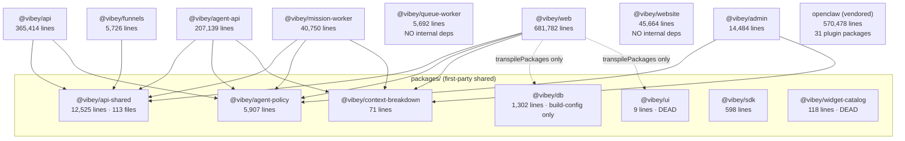

# Dependency & Coupling Map

> Scope: `vibey-v2` monorepo (product "ROAS"). Read-only audit. All counts were produced by scanning the working tree; commands are shown so they can be re-run.
> Companion doc: `16-code-health-findings.md`. Cross-references: `05-api-map.md`, `06-database-map.md`, `08-auth-security.md`, `10-background-processes.md`, `11-configuration.md`.

## Executive Summary

The repo is ~2.1M lines of TypeScript across 20 pnpm workspaces (`pnpm-workspace.yaml`: 12 explicit app paths + `packages/*` + root). Excluding the vendored `apps/openclaw` (570,478 lines), it is ~1.4M lines. `apps/web` alone is **681,782 lines in 4,809 files** — nearly half the first-party code.

Five findings define the coupling picture:

1. **The architecture gate is real but has a load-bearing blind spot.** `scripts/arch/check-loc.mjs` enforces LOC limits and cross-feature import bans, and it currently fails with 25 violations. But its classifier only recognises `*.controller.ts`, `*.service.ts`, `*.repository.ts`, and `.tsx` under `apps/web/src/{features,components}`. Everything else is unlimited. **32,508 lines of `apps/api` service logic have been moved into `*-NN.base.ts` inheritance chains that the gate does not classify at all** — `space-automation.service.ts` is a 530-line file sitting on 19 abstract base classes totalling 11,395 lines, and it passes a 600-line limit.
2. **The real debt figure is the baseline, not the failure count.** `scripts/arch/loc-allowlist.json` (77,908 bytes, generated `2026-08-19`) baselines **145 over-limit files** carrying **54,437 excess lines**, plus **184 files with 429 cross-feature imports**. The 25 current violations are drift on top of that.
3. **`apps/web` has no working feature boundary.** 437 live cross-feature import statements across 191 files and 68 distinct feature pairs (35 features total). Worse, the _shared_ layer is inverted: `apps/web/src/{components,lib,hooks}` contains **257 imports pointing back into `@/features/*`**, a direction the gate does not check at all.
4. **52 circular dependency cycles** (9 in `apps/web`, 30 in `apps/api`, 13 in `apps/agent-api`). Almost all are service↔helper or service↔repository pairs; none cross a feature boundary in `apps/web`.
5. **The layers that do hold, hold well.** Zero controllers call Supabase directly (all 367 `.controller.ts` files are clean — every `.from(` hit is `Buffer.from`). Only 4 controllers exceed 200 lines. Raw `fetch('/api/...')` inside components is effectively absent (4 occurrences). Zero unused runtime dependencies across 10 audited workspaces. This is not uniformly vibe-coded; the backend HTTP boundary is disciplined and the frontend service layer is genuinely used.

The dominant risk is not "messy code" — it is that **two features (`spaces` 156,867 lines, `studio` 120,940 lines) plus one store (`use-chat-store.ts`, imported by 56 files) form a core that every other feature reaches into.**

---

## Workspace Dependency Graph

Derived from `dependencies`/`devDependencies` in each `package.json` where the target is also a workspace name. 47 internal edges total; 31 of them are `@openclaw/*` plugins depending on the vendored `openclaw` host.



### Reality check on the shared packages

| Package                    | Import sites                                                                                | Verdict                                                                                                                                                                                         |
| -------------------------- | ------------------------------------------------------------------------------------------- | ----------------------------------------------------------------------------------------------------------------------------------------------------------------------------------------------- |
| `@vibey/api-shared`        | 860 (`apps/api` 606, `apps/agent-api` 182, `apps/web` 26, `mission-worker` 12, `funnels` 3) | The genuine hub. Guards, filters, DTOs, Supabase decorators.                                                                                                                                    |
| `@vibey/agent-policy`      | 46                                                                                          | Real, focused.                                                                                                                                                                                  |
| `@vibey/context-breakdown` | 18                                                                                          | Real. 71 lines — arguably too small to be a package.                                                                                                                                            |
| `@vibey/sdk`               | 3                                                                                           | Marginal.                                                                                                                                                                                       |
| `@vibey/db`                | 0 source imports                                                                            | Referenced only in `apps/web/next.config.js:11` (`transpilePackages`) and `apps/web/vitest.config.ts:39` (path alias). Its `src/types.ts` is 1,292 lines of generated DB types nothing imports. |
| `@vibey/ui`                | 0                                                                                           | **Dead.** 9 lines in 2 files; `src/utils.ts` is a 7-line `cn()` helper duplicated in 3 other places.                                                                                            |
| `@vibey/widget-catalog`    | 0                                                                                           | **Dead.** 118 lines.                                                                                                                                                                            |

`apps/queue-worker` and `apps/website` declare **zero** internal workspace dependencies. For `queue-worker` this is the direct cause of duplicated infrastructure code (see Duplicated Logic).

---

## The Architecture Gate (`check-loc.mjs`) — what it enforces and the real baseline debt

`scripts/arch/check-loc.mjs` (429 lines) runs as `pnpm architecture:check` and is mirrored by ESLint rules in `eslint.config.mjs` (160 lines), which reads the same allowlist to suppress `max-lines` and `no-restricted-syntax` on baselined files.

### Limits enforced

| Kind            | Limit | Matched by (`classifyLocFile`, lines 38–60)                          |
| --------------- | ----- | -------------------------------------------------------------------- |
| `controller`    | 200   | `*.controller.ts`                                                    |
| `service`       | 600   | `*.service.ts`                                                       |
| `repository`    | 400   | `*.repository.ts`                                                    |
| `web-container` | 600   | `apps/web/src/**/containers/**/*.tsx`                                |
| `web-component` | 400   | `apps/web/src/features/**/*.tsx`, `apps/web/src/components/**/*.tsx` |

Three additional checks: cross-feature imports inside `apps/web/src/features/<a>` → `@/features/<b>` (`detectWebFeatureImports`, line 110); `supabase.from(` inside `apps/api`/`apps/agent-api` controllers (`detectControllerSupabase`, line 133); and an allowlist-may-only-shrink ratchet (`checkAllowlistOnlyShrinks`, line 362) gated behind `--check-allowlist-shrink`.

### The real baseline debt

`scripts/arch/loc-allowlist.json`, generated `2026-08-19T04:50:07Z`:

| Section                   | Entries       | Detail                                                                   |
| ------------------------- | ------------- | ------------------------------------------------------------------------ |
| `files` (LOC)             | **145**       | 54,437 excess lines over limits; 116,637 lines total in over-limit files |
| `webFeatureImports`       | **184 files** | **429 baselined cross-feature imports**                                  |
| `controllerSupabaseFiles` | **0**         | Nothing to forgive — controllers are clean                               |

Baselined LOC entries by app: `apps/web` 115, `apps/api` 14, `apps/agent-api` 10, `apps/mission-worker` 4, `apps/queue-worker` 2. By kind: `web-component` 107, `service` 23, `repository` 6, `controller` 4, `web-container` 4.

Live re-scan: **146 files currently exceed their limit** (43 exceed 2×, 19 exceed 3×) out of 3,545 classified files. So the gate is holding the line — current failures are drift of a few lines each, not new god files.

One allowlist entry is malformed: `apps/api/src/modules/work-requests/services/work-request.service.ts` has `{"lines": 601}` with **no `kind` or `limit` field**. It is also the source of a current failure (`now 592/600 LOC; remove it from loc-allowlist.json`).

### Gate blind spots (this is where the debt actually lives)

`classifyLocFile` returns `null` for anything not matching the five patterns. Verified largest unclassified first-party source files:

| Lines | File                                                                       | Why unlimited                 |
| ----- | -------------------------------------------------------------------------- | ----------------------------- |
| 4,731 | `apps/website/src/app/vibey-pitch/PitchDeckV1.tsx`                         | `.tsx` outside `apps/web`     |
| 4,461 | `apps/agent-api/src/modules/artifacts/services/artifact-action-schemas.ts` | not `*.service.ts`            |
| 3,839 | `apps/mission-worker/src/modules/brain-ops/brain-ops.processor.ts`         | `*.processor.ts` unclassified |
| 2,766 | `apps/agent-api/src/modules/agent-sync/data/vibey-api-action-docs.ts`      | plain `.ts`                   |
| 2,489 | `apps/mission-worker/src/.../gateways/mission-openclaw.gateway.ts`         | `*.gateway.ts` unclassified   |
| 2,475 | `apps/web/src/features/studio/store/use-chat-store.ts`                     | `.ts`, not `.tsx`             |
| 1,438 | `apps/agent-api/.../artifact-capability.policy.ts`                         | `*.policy.ts` unclassified    |
| 1,308 | `apps/web/src/app/api/proxy/[...path]/route.ts`                            | route handlers unclassified   |
| 1,046 | `apps/api/.../meeting-follow-up-slack-confirm.workflow.ts`                 | `*.workflow.ts` unclassified  |

**The `*.base.ts` escape hatch.** 143 `.base.ts` files exist; 10 of them form numbered inheritance chains whose concrete leaf is a small `*.service.ts`/`*.repository.ts` that passes the gate. Verified by calling `classifyLocFile('apps/api/src/modules/spaces/services/spaces-service-01.base.ts')` → `null`.

| Effective LOC | Links  | Chain                                                                      | Leaf that passes the gate                         |
| ------------- | ------ | -------------------------------------------------------------------------- | ------------------------------------------------- |
| **11,395**    | 19     | `apps/api/src/modules/spaces/services/space-automation-service-NN.base.ts` | `space-automation.service.ts` (530)               |
| **5,548**     | 10     | `spaces/services/social-research-scrapecreators-service-NN.base.ts`        | `social-research-scrapecreators.service.ts` (377) |
| **3,434**     | 7      | `spaces/services/spaces-service-NN.base.ts`                                | `spaces.service.ts` (137)                         |
| 1,874         | 4      | `campaigns/services/campaigns-service-NN.base.ts`                          | `campaigns.service.ts` (47)                       |
| 1,854         | 7      | `leads/repositories/leads-repository-NN.base.ts`                           | `leads.repository.ts` (26)                        |
| 1,851         | 4      | `telegram/services/telegram-service-NN.base.ts`                            | `telegram.service.ts` (55)                        |
| 1,795         | 4      | `media/services/media-service-NN.base.ts`                                  | `media.service.ts` (35)                           |
| 1,654         | 4      | `brain/services/brain-retrieval-service-NN.base.ts`                        | `brain-retrieval.service.ts` (66)                 |
| 1,559         | 3      | `machines/services/machines-service-NN.base.ts`                            | `machines.service.ts` (75)                        |
| 1,544         | 4      | `transfer/services/transfer-service-NN.base.ts`                            | `transfer.service.ts` (27)                        |
| **32,508**    | **66** | **total**                                                                  |                                                   |

The chain shape is uniform (`SpacesServiceBase01` ← `Base02` ← … ← `Base07` ← `SpacesService`), i.e. a mechanical split by line count, not by responsibility. It is also the direct cause of the longest circular dependency cycles in `apps/api` (see below).

---

## High-Coupling Modules

Ranked by inbound reach.

| Module                                                             | Inbound                                                                                                                 | Evidence                                                                                                                                                                                |
| ------------------------------------------------------------------ | ----------------------------------------------------------------------------------------------------------------------- | --------------------------------------------------------------------------------------------------------------------------------------------------------------------------------------- |
| `apps/web/src/features/studio/store/use-chat-store.ts`             | **56 files**, 10+ features                                                                                              | Imported from `components/shell/*` (11 files), `components/global-chat/*` (6), `features/{projects,composer,notifications,spaces,studio,mission-control}`. 2,475 lines, gate-invisible. |
| `@vibey/api-shared`                                                | 860 import sites                                                                                                        | Legitimate hub, but 26 of those are in `apps/web` — a frontend importing NestJS-adjacent shared code.                                                                                   |
| `apps/web/src/features/spaces`                                     | 156,867 lines, 943 files; target of 4 feature pairs and 109 inverted shared imports                                     | The de-facto core domain.                                                                                                                                                               |
| `apps/web/src/features/studio`                                     | 120,940 lines, 786 files; **top cross-feature target (67 imports from `spaces` alone)** plus 77 inverted shared imports | Chat/artifact runtime that everything embeds.                                                                                                                                           |
| `apps/api/src/modules/spaces/services/spaces.service.ts`           | 3,434-line inheritance chain; participates in 8 of the 30 `apps/api` cycles                                             |                                                                                                                                                                                         |
| `apps/mission-worker/src/modules/brain-ops/brain-ops.processor.ts` | 3,839 lines, 44 async methods, **63 direct `.from('...')` calls**                                                       | Single class owning 9 job types.                                                                                                                                                        |

---

## Cross-Feature Imports in apps/web

35 features under `apps/web/src/features/`. Live scan of `from '@/features/<x>'` where `<x>` differs from the containing feature: **437 import statements in 191 files across 68 distinct pairs** (7 of the 437 are in test files).

Reproduce: `rg -l --glob '*.ts' --glob '*.tsx' "from '@/features/" apps/web/src/features`, then group by source feature vs. target.

### Worst offender pairs

| From feature | Imports from    | Count                                    | Example                                                                 |
| ------------ | --------------- | ---------------------------------------- | ----------------------------------------------------------------------- |
| spaces       | studio          | **67**                                   | `@/features/studio/services/artifact-preview.service`                   |
| home         | spaces          | 37                                       | `@/features/spaces/components/OptionBadge`                              |
| studio       | themes          | 31                                       | `@/features/themes/components/FontPicker`                               |
| settings     | mission-control | 30                                       | `@/features/mission-control/components/AwarenessToggle`                 |
| projects     | studio          | 19                                       | `@/features/studio/components/chat/ArtifactAttachments`                 |
| team         | mission-control | 18                                       | `@/features/mission-control/types`                                      |
| team         | studio          | 17                                       | `@/features/studio/services/campaign.service`                           |
| flows        | spaces          | 15                                       | `@/features/spaces/components/automations/ActionBuilder`                |
| spaces       | org             | 15                                       | `@/features/org/services/org.service`                                   |
| studio       | spaces          | **13** (bidirectional with the 67 above) | `@/features/spaces/components/reporting/shared/reporting-toolbar.types` |
| settings     | email           | 11                                       | `@/features/email/components/domains/AddEmailDomainDialog`              |
| channels     | studio          | 10                                       | `@/features/studio/types`                                               |
| settings     | org             | 10                                       | `@/features/org/store/use-org-store`                                    |
| home         | org             | 10                                       | `@/features/org/services/org.service`                                   |
| settings     | team            | 9                                        | `@/features/team/constants/team.constants`                              |

### By source feature (total outbound)

`spaces` 103 · `settings` 81 · `home` 58 · `studio` 54 · `team` 36 · `flows` 24 · `projects` 21 · `channels` 14 · `autopilot` 9 · `notifications` 7 · `team-2` 7 · `inbox` 6 · `my-work` 3 · `public-agent` 3 · `contacts` 2 · `composer` 1.

### Worst individual files

| Cross-feature imports | File                                                                                                                                                              |
| --------------------- | ----------------------------------------------------------------------------------------------------------------------------------------------------------------- |
| 17                    | `features/spaces/components/chat/SpaceVibeyChatPanel.tsx`                                                                                                         |
| 14                    | `features/projects/components/ProjectChatPane.tsx`                                                                                                                |
| 12                    | `features/home/components/HomeTaskDetailHost.tsx`                                                                                                                 |
| 10                    | `features/settings/components/settings-content/AutopilotPageContent.tsx`                                                                                          |
| 8                     | `features/settings/components/settings-content/EmailDomainsAndSendersContent.tsx`                                                                                 |
| 7                     | `features/channels/components/ChannelOrderedBlocks.tsx`, `features/team/components/CampaignTeamManageModal.tsx`, `features/home/components/cards/MyTasksCard.tsx` |

The `spaces ↔ studio` pair is bidirectional (67 + 13 = 80 imports). At the module level madge found no cycle between them, but at the feature level they are a single unit that happens to live in two directories.

**Reciprocal (bidirectional) feature pairs:** `spaces↔studio`, `spaces↔settings`, `spaces↔channels`, `spaces↔themes`, `spaces↔team`, `spaces↔properties`, `spaces↔mission-control`, `studio↔composer`, `studio↔projects`, `studio↔flows`, `home↔channels`, `home↔settings`, `settings↔autopilot`, `settings↔team-2`, `inbox↔my-work`, `notifications↔mission-control`.

---

## Circular Dependencies

Tool: `npx --yes madge --circular --extensions ts,tsx --ts-config <app>/tsconfig.json <app>/src`. Ran successfully on all three main apps (74s for `apps/web`/4,864 files, 31s for `apps/api`/2,271 files, 72s for `apps/agent-api`/1,003 files). Nothing was installed permanently. `apps/openclaw`, `apps/website`, `apps/admin`, and the workers were not scanned.

**Total: 52 cycles.**

### `apps/web` — 9 cycles (all intra-feature, all 2–3 nodes)

1. `features/brain/components/cortex-max-view-model.ts` ↔ `cortex-max-search.ts`
2. `features/spaces/lib/page-grader-client-tag.ts` ↔ `features/spaces/services/page-grader-send.service.ts`
3. `features/spaces/components/automations/PromptTemplateEditor.tsx` ↔ `PromptTemplateVarMenu.tsx`
4. `features/team-2/components/AgentsGroupSectionHeader.tsx` ↔ `AgentsListView.tsx`
5. `features/team-2/components/Team2Toolbar.tsx` ↔ `Team2GroupByButton.tsx`
6. `features/team-2/components/Team2Toolbar.tsx` ↔ `Team2GroupByToolbarPopover.tsx`
7. `features/team-2/components/teams/TeamsToolbar.tsx` ↔ `TeamsGroupByToolbarPopover.tsx`
8. `features/team/components/chat/TeamConversationsSidebar.tsx` ↔ `use-team-conversations-sidebar-controller.ts`
9. same as 8 extended through `use-team-conversations-sidebar-campaign-controller.ts`

**Notably, zero cycles cross a feature boundary.** The 437 cross-feature imports are messy but acyclic at module level. 4 of 9 cycles are in `team-2`, all toolbar↔popover pairs.

### `apps/api` — 30 cycles

8 of the 30 (#9–#16) are the _same_ cycle re-reported at increasing depth, all rooted in the `spaces-service-NN.base.ts` chain:

```
space-automation.service.ts
  → meeting-follow-up-slack-confirm.service.ts
  → meeting-follow-up-slack-confirm.workflow.ts
  → meeting-follow-up-name-knowledge.loader.ts
  → integrations/page-grader/services/page-grader-api.service.ts
  → page-grader-send-work.service.ts
  → spaces/services/spaces.service.ts
  → spaces-service-07.base.ts → …-06 → …-05 → …-04 → …-03 → …-02 → …-01
```

This is a 7-hop cross-module cycle (`spaces` → `integrations` → `spaces`) that then walks the whole inheritance chain. The `.base.ts` split converted one god file into a deep cycle.

The remaining 22 are 2-node pairs. **7 are service↔repository inversions** — the repository imports its own service, defeating the layering:

- `browser-sessions.repository.ts` ↔ `browser-sessions.service.ts`
- `vault.service.ts` ↔ `vault.repository.ts`
- `brain-permissions.service.ts` ↔ `brain-permissions.repository.ts`
- `feature-updates.service.ts` ↔ `feature-updates.repository.ts`
- `leads/services/contact-identifier.service.ts` ↔ `leads/repositories/contact-identifier.repository.ts`
- `channels.repository.ts` ↔ `channel-memberships.repository.ts`
- `meetings/repositories/meeting-workspace-resolution.repository.ts` ↔ `create-scheduled-meeting-item.ts`

5 involve `integrations-calendar.service.ts` and its extracted helpers (`-dedupe`, `-enrichment`, `-parse`, `-team.service`, `-workspace-map`) — the same "extract helper, helper imports parent back" anti-pattern. 3 are NestJS **module-level** cycles (`brain.module` ↔ `space-retrieval.module`, `spaces.module` ↔ `cursor.module`, `spaces.module` → `slack.module` → `leads.module`), which are the riskiest because they can produce undefined DI providers at boot.

### `apps/agent-api` — 13 cycles

6 are in the artifact action schema/preflight cluster: `artifact-action-schemas.ts` ↔ `artifact-action-additional-schemas.ts` (± `artifact-action-meta-schemas.ts`), `artifact-action-schemas.ts` ↔ `artifact-space-item-field-contract.ts`, and `artifact-action-preflight.ts` ↔ 3 specialised preflights (`artifact-mcp-tool-preflight`, `artifact-presentation-action-preflight`, `artifact-webinar-launch-bible-preflight`). 3 are `chat-stream-execution.service.ts` ↔ its extracted executors. 2 are repository↔service inversions (`browser-sessions`, `public-agent`). 1 is `chat-runtime.repository.ts` ↔ `message-timeline.service.ts`.

**Pattern across all 52:** the repo's standard response to a too-large file is to extract a sibling helper and let the helper import the parent back. That satisfies the LOC gate and creates a cycle.

---

## Shared Global State

`apps/web` uses Zustand with **25 stores** and no react-query/SWR, so every store is also a hand-rolled server cache.

### Stores read/written across unrelated features

| Store                                                   | Lines | Reach                                                                                                                                                                                                                                                                                                                                         |
| ------------------------------------------------------- | ----- | --------------------------------------------------------------------------------------------------------------------------------------------------------------------------------------------------------------------------------------------------------------------------------------------------------------------------------------------- |
| `features/studio/store/use-chat-store.ts`               | 2,475 | **56 importing files.** Consumers include `components/shell/*` (11), `components/global-chat/*` (6), `components/layout/*`, `lib/chat/studio-chat-runtime-adapter.ts`, and features `projects`, `composer`, `notifications`, `spaces`, `mission-control`. Also holds 5 `localStorage`/persist call sites and 3 module-level `let` singletons. |
| `features/spaces/store/use-spaces-store.ts`             | 1,235 | Read by `home`, `flows`, `inbox`, `my-work`, plus `components/layout/sidebar/*`                                                                                                                                                                                                                                                               |
| `components/shell/use-shell-store.ts`                   | 591   | Global shell/panel state                                                                                                                                                                                                                                                                                                                      |
| `components/global-chat/store/use-global-chat-store.ts` | 359   | Itself imports `use-chat-store` — a store composing another feature's store                                                                                                                                                                                                                                                                   |
| `lib/org/org-context-store.ts`                          | 277   | Org/tenant context, read app-wide                                                                                                                                                                                                                                                                                                             |
| `features/org/store/use-org-store.ts`                   | —     | Cross-imported by `settings` (10), `home`, `flows`, `notifications`, `studio`                                                                                                                                                                                                                                                                 |

The `MissionTrackActions.tsx:3 → @/features/studio/store/use-chat-store` import is one of the 25 current gate failures — a new cross-feature reach into the chat store from `mission-control`.

### Module-level mutable singletons

- **60** module-scope `let` declarations in `apps/web/src` (non-test). Worst: `lib/debug/freeze-diagnostics.ts` (5), `features/mission-control/store/use-mission-dashboard-store.ts` (5), `features/spaces/hooks/use-cached-spaces.ts` (4), `features/brain/store/use-brain-store.ts` (4), `features/studio/services/chat.service.ts` (3).
- **392** module-level `new Map()`/`new Set()`/`new WeakMap()` caches across `apps/web`, `apps/api`, `apps/agent-api`. In the Next.js and NestJS server processes these are per-instance caches with no eviction contract and no tenant key guarantee — see `06-database-map.md` and `08-auth-security.md` for the multi-tenancy model these must respect.
- `apps/web/src/features/spaces/hooks/use-cached-spaces.ts` holds a module-level spaces cache, which is the hand-rolled substitute for the missing query library.

### `globalThis`

20 occurrences (non-test). Concentrated in one place: `features/studio/components/ChatInput/` — `use-chat-input-dropzone.ts` (8), `use-chat-input-external-attachments.ts` (2), plus `-global-shortcuts`, `-context-popover`, `chat-input-file-state.ts`. Also `lib/api/backend-client.ts` (2). This is cross-component coordination via the global object instead of context or a store.

---

## Layer Violations (Architecture That Exists Only In Name)

### Frontend components doing backend work

Honest result: **this layer mostly holds.**

- Raw `fetch('/api/...')` in `.tsx`: **4 occurrences.** Only 17 `.tsx` files call `fetch(` at all, and **zero** of them are under a `components/` directory — they are blob/media fetches in preview panes (`MediaPreviewPanes.tsx`, `DocxThumbnail.tsx`, `PresentationSlideMiniPreview.tsx`) and two auth pages.
- `eslint.config.mjs:120–139` bans `supabase.from(` anywhere in `apps/web` (`no-restricted-syntax`), exempting only `middleware.ts`, `app/(auth)/callback/route.ts`, `app/api/proxy/[...path]/route.ts`, and `lib/supabase/**`. All traffic is meant to go through `backendGet/backendPost/backendPatch` in `lib/api/backend-client.ts`.

What actually leaks:

- **5 live violations of that ESLint rule** outside the exempted paths:
  - `features/brain/hooks/use-brain-scope-nav-options.ts:101,141,328` — queries `profiles` and `brain_shares` from a hook
  - `features/brain/services/recurring-rules.service.ts:206` — queries `agents_registry`
  - `features/settings/components/settings-content/BrainPageContent.tsx:75` — queries `agents_registry` **from a component**
- **25 `.tsx` files call `createClient()` directly.** 11 are auth pages (`login`, `register`, `join`, `invite/[token]`, `reset-password`, `verify-email`, `forgot-password`, `mcp/consent`, `no-org-access`, onboarding) where using the Supabase client is correct. The other ~14 are not: `components/layout/AvatarAccountMenuPanel.tsx:91`, `components/shell/ShellNewChatGreeting.tsx:40`, `components/flows/AutomationRunsLog.tsx:90`, `features/team-2/components/VibeyOpsDesk.tsx:43`, `features/settings/components/EnterpriseApplicationModal.tsx:35`, `features/work-requests/components/WorkRequestReviewPage.tsx:52`, and `features/settings/.../ProfilePageContent.tsx` at lines 45, 83, 111, 147 (four separate clients in one component).
- **30 `.tsx` files import from `@/lib/supabase`** at all.

### Controllers doing service work

**This layer is clean, and it is worth saying plainly.** 367 `*.controller.ts` files across `apps/api` and `apps/agent-api`:

- **0 direct Supabase calls.** Every one of the 7 `.from(` matches is `Buffer.from(...)` (`browser-media.controller.ts:49`, `sessions-storage.controller.ts:33,55`, `sk.controller.ts:70`, `transcribe.controller.ts:121`, `dropbox.controller.ts:145`, `google-drive-files.controller.ts:132`). The `controllerSupabaseFiles` allowlist is empty because there is nothing to forgive.
- **Only 4 controllers exceed 200 lines:** `apps/agent-api/src/health.controller.ts` (303), `agent-api/.../public-chat.controller.ts` (238), `apps/api/.../agents.controller.ts` (218), `apps/api/.../transcribe.controller.ts` (208). All 4 are baselined.

### Direct database access outside repositories

This is where the backend layering actually fails.

- **45 files in `apps/api/src` call `.from('...')` outside a `*repositor*` path.** Worst: `missions/services/skill-catalog-organization.service.ts` (15 calls), `meetings/services/meeting-follow-up-review.service.ts` (14), `brain/services/page-grader-client-import.service.ts` (11), `spaces/services/meetings-precall-drive-agenda.service.ts` (10), `brain/services/page-grader-brain-package-ingest.service.ts` (10), and three `page-grader/services/*` files (9, 9, 8).
- **Workers bypass repositories entirely.** `apps/mission-worker/src/modules/brain-ops/brain-ops.processor.ts` makes **63 direct `.from('...')` calls**; `missions/services/gateways/mission-openclaw.gateway.ts` makes 19; `agent-runtime/processors/agent-runtime-chat-shadow.processor.ts` makes 3. `brain-ops.processor.ts` has private methods named `loadExistingAvatars`, `loadCustomerContactsLite`, `loadCustomerBrainMemoriesSince`, `loadDiscriminatorAxes` — a repository living inside a BullMQ processor. See `10-background-processes.md` for what these jobs do.
- **Duplicate-table access is unresolved.** 89 `from('profiles')` vs 19 `from('user_profiles')` call sites in the working tree; `apps/web/src/middleware.ts` queries both on every dashboard request. See `06-database-map.md`.

### The inverted layer (not checked by any gate)

`apps/web/src/{components,lib,hooks}` — the _shared_ layer — contains **257 imports into `@/features/*`**:

| Target feature        | Inverted imports |
| --------------------- | ---------------- |
| `spaces`              | 109              |
| `studio`              | 77               |
| `org`                 | 16               |
| `home`                | 16               |
| `brain`               | 15               |
| `team`                | 6                |
| `updates`, `projects` | 4 each           |
| 12 others             | 1–2 each         |

Worst files: `components/home-dashboard-v4/HomeDashboardV4Composer.tsx` (16), `components/deliverables/DeliverableEntityPreviewAdapter.tsx` (11), `components/layout/sidebar/useSidebarController.ts` (10), `components/layout/sidebar/SidebarBrainFlyout.tsx` (7), `components/layout/Sidebar.tsx` (6), `components/layout/AvatarAccountMenuPanel.tsx` (6).

`check-loc.mjs:103` (`sourceFeatureFor`) returns `null` unless the path is `apps/web/src/features/...`, so the gate is structurally incapable of seeing this direction. The gate's own advice — "move shared code to `@/lib` or `@/components`" — has been followed by moving _consumers_ into the shared layer while their dependencies stayed in features. `apps/web/src/components/` now contains directories that mirror feature names (`spaces/`, `chat/`, `flows/`, `contacts/`, `notifications/`, `missions/`, `channels/`, `artifacts/`, `presentations/`, `work-views/`), which is why the inversion is so large.

Concrete example: `apps/web/src/components/ui/forms/rich-text-toolbar.tsx` (2,252 lines) — a generic UI primitive — imports `@/features/spaces/components/cells`.

---

## Duplicated Logic

Verified by md5-hashing 8,765 non-`dist`, non-`.d.ts` `.ts`/`.tsx` files outside `apps/openclaw`: **15 byte-identical groups covering 34 files, 13 of them spanning more than one workspace.**

### Byte-identical across workspaces

| Lines | Copies | Files                                                                                                                                                                                                         |
| ----- | ------ | ------------------------------------------------------------------------------------------------------------------------------------------------------------------------------------------------------------- |
| 221   | 2      | `apps/agent-api/src/modules/brain/services/brain-sufficiency.service.ts` = `apps/api/src/modules/brain/services/brain-sufficiency.service.ts`                                                                 |
| 179   | 2      | `apps/agent-api/src/modules/brain/services/link-extraction.service.ts` = `apps/api/.../link-extraction.service.ts`                                                                                            |
| 82    | 2      | `apps/mission-worker/src/lib/services/supabase-resilient-fetch.ts` = `apps/queue-worker/src/lib/services/supabase-resilient-fetch.ts`                                                                         |
| 54    | 2      | `apps/admin/src/components/vibey/vibey-loading-orb.tsx` = `apps/web/src/components/vibey/vibey-loading-orb.tsx`                                                                                               |
| 36    | **3**  | `esbuild-transform.ts` in `apps/funnels/src/lib`, `apps/admin/src/lib`, `apps/web/src/lib`                                                                                                                    |
| 36    | **3**  | `use-esbuild-runner.ts` in `apps/funnels/src/hooks`, `apps/admin/src/hooks`, `apps/web/src/hooks`                                                                                                             |
| 17    | 2      | `database.module.ts` in `apps/mission-worker/src/lib` and `apps/queue-worker/src/lib`                                                                                                                         |
| 9     | 2      | `supabase/client.ts` in `apps/admin/src/lib` and `apps/web/src/lib`                                                                                                                                           |
| 9     | 2      | `normalize-slack-timestamp.ts` in `apps/queue-worker/src/modules/slack-sync/utils` and `apps/api/src/modules/slack/utils`                                                                                     |
| 7     | **4**  | `cn()` helper: `packages/ui/src/utils.ts`, `apps/funnels/src/lib/utils.ts`, `apps/admin/src/lib/utils/cn.ts`, `apps/website/src/lib/utils.ts` — and the one package that exists to hold it has zero importers |
| 2     | 2      | `instrumentation.ts` in `apps/web/src` and `apps/website/src`                                                                                                                                                 |
| 2     | 2      | `instrument.ts` in `apps/mission-worker/src` and `apps/api/src`                                                                                                                                               |

### Near-identical, three-way

`supabase-resilient-fetch.ts` exists in **three** places: `packages/api-shared/src/services/` (99 lines) and the two workers (81 lines each, byte-identical to each other). The workers have their own copy because `apps/queue-worker` declares no dependency on `@vibey/api-shared` — the duplication is structural, not accidental. Same story for `database.module.ts`.

### The studio chat store family

`apps/web/src/features/studio/store/` contains 4,271 lines across 13 files, including **6 chat stores that are structurally paired** — one `funnel-*` and one `presentation-*` variant of each concern. Verified by normalising `funnel`→`X` / `presentation`→`X` and diffing:

| Pair                                                                            | Lines     | Differing lines after name normalisation |
| ------------------------------------------------------------------------------- | --------- | ---------------------------------------- |
| `use-funnel-tweaks-chat-store.ts` / `use-presentation-tweaks-chat-store.ts`     | 65 / 53   | **18**                                   |
| `use-funnel-full-mode-store.ts` / `use-presentation-full-mode-store.ts`         | 99 / 109  | 46                                       |
| `use-funnel-design-chat-store.ts` / `use-presentation-design-chat-store.ts`     | 330 / 258 | 168                                      |
| `use-funnel-comments-chat-store.ts` / `use-presentation-comments-chat-store.ts` | 120 / 288 | 312                                      |

The action surfaces are the same contract in every pair — `session`, `registerSession`, `clearSession`, `set<X>ChatActive`, `setBundle`, plus `addComment`/`resolveComment`/`sendCommentsToVibe` for the comments pair. The `tweaks` pair is effectively the same store twice. The `comments` pair has **diverged**: the presentation version gained `loadComments`, `retryPendingComments`, and a `writeOutbox` path that the funnel version never got. That is the real cost — a bug fixed in one is not fixed in the other.

### Duplicated formatting helpers

Same exported name, independent implementations:

- `formatRelativeTime` — **4** copies: `features/spaces/components/contacts/ContactCommunicationPanel.helpers.ts:20`, `features/spaces/components/artifacts/form/form-responses-display.tsx:4`, `features/spaces/components/task-detail/task-activity-format.ts:228`, `features/mission-control/components/dialogs/detail-helpers.tsx:179`
- `formatDate` — **4** copies: `features/studio/components/preview/media/media-tab.utils.ts:3`, `features/brain/components/node-detail-formatters.ts:3`, `features/settings/.../billing-page/utils/billing-format.ts:5`, `components/media/drive-file-browser-modal.utils.tsx:37`
- `formatLongDate` — 2, both inside `features/team-2/components/teams/` (`team-overview-utils.ts:132`, `team-analytics-formatting.ts:26`)
- `formatMeetingTime` — 2, both inside `features/brain/components/` (`user-add-info-panel/utils.ts:18`, `training/training-staging-helpers.ts:209`)
- `formatTokenK` — 2 (`lib/chat/composer-model-picker.ts:9`, `features/studio/components/ChatInput/chat-input-format.ts:1`)
- `formatSkillName` — 2 (`lib/agents/agent-display.ts:1`, `features/team/constants/team.constants.ts:10`) — and `settings` imports the `team` copy across a feature boundary

Also 2 duplicated test files: `resolve-reporting-dates.test.ts` and `funnel-pixel-utils.test.ts` each exist byte-identical in both `lib/`/`components/` and `features/` locations.

### Parallel feature rewrites

`features/team` (29,772 lines, 161 files) and `features/team-2` (25,133 lines, 163 files) are **both live and both routed**: `app/(dashboard)/team/page.tsx` uses `team-2`, while `app/(dashboard)/team/teams/page.tsx` and `team/teams/[teamId]/page.tsx` reference both, as does `app/(dashboard)/campaigns/[id]/page.tsx`. 54,905 lines maintaining two implementations of one domain. Additionally `settings → team-2` and `home → team-2` cross-feature imports exist alongside `settings → team`, so consumers are split too. `components/home-dashboard-v4/` is a similar versioned artifact next to `features/home`.

---

## God Files

Top 15 by size, each opened and characterised. "Limit" is what `check-loc.mjs` would apply if it classified the file.

| File                                                                                | Lines | Responsibilities it actually mixes                                                                                                                                                                                                                                                                                                                                                                                                  | Risk                                                                                                           |
| ----------------------------------------------------------------------------------- | ----- | ----------------------------------------------------------------------------------------------------------------------------------------------------------------------------------------------------------------------------------------------------------------------------------------------------------------------------------------------------------------------------------------------------------------------------------- | -------------------------------------------------------------------------------------------------------------- |
| `scripts/seed-yc-demo/content/narrative-pages.ts`                                   | 5,578 | One export: a demo-content blob. Pure static data, no logic. Not shipped in an app.                                                                                                                                                                                                                                                                                                                                                 | **LOW** — largest file in the repo and the least dangerous                                                     |
| `apps/website/src/app/vibey-pitch/PitchDeckV1.tsx`                                  | 4,730 | Single component: slide layout + 14 `useState` + 9 `useEffect` + copy + embedded media URLs (including signed legacy-Supabase links) + PDF export                                                                                                                                                                                                                                                                                   | MEDIUM — marketing-only, but unbounded and unlinted                                                            |
| `apps/agent-api/.../artifacts/services/artifact-action-schemas.ts`                  | 4,460 | Type definitions (`ActionParamType`, `ActionSchema`, `ResolvableField`) + enum data tables (`VALID_FUNNEL_TYPES`, `FUNNEL_TYPE_ALIASES`, `VALID_WEBSITE_PAGE_TYPES`) + the ~4,100-line `ACTION_SCHEMAS` literal + runtime validation (`validateActionData`) + contract introspection (`describeActionContract`, `getResolvableFieldsForAction`). Also the hub of 6 circular deps.                                                   | **CRITICAL** — every agent action validates through it; #2 most-cited file in the follow-up log (102 mentions) |
| `apps/mission-worker/.../brain-ops/brain-ops.processor.ts`                          | 3,838 | One class, 44 async methods: BullMQ dispatch for **9 job types** (daily dream, cortex formation, context-rule lint, avatar synthesis, interaction routing, pattern analysis, library sync, timeline synthesis, lint) + **63 direct Supabase queries** acting as a repository + outbox bookkeeping (`markOutboxDone`/`markOutboxFailed`) + counter mutation + feature-flag checks (`isCortexMaxEnabled`) + contact resolve-or-create | **CRITICAL** — no layering at all, gate-invisible                                                              |
| `apps/web/src/features/studio/services/chat.service.ts`                             | 2,993 | Timeline event replay/recovery + ordered-content-block merging (5 distinct merge functions) + stream-error interpretation + prewarm cache with its own scheduler and test-reset hook + status-message bucketing/copy + 3 module-level `let` singletons                                                                                                                                                                              | **CRITICAL** — 5× its 600 limit; the frontend chat brain                                                       |
| `apps/agent-api/.../agent-sync/data/vibey-api-action-docs.ts`                       | 2,765 | Two exports: hand-maintained prose documentation of every agent action, as a TS literal. Must be kept in sync by hand with `artifact-action-schemas.ts`.                                                                                                                                                                                                                                                                            | HIGH — #1 most-cited file in the follow-up log (118 mentions); drift is silent                                 |
| `apps/web/src/features/spaces/components/chat/SpaceVibeyChatPanel.tsx`              | 2,664 | **One component** with 35 `useEffect`, 35 `useCallback`, 21 `useMemo`, 13 `useState`, 13 `useRef`. Also holds **17 cross-feature imports** (9 into `@/features/studio/store`) — the single worst coupling site in `apps/web`                                                                                                                                                                                                        | **CRITICAL** — 6.7× the 400 limit; 35 effects in one component is unreviewable                                 |
| `apps/mission-worker/.../missions/services/gateways/mission-openclaw.gateway.ts`    | 2,488 | Gateway transport + 19 async methods + **19 direct Supabase queries** + 16 top-level declarations                                                                                                                                                                                                                                                                                                                                   | HIGH — gate-invisible (`*.gateway.ts` unclassified)                                                            |
| `apps/web/src/features/studio/store/use-chat-store.ts`                              | 2,475 | Zustand store + timeline mutation engine (`upsertGenerationInTimeline`, `start/progress/endToolInTimeline`) + persistence slimming/capping logic (`slimMessagesForPersist`, `capByConversation`, `capToolPreviewContent`) + 5 storage call sites + 5 exported React hooks (`useActiveMessages`, `useActiveContextBreakdown`, …). **Imported by 56 files.**                                                                          | **CRITICAL** — gate-invisible (`.ts`), and the most-shared mutable state in the app                            |
| `apps/web/src/features/spaces/components/DocsView.tsx`                              | 2,447 | **23 components in one file** (`DocsEmptyIllustration`, `GoogleDriveLogo`, `TreeNode`, `DocCard`, `DocsDriveInlineListRow`, …) + Google Drive grouping/bucketing logic (`driveFileTypeBucket`, `buildDriveListingGroups`) + thumbnail URL rewriting (`upgradeDriveThumbSize`) + drag-and-drop tree + artifact payload construction + focus event emission                                                                           | **CRITICAL** — 6.1× limit; presentation and Drive integration fused                                            |
| `apps/mission-worker/.../missions/services/phases/mission-execute-phase.service.ts` | 2,259 | Mission execution phase orchestration in one service                                                                                                                                                                                                                                                                                                                                                                                | HIGH — 3.8× the 600 limit, baselined                                                                           |
| `apps/web/src/components/ui/forms/rich-text-toolbar.tsx`                            | 2,252 | Generic UI primitive that also owns TipTap document-style resolution (`getDocTextStyleOption`, `applyDocTextStyle`), list lifting (`liftOutOfListItems`), alignment state, 13 `useState` + a `useReducer`, and **imports `@/features/spaces/components/cells`**                                                                                                                                                                     | **HIGH** — a shared primitive depending on a feature                                                           |
| `apps/web/src/features/spaces/components/automations/ActionBuilder.tsx`             | 2,121 | Single exported component, only 4 `useMemo` — i.e. ~2,000 lines of inline JSX branching over automation action types with no sub-component extraction. Also imported across the boundary by `flows`.                                                                                                                                                                                                                                | HIGH                                                                                                           |
| `apps/web/src/features/flows/containers/FlowsPage.tsx`                              | 2,110 | Container with 35 `useCallback`, 27 `useEffect`, 26 `useMemo`, 9 `useState`, 28 top-level declarations — page shell, flow CRUD, canvas state, and dialog orchestration in one file                                                                                                                                                                                                                                                  | **CRITICAL** — 3.5× the 600 container limit                                                                    |
| `apps/agent-api/.../artifacts/services/artifact-capability.policy.ts`               | 1,438 | Capability policy data + resolution logic; gate-invisible (`*.policy.ts`)                                                                                                                                                                                                                                                                                                                                                           | HIGH — 58 follow-up-log mentions                                                                               |

**Counts:** 19 files exceed 3× their gate limit; 43 exceed 2×; 146 exceed 1×. Adding the 9 largest gate-invisible files above, **~28 files qualify as god files** by the >3×-equivalent standard.

---

## Architectural Hotspots

The ten places a refactor must start, ranked by (blast radius × how much it blocks everything else).

1. **`features/studio/store/use-chat-store.ts` (2,475 lines, 56 importers).** Nothing else can be decoupled until this is. It is the shared mutable core of chat, and it is invisible to the gate because it is `.ts` not `.tsx`. Every `shell`, `global-chat`, `spaces`, `projects`, `composer`, `notifications`, and `mission-control` surface reads it. Start by splitting the timeline mutation engine and the persistence-slimming layer out of the store; they are pure functions already.

2. **Close the `*.base.ts` gate hole (32,508 lines, 66 files, 10 chains).** This is the single highest-leverage change because it is a five-line edit to `classifyLocFile` — but doing it surfaces 32k lines of unlimited service logic, including an 11,395-line `space-automation` service. It also feeds 8 of the 30 `apps/api` cycles. Classify `*.base.ts` by the leaf it serves, and treat the chain's total as the service's real size. Until this is fixed, the gate's green light is misleading.

3. **The `spaces ↔ studio` fusion (277,807 lines, 80 bidirectional imports).** These are not two features; they are one domain in two directories. `spaces → studio` is 67 imports (top pair overall) and `studio → spaces` is 13. No amount of per-file cleanup fixes this. Either extract the shared chat/artifact runtime into a real third module or merge them and stop pretending the boundary exists.

4. **The 257 inverted shared→feature imports.** `apps/web/src/components/` has become a second feature layer (`components/spaces/`, `components/chat/`, `components/flows/`, `components/home-dashboard-v4/`…) that depends on the first. The gate cannot see this direction, so it will keep growing. Extending `sourceFeatureFor`/`detectWebFeatureImports` to flag `components|lib|hooks → features` is the prerequisite for any boundary work.

5. **`brain-ops.processor.ts` (3,838 lines, 63 Supabase calls, 9 job types).** The worst single layering failure in the repo: BullMQ dispatch, repository, outbox bookkeeping, and feature flags in one class, in a worker that has no repository layer at all. High risk because it mutates Brain data for all tenants. See `10-background-processes.md`.

6. **`SpaceVibeyChatPanel.tsx` (2,664 lines, 35 `useEffect`, 17 cross-feature imports).** The most dangerous _frontend_ file: effect count that high means render-order bugs are near-undebuggable, and it is simultaneously the worst coupling site. Any chat change routes through here.

7. **`artifact-action-schemas.ts` + `vibey-api-action-docs.ts` (7,225 lines combined, 220 follow-up-log mentions, 6 circular deps).** Two hand-maintained parallel descriptions of the same agent action surface, which must be kept in sync manually. AGENTS.md §8.5 requires schema + lifecycle + preflight + docs to move together; the current shape makes that a four-file manual edit. Generate the docs from the schemas.

8. **The 22 two-node cycles, especially the 9 service↔repository inversions.** `vault.service ↔ vault.repository`, `brain-permissions.service ↔ .repository`, `browser-sessions` (in both `api` and `agent-api`), `feature-updates`, `contact-identifier`, `public-agent`, `chat-runtime.repository ↔ message-timeline.service`. Each is small and independently fixable, and each one removed is a permanent structural win. The 3 NestJS **module** cycles (`brain ↔ space-retrieval`, `spaces ↔ cursor`, `spaces → slack → leads`) should go first — those can produce undefined DI providers at boot.

9. **`features/team` vs `features/team-2` (54,905 lines, both routed).** A rewrite that never finished. Consumers are split across both (`settings` and `home` import each). Every team-domain bug must be triaged twice. Finish or delete; this is pure carrying cost.

10. **Worker/service duplication caused by missing workspace deps.** `apps/queue-worker` declares zero internal dependencies, which is why `supabase-resilient-fetch.ts` exists three times and `database.module.ts` twice, and why `brain-sufficiency.service.ts` and `link-extraction.service.ts` are byte-identical across `api` and `agent-api`. Also delete `@vibey/ui` (9 lines, 0 importers) and `@vibey/widget-catalog` (118 lines, 0 importers), and either use or drop `@vibey/db` (1,302 generated lines, referenced only in `next.config.js` and `vitest.config.ts`). Lowest risk on this list and it removes ~1,600 lines plus four copies of `cn()`.
