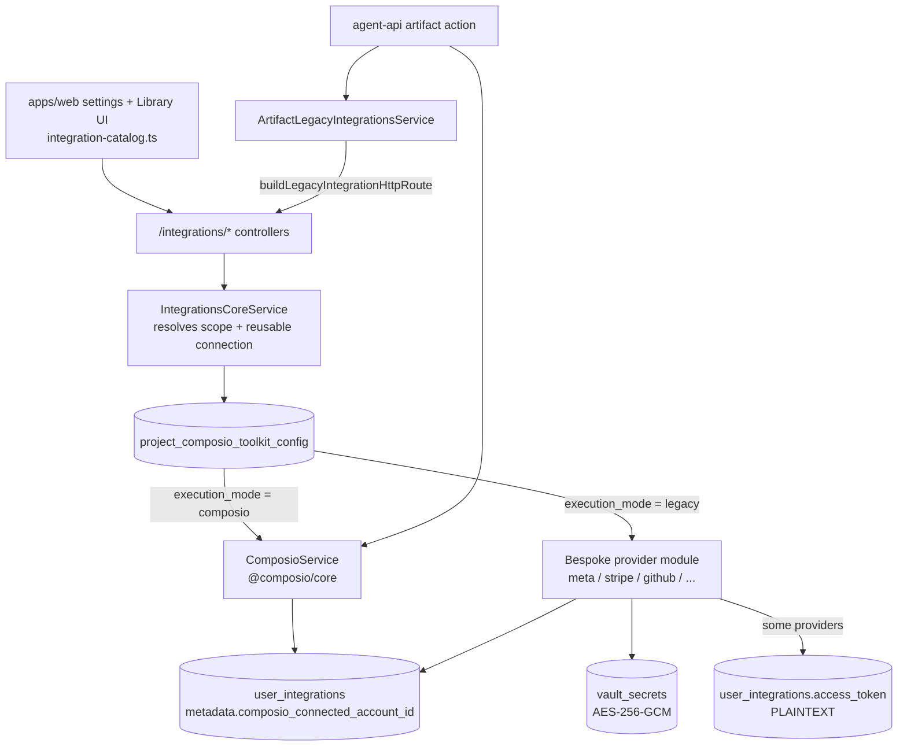

# External Integrations

Reverse-engineered from source. Read-only audit. No secret values appear here — only variable names and paths.

Scope note: `apps/openclaw` is a **vendored third-party agent runtime** (upstream `openclaw`). It ships its own huge integration surface (Discord, Telegram, WhatsApp/Baileys, LINE, Feishu, Matrix, Mattermost, Twitch, AWS Bedrock, …) that ROAS does **not** wire into the product. Those are called out once in "Vendored runtime surface" rather than given per-integration sections.

## Summary Table

| Integration                                                                                                    | Category             | Status                                | Credential source                                        | Triggered by                | Webhook                                                   | Main path                                                                                        |
| -------------------------------------------------------------------------------------------------------------- | -------------------- | ------------------------------------- | -------------------------------------------------------- | --------------------------- | --------------------------------------------------------- | ------------------------------------------------------------------------------------------------ |
| Composio (integration broker)                                                                                  | Meta-integration     | CONFIRMED WIRED                       | `COMPOSIO_API_KEY` env                                   | User connect + agent tool   | `/integrations/composio/webhook` (HMAC verified)          | `apps/api/src/modules/composio`                                                                  |
| Supabase (platform DB/auth/storage)                                                                            | Infra                | CONFIRMED WIRED                       | env service role / anon                                  | Everything                  | No                                                        | `packages/api-shared`, all apps                                                                  |
| OpenRouter                                                                                                     | LLM                  | CONFIRMED WIRED                       | `OPENROUTER_*_API_KEY` env                               | Chat / mission / agent      | No                                                        | `docker/openclaw.json`, `apps/agent-api/src/modules/chat`                                        |
| Anthropic (direct API)                                                                                         | LLM                  | CONFIRMED WIRED                       | OpenClaw provider config                                 | Chat via gateway            | No                                                        | `docker/openclaw.json`                                                                           |
| Anthropic Claude subscription                                                                                  | LLM (BYO seat)       | CONFIRMED WIRED                       | `vault_secrets` (encrypted)                              | User connect → chat         | No                                                        | `apps/api/src/modules/integrations/anthropic-claude`                                             |
| OpenAI Codex                                                                                                   | LLM (BYO seat)       | CONFIRMED WIRED                       | `vault_secrets` (encrypted)                              | OAuth PKCE → chat           | No                                                        | `apps/api/src/modules/integrations/openai-codex`                                                 |
| Google Gemini                                                                                                  | LLM + image gen      | CONFIRMED WIRED                       | `GEMINI_API_KEY` env                                     | Agent media actions         | No                                                        | `apps/api/src/modules/media/integrations/gemini-image.integration.ts`                            |
| OpenClaw gateway                                                                                               | Agent runtime        | CONFIRMED WIRED                       | `OPENCLAW_GATEWAY_TOKEN` env                             | Every agent turn            | No                                                        | `apps/agent-api/src/modules/chat/services/openclaw-gateway-request.service.ts`                   |
| Stripe (platform billing)                                                                                      | Payments             | CONFIRMED WIRED                       | `STRIPE_SECRET_KEY` env                                  | Checkout + webhook          | `/billing/webhook` (verified)                             | `apps/api/src/modules/billing`                                                                   |
| Stripe (customer OAuth)                                                                                        | Payments             | CONFIRMED WIRED                       | **`user_integrations.access_token` plaintext**           | User connect                | No                                                        | `apps/api/src/modules/integrations/stripe`                                                       |
| SendGrid                                                                                                       | Email                | CONFIRMED WIRED                       | `SENDGRID_API_KEY` env                                   | Queue job                   | `/email/webhooks/*` (ECDSA verified)                      | `apps/api/src/modules/email/integrations/sendgrid.integration.ts`                                |
| Meta (Facebook/Instagram Graph + Ads)                                                                          | Ads/social           | CONFIRMED WIRED                       | **`user_integrations.access_token` plaintext**           | User OAuth + sync           | `/integrations/meta/webhook` (HMAC verified)              | `apps/api/src/modules/integrations/meta`                                                         |
| Slack                                                                                                          | Messaging            | CONFIRMED WIRED                       | env app creds + connection rows                          | Events + agent tool         | `/webhooks/slack/events` (HMAC verified)                  | `apps/api/src/modules/slack`                                                                     |
| Google Workspace / Calendar / Drive / Sheets / Docs                                                            | Productivity         | CONFIRMED WIRED                       | Composio-brokered                                        | User connect + Drive push   | `/integrations/google-drive/push/webhook` (channel token) | `apps/api/src/modules/integrations/google-{drive,workspace}`                                     |
| GitHub                                                                                                         | Developer            | CONFIRMED WIRED                       | `vault_secrets` + App install id                         | OAuth/App install           | No                                                        | `apps/api/src/modules/integrations/github`                                                       |
| Fly.io Machines                                                                                                | Infra                | CONFIRMED WIRED                       | `FLY_API_TOKEN` env                                      | Cron + agent runtime bind   | No                                                        | `apps/api/src/modules/machines`                                                                  |
| Redis (BullMQ)                                                                                                 | Infra                | CONFIRMED WIRED                       | `REDIS_URL` / host+password env                          | All queues                  | No                                                        | `apps/{queue,mission}-worker/src/config/configuration.ts`                                        |
| Modal                                                                                                          | Sandbox compute      | CONFIRMED WIRED                       | `MODAL_TOKEN_ID` / `MODAL_TOKEN_SECRET` env              | Space project build         | No                                                        | `packages/api-shared/src/services/modal-sandbox-client.ts`                                       |
| Cloudflare (DNS + Turnstile)                                                                                   | Infra                | CONFIRMED WIRED                       | `CLOUDFLARE_API_TOKEN`, `TURNSTILE_SECRET_KEY` env       | Funnel publish, form submit | No                                                        | `apps/api/src/modules/domains/integrations/cloudflare.integration.ts`                            |
| Vercel                                                                                                         | Deploy               | CONFIRMED WIRED                       | `VERCEL_TOKEN` env                                       | Funnel domain attach        | No                                                        | `apps/api/src/modules/domains/integrations/vercel.integration.ts`                                |
| Railway                                                                                                        | Infra autoscale      | CONFIRMED WIRED                       | `RAILWAY_API_TOKEN` / `RAILWAY_PROJECT_TOKEN` env        | Autoscaler loop             | No                                                        | `apps/mission-worker/src/modules/agent-runtime/autoscaler`                                       |
| Deepgram                                                                                                       | Transcription        | CONFIRMED WIRED                       | `DEEPGRAM_API_KEY` env                                   | Media/mission action        | No                                                        | `apps/api/src/modules/transcribe/integrations/deepgram.integration.ts`                           |
| Firecrawl                                                                                                      | Scraping             | CONFIRMED WIRED                       | `FIRECRAWL_API_KEY` env                                  | Theme/branding extract      | No                                                        | `apps/api/src/modules/themes/integrations/firecrawl.integration.ts`                              |
| ScrapeCreators                                                                                                 | Social scraping      | CONFIRMED WIRED                       | `SCRAPECREATORS_API_KEY` env                             | Agent tool                  | No                                                        | `apps/api/src/modules/integrations/scrapecreators`                                               |
| SearchAPI.io                                                                                                   | Web search           | CONFIRMED WIRED                       | `SEARCHAPI_API_KEY` env                                  | Agent tool                  | No                                                        | `apps/api/src/modules/integrations/searchapi`                                                    |
| DataForSEO                                                                                                     | SEO data             | CONFIRMED WIRED                       | `DATAFORSEO_LOGIN` / `_PASSWORD` env                     | Agent tool                  | No                                                        | `apps/api/src/modules/integrations/dataforseo`                                                   |
| Fathom                                                                                                         | Meeting transcripts  | CONFIRMED WIRED                       | `vault_secrets` + per-user webhook secret                | Webhook push                | `/integrations/fathom/webhook` (**weak**)                 | `apps/api/src/modules/integrations/fathom`                                                       |
| Fireflies                                                                                                      | Meeting transcripts  | CONFIRMED WIRED                       | `vault_secrets` (encrypted)                              | Poll/agent tool             | No                                                        | `apps/api/src/modules/integrations/fireflies`                                                    |
| Calendly                                                                                                       | Scheduling           | PARTIALLY WIRED                       | **`user_integrations.access_token` plaintext**           | OAuth + webhook             | `/integrations/calendly/webhooks` (**none**)              | `apps/api/src/modules/integrations/calendly`                                                     |
| GoHighLevel                                                                                                    | CRM                  | CONFIRMED WIRED                       | `vault_secrets` (encrypted)                              | Agent tool + CRM sync queue | No                                                        | `apps/api/src/modules/integrations/gohighlevel`                                                  |
| ActiveCampaign                                                                                                 | Email marketing      | CONFIRMED WIRED                       | `vault_secrets` (encrypted)                              | Agent tool                  | No                                                        | `apps/api/src/modules/integrations/activecampaign`                                               |
| WordPress                                                                                                      | CMS                  | CONFIRMED WIRED                       | `vault_secrets` (encrypted)                              | Agent tool                  | No                                                        | `apps/api/src/modules/integrations/wordpress`                                                    |
| PayPal                                                                                                         | Payments             | CONFIRMED WIRED                       | OAuth via bespoke service                                | User connect                | No                                                        | `apps/api/src/modules/integrations/paypal`                                                       |
| Fanbasis                                                                                                       | Payments             | CONFIRMED WIRED                       | `vault_secrets` (encrypted)                              | Webhook subscriptions       | `/integrations/fanbasis/*`                                | `apps/api/src/modules/integrations/fanbasis`                                                     |
| Dropbox                                                                                                        | Storage              | CONFIRMED WIRED                       | Composio-brokered OAuth                                  | User connect                | No                                                        | `apps/api/src/modules/integrations/dropbox`                                                      |
| Supabase Management API                                                                                        | Developer            | CONFIRMED WIRED                       | **`user_integrations.access_token` plaintext**           | OAuth                       | No                                                        | `apps/api/src/modules/integrations/supabase`                                                     |
| Cursor                                                                                                         | Developer            | CONFIRMED WIRED                       | **`user_integrations.access_token` = API key plaintext** | API key paste + webhook     | `cursor_webhook_events`                                   | `apps/api/src/modules/integrations/cursor`                                                       |
| Higgsfield (MCP)                                                                                               | Video gen            | CONFIRMED WIRED                       | MCP OAuth token bundle                                   | User connect → agent        | No                                                        | `apps/api/src/modules/integrations/higgsfield`                                                   |
| Page Grader                                                                                                    | Internal partner API | CONFIRMED WIRED                       | `vault_secrets` (encrypted)                              | Webhook + agent             | `/integrations/page-grader/webhooks/*` (shared secret)    | `apps/api/src/modules/integrations/page-grader`                                                  |
| Telegram                                                                                                       | Messaging            | CONFIRMED WIRED                       | `channels.provider_config.bot_token` (**DB plaintext**)  | Channel connect             | Bot polling/webhook                                       | `apps/api/src/modules/telegram`                                                                  |
| LinkedIn / YouTube / Instagram / X / TikTok / Reddit                                                           | Social               | PARTIALLY WIRED (Composio)            | Composio-brokered                                        | User connect + agent        | No                                                        | `apps/api/src/modules/integrations/services/integrations-{linkedin,youtube,facebook}.service.ts` |
| Notion / Airtable / HubSpot / Salesforce / ClickUp / Outlook / Zoom / Canva / Mailchimp / Kit / Klaviyo / Whop | Long tail            | PARTIALLY WIRED (Composio only)       | Composio-brokered                                        | User connect + agent        | No                                                        | catalog rows only                                                                                |
| ElevenLabs                                                                                                     | TTS                  | STUBBED                               | Composio toolkit row only                                | —                           | No                                                        | `supabase/migrations/20260325140000_elevenlabs_integration.sql`                                  |
| Sentry                                                                                                         | Observability        | DEAD CODE CANDIDATE                   | `SENTRY_DSN` env (unread)                                | —                           | No                                                        | packages installed, never imported                                                               |
| Microsoft Clarity                                                                                              | Analytics            | CONFIRMED WIRED (marketing site only) | component prop                                           | Page load                   | No                                                        | `apps/website/src/components/MicrosoftClarity.tsx`                                               |
| Twilio / WhatsApp / Discord / LINE / Feishu / Matrix / Bedrock                                                 | Messaging/LLM        | DEAD CODE CANDIDATE (vendored)        | openclaw config                                          | —                           | varies                                                    | `apps/openclaw/**` only                                                                          |

## Integration Architecture

There is a **real, generic registry** — but it is a _two-lane_ one. Every integration is a row in a catalog table, and each row declares which lane it uses.

**Lane 1 — Composio-brokered (`execution_mode: 'composio'`).** ROAS does not hold the user's OAuth token. It calls Composio to mint a connection and then executes named toolkit actions (`GMAIL_GET_PROFILE`, `SLACK_AUTH_TEST`, `LINKEDIN_GET_MY_INFO`, …). The `project_composio_toolkit_config` table maps `integration_id → toolkit_slug + auth_config_id + auth_mode`.

**Lane 2 — Legacy/bespoke (`execution_mode: 'legacy'`).** ROAS owns the HTTP client, the OAuth dance, and the token. Each lives in its own NestJS module under `apps/api/src/modules/integrations/<provider>/` with the repo's standard shape (`controllers/`, `services/`, `repositories/`, `integrations/` for the raw HTTP client, `dto/`, `types/`).

The tables:

| Table                             | Role                                                                                                                   |
| --------------------------------- | ---------------------------------------------------------------------------------------------------------------------- |
| `integrations_available`          | Catalog: id, provider, name, `auth_type`, `is_available`, `metadata.managed_by`                                        |
| `project_composio_toolkit_config` | Composio binding: `toolkit_slug`, `auth_config_id`, `auth_mode`, `metadata.execution_mode`                             |
| `user_integrations`               | Per-user/org connection state: `status`, `access_token`, `refresh_token`, `token_expires_at`, `scope_mode`, `metadata` |
| `vault_secrets`                   | AES-256-GCM encrypted per-user secrets (`provider`, `label`, `encrypted_value`)                                        |

`user_integrations` is the hub — 86 distinct query sites in the integrations module alone.

Agent-side, `ArtifactLegacyIntegrationsService` reads a per-capability route config out of the DB (`method`, `path`, `query_params`, optional `ghl_proxy`) and turns an agent tool call into an authenticated HTTP call back into `apps/api`. So agents reach legacy integrations _through_ the platform API, not directly.

**Evidence**

- `apps/api/src/modules/integrations/integrations.module.ts:50-77` — 23 provider sub-modules registered under one `IntegrationsModule`.
- `apps/api/src/modules/composio/repositories/composio.repository.ts:91` — reads `project_composio_toolkit_config`.
- `apps/api/src/modules/integrations/services/integrations-core.service.ts:50-70` — `resolveReusableComposioConnection` reconciles stored rows against live Composio accounts.
- `apps/agent-api/src/modules/artifacts/services/artifact-legacy-integrations.service.ts:12-59` — `parseRouteConfig` builds the DB-driven legacy route.
- `apps/api/src/modules/composio/services/composio-capability-catalog.types.ts:14-58` — `INTEGRATION_DOMAIN_MAP`, the 43-provider domain routing table.

## LLM Provider Routing

Model resolution is a **three-stage pipeline**, and the routing table is split across three files in two packages.

**Stage 1 — strategy → model id.** `packages/api-shared/src/services/model-strategy.ts` maps a `ModelStrategy` (`auto` / `auto:economy` / `auto:power`) crossed with a `TaskType` (`chat`, `mission_plan`, `mission_execute`, `mission_review`, `mission_awareness`, `mission_quality_eval`) to a concrete model id plus settings (`reasoning_effort`, `context_window_tokens`, `speed_mode`). Constants at `model-strategy.ts:33-37`: `AUTO_MODEL_ID = 'openai/gpt-5.6-terra'`, `HIGH_STAKES_MODEL_ID = 'anthropic/claude-opus-5'`, `AUTO_WRITE_MODEL_ID`/`QUALITY_FALLBACK_MODEL_ID = 'anthropic/claude-sonnet-4.6'`.

**Stage 2 — model id → gateway prefix.** `apps/agent-api/src/modules/chat/services/openclaw-model-routing.ts:22-49` (`resolveGatewayModel`) is the actual provider selector. Rules, in order: empty → `openclaw:<agentId>` (agent's own default); already-prefixed `openclaw:` or `openrouter/` → passthrough (with a de-dup loop for the real `openrouter/openrouter/` bug); `openai-codex/` → passthrough; `anthropic-subscription/*` → remapped through `ANTHROPIC_SUBSCRIPTION_GATEWAY_MODEL_IDS` to `anthropic/*`; bare `gpt-5.3-codex` / `gpt-5.5-codex` → `openai-codex/`; **everything else falls through to `openrouter/<model>`**. OpenRouter is the default sink.

**Stage 3 — prefix → upstream.** The OpenClaw gateway (`docker/openclaw.json`, `models.providers`) owns base URLs: `anthropic` → `https://api.anthropic.com` (`anthropic-messages` API), `openrouter` → `https://openrouter.ai/api/v1` (`openai-completions` API). `apps/agent-api` never calls a model vendor directly for chat; it POSTs to `OPENCLAW_GATEWAY_URL` (default `http://localhost:18789`, `http://127.0.0.1:18789` on Fly) with `Authorization: Bearer ${OPENCLAW_GATEWAY_TOKEN}`.

**Fallbacks.** Two exist and they are different things. (a) `QUALITY_FALLBACK_MODEL_ID` in the strategy matrix — a _modelling_ fallback for quality-eval tasks. (b) `retryWithoutScopedPayloadFieldsIfNeeded` in `openclaw-gateway-request.service.ts:317-379` — a _compatibility_ fallback that strips unrecognised payload keys (`enabled_toolkits` etc.) and re-sends when the gateway 400s. There is **no cross-provider failover**: if OpenRouter is down, the request fails.

**Cost tracking.** Real spend is reconciled after the fact, not estimated. OpenClaw returns an OpenRouter `generationId` (`gen-`/`gen_` prefix, validated by `resolveOpenRouterGenerationId`). `apps/agent-api/src/modules/chat/services/openrouter-cost.service.ts:46-113` then polls `https://openrouter.ai/api/v1/generation?id=...` for `total_cost`, retrying across a long tail because "OpenRouter generation metadata often 404s until indexed" (`:37`). It tries **each configured key in turn** — `OPENROUTER_INTERACTIVE_API_KEY`, `OPENROUTER_BACKGROUND_API_KEY`, `OPENROUTER_MEDIA_API_KEY`, `OPENROUTER_API_KEY` — because the generation is only visible to the key that made it. The resolved USD figure feeds `CreditsService`. Note every `cost` entry in `docker/openclaw.json` is `0`, so the gateway's own accounting is inert; OpenRouter's API is the source of truth.

**Context windows.** `apps/agent-api/src/modules/chat/model-registry.ts:14-51` is a separate hand-maintained map used to decide when to summarise a conversation. Its header comment concedes it "must mirror models in openclaw.json and frontend ModelSelector.tsx" — three copies, no generator.

---

## Composio

- **Status:** CONFIRMED WIRED
- **Purpose:** Third-party OAuth broker + tool-execution proxy. Backs the majority of the user-facing integration Library.
- **SDK / API used:** `@composio/core` `^0.11.0` (api), `^0.10.0` (agent-api, queue-worker)
- **Configuration:** `COMPOSIO_API_KEY`, `COMPOSIO_BASE_URL` (optional override), `COMPOSIO_WEBHOOK_SECRET`
- **Main files:**

| Path                                                                                  | Responsibility                                                 |
| ------------------------------------------------------------------------------------- | -------------------------------------------------------------- |
| `apps/api/src/modules/composio/services/composio.service.ts`                          | SDK wrapper: initiate connection, list accounts, `executeTool` |
| `apps/api/src/modules/composio/repositories/composio.repository.ts`                   | Reads `project_composio_toolkit_config`                        |
| `apps/api/src/modules/integrations/services/integrations-composio.service.ts`         | Connect/disconnect orchestration                               |
| `apps/api/src/modules/integrations/services/integrations-composio-webhook.service.ts` | HMAC-verified inbound webhook                                  |
| `apps/api/src/modules/integrations/services/integrations-identity-tools.ts`           | Per-toolkit identity probe used to label a connection          |

- **Triggered by:** User clicks Connect in settings → agent tool invocation → periodic health sync (`IntegrationsComposioHealthService`).
- **Data sent / received:** Sends ROAS `userId` as Composio external user id, `authConfigId`, callback URL, optional API-key connection data. Receives `connectionId`, `redirectUrl`, status, and tool execution results.
- **Credential storage:** ROAS stores **no** third-party token for this lane. `user_integrations.access_token` is `null`; `metadata.composio_connected_account_id` is the handle. Composio holds the secret.
- **Failure handling:** SDK errors propagate as NestJS exceptions to the controller; the webhook returns a structured `{ success, status, error }`. Missing `COMPOSIO_WEBHOOK_SECRET` returns 500 rather than silently accepting.
- **Retry handling:** None at the Composio layer. Connection reconciliation is idempotent (`resolveReusableComposioConnection` re-checks before creating).
- **Webhooks:** `POST /integrations/composio/webhook` — **signature verified**, `createHmac('sha256', COMPOSIO_WEBHOOK_SECRET)` compared with `timingSafeEqual`.
- **Sandbox / test mode:** None. `COMPOSIO_BASE_URL` allows pointing at an alternate host, which is the only lever.
- **Evidence:** `composio.service.ts:60-68` (client construction), `:165-171` (`executeTool`), `integrations-composio-webhook.service.ts:21-23,159-170` (HMAC + timing-safe compare), `composio.repository.ts:91`.

## Meta (Facebook / Instagram Graph + Ads)

- **Status:** CONFIRMED WIRED — the deepest bespoke integration in the repo.
- **Purpose:** Ad account sync (campaigns, ad sets, ads, insights), page/IG publishing, lead ingestion.
- **SDK / API used:** Raw `fetch` against Graph API **v25.0**.
- **Configuration:** `META_APP_ID`, `META_APP_SECRET`, `META_WEBHOOK_VERIFY_TOKEN`, redirect URI — all read in `meta-integration-core.base.ts:40-41`.
- **Main files:**

| Path                                                                                           | Responsibility                               |
| ---------------------------------------------------------------------------------------------- | -------------------------------------------- |
| `.../meta/integrations/meta-integration-core.base.ts`                                          | OAuth URLs, token exchange, Graph base       |
| `.../meta/integrations/meta-integration-fetch-webhook.base.ts`                                 | Graph fetch + webhook signature verification |
| `.../meta/services/meta-oauth.service.ts`                                                      | Token exchange → connection row              |
| `.../meta/repositories/meta-{insights,sync,accounts,publish,eligibility,status}.repository.ts` | Persists `ad_campaigns`, `ad_sets`, `ads`    |
| `.../meta/controllers/meta-webhooks.controller.ts`                                             | Verify handshake + event receipt             |

- **Triggered by:** User OAuth from settings; scheduled/manual ad sync; agent publishing actions; inbound Graph webhooks.
- **Data sent / received:** Sends app credentials + user access token. Receives ad entities, insights metrics, page/IG media objects, lead-gen events.
- **Credential storage:** **`user_integrations.access_token` — plaintext long-lived Graph token** (`meta-oauth.service.ts:252`). Not vaulted.
- **Failure handling:** A dedicated `config/meta-errors.config.ts` maps Graph errors to user-facing copy — the most mature error handling of any integration here.
- **Retry handling:** No BullMQ retry on the sync path; failures set `user_integrations.status = 'error'` + `error_message`.
- **Webhooks:** `GET /integrations/meta/webhook` (hub challenge against `META_WEBHOOK_VERIFY_TOKEN`) and `POST /integrations/meta/webhook` — **verified**, `x-hub-signature-256` HMAC-SHA256 over the raw body using the app secret.
- **Sandbox / test mode:** None in code. No Graph test-app switch.
- **Evidence:** `meta-integration-core.base.ts:22-24,40-41`; `meta-integration-fetch-webhook.base.ts:316-327`; `meta-webhooks.controller.ts:26-57`; `meta-oauth.service.ts:243-258`.

## Stripe

Two independent Stripe surfaces — do not conflate them.

- **Status:** CONFIRMED WIRED (both)
- **Purpose:** (a) _Platform billing_ — ROAS's own subscriptions and credit purchases. (b) _Customer integration_ — reading a user's own Stripe account for revenue analytics.
- **SDK / API used:** `stripe` `^20.3.1` for (a); OAuth + raw calls for (b).
- **Configuration:** (a) `STRIPE_SECRET_KEY`, `STRIPE_WEBHOOK_SECRET`. (b) Stripe Connect OAuth in `integrations/stripe/services/stripe-oauth.service.ts`.
- **Main files:**

| Path                                                                                                                     | Responsibility                         |
| ------------------------------------------------------------------------------------------------------------------------ | -------------------------------------- |
| `apps/api/src/modules/billing/services/stripe-service.base.ts`                                                           | Platform client, test-mode detection   |
| `apps/api/src/modules/billing/services/stripe-service-webhook*.base.ts`                                                  | Checkout + subscription event handling |
| `apps/api/src/modules/billing/controllers/billing-webhook.controller.ts`                                                 | Raw-body webhook entry                 |
| `apps/api/src/modules/integrations/stripe/services/stripe-oauth.service.ts`                                              | Customer account connect               |
| `apps/api/src/modules/integrations/stripe/controllers/stripe-{data,analytics,catalog,campaign,connection}.controller.ts` | Customer-account reads                 |

- **Triggered by:** Checkout completion, subscription lifecycle, credit top-up (platform); user connect + dashboard load (integration).
- **Data sent / received:** Checkout sessions, subscriptions, invoices, charges, balance transactions.
- **Credential storage:** Platform key is env-only. **Customer OAuth token is written plaintext to `user_integrations.access_token`** (`stripe-oauth.service.ts:182`), alongside a `livemode` flag.
- **Failure handling:** Webhook throws if `STRIPE_WEBHOOK_SECRET` is missing rather than accepting unverified events — correct.
- **Retry handling:** Relies on Stripe's own webhook redelivery. No internal queue.
- **Webhooks:** `POST /billing/webhook` — **verified** via `stripe.webhooks.constructEvent(rawBody, signature, secret)`.
- **Sandbox / test mode:** **Yes** — the only integration with real test-mode support. `stripe-service.base.ts:33` sets `isTestMode = secretKey.startsWith('sk_test_')`, and connected accounts carry `livemode`.
- **Evidence:** `billing-webhook.controller.ts:28-33`; `stripe-service-webhook.base.ts:16-23`; `stripe-service.base.ts:33`; `stripe-oauth.service.ts:182,190`.

## SendGrid

- **Status:** CONFIRMED WIRED
- **Purpose:** All outbound transactional and broadcast email. This is the _only_ email sender — there is no Resend, Nodemailer, or Gmail-send path in product code.
- **SDK / API used:** `@sendgrid/mail`, `@sendgrid/client`, `@sendgrid/eventwebhook` `^8.x`
- **Configuration:** `SENDGRID_API_KEY`, `SENDGRID_WEBHOOK_VERIFICATION_KEY`, plus `UNSUBSCRIBE_TOKEN_SECRET` for footer links.
- **Main files:**

| Path                                                                  | Responsibility                    |
| --------------------------------------------------------------------- | --------------------------------- |
| `apps/api/src/modules/email/integrations/sendgrid.integration.ts`     | Send + ECDSA webhook verification |
| `apps/api/src/modules/email/controllers/webhooks.controller.ts`       | Event webhook receiver            |
| `apps/api/src/modules/email/services/email-webhook-events.service.ts` | Event → DB projection             |
| `apps/queue-worker/src/modules/{single-emails,broadcast-emails}`      | BullMQ producers/consumers        |

- **Triggered by:** BullMQ jobs on `SINGLE_EMAILS_QUEUE` and `BROADCAST_EMAILS_QUEUE`; inbound SendGrid event webhooks.
- **Data sent / received:** Sends rendered messages with from-identity + unsubscribe footer. Receives delivered/open/click/bounce/spam events.
- **Credential storage:** Env only.
- **Failure handling:** Missing key logs a warning at construction and lets sends fail (`sendgrid.integration.ts:25`) — degraded rather than crash-on-boot.
- **Retry handling:** **Yes** — BullMQ exponential backoff, `delay: 60000` at the queue-worker root (`apps/queue-worker/src/app.module.ts`).
- **Webhooks:** `POST /email/webhooks/*` — **verified** with SendGrid's `EventWebhook` ECDSA public-key check over raw body + timestamp.
- **Sandbox / test mode:** None.
- **Evidence:** `sendgrid.integration.ts:4-5,17-32,378-386`; `webhooks.controller.ts:16-31`; `apps/queue-worker/src/modules/single-emails/single-emails.module.ts:10-11`.

## Slack

- **Status:** CONFIRMED WIRED
- **Purpose:** Team observation loop — ingest channel messages into Brain, DM digests, agent-driven posting.
- **SDK / API used:** Raw `fetch` against `slack.com/api` in `apps/api`; `@slack/bolt` + `@slack/web-api` exist only in the vendored `apps/openclaw`.
- **Configuration:** `SLACK_CLIENT_ID`, `SLACK_CLIENT_SECRET`, `SLACK_SIGNING_SECRET`, `SLACK_OAUTH_REDIRECT_URI`, `SLACK_OAUTH_STATE_SECRET`, `SLACK_BOT_TOKEN`, `MEETING_FOLLOW_UP_SLACK_DM_EMAIL`
- **Main files:**

| Path                                                                                                               | Responsibility                               |
| ------------------------------------------------------------------------------------------------------------------ | -------------------------------------------- |
| `apps/api/src/modules/slack/integrations/slack-api-integration-core.base.ts`                                       | HTTP client + request signature verification |
| `apps/api/src/modules/slack/services/slack-service-auth.base.ts`                                                   | OAuth, HMAC-signed state                     |
| `apps/api/src/modules/slack/controllers/slack-webhook.controller.ts`                                               | Events API receiver                          |
| `apps/api/src/modules/slack/repositories/slack-{observation,people,signal-training,digest-evidence}.repository.ts` | Observation persistence                      |

- **Triggered by:** OAuth install; Slack Events API pushes; agent tools; scheduled digest jobs.
- **Data sent / received:** Sends OAuth exchange + `chat.postMessage`/history/search calls. Receives channel messages, user directory, auth identity.
- **Credential storage:** Bot token in the connection row; OAuth `state` is HMAC-signed with `SLACK_OAUTH_STATE_SECRET` (good CSRF hygiene).
- **Failure handling:** Missing `SLACK_SIGNING_SECRET` throws (`slack.service.ts:578-579`).
- **Retry handling:** None on the event path; Slack retries on non-2xx.
- **Webhooks:** `POST /webhooks/slack/events` — **verified**, `x-slack-signature` HMAC-SHA256 with `timingSafeEqual`.
- **Sandbox / test mode:** None.
- **Evidence:** `slack-api-integration-core.base.ts:1,31`; `slack-service-auth.base.ts:282,293`; `slack-webhook.controller.ts:13-27`; `slack.service.ts:578-579`.

## Google Workspace (Calendar, Drive, Sheets, Docs, Gmail, Ads, Analytics, Search Console)

- **Status:** CONFIRMED WIRED for Calendar + Drive; PARTIALLY WIRED for the rest (catalog + Composio toolkit, thin product surface). Gmail has **no direct Google client** — it is Composio-only.
- **Purpose:** Calendar agenda + meeting enrichment, Drive folder sync into Spaces, document read/write.
- **SDK / API used:** No `googleapis` package. Composio toolkit actions plus a hand-rolled client at `google-workspace/integrations/google-workspace-google.client.ts`.
- **Configuration:** Composio `auth_config_id` per toolkit; `GEMINI_API_KEY`/`GOOGLE_API_KEY` are for Gemini, not Workspace.
- **Main files:**

| Path                                                                        | Responsibility                                             |
| --------------------------------------------------------------------------- | ---------------------------------------------------------- |
| `.../google-workspace/services/google-workspace-calendar.service.ts`        | Calendar pull + normalise                                  |
| `.../google-workspace/services/google-workspace-person-briefing.service.ts` | Meeting → person briefing                                  |
| `.../google-drive/sync/drive-sync.service.ts`                               | Folder → Space item sync                                   |
| `.../google-drive/sync/drive-push-webhook.controller.ts`                    | Google push channel receiver                               |
| `.../google-drive/repositories/drive-folder-mappings.repository.ts`         | `space_drive_folder_mappings`, `space_drive_push_channels` |
| `.../integrations/services/integrations-calendar*.ts`                       | Cross-provider calendar list, dedupe, enrichment           |

- **Triggered by:** User connect; Drive push notifications; hourly `/cron/meeting-action-reconciliation`.
- **Data sent / received:** Calendar events + attendees, Drive file metadata and content, profile email for connection labelling.
- **Credential storage:** Composio-held. `user_integrations.access_token` is explicitly `null` (`google-drive-connection.service.ts:120`).
- **Failure handling:** Errors set connection status; calendar list degrades per-provider rather than failing whole.
- **Retry handling:** None specific; Google re-pushes on non-2xx.
- **Webhooks:** `POST /integrations/google-drive/push/webhook` — authenticated by `x-goog-channel-token` (a **shared bearer token, not a signature**). Weaker than HMAC but is Google's documented mechanism.
- **Sandbox / test mode:** None.
- **Evidence:** `google-drive-connection.service.ts:108-135`; `drive-push-webhook.controller.ts:8-12`; `integrations-identity-tools.ts:34-64`; `apps/api/vercel.json` cron `/cron/meeting-action-reconciliation`.

## Fathom

- **Status:** CONFIRMED WIRED, but the auth model is weak.
- **Purpose:** Ingest meeting recordings/transcripts into Brain and meeting follow-up flows.
- **SDK / API used:** Raw `fetch`.
- **Configuration:** Per-user webhook secret stored in `vault_secrets`; OAuth in `fathom-oauth.service.ts`.
- **Main files:**

| Path                                                   | Responsibility               |
| ------------------------------------------------------ | ---------------------------- |
| `.../fathom/controllers/fathom-webhooks.controller.ts` | Webhook receipt              |
| `.../fathom/services/fathom-webhook.service.ts`        | Parse + attribute to user    |
| `.../fathom/services/fathom-api.service.ts`            | `resolveUserByWebhookSecret` |

- **Triggered by:** Fathom pushes after a meeting ends.
- **Data sent / received:** Receives recording metadata, transcript entries, invitees.
- **Credential storage:** `vault_secrets` (encrypted).
- **Failure handling:** Processed async after a 200; failures are logged and the webhook is dropped (`fathom-webhook.service.ts:75`).
- **Retry handling:** None. A dropped webhook is a permanently lost meeting.
- **Webhooks:** `POST /integrations/fathom/webhook` — **not cryptographically verified**. The `x-fathom-signature` header is treated as a _lookup key_ (`resolveUserByWebhookSecret`), and when absent the service falls back to attributing by invitee email in the payload: "Shared-team webhooks often omit the signature. Attribute via invitees" (`:447`).
- **Sandbox / test mode:** None.
- **Evidence:** `fathom-webhook.service.ts:31,58-75,447`; `fathom-webhooks.controller.ts:67-85`.

## Calendly

- **Status:** PARTIALLY WIRED
- **Purpose:** Booking events → contacts/leads.
- **SDK / API used:** Raw `fetch` against `api.calendly.com`.
- **Configuration:** OAuth client config in `calendly-oauth.service.ts`.
- **Main files:**

| Path                                                      | Responsibility                         |
| --------------------------------------------------------- | -------------------------------------- |
| `.../calendly/services/calendly-oauth.service.ts`         | Token exchange + refresh               |
| `.../calendly/controllers/calendly-webhook.controller.ts` | `invitee.created` / `invitee.canceled` |

- **Triggered by:** User OAuth; Calendly webhook push.
- **Data sent / received:** Receives invitee email + scheduled event URI.
- **Credential storage:** **`user_integrations.access_token` plaintext** (`calendly-oauth.service.ts:210,247`).
- **Failure handling:** Unhandled event types log a warning and return 200.
- **Retry handling:** None.
- **Webhooks:** `POST /integrations/calendly/webhooks` — **no signature verification and no auth guard**. The controller takes `@Body()` directly, with no raw-body access, so verification is not merely skipped, it is structurally impossible without a refactor. Anyone who knows the URL can inject booking events.
- **Sandbox / test mode:** None.
- **Evidence:** `calendly-webhook.controller.ts:1-30` (no signature param, no guard); `calendly-oauth.service.ts:210,247`.

## OpenClaw Gateway (agent runtime)

- **Status:** CONFIRMED WIRED — the single chokepoint for all LLM traffic.
- **Purpose:** Local agent runtime that owns model providers, tool execution, and browser automation.
- **SDK / API used:** HTTP to the gateway's OpenAI-compatible endpoints (`chatCompletions`, `responses`).
- **Configuration:** `OPENCLAW_GATEWAY_URL`, `OPENCLAW_GATEWAY_TOKEN`, `OPENCLAW_CONFIG_PATH`, `OPENCLAW_SESSIONS_DIR`, `OPENCLAW_STATE_DIR`, `AGENTS_BASE_DIR`
- **Main files:**

| Path                                                                            | Responsibility                                       |
| ------------------------------------------------------------------------------- | ---------------------------------------------------- |
| `apps/agent-api/src/modules/chat/services/openclaw-gateway-request.service.ts`  | Request build, auth, compatibility retry             |
| `apps/agent-api/src/modules/chat/services/openclaw-model-routing.ts`            | Model id → provider prefix                           |
| `apps/agent-api/src/modules/chat/services/openclaw-stream-lifecycle.service.ts` | SSE stream lifecycle                                 |
| `docker/openclaw.json`                                                          | Provider base URLs, model catalog, gateway auth mode |
| `docker/fly.roas.runtime.toml`                                                  | Co-located deploy on Fly `roas-runtimes`             |

- **Triggered by:** Every chat turn, mission step, and artifact generation.
- **Data sent / received:** Full conversation payload + tool definitions; receives streamed completions plus `generationId` for cost reconciliation.
- **Credential storage:** Gateway token in env. Upstream provider keys live in the gateway's own config, not in `apps/api`.
- **Failure handling:** Gateway 400s on unknown payload keys trigger a single strip-and-retry; other errors surface through the structured tool-error contract.
- **Retry handling:** One compatibility retry only. No provider failover.
- **Webhooks:** None.
- **Sandbox / test mode:** `gateway.bind: "loopback"` restricts it to localhost; browser profile has `ssrfPolicy.dangerouslyAllowPrivateNetwork: false`.
- **Evidence:** `openclaw-gateway-request.service.ts:96,304,317-379`; `docker/openclaw.json` (`models.providers`, `gateway`); `docker/fly.roas.runtime.toml:7`.

## Infrastructure Providers (Fly.io, Modal, Railway, Vercel, Cloudflare, Redis)

Grouped — each is a thin authenticated `fetch`/SDK wrapper with env-only credentials, no webhooks, and no test mode.

| Provider             | Status          | Endpoint / SDK                                              | Env vars                                                                                                                            | Purpose                                                                | Trigger                                                                              | Main path                                                             |
| -------------------- | --------------- | ----------------------------------------------------------- | ----------------------------------------------------------------------------------------------------------------------------------- | ---------------------------------------------------------------------- | ------------------------------------------------------------------------------------ | --------------------------------------------------------------------- |
| Fly.io Machines      | CONFIRMED WIRED | `https://api.machines.dev/v1`                               | `FLY_API_TOKEN`, `FLY_RUNTIME_APP` (default `roas-runtimes`), `FLY_MACHINE_ID`, `FLY_MACHINE_READ_TOKEN`, `FLY_MACHINE_HOURLY_RATE` | Start/stop/bind agent runtime machines, idle reaping, cost attribution | Vercel crons `/api/machines/idle-check` (_/5), `/api/machines/pool-replenish` (_/10) | `apps/api/src/modules/machines`                                       |
| Modal                | CONFIRMED WIRED | `modal` `^0.7.4`                                            | `MODAL_TOKEN_ID`, `MODAL_TOKEN_SECRET`, `MODAL_APP_NAME`, `MODAL_SPACES_PROJECT_TEMPLATE_IMAGE_ID`                                  | Sandboxed project builds for Spaces                                    | Space project create/build                                                           | `packages/api-shared/src/services/modal-sandbox-client.ts`            |
| Railway              | CONFIRMED WIRED | `https://backboard.railway.app` GraphQL                     | `RAILWAY_API_TOKEN`, `RAILWAY_PROJECT_TOKEN`, `RAILWAY_AUTOSCALER_{PROJECT,SERVICE,ENVIRONMENT}_ID`                                 | Scale mission-worker replicas                                          | Autoscaler interval                                                                  | `apps/mission-worker/src/modules/agent-runtime/autoscaler`            |
| Vercel               | CONFIRMED WIRED | `https://api.vercel.com`                                    | `VERCEL_TOKEN`, `VERCEL_FUNNELS_PROJECT_ID`, `VERCEL_TEAM_ID`                                                                       | Attach custom domains to published funnels                             | Funnel publish                                                                       | `apps/api/src/modules/domains/integrations/vercel.integration.ts`     |
| Cloudflare DNS       | CONFIRMED WIRED | `https://api.cloudflare.com/client/v4`                      | `CLOUDFLARE_API_TOKEN`, `CLOUDFLARE_ZONE_ID`, `CLOUDFLARE_BASE_DOMAIN`                                                              | DNS records for funnel subdomains                                      | Funnel publish                                                                       | `apps/api/src/modules/domains/integrations/cloudflare.integration.ts` |
| Cloudflare Turnstile | CONFIRMED WIRED | `https://challenges.cloudflare.com/turnstile/v0/siteverify` | `TURNSTILE_SECRET_KEY`, `NEXT_PUBLIC_TURNSTILE_SITE_KEY`                                                                            | Public form spam protection                                            | Form submit                                                                          | `apps/api/src/modules/forms/services/forms.service.ts:366-383`        |
| Cloudflare Workers   | CONFIRMED WIRED | wrangler                                                    | —                                                                                                                                   | `workers/apps-proxy` edge proxy                                        | Manual deploy script                                                                 | `scripts/roas/deploy-apps-proxy.sh`                                   |
| Redis / BullMQ       | CONFIRMED WIRED | `ioredis`, `bullmq` `^5.34.8`                               | `REDIS_URL`, `REDIS_URL_EMAIL`, `REDIS_URL_MISSIONS`, `REDIS_URL_AGENT_STREAM`, `REDIS_HOST`, `REDIS_PORT`, `REDIS_PASSWORD`        | Queues, chat stream buffering, prewarm cache                           | All async work                                                                       | `apps/{queue,mission}-worker/src/config/configuration.ts`             |

Cloudflare and Vercel both fail **soft**: they return `{ success: false, error: 'Missing … credentials' }` rather than throwing (`cloudflare.integration.ts:52,112`; `vercel.integration.ts:42`). Fly fails **hard** — `throw new Error('FLY_API_TOKEN not configured')` (`fly-machine-state.service.ts:70`). Redis defaults to `localhost` when unset, which silently produces a dead queue in a misconfigured deploy.

## Research / Data APIs (Firecrawl, ScrapeCreators, SearchAPI, DataForSEO, Deepgram)

All five follow the same shape: env-only API key, hardcoded base URL, raw `fetch`, no webhooks, no sandbox, no retry.

| Provider       | Status          | Base URL                                 | Env vars                                               | Purpose                                | Trigger                        | Main path                                                                                                                                                          |
| -------------- | --------------- | ---------------------------------------- | ------------------------------------------------------ | -------------------------------------- | ------------------------------ | ------------------------------------------------------------------------------------------------------------------------------------------------------------------ |
| Firecrawl      | CONFIRMED WIRED | `https://api.firecrawl.dev/v2`           | `FIRECRAWL_API_KEY`, `FIRECRAWL_BASE_URL`              | Scrape a site to extract brand theme   | Theme/branding generation      | `apps/api/src/modules/themes/integrations/firecrawl.integration.ts`                                                                                                |
| ScrapeCreators | CONFIRMED WIRED | `https://api.scrapecreators.com`         | `SCRAPECREATORS_API_KEY`                               | Instagram/TikTok/ads research scraping | Agent tool, ads-research panel | `apps/api/src/modules/integrations/scrapecreators/services/scrapecreators-api.service.ts` + `apps/agent-api/.../artifact-missions-media-scrape-creators.client.ts` |
| SearchAPI.io   | CONFIRMED WIRED | `https://www.searchapi.io/api/v1/search` | `SEARCHAPI_API_KEY`                                    | Web/SERP search for agents             | Agent tool                     | `apps/api/src/modules/integrations/searchapi/services/searchapi-api.service.ts`                                                                                    |
| DataForSEO     | CONFIRMED WIRED | `https://api.dataforseo.com`             | `DATAFORSEO_LOGIN`, `DATAFORSEO_PASSWORD` (HTTP Basic) | Keyword/SERP/SEO research              | Agent tool                     | `apps/api/src/modules/integrations/dataforseo/services/dataforseo-api.service.ts`                                                                                  |
| Deepgram       | CONFIRMED WIRED | `https://api.deepgram.com/v1/listen`     | `DEEPGRAM_API_KEY`, `DEEPGRAM_BASE_URL`                | Audio/video transcription              | Media + mission actions        | `apps/api/src/modules/transcribe/integrations/deepgram.integration.ts` + `apps/agent-api/.../artifact-missions-media-deepgram.client.ts`                           |

Two distinct missing-key behaviours coexist. Firecrawl and Deepgram **warn at construction and degrade** ("transcription will fail", "website branding extraction disabled"). ScrapeCreators, SearchAPI, and DataForSEO **throw at call time** (`'SEARCHAPI_API_KEY is not configured'`). Both are defensible; the inconsistency is the problem.

`@deepgram/sdk` `^4.11.3` is a dependency of `apps/web` but the actual transcription calls are raw `fetch` in `apps/api` — see "Configured But Apparently Unused".

**Evidence:** `firecrawl.integration.ts:17-22,33`; `scrapecreators-api.service.ts:10,19,32`; `searchapi-api.service.ts:15,23,37`; `dataforseo-api.service.ts:10,19-21,42`; `deepgram.integration.ts:37,41,44,75`.

## Google Gemini (image + text)

- **Status:** CONFIRMED WIRED
- **Purpose:** Image generation and editing for ad creatives; some text generation for brain reranking.
- **SDK / API used:** `@google/genai` `^1.42.0` as a dependency, but the image path uses raw `fetch` to `generativelanguage.googleapis.com/.../models/{model}:generateContent`.
- **Configuration:** `GEMINI_API_KEY`, `GOOGLE_GENERATIVE_AI_API_KEY`, `GOOGLE_API_KEY` — three names for what is functionally one credential, read at `apps/api/src/modules/media/integrations/gemini-image.integration.ts:24` and in several `apps/agent-api` sites.
- **Main files:**

| Path                                                                   | Responsibility                              |
| ---------------------------------------------------------------------- | ------------------------------------------- |
| `apps/api/src/modules/media/integrations/gemini-image.integration.ts`  | Generate + edit images, OpenRouter fallback |
| `apps/api/src/modules/media/services/ad-concept-generation.service.ts` | Ad creative concepts                        |

- **Triggered by:** Agent media actions, ad creative generation in Studio/Spaces.
- **Data sent / received:** Sends prompt + reference images; receives base64 image parts.
- **Credential storage:** Env only. **The key is passed as a URL query parameter** (`?key=${this.apiKey}` at `:226,326`), which leaks into any proxy/access log that records full URLs.
- **Failure handling:** `try/catch` with an OpenRouter image-model fallback (`:87-157`); some inner catches are bare `catch {}` (`:259,370`) and swallow silently.
- **Retry handling:** The OpenRouter fallback is the only retry.
- **Webhooks:** None.
- **Sandbox / test mode:** None.
- **Evidence:** `gemini-image.integration.ts:24,71,87,226,318-326`.

## BYO-LLM-Seat Integrations (OpenAI Codex, Anthropic Claude subscription)

Distinct pattern: instead of ROAS paying for inference, the user attaches their own vendor subscription and the OpenClaw gateway uses it.

- **Status:** CONFIRMED WIRED (both)
- **Purpose:** Route `openai-codex/*` and `anthropic-subscription/*` model ids to the user's own seat.
- **SDK / API used:** Codex uses OAuth 2.0 **PKCE** (S256) against OpenAI's auth host; Claude takes a pasted setup token.
- **Configuration:** No shared env credential — both are fully per-user.
- **Main files:**

| Path                                                        | Responsibility                            |
| ----------------------------------------------------------- | ----------------------------------------- |
| `.../openai-codex/services/openai-codex-oauth.service.ts`   | PKCE flow, HMAC-signed state, vault store |
| `.../openai-codex/repositories/openai-codex.repository.ts`  | Connection row (`access_token: null`)     |
| `.../anthropic-claude/services/anthropic-claude.service.ts` | Setup-token validation + vault store      |
| `apps/web/src/lib/integrations/openai-codex-oauth.ts`       | Client-side connect                       |

- **Triggered by:** Admin connects from `/admin/integrations`; then any chat using a matching model id.
- **Data sent / received:** OAuth code exchange (Codex) or a pasted setup token (Claude). No user content passes through `apps/api`.
- **Credential storage:** **`vault_secrets`, AES-256-GCM.** `user_integrations.access_token` is `null`. This is the correct pattern and it is a shame it is not universal.
- **Failure handling:** `BadRequestException` on malformed tokens; prefix + min-length validated before storage.
- **Retry handling:** None (interactive flows).
- **Webhooks:** None.
- **Sandbox / test mode:** None.
- **Evidence:** `openai-codex-oauth.service.ts:1,23,35-40` (PKCE + signed state), `openai-codex.repository.ts:31,77` (`access_token: null`), `anthropic-claude.service.ts:21-34` (vault store), `openclaw-model-routing.ts:14-20` (subscription id remap).

## Other Bespoke Providers (condensed)

| Integration               | Status          | Credential storage                                                 | Notes                                                                                                                                            | Evidence                                                                   |
| ------------------------- | --------------- | ------------------------------------------------------------------ | ------------------------------------------------------------------------------------------------------------------------------------------------ | -------------------------------------------------------------------------- |
| GitHub                    | CONFIRMED WIRED | `vault_secrets` + `metadata.installation_id`; `access_token: null` | GitHub App install flow, `@octokit/auth-app` `^8.2.0`. Repos in `github_repos` / `project_repos`                                                 | `github-oauth.service.ts:192-205`                                          |
| Cursor                    | CONFIRMED WIRED | **`user_integrations.access_token` = pasted API key, plaintext**   | Webhook events land in `cursor_webhook_events`                                                                                                   | `cursor.controller.ts:81`; `cursor-webhook.service.ts`                     |
| Supabase (Management API) | CONFIRMED WIRED | **`user_integrations.access_token` plaintext**                     | User links their own Supabase project; `api.supabase.com`                                                                                        | `supabase-oauth.service.ts:205,258`                                        |
| Higgsfield                | CONFIRMED WIRED | MCP OAuth token bundle                                             | Remote MCP server `https://mcp.higgsfield.ai/mcp` with its own `/oauth2/authorize` + `/oauth2/token`                                             | `higgsfield-oauth.service.ts:16-18,112`                                    |
| Page Grader               | CONFIRMED WIRED | `vault_secrets`                                                    | Internal partner service. 3 webhooks (`brain-package`, `slack-messages`, `work-status`) authenticated by shared `x-page-grader-signature` header | `page-grader-webhooks.controller.ts:18-27,59-66,82`                        |
| GoHighLevel               | CONFIRMED WIRED | `vault_secrets`                                                    | Largest legacy capability surface (11 `.partial.ts` capability files); CRM sync via `CRM_SYNC_QUEUE`                                             | `apps/api/src/modules/composio/ghl-legacy-capabilities*.partial.ts`        |
| ActiveCampaign            | CONFIRMED WIRED | `vault_secrets`                                                    | 4 capability partials                                                                                                                            | `activecampaign-api.service.ts`                                            |
| WordPress                 | CONFIRMED WIRED | `vault_secrets`                                                    | Posts, pages, media, taxonomies controllers                                                                                                      | `wordpress.service.ts`                                                     |
| Fireflies                 | CONFIRMED WIRED | `vault_secrets`                                                    | Meeting transcripts, GraphQL                                                                                                                     | `fireflies-api.service.ts`                                                 |
| Fanbasis                  | CONFIRMED WIRED | `vault_secrets`                                                    | Payment webhook subscriptions                                                                                                                    | `fanbasis-webhook-subscriptions.controller.ts`                             |
| PayPal                    | CONFIRMED WIRED | OAuth via `paypal-oauth.service.ts`                                | Payments read                                                                                                                                    | `paypal-oauth.service.ts`                                                  |
| Dropbox                   | CONFIRMED WIRED | Composio-brokered                                                  | Storage                                                                                                                                          | `dropbox-oauth.service.ts`                                                 |
| Telegram                  | CONFIRMED WIRED | **`channels.provider_config.bot_token`, DB plaintext**             | `https://api.telegram.org`; token validated on connect                                                                                           | `telegram-api.integration.ts:4`; `telegram-service-01.base.ts:192,270,353` |
| Microsoft Clarity         | CONFIRMED WIRED | `@microsoft/clarity` `^1.0.2`                                      | Marketing site analytics only, not the product app                                                                                               | `apps/website/src/components/MicrosoftClarity.tsx`                         |

## Vendored Runtime Surface (`apps/openclaw`)

`apps/openclaw` is upstream `openclaw`, vendored wholesale. Its `dependencies` include `@slack/bolt`, `@whiskeysockets/baileys` (WhatsApp), `grammy` (Telegram), `discord-api-types`, `@line/bot-sdk`, `@larksuiteoapi/node-sdk` (Feishu), `@buape/carbon`, `@aws-sdk/client-bedrock`, `playwright-core`, `node-edge-tts`, `sqlite-vec`.

ROAS uses openclaw as a **model gateway and tool runtime only**. The chat-channel adapters (Discord, WhatsApp, LINE, Feishu, Matrix, Mattermost, Twitch, Zalo, Nextcloud Talk), Bedrock, and the built-in TTS are not referenced from `apps/api`, `apps/agent-api`, or `apps/web`. Product Telegram support is a **separate, independent** implementation in `apps/api/src/modules/telegram`.

Playwright browsing is likewise openclaw-internal: `playwright-core` `1.58.2` is an openclaw dependency, and browser config lives at `docker/openclaw.json` → `browser` (`headless: true`, `noSandbox: true`, CDP at `http://127.0.0.1:18800`, `ssrfPolicy.dangerouslyAllowPrivateNetwork: false`). `apps/api/src/modules/browser-sessions` stores encrypted session state (`BROWSER_SESSION_ENCRYPTION_KEY`) but does not drive Playwright itself.

The env-var sweep surfaces ~60 openclaw-only provider keys (`ZAI_API_KEY`, `MOONSHOT_API_KEY`, `GROQ_API_KEY`, `XAI_API_KEY`, `NVIDIA_API_KEY`, `MINIMAX_API_KEY`, `QIANFAN_API_KEY`, `VOYAGE_API_KEY`, `HF_TOKEN`, `PLIVO_AUTH_ID`, `TELNYX_API_KEY`, `NGROK_AUTHTOKEN`, …). **None are set or read by ROAS product code.** Treat them as upstream surface, not ROAS configuration.

---

## Integrations Configured But Apparently Unused

1. **Sentry — DEAD CODE CANDIDATE, and the highest-value item here.** `@sentry/nestjs` `^10.44.0` and `@sentry/node` `^10.42.0` are in `apps/api`, `apps/mission-worker`, and `packages/api-shared`; `@sentry/nextjs` `^10.42.0` is in `apps/web` and `apps/website`. `SENTRY_DSN` is listed in `scripts/roas/roas-secrets.env.template`. **There is not a single `from '@sentry/…'` import or `Sentry.init(` call in any product source file.** `apps/api/src/instrument.ts` — the conventional Sentry bootstrap filename, loaded before the Nest app — contains exactly one line: `import 'dotenv/config'`. The only `Sentry.init` in the repo is `apps/openclaw/src/infra/sentry-gateway.ts`, i.e. the vendored runtime. The platform has no error tracking despite believing it does. Note `AGENTS.md` §8 lists Sentry as an incident-triage MCP.
2. **ElevenLabs — STUBBED.** `integrations_available` row (`auth_type: 'api_key'`, `is_available: true`) plus a `project_composio_toolkit_config` row with a real `auth_config_id`, a logo in the chat-input constants, and a marketing-site vendor logo. No backend client, no `ELEVENLABS_API_KEY` anywhere in product code. Connectable in the UI; nothing consumes it.
3. **`@deepgram/sdk` `^4.11.3` in `apps/web`.** Transcription runs server-side via raw `fetch` in `apps/api`. A browser-bundled Deepgram SDK is dead weight and a foot-gun (it invites shipping a key to the client).
4. **`@vercel/functions` `^3.7.5`** in `apps/api` — no usage found outside deploy config.
5. **`apps/openrouter-model-scout`** — a standalone workspace using `@openrouter/agent` `0.8.0`. Not wired to any app; appears to be a one-off tool.
6. **`apps/*/railway.json` for `api` and `agent-api`** — `CLAUDE.md` explicitly labels these "unused configs" from the legacy VM topology.
7. **Legacy Supabase project `qfrvykscoymiwwgysvsr`** — 21 references remain in the tree. `CLAUDE.md` and `AGENTS.md` §8 declare it forbidden for production.
8. **`BRAVE_API_KEY`, `PERPLEXITY_API_KEY`** — present in `scripts/roas/roas-secrets.env.template` and the secret sync script, but read by no product code. Search is SearchAPI + Firecrawl + DataForSEO.

## Integrations Referenced In UI But Not Implemented In Backend

`apps/web/src/lib/integrations/integration-catalog.ts` is honest about this — it gates on `is_active`, and `isIntegrationsLibraryComingSoon` renders inactive rows as "Coming Soon" so users are not offered a Connect that fails. The gap is real but _managed_.

**Catalogued as `is_active: false` (shown, not connectable):** `facebook`, `twitter`, `tiktok`, `reddit`, `google_ads`, `google_analytics`, `google_search_console`, `gmail`, `google_docs`, `mailchimp`, `kit`, `clickup`, `whop`, `vercel`.

Two of these deserve a flag. `google_ads` and `google_analytics` are inactive in the UI yet carry full entries in `INTEGRATION_DOMAIN_MAP` (`['marketing', 'analyst']`) and identity-tool mappings — the plumbing was built and the switch was never flipped. And `twitter`/`tiktok` have explicit DB reasons: `metadata.reason = 'custom_auth_required'` (`20260305125500_seed_composio_integrations_available.sql:53-66`), meaning Composio cannot broker them without a custom auth config.

**Catalogued as `is_active: true` but backed _only_ by a Composio toolkit row — no ROAS-side service, no capability partial, no tests:** `notion`, `airtable`, `hubspot`, `salesforce`, `outlook`, `zoom`, `canva`, `instagram`, `linkedin`, `youtube`. These will work to the extent Composio's generic tool execution works, but ROAS has no error mapping, no sync logic, and no data model for them. Marking them PARTIALLY WIRED rather than CONFIRMED WIRED is the honest read.

**Frontend-only:** `apps/web/src/components/integrations/MetaIntegrationConnectCard.tsx` gates Meta on billing/role eligibility (`meta-integrations-library-eligibility.ts`) — so an "active" catalog row can still be non-connectable for a given user.

## Risks

1. **Plaintext OAuth tokens in `user_integrations.access_token`.** A working AES-256-GCM vault exists (`vault.service.ts`) and roughly half the providers use it correctly (`access_token: null` + `vault_secrets` row). The other half write live third-party tokens as plaintext into a regular Postgres column: **Meta** (long-lived Graph token with Ads write scope — the worst one), **Stripe** Connect, **Supabase** Management API (can create/drop customer databases), **Calendly**, and **Cursor** (pasted API key). Telegram bot tokens sit in `channels.provider_config` JSONB, also plaintext. Any read of these tables — a leaked service-role key, a broad RLS policy, a DB backup, a support query — is full account compromise across those vendors. The fix is mechanical, not architectural: the vault is already there.
2. **Unauthenticated Calendly webhook.** `POST /integrations/calendly/webhooks` has no signature check, no shared secret, and no guard. Because the controller binds `@Body()` rather than a raw body, verification cannot be added without changing the handler signature. Anyone who discovers the URL can inject `invitee.created` events and create contacts/leads.
3. **No error tracking in production.** Four Sentry packages installed across five apps, `SENTRY_DSN` in the secrets template, `instrument.ts` present at the conventional path — and zero `Sentry.init` calls in product code. Every integration failure documented above is currently observable only through Vercel/Fly log greps. This also makes the "swallowed error" risks below effectively invisible.
4. **Silent failures on the media path.** `gemini-image.integration.ts` contains bare `catch {}` blocks (`:259`, `:370`) that discard the error entirely, and Cloudflare/Vercel integrations return `{ success: false }` on missing credentials instead of throwing. Combined with risk 3, a mis-set `CLOUDFLARE_API_TOKEN` produces funnels that publish "successfully" with no DNS and no alert. Separately, the Gemini API key is sent as a **URL query parameter** (`?key=…`), so it lands in any log that records full request URLs.
5. **Single-point LLM dependency with no failover.** `resolveGatewayModel` sends every unrecognised model id to `openrouter/`, and `docker/openclaw.json` defines exactly two providers. There is no cross-provider fallback anywhere in the routing path — the only retry is a payload-compatibility retry. An OpenRouter outage stops all chat, all missions, and all artifact generation. Cost reconciliation compounds this: it depends on a _second_ OpenRouter endpoint that the code itself notes "often 404s until indexed", so an outage also silently under-bills credits.

Runners-up worth tracking: Fathom webhooks are attributed by invitee email when the signature header is absent, so a crafted payload can inject transcripts into another user's Brain; `VAULT_ENCRYPTION_KEY` must be byte-identical across `apps/api` and `apps/agent-api` or every vaulted credential silently fails to decrypt (per `AGENTS.md`), and there is no startup assertion enforcing it; and the model catalog is duplicated three ways (`model-registry.ts`, `docker/openclaw.json`, frontend `ModelSelector.tsx`) with only a comment holding them in sync.

---

**Method:** dependency scan of all 22 `package.json` files; outbound-host frequency scan excluding `node_modules`/`dist`/`apps/openclaw`; `process.env.*` extraction per app; `apps/api/src/modules/integrations` module tree; 937 Supabase migrations grepped for integration/vault/oauth DDL; `apps/web/src/lib/integrations` + `useIntegrations.ts` for the UI surface. Read-only; no builds, no dev servers, no third-party calls.
