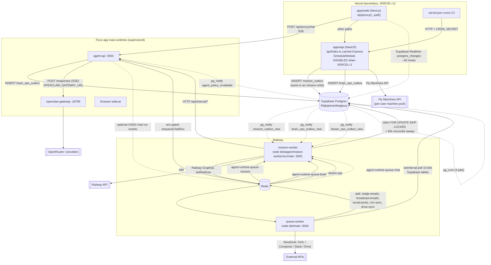

# Background Processes, Queues & Workers

> Reverse-engineered read-only from source at commit-time state. Every claim is
> tagged **CONFIRMED** (read in code), **LIKELY** (strong inference from code +
> config), **UNKNOWN** (needs runtime/dashboard access), or
> **DEAD CODE CANDIDATE**.

---

## Executive Summary

The platform has **three** genuinely long-lived Node processes plus two
serverless/edge surfaces:

1. **`apps/queue-worker`** (Railway) — email sending, social publishing, CRM
   sync, Google Drive sync, Slack→Brain sync. **5 BullMQ queues.**
2. **`apps/mission-worker`** (Railway) — "missions" (the agent task/kanban
   execution engine), Brain Ops, Dream Ops, chat-runtime shadow. **5 BullMQ
   queues** + 3 Postgres outbox dispatchers.
3. **Fly.io app `roas-runtimes`** — a _supervisord_ box running three programs:
   `agent-api` (3003), `openclaw-gateway` (18789), `browser-sidecar`. This is
   where actual LLM/agent execution happens.
4. **`apps/api`** on Vercel — serverless. Its `@nestjs/schedule` timers are
   _deliberately disabled_ on Vercel; Vercel `crons` + `@Cron` duplicate the
   same work depending on host.
5. **`workers/apps-proxy`** — Cloudflare Worker (routing only, no background
   work). CONFIRMED: `workers/apps-proxy/src/index.ts` is a request proxy.

### What silently breaks if a worker is down

| Worker down          | Silently broken                                                                                                                                                                                                                                    |
| -------------------- | -------------------------------------------------------------------------------------------------------------------------------------------------------------------------------------------------------------------------------------------------- |
| `queue-worker`       | Scheduled + broadcast emails never send (rows sit `status='scheduled'`), social posts never publish, CRM sync jobs stay `queued`, Drive/Slack→Brain sync stops. **No user-visible error** — schedulers are the only thing that moves the row.      |
| `mission-worker`     | **Missions never execute.** `mission_outbox` rows accumulate in `pending` forever; the Kanban card just never moves. Brain Ops (pattern analysis, timeline synthesis, cortex formation) and Dream Ops stop. Provider-billing reconciliation stops. |
| Fly `roas-runtimes`  | All chat/agent work 502s. This is a **hard, visible** failure (unlike the queues).                                                                                                                                                                 |
| Redis                | Missions + emails + social stop; **chat still works** (chat streams direct SSE, Redis only used for a lock + optional event replay).                                                                                                               |
| `apps/api` on Vercel | Everything, including auth-scoped reads.                                                                                                                                                                                                           |

### The headline structural problems

- **`agent-runtime-queue-automation` is dead in production.** Its producer is
  explicitly gated `process.env.VERCEL !== '1'`
  (`apps/api/src/modules/spaces/services/space-automation-service-01.base.ts:510`)
  and its only consumer is a `@Processor` that also lives in `apps/api`
  (`space-automation-runtime.processor.ts:26`) — i.e. inside the same Vercel
  serverless function. On Vercel nothing produces and nothing durably consumes.
- **`agent-runtime-queue-brain-import` has two competing consumers with
  different implementations** (one in `apps/api`, one in `mission-worker`).
- **BullMQ `@Processor` workers are registered inside `apps/api`**, which is a
  Vercel serverless function. Workers require a live process; serverless
  functions freeze between invocations.
- **Two queue names are declared and never used at all**
  (`agent-runtime-queue-artifact`, `agent-runtime-queue-subagent`).

---

## Runtime Topology



---

## Worker Processes

| Process          | App                     | Entry point                                                     | Started by                                                                                                                                                | Deployed on                                                  | Concurrency                                                                                         |
| ---------------- | ----------------------- | --------------------------------------------------------------- | --------------------------------------------------------------------------------------------------------------------------------------------------------- | ------------------------------------------------------------ | --------------------------------------------------------------------------------------------------- |
| Queue Worker     | `@vibey/queue-worker`   | `apps/queue-worker/src/main.ts:43`                              | `node --enable-source-maps dist/main` (`apps/queue-worker/railway.json:7`)                                                                                | Railway service `queue-worker`                               | per-queue: single-emails ?, broadcast ?, social 5, crm 2, drive 5 (see inventory)                   |
| Mission Worker   | `@vibey/mission-worker` | `apps/mission-worker/src/main.ts:50`                            | `node --enable-source-maps dist/apps/mission-worker/src/main` (`apps/mission-worker/railway.json:8`); Docker `CMD` at `apps/mission-worker/Dockerfile:62` | Railway service `roas-platform` (per `CLAUDE.md` deploy map) | missions 3 (`AGENT_RUNTIME_MISSION_CONCURRENCY`), brain-ops/dream-ops/chat/brain-import env-tunable |
| agent-api        | `apps/agent-api`        | `dist/apps/agent-api/src/main.js`                               | supervisord `[program:agent-api]` (`docker/supervisord.conf:8`)                                                                                           | Fly `roas-runtimes`                                          | HTTP; `soft_limit = 25` requests (`docker/fly.roas.runtime.toml:24`)                                |
| OpenClaw gateway | `apps/openclaw`         | `/app/dist/gateway-headless.js`                                 | supervisord `[program:openclaw-gateway]` (`docker/supervisord.conf:23`)                                                                                   | Fly `roas-runtimes`, port 18789                              | UNKNOWN (internal to OpenClaw)                                                                      |
| Browser sidecar  | —                       | `/usr/local/bin/vibey-browser-sidecar.sh`                       | supervisord `[program:browser-sidecar]` (`docker/supervisord.conf:38`)                                                                                    | Fly `roas-runtimes`                                          | n/a                                                                                                 |
| platform API     | `apps/api`              | `apps/api/api/index.ts:25` (cached Express, `maxDuration: 300`) | Vercel invocation                                                                                                                                         | Vercel `roas-api` / `api.roas.io`                            | serverless — **hosts 2 BullMQ processors, see risks**                                               |

Both workers also expose **Bull Board** on `/admin/queues`
(`apps/queue-worker/src/main.ts:51`, `apps/mission-worker/src/main.ts:56`).
**LIKELY RISK:** no auth guard is applied to that mount in either `main.ts`.

`min_machines_running = 1`, `auto_stop_machines = "off"`
(`docker/fly.roas.runtime.toml:19-21`) — CONFIRMED the shared runtime is always-on,
not scale-to-zero.

---

## Queue Inventory

Shared constants live in **`packages/api-shared/src/services/agent-runtime-queues.ts:10-26`**
(7 names). The `queue-worker` queues use **local per-module constants** instead —
there is no single repo-wide queue registry.

| Queue name                         | Constant / file                                                                                                                                        | Producer(s)                                                                                                                                                                   | Consumer (processor file)                                                                                                             | Payload shape                                                                                                                                                  | Retry / backoff                                                | Status                                                        |
| ---------------------------------- | ------------------------------------------------------------------------------------------------------------------------------------------------------ | ----------------------------------------------------------------------------------------------------------------------------------------------------------------------------- | ------------------------------------------------------------------------------------------------------------------------------------- | -------------------------------------------------------------------------------------------------------------------------------------------------------------- | -------------------------------------------------------------- | ------------------------------------------------------------- |
| `single-emails`                    | `apps/queue-worker/src/modules/single-emails/types/single-email.types.ts:13`                                                                           | `single-email.scheduler.ts:73` (`setInterval` 15s)                                                                                                                            | `single-emails/processors/single-email.processor.ts:8`                                                                                | `{ scheduleId }`                                                                                                                                               | root default: 3 attempts, exp 60s (`app.module.ts:31-36`)      | OK                                                            |
| `broadcast-emails`                 | `broadcast-emails/types/broadcast-email.types.ts:15`                                                                                                   | `broadcast-email.scheduler.ts:56` (`setInterval` 30s)                                                                                                                         | `broadcast-emails/processors/broadcast-email.processor.ts:12`                                                                         | `{ broadcastScheduleId }`                                                                                                                                      | root default 3 / exp 60s                                       | OK                                                            |
| `social-posts`                     | `social-posts/types/social-post.types.ts:13`                                                                                                           | `social-post.scheduler.ts:67` (`setInterval` 15s)                                                                                                                             | `social-posts/processors/social-post.processor.ts:8` (concurrency 5)                                                                  | `{ scheduleId }`                                                                                                                                               | 4 attempts, exp 2s (per-job)                                   | OK                                                            |
| `crm-sync`                         | `crm-sync/types/crm-sync.types.ts:1`                                                                                                                   | `crm-sync.scheduler.ts:57` (`setInterval` 15s)                                                                                                                                | `crm-sync/processors/crm-sync.processor.ts:8` (concurrency 2)                                                                         | `{ crmSyncJobId }`                                                                                                                                             | root default 3 / exp 60s                                       | OK                                                            |
| `drive-sync`                       | `drive-sync/types/drive-sync.types.ts:1`                                                                                                               | `drive-sync.queue.ts:21` — called by `drive-sync.scheduler.ts:12` (60s) **and** by HTTP `POST /internal/drive-sync/enqueue` (`drive-sync-internal.controller.ts:18`)          | `drive-sync/processors/drive-sync.processor.ts:12` (concurrency 5)                                                                    | `{ mappingId, userId, reason }`                                                                                                                                | 3 attempts, exp 60s                                            | OK                                                            |
| `agent-runtime-queue-mission`      | `AGENT_RUNTIME_MISSION_QUEUE` → aliased `MISSIONS_QUEUE` (`apps/mission-worker/src/modules/missions/types/missions.types.ts:3`)                        | `missions.outbox-dispatcher.service.ts:353` (**only** producer)                                                                                                               | `missions/processors/missions.processor.ts:15` (concurrency 3, lock 6 000 000 ms)                                                     | `MissionJobData { missionId, correlationId, userId, orgId, phase, priorityRank, subtaskId, commentId }` (`missions.types.ts:51`)                               | 3 attempts, exp 2s, `removeOnComplete: true`                   | OK                                                            |
| `agent-runtime-queue-brain`        | `AGENT_RUNTIME_BRAIN_QUEUE` → `BRAIN_OPS_QUEUE` (`brain-ops/types.ts:3`)                                                                               | `brain-ops-outbox-dispatcher.service.ts:321`                                                                                                                                  | `brain-ops/brain-ops.processor.ts:398`                                                                                                | `BrainOpsJobData { outboxId, brainId, userId, orgId, eventType, payload }` (`brain-ops/types.ts:16`)                                                           | root default (3 / exp 2s)                                      | OK                                                            |
| `dream-ops`                        | `DREAM_OPS_QUEUE`/`DREAM_OPS_BULL_QUEUE` (`dream-ops/types.ts:1-2`) — **two aliases for one string**, and the _only_ queue not using a shared constant | `dream-ops-outbox-dispatcher.service.ts:146`                                                                                                                                  | `dream-ops/dream-ops.processor.ts:16`                                                                                                 | `DreamOpsJobData`                                                                                                                                              | root default                                                   | OK (naming smell)                                             |
| `agent-runtime-queue-chat`         | `AGENT_RUNTIME_CHAT_QUEUE` (`api-shared:20`)                                                                                                           | `apps/agent-api/.../agent-runtime-queue.service.ts:92` (`shadow-chat-run`, gated `AGENT_RUNTIME_QUEUE_SHADOW`) and `:122` (`chat-run`, gated `AGENT_RUNTIME_QUEUE_EXECUTION`) | `mission-worker/.../agent-runtime-chat-shadow.processor.ts:33`                                                                        | `AgentRuntimeChatJobData` / `AgentRuntimeShadowJobData` (`agent-runtime-queue.service.ts:20,47`) — **includes `accessToken` + `refreshToken` in the job body** | shadow: 3 / exp 60s; real: `attempts: 1`, `backoff: undefined` | **Both producers default-OFF.** Dormant unless env flags set. |
| `agent-runtime-queue-brain-import` | `AGENT_RUNTIME_BRAIN_IMPORT_QUEUE` (`api-shared:22`)                                                                                                   | `apps/api/.../brain-import-jobs-runtime.base.ts:169,179,203`                                                                                                                  | 🔴 **TWO:** `apps/api/.../brain-import-runtime.processor.ts:14` _and_ `mission-worker/.../agent-runtime-brain-import.processor.ts:64` | `{ jobId }`; job names `brain-import-job`, `brain-import-sweep`, `page-grader-brain-sync-sweep`                                                                | `attempts: 1`, `removeOnComplete/Fail: true`                   | 🔴 **COMPETING CONSUMERS**                                    |
| `agent-runtime-queue-automation`   | `AGENT_RUNTIME_AUTOMATION_QUEUE` (`api-shared:25`)                                                                                                     | `apps/api/.../space-automation-service-01.base.ts:528`, `slack-offer-fulfillment.service.ts:36`                                                                               | `apps/api/.../space-automation-runtime.processor.ts:26` (concurrency 5) — **only**                                                    | `{ mode: 'item'\|'itemless'\|'offer_fulfillment', automationId, event, userId, orgId, spaceId, itemId, depth, afterComplete, offerId }`                        | `attempts: 1`                                                  | 🔴 **DEAD IN PRODUCTION**                                     |
| `agent-runtime-queue-artifact`     | `AGENT_RUNTIME_ARTIFACT_QUEUE` (`api-shared:24`)                                                                                                       | **none**                                                                                                                                                                      | **none**                                                                                                                              | —                                                                                                                                                              | —                                                              | 🔴 **ORPHAN / DEAD CODE CANDIDATE**                           |
| `agent-runtime-queue-subagent`     | `AGENT_RUNTIME_SUB_AGENT_QUEUE` (`api-shared:26`)                                                                                                      | **none**                                                                                                                                                                      | **none**                                                                                                                              | —                                                                                                                                                              | —                                                              | 🔴 **ORPHAN / DEAD CODE CANDIDATE**                           |

**Total: 13 declared queue names, 11 with any wiring, 9 healthy.**

### 🔴 FLAGGED: orphans and mis-wirings

**1. `agent-runtime-queue-automation` — producer disabled on the only host that
runs the consumer.** CONFIRMED:

```510:514:apps/api/src/modules/spaces/services/space-automation-service-01.base.ts
  protected shouldUseAutomationQueue(): boolean {
    return (
      !!this.automationQueue &&
      process.env.AGENT_RUNTIME_AUTOMATION_QUEUE_ENABLED === '1' &&
      process.env.VERCEL !== '1' &&
```

On Vercel (`VERCEL=1`) `enqueueAutomationRuntimeJob` returns `false` and the
caller falls back to inline execution. So the queue is never fed. Meanwhile the
consumer `SpaceAutomationRuntimeProcessor` is registered in
`apps/api/src/modules/spaces/spaces.module.ts:253` — inside the _same_ Vercel
function. `mission-worker` registers the automation queue only for **Bull Board
display** (`apps/mission-worker/src/modules/admin/admin.module.ts:26`), _not_ a
processor. **Net effect: if the env flag is ever flipped on a persistent host,
jobs land in a queue that nothing on Railway consumes.**

**2. `agent-runtime-queue-brain-import` — two consumers, different semantics.**
Both register `@Processor` with concurrency 3 on the same queue, so BullMQ will
hand each job to whichever worker grabs it first:

- `apps/api` version calls `brainImportJobs.processRuntimeJob(jobId)` **in
  process** (`brain-import-runtime.processor.ts:37`).
- `mission-worker` version instead **HTTP POSTs** to
  `/api/internal/brain/import-jobs/{id}/execute` on agent-api
  (`agent-runtime-brain-import.processor.ts:~101`), and handles an extra job
  name `page-grader-brain-sync-sweep` that the `apps/api` version does not
  (`brain-import-runtime.processor.ts:27` only knows `brain-import-sweep`).

So a `page-grader-brain-sync-sweep` job picked up by the `apps/api` worker falls
through to `jobId` extraction, finds none, and is silently dropped with a warn.
**Non-deterministic behaviour depending on which worker wins the race.**

**3. Producer/consumer can land on different Redis instances.** The env
resolution chains differ per surface — CONFIRMED:

- agent-runtime queues (api, agent-api, mission-worker's agent-runtime module):
  `REDIS_URL_AGENT_QUEUE → REDIS_URL_AGENT_STREAM → REDIS_URL_MISSIONS → REDIS_URL`
  (`packages/api-shared/src/services/agent-runtime-queues.ts:28-33`).
- mission-worker **root** BullModule (missions, brain-ops, dream-ops):
  `REDIS_URL_MISSIONS → REDIS_URL` (`apps/mission-worker/src/config/configuration.ts:5`).
- queue-worker: `REDIS_URL_EMAIL → REDIS_URL` (`apps/queue-worker/src/config/configuration.ts:5`).

If `REDIS_URL_AGENT_QUEUE` is set on one app and not another, the producer and
consumer silently use **different Redis servers** and jobs vanish. There is no
startup assertion that a queue's producer and consumer agree.

---

## Scheduled Jobs

### Vercel Crons

From `apps/api/vercel.json:34-63` (7 entries). Every handler requires
`Authorization: Bearer ${CRON_SECRET}`.

| Schedule                  | Path                                                     | Handler file                                                                                                    | What it does                                                                                                                                                                                 | Idempotent?                                                              |
| ------------------------- | -------------------------------------------------------- | --------------------------------------------------------------------------------------------------------------- | -------------------------------------------------------------------------------------------------------------------------------------------------------------------------------------------- | ------------------------------------------------------------------------ |
| `*/5 * * * *`             | `/api/machines/idle-check`                               | `apps/api/src/modules/machines/controllers/machines.controller.ts:89` (POST) / `:94` (GET); secret check `:120` | `MachineReconciliationService.reconcileRuntimeState()` + `IdleManagerService.checkIdleMachines()` → suspends Fly machines idle > `MACHINE_IDLE_THRESHOLD_MS` (default 15 min)                | **Yes** — selects by `last_active` cutoff (`idle-manager.service.ts:33`) |
| `*/10 * * * *`            | `/api/machines/pool-replenish`                           | `machines.controller.ts:99/104`                                                                                 | `MachinePoolService.replenishPool()` → creates warm Fly machines up to `MACHINE_POOL_SIZE` (default 5); no-op unless `MACHINE_POOL_REPLENISH_ENABLED=true` (`machine-pool.service.ts:29,54`) | **Yes** — computes `target - current` (`machine-pool.service.ts:70`)     |
| `0 2 * * *`               | `/api/admin/billing-health/reconcile`                    | `apps/api/src/modules/admin` (`AdminService.runBillingReconciliation`)                                          | Stripe ↔ local billing reconciliation                                                                                                                                                        | LIKELY yes (reconciler)                                                  |
| `1-4,6-9,…,56-59 * * * *` | `/cron/space-automations` → `/api/space-automation-cron` | `apps/api/api/space-automation-cron.ts:9` → fetches `/api/internal/space-automations/process-due`               | Fires due space-automation schedules. **48 of 60 minutes** — the odd mask deliberately avoids minutes 0,5,10,… i.e. the slots the `*/5` crons use                                            | LIKELY — depends on `process-due` claiming                               |
| `*/5 * * * *`             | `/cron/billing-credit-alerts`                            | `apps/api/api/billing-credit-alert-cron.ts`                                                                     | Credit-threshold alert emails                                                                                                                                                                | UNKNOWN                                                                  |
| `*/5 * * * *`             | `/cron/work-requests`                                    | `apps/api/api/work-request-cron.ts`                                                                             | Work-request processing                                                                                                                                                                      | UNKNOWN                                                                  |
| `0 * * * *`               | `/cron/meeting-action-reconciliation`                    | `apps/api/api/meeting-action-reconciliation-cron.ts`                                                            | Meeting → action-item reconciliation                                                                                                                                                         | UNKNOWN                                                                  |

### In-Process Schedulers (`@Cron` / `setInterval`)

**`@nestjs/schedule` is host-gated in `apps/api`** — CONFIRMED:

```1:5:apps/api/src/cron-runtime-policy.ts
export function shouldEnableInProcessScheduling(
  vercel: string | undefined = process.env.VERCEL,
): boolean {
  return vercel !== '1'
}
```

Applied at `apps/api/src/app.module.ts:85`. **Therefore every `@Cron` in
`apps/api/src/cron.service.ts` never fires in production.** Those that matter are
mirrored as Vercel crons; those that are **not** mirrored are silently lost in
production:

| `@Cron` in `apps/api/src/cron.service.ts` | Schedule      | Mirrored by a Vercel cron?                                                                                                 |
| ----------------------------------------- | ------------- | -------------------------------------------------------------------------------------------------------------------------- |
| `idleCheck` `:33`                         | every 5 min   | ✅ `/api/machines/idle-check`                                                                                              |
| `replenishMachinePool` `:43`              | every 10 min  | ✅ `/api/machines/pool-replenish`                                                                                          |
| `repairStaleAgentSetups` `:57`            | every 10 min  | 🔴 **NO**                                                                                                                  |
| `billingReconcile` `:71`                  | `0 2 * * *`   | ✅ `/api/admin/billing-health/reconcile`                                                                                   |
| `browserSessionExpiryCheck` `:81`         | `0 */6 * * *` | 🔴 **NO**                                                                                                                  |
| `materializeRecurringSpaceItems` `:93`    | every minute  | 🔴 **NO** — recurring space items would never materialise                                                                  |
| `reconcileSpaceAutomations` `:105`        | every 30s     | 🔴 **NO**                                                                                                                  |
| `processDueSpaceSchedules` `:114`         | every minute  | ✅ via `/cron/space-automations` (and itself double-gated by `SPACE_AUTOMATION_IN_PROCESS_CRON_ENABLED !== '1'` at `:116`) |
| `purgePendingAgentBrains` `:127`          | `0 3 * * *`   | 🔴 **NO**                                                                                                                  |
| `syncOpenRouterModelCapabilities` `:136`  | `15 3 * * *`  | 🔴 **NO**                                                                                                                  |

**This is the single largest scheduled-work gap in the repo.** See Risks.

`apps/agent-api` runs `ScheduleModule.forRoot()` **unconditionally**
(`apps/agent-api/src/app.module.ts:40`) because it lives on Fly (persistent) —
correct. Only one `@Cron` there:
`artifact-media-jobs-sweeper.service.ts:50` — `EVERY_5_MINUTES`.
`apps/api/src/modules/mcp/services/mcp-oauth-cleanup.service.ts:9` —
`EVERY_DAY_AT_3AM`, and is therefore also dead on Vercel.

**`setInterval`-based schedulers (the real backbone):**

| Interval                                              | Service                                         | File                                                            |
| ----------------------------------------------------- | ----------------------------------------------- | --------------------------------------------------------------- |
| 15s                                                   | Single email schedule sweep                     | `queue-worker/.../single-email.scheduler.ts:21`                 |
| 15s                                                   | Social post schedule sweep                      | `queue-worker/.../social-post.scheduler.ts:20`                  |
| 15s                                                   | CRM sync job sweep                              | `queue-worker/.../crm-sync.scheduler.ts:20`                     |
| 30s                                                   | Broadcast email schedule sweep                  | `queue-worker/.../broadcast-email.scheduler.ts:20`              |
| 60s                                                   | Drive sync enqueue + push-channel renewal       | `queue-worker/.../drive-sync.scheduler.ts:12`                   |
| 60s                                                   | Slack→Brain mapping enqueue                     | `queue-worker/.../slack-sync.scheduler.ts:12`                   |
| 60s (`missions.outboxReconcileMs`)                    | Mission outbox reconcile sweep                  | `mission-worker/.../missions.outbox-dispatcher.service.ts:195`  |
| 60s                                                   | Brain-ops outbox reconcile                      | `mission-worker/.../brain-ops-outbox-dispatcher.service.ts:165` |
| 60s                                                   | Dream-ops outbox reconcile                      | `mission-worker/.../dream-ops-outbox-dispatcher.service.ts:122` |
| `MISSIONS_WATCHDOG_MS` (default **900 000** = 15 min) | Mission phase poll                              | `mission-worker/.../missions.scheduler.ts:36`                   |
| `getMissionRecoveryPollMs()`                          | Mission lease recovery sweep                    | `missions.scheduler.ts:33`                                      |
| 30s (`DEFAULT_POLL_MS`)                               | Agent-runtime autoscaler                        | `mission-worker/.../agent-runtime-autoscaler.service.ts:57`     |
| —                                                     | Brain-ops night janitor                         | `brain-ops-night-janitor.service.ts:33`                         |
| —                                                     | Dream-ops night janitor                         | `dream-ops-night-janitor.service.ts:33`                         |
| —                                                     | Customer signal sweeper                         | `customer-signal-sweeper.service.ts:92`                         |
| —                                                     | Provider billing reconciler                     | `provider-billing-reconciler.service.ts:15`                     |
| 10s                                                   | agent-api health probe (from `apps/api`)        | `apps/api/.../brain-import-jobs.base.ts:54`                     |
| `pollIntervalMs`                                      | Skill-recommendation job poller (in `apps/api`) | `apps/api/.../skill-recommendation-jobs.service.ts:36`          |

🔴 The last two run **inside the Vercel function** and so only tick for the
lifetime of a warm invocation. `skill-recommendation-jobs.service.ts:36` is a
`setInterval` poller on serverless — **DEAD CODE CANDIDATE in production**.

No `while (true)` loops found outside a bounded SSE reader
(`apps/agent-api/.../chat-stream-http.service.ts:185`, `while (clientAlive)`).

### BullMQ Repeatable Jobs

Only **two**, both produced from `apps/api`:

```167:175:apps/api/src/modules/brain/services/brain-import-jobs-runtime.base.ts
  private async installRuntimeSweep(): Promise<void> {
    if (!this.brainImportQueue) return
    await this.brainImportQueue.add(
      'brain-import-sweep',
      {},
      {
        jobId: 'brain-import-sweep',
        repeat: { every: this.pollIntervalMs },
```

- `brain-import-sweep` — `repeat.every = pollIntervalMs` = **3000 ms**
  (`brain-import-jobs.base.ts:34`). A repeatable job every 3 seconds.
- `page-grader-brain-sync-sweep` — `repeat.every = 60 * 60 * 1000` (1 h)
  (`brain-import-jobs-runtime.base.ts:184`).

Installed from `onModuleInit` unless `DISABLE_BRAIN_IMPORT_POLLER === '1'`
(`brain-import-jobs-runtime.base.ts:21`). **LIKELY RISK:** BullMQ repeat
schedulers are registered by whichever process boots — here a Vercel cold start —
and then persist in Redis. A 3-second repeat is aggressive and outlives the
function that created it.

### Database-Level Scheduling (pg_cron)

CONFIRMED — 4 `cron.schedule` registrations in `supabase/migrations`:

| Migration                                                                                                                | Job                                                                                                              |
| ------------------------------------------------------------------------------------------------------------------------ | ---------------------------------------------------------------------------------------------------------------- |
| `20260304154000_campaign_soft_delete_retention_pg_cron.sql:68` + `20260304155000_enable_pg_cron_campaign_cleanup.sql:16` | `campaign-retention-cleanup`, `0 3 * * *` → `SELECT public.cleanup_soft_deleted_campaigns();` (30-day retention) |
| `20260319123000_media_presign_and_cleanup.sql:76`                                                                        | media presign/cleanup retention job                                                                              |
| `20260506101600_reconcile_stale_agent_traces.sql:50`                                                                     | reconcile stale agent traces                                                                                     |

All wrapped in `DO $$ … IF to_regnamespace('cron') IS NULL THEN RAISE NOTICE …`
so they **degrade to a no-op** if `pg_cron` is unavailable — the migration
succeeds and the schedule silently does not exist. **UNKNOWN** whether these are
actually registered on `lhfgtsjetcardinpgouq` (needs `SELECT * FROM cron.job`).

---

## Outbox / Event Dispatch

Three outbox tables, all following the same pattern.

### Tables

| Table              | Migration                                                 | Keyed on                            | Retry ceiling                |
| ------------------ | --------------------------------------------------------- | ----------------------------------- | ---------------------------- |
| `mission_outbox`   | `supabase/migrations/20260228210000_mission_outbox.sql:1` | `mission_id`, `UNIQUE (dedupe_key)` | `max_attempts` default **8** |
| `brain_ops_outbox` | `20260407100000_brain_ops_outbox.sql:7`                   | `brain_id`, `dedupe_key UNIQUE`     | `max_attempts` default **3** |
| `dream_ops_outbox` | `20260624203000_shared_dream_ops.sql`                     | subject/org                         | see migration                |

`mission_outbox` columns: `status IN ('pending','processing','processed','dead_letter')`,
`attempts`, `max_attempts`, `next_attempt_at`, `locked_at`, `error`
(`20260228210000_mission_outbox.sql:8-14`). Later migrations add `org_id` and
`priority_rank` (`20260327110000_mission_outbox_priority_rank.sql`).

### Writer

CONFIRMED: mission events are inserted **in the same native Postgres
transaction** as the mission state change — this is a real outbox, not a
best-effort side write:

- `apps/api/src/modules/missions/services/mission-lifecycle-native-tx.service.ts:99, 313, 433` — raw `INSERT INTO mission_outbox (…)`
- `apps/api/src/modules/missions/services/mission-internal-plan.base.ts:292, 342, 389`

`brain_ops_outbox` writers are `.insert()` calls via Supabase client (**not**
transactional with the domain write) from ~12 sites, e.g.
`apps/api/.../brain-ops-hook.repository.ts:27`,
`apps/agent-api/.../brain-ingestion.repository.ts:205`,
`mission-worker/.../brain-ops.processor.ts:3528`.

### Notify triggers

```4:12:supabase/migrations/20260301091500_mission_outbox_notify_wakeup.sql
CREATE OR REPLACE FUNCTION public.notify_mission_outbox_new()
RETURNS trigger AS $$
BEGIN
  IF NEW.status = 'pending' THEN
    PERFORM pg_notify('mission_outbox_new', NEW.id::text);
  END IF;
  RETURN NEW;
END;
```

Fires `AFTER INSERT` **and** `AFTER UPDATE OF status` back to `pending`
(`:20-25`). Same pattern for `brain_ops_outbox_new`
(`20260407100000_brain_ops_outbox.sql:32`) and `dream_ops_outbox_new`
(`20260624203000_shared_dream_ops.sql:131`).

### Dispatcher

`apps/mission-worker/src/modules/missions/services/missions.outbox-dispatcher.service.ts`:

- `onModuleInit` (`:35`) → `setupOutboxNotifyListener()` + `startReconcileSweep()` + an immediate `dispatchDueEvents()`.
- **LISTEN** requires a direct PG pool: `if (!this.databaseService.hasPgPool())` → warns `'Outbox LISTEN/NOTIFY disabled: SUPABASE_DIRECT_DB_URL is not configured'` (`:147`) and falls back to the 60 s sweep only.
- Claim is a proper atomic claim (`claimPendingRows`, SQL at `:219-241`, `FOR UPDATE SKIP LOCKED` at `:228`):
  `WITH candidates AS (SELECT id … WHERE status='pending' AND next_attempt_at <= NOW() ORDER BY priority_rank, created_at LIMIT $1 FOR UPDATE SKIP LOCKED) UPDATE mission_outbox SET status='processing', locked_at=NOW(), attempts=attempts+1 …`
- **Supabase fallback claim** (`claimPendingRowsViaSupabase`, `:244-290`) replaces
  `FOR UPDATE SKIP LOCKED` with a per-row `.update().eq('status','pending')`
  compare-and-set — weaker but still single-winner.
- Circuit breaker: `missions.outboxCircuitBreakerFailures` (default 5) opens for
  `missions.outboxCircuitBreakerMs` (default 30 000) (`:94-105`).
- Dedupe at the BullMQ layer: deterministic `jobId` from
  `mapOutboxEventToJob(row)`; existing `active` jobs are left alone unless older
  than `missions.stalledMinutes` (default 10) (`:320-336`).

### Verifiable delivery guarantees

| Guarantee                   | Verdict                                                                                                                                                                                                             |
| --------------------------- | ------------------------------------------------------------------------------------------------------------------------------------------------------------------------------------------------------------------- |
| Mission event durability    | ✅ **Yes** for missions — same-transaction insert, so a crash between "mission updated" and "job enqueued" is recoverable.                                                                                          |
| Brain-ops event durability  | ⚠️ **No** — `brain_ops_outbox` rows are separate `.insert()` calls, so the domain write can commit without the outbox row.                                                                                          |
| At-least-once               | ✅ Row stays `processing`/`pending` until `markProcessed`.                                                                                                                                                          |
| Exactly-once                | ❌ Not claimed. `attempts` is incremented at claim time, so a crash _after_ claim but _before_ `markProcessed` burns an attempt and the job may run twice (BullMQ `jobId` dedupe mitigates but does not eliminate). |
| Ordering                    | ⚠️ Only `ORDER BY priority_rank, created_at` at claim; concurrent workers process out of order.                                                                                                                     |
| Dead letter                 | ⚠️ `mission_outbox.status` has a `'dead_letter'` value and `max_attempts` 8 — but **there is no consumer, alert, or replay path for `dead_letter` rows** found anywhere in the repo.                                |
| Stale `processing` recovery | ⚠️ Present but degraded without direct PG — `main.ts:65` warns: _"stale `processing` outbox reset uses Supabase only"_.                                                                                             |

**Failure modes:** if `SUPABASE_DIRECT_DB_URL` is unset the worker loses
LISTEN/NOTIFY, advisory locks become **no-ops**, and mission latency degrades
from ~instant to ≤60 s. This is logged loudly at boot
(`apps/mission-worker/src/main.ts:61-67`) — CONFIRMED, a genuinely good bit of
operational hygiene.

---

## Event Listeners & Realtime Subscriptions

**NestJS `@OnEvent` / EventEmitter2:** none found. `rg '@OnEvent'` returns
nothing across `apps/`. Cross-service eventing is done entirely via
outbox + `pg_notify` + BullMQ.

**Postgres LISTEN/NOTIFY channels (4):**

| Channel                   | Listener       | File                                                                                                                             |
| ------------------------- | -------------- | -------------------------------------------------------------------------------------------------------------------------------- |
| `mission_outbox_new`      | mission-worker | `missions.outbox-dispatcher.service.ts:153`                                                                                      |
| `brain_ops_outbox_new`    | mission-worker | `brain-ops-outbox-dispatcher.service.ts:137`                                                                                     |
| `dream_ops_outbox_new`    | mission-worker | `dream-ops-outbox-dispatcher.service.ts:92`                                                                                      |
| `agent_policy_invalidate` | **agent-api**  | `apps/agent-api/.../agent-policy-invalidation-listener.service.ts:24` (skips with warn if `SUPABASE_DIRECT_DB_URL` unset, `:15`) |

A fifth notify exists in `20260423200100_space_automation_notify.sql:31`
(space automations). **DEAD CODE CANDIDATE:** no `LISTEN` for it was found —
`apps/api/.../space-automation-reconciler.service.ts:11-13` comments that it
"also emits pg_notify" but that Vercel "cannot hold a persistent LISTEN
connection", so the notify is emitted and **nobody is listening**.

**Supabase Realtime (`postgres_changes`):** ~**43 frontend hooks / 130+
subscriptions** in `apps/web/src`. Heaviest: `useMissionDetailData.ts` (7),
`use-space-artifact-preview-realtime.ts` (6), `useArtifactsRealtime.ts` (6),
`StudioContainer.tsx` (6), `use-mission-dashboard-store.ts` (5),
`use-brain-health-realtime.ts` (5), `use-team-overview.ts` (5). This is how the
UI learns that background work finished — **there is no polling fallback in most
of them**, so a Realtime outage looks like "the worker is broken".

**Backend Realtime broadcast (1):**
`apps/mission-worker/.../mission-exec-broadcast.service.ts:17` —
`supabase.channel('mission-exec:${subtaskId}')`, consumed by
`apps/web/.../useMissionExecStream.ts`.

**WebSocket gateway (1):** `apps/agent-api/.../brain-live.gateway.ts:36` —
`@WebSocketGateway({ path: '/api/brain/live-ws' })`, with two `setInterval`
keepalives (`:771`, `:816`).

---

## Agent Run Lifecycle

**It is SSE, end to end, over a single held-open HTTP request. Not websockets,
not polling, and — by default — not a queue.**

Hop by hop:

1. **Browser** → `POST /api/proxy/chat` on the Next.js app.
2. **`apps/web/src/app/api/proxy/[...path]/route.ts`** — `AGENT_PATHS = ['chat', 'apps', 'project-files']` (`:34`) routes to the agent backend rather than the platform API. For `chat` it may first **wake the user's Fly machine** (`:910-935`, `shouldWarmChatBeforeProxying = backendPath === '/api/chat' && method === 'POST'`, `:935`; runtime requirement classified `'chat'` vs `'work'` at `:495`). Target resolution falls back to `AGENT_BACKEND_URL` (`:26`, default `http://localhost:3003`) when there is no machine pin (`:299-368`). Sets `Accept: text/event-stream` (`:913`) and re-streams the body (`:1096`).
3. **`apps/agent-api`** `POST /api/chat` → `ChatStreamHttpService.sendMessage` (`apps/agent-api/src/modules/chat/services/chat-stream-http.service.ts:82`):
   - verifies conversation access (`:114`);
   - **single-flight lock**: `chatRunEvents.tryAcquireConversationLock` (Redis) _or_ in-memory `streamRegistry.isActive` → `409 "A generation is already in progress"` (`:127-137`). Note `.catch(() => true)` at `:129` — **if Redis is down the lock is assumed acquired**, so the guard degrades to the in-process registry only;
   - writes SSE headers `text/event-stream`, `Cache-Control: no-cache, no-transform`, `X-Accel-Buffering: no` and `flushHeaders()` (`:140-145`);
   - installs a **25 s comment heartbeat** `': heartbeat\n\n'` (`:155-162`);
   - registers an `AbortController` in `StreamRegistryService` so `POST /api/chat/stop` can cancel.
4. **`ChatService`** assembles context (prewarm cache, brain retrieval, model routing — `[ModelRouter]` log at `chat.service.ts:430`) and resolves the gateway agent id via `AgentRuntimeService.resolveGatewayAgentId` (`apps/agent-api/src/modules/shared/services/agent-runtime.service.ts:22`): `org-<orgId>-<key>`, or in shared mode `user-<userId>-<key>` (`:26`).
5. **`OpenClawGatewayRequestService.openGatewayStream`** (`apps/agent-api/.../openclaw-gateway-request.service.ts:103`) → `gatewayClient.postResponses({ gatewayUrl, headers, payload, signal })` where `gatewayUrl = process.env.OPENCLAW_GATEWAY_URL ?? 'http://localhost:18789'` (`:96`). On Fly this is `http://127.0.0.1:18789` (`docker/fly.roas.runtime.toml:7`) — **same machine, loopback**. Auth via `OPENCLAW_GATEWAY_TOKEN`. Wrapped in `AbortSignal.any([options.signal, timeoutController.signal])` (`:113`).
6. **OpenClaw gateway** (`/app/dist/gateway-headless.js`, supervisord `:23`) runs the agent loop — tools, MCP, browser via the sidecar — and streams an OpenAI-Responses-style SSE back.
7. **`OpenClawStreamReaderService`** (`apps/agent-api/.../openclaw-stream-reader.service.ts:38`) parses that stream into content/tool/lifecycle events. Stall watchdog: warn at **20 s**, abort at **120 s**, abort-if-still-empty at **300 s**, tick **5 s** (`:39-42`), driven by a `setInterval` at `:140`.
8. Each parsed event is re-emitted to the browser as `data: {"type":…}\n\n` via `writeSse` (`chat-stream-http.service.ts:172-180`).
9. **Optional Redis replay path.** If `CHAT_STREAM_REDIS_READER` ∈ {1,true,on,yes} (`:11`, `:165`) the service instead reads from a Redis stream via `chatRunEvents.readAfter(runId, cursor, 25_000)` in a `while (clientAlive)` loop (`:182-200`). This enables reconnect/resume: `GET /api/chat/runs/:runId/stream` exists (route inventory snapshot) and `chat-status.controller.ts:131` is a second SSE endpoint with its own heartbeat (`:154`).
10. Browser consumes SSE; separately, ~43 Supabase Realtime hooks pick up the persisted artifacts/messages.

**Where does BullMQ fit?** Only as a **shadow/experimental** path.
`AgentRuntimeQueueService.enqueueChatShadowRun` requires
`AGENT_RUNTIME_QUEUE_SHADOW` and `enqueueChatRun` requires
`AGENT_RUNTIME_QUEUE_EXECUTION` (`agent-runtime-queue.service.ts:215-225`); both
default **off**. The mission-worker consumer literally returns early for shadow
jobs after recording claim latency (`agent-runtime-chat-shadow.processor.ts:51-61`)
— i.e. it is a **latency measurement harness**, being used to prove out queue-based
execution before switching over. LIKELY: this is an in-progress migration from
"synchronous SSE" to "queued execution + Redis stream replay".

**Missions are the async agent path.** A mission is a durable agent work item
(`MissionJobData { missionId, correlationId, userId, orgId, phase, subtaskId }`,
phases `plan | execute | review | triage | directive`,
`apps/mission-worker/.../missions.types.ts:5,51`) with 13 statuses including
`awaiting_human` and `pending_approval` (`:7-21`). Execution strategy is a
**playbook registry** (`mission-playbook.registry.ts` + 10 playbooks such as
`meta-ads-launch`, `webinar-fulfillment`, `ig-organic-video-ad`,
`static-ad-production`, `client-strategy`). Missions get to the worker only via
`mission_outbox` → `pg_notify` → BullMQ, and the worker calls back to
`${BACKEND_URL}/api/internal/missions/callback`
(`apps/mission-worker/src/config/configuration.ts:123`).

---

## Fly.io Machine Orchestration

There are **two distinct Fly concepts**, and conflating them is easy:

**(A) The shared always-on runtime — where agent runs actually execute.**
Fly app `roas-runtimes`, `docker/fly.roas.runtime.toml`. Key facts CONFIRMED:
`AGENT_RUNTIME_MODE = "shared"` (`:6`), `auto_stop_machines = "off"`,
`auto_start_machines = true`, `min_machines_running = 1` (`:19-21`),
`internal_port = 3003`, health check `GET /api/health/deep` every 30 s with a
180 s grace (`:26-31`), `shared-cpu-2x` / 4096 MB (`:33-35`). Deployed **only**
via `bash scripts/roas/deploy-fly-runtimes.sh` per `CLAUDE.md`.
In shared mode agent identity is namespaced _logically_ (`user-<uuid>-<key>`,
`agent-runtime.service.ts:26`), **not** by giving each user a machine.

**(B) The per-user machine pool — a separate, parallel mechanism.**
`apps/api/src/modules/machines/` (32 files), orchestrated entirely from
`apps/api` via the Fly Machines API:

- `MachinePoolService` — `MACHINE_POOL_REPLENISH_ENABLED` (default **false**, `machine-pool.service.ts:29`), `MACHINE_POOL_SIZE` default 5 (`:30`); `createPoolMachine()` tags machines `VIBEY_POOL_MACHINE: 'true'` (`:162`); `claimFromPool(userId)` (`:235`), `startClaimedMachine` (`:248`), `stopPoolMachine` (`:260`), `destroyFailedPoolMachine` (`:276`), `releaseClaim` (`:308`), `recoverFailedPoolMachines` (`:90`).
- `IdleManagerService` — suspends machines idle > `MACHINE_IDLE_THRESHOLD_MS` (15 min default), destroys machines stale > `MACHINE_STALE_THRESHOLD_DAYS` (30), tracks cost at `FLY_MACHINE_HOURLY_RATE` default `0.0226` (`idle-manager.service.ts:11-19`).
- `MachineReconciliationService.reconcileRuntimeState()` — distinguishes shared machines by env (`return machine.env.AGENT_RUNTIME_MODE === 'shared'`, `machine-reconciliation.service.ts:381`), i.e. it knows to leave shared runtime machines alone. Plus `MachineWakeAttemptsService`, `MachineRuntimeCapabilitiesService`, `FlyMachineStateService`, `MachineProvisionAccessService`.
- Lifecycle is driven by the **Vercel crons** `/api/machines/idle-check` (5 min) and `/api/machines/pool-replenish` (10 min), plus on-demand wake from the web proxy (`route.ts:910-935`).

**Answer to "are agent runs executed on dynamically provisioned Fly machines?"**
LIKELY **no, not in the current production config**: `AGENT_RUNTIME_MODE="shared"`
plus `MACHINE_POOL_REPLENISH_ENABLED` defaulting to `false` means runs land on
the shared always-on `roas-runtimes` machine. The pool is retained for
per-user/dedicated runtimes and the web proxy still contains machine-pinning +
wake logic. **UNKNOWN** without the Fly/Vercel dashboards: whether
`MACHINE_POOL_REPLENISH_ENABLED=true` is set in production.

**A third autoscaler exists, and it is Railway, not Fly.**
`apps/mission-worker/.../agent-runtime-autoscaler.service.ts` polls
`agent-runtime-queue-chat` pressure every 30 s and calls the **Railway GraphQL
API** to `setReplicas` between `DEFAULT_MIN_REPLICAS = 2` and
`DEFAULT_MAX_REPLICAS = 4` (`:32-33`), coordinated by a Redis lock
`agent-runtime:autoscaler:railway-vibeyv2:lock` (`:23`). Since the chat queue's
producers are off by default, this autoscaler **currently observes an always-empty
queue** — DEAD CODE CANDIDATE until the queued-chat migration lands.

---

## Failure Modes & Operational Risks

### 🔴 CRITICAL

1. **BullMQ workers registered inside a Vercel serverless function.**
   `SpaceAutomationRuntimeProcessor` (`apps/api/.../spaces.module.ts:253`) and
   `BrainImportRuntimeProcessor` (`apps/api/.../brain.module.ts:155`) extend
   `WorkerHost` with `lockDuration: 5_000_000` and `stalledInterval: 120_000`.
   A worker that holds a 5000-second lock inside a process that freezes between
   invocations will claim jobs and then stop heartbeating. Nothing gates these on
   `VERCEL` the way `ScheduleModule` is gated. Expect stalled-job churn and
   duplicate execution after `stalledInterval`.

2. **Seven `@Cron` jobs never run in production and have no Vercel-cron mirror.**
   `shouldEnableInProcessScheduling()` returns `false` when `VERCEL=1`
   (`apps/api/src/cron-runtime-policy.ts:4`). Unmirrored: recurring space item
   materialisation (every minute), space-automation mission-completion
   reconciliation (every 30 s), stale agent-setup repair, browser-session expiry
   notices, pending-agent-brain purge (a **14-day grace-window deletion** that
   therefore never happens), OpenRouter model capability sync, and MCP OAuth
   cleanup. Each is a feature that looks implemented and is inert.

3. **`agent-runtime-queue-automation`: producer gated off on the host that owns
   the consumer.** Detailed above. Either the queue path is unreachable, or if the
   flag is flipped on a persistent host, jobs pile up unconsumed on Railway
   because `mission-worker` registers this queue for Bull Board only
   (`apps/mission-worker/src/modules/admin/admin.module.ts:26`).

4. **Competing consumers on `agent-runtime-queue-brain-import` with divergent
   behaviour**, including one job name (`page-grader-brain-sync-sweep`) that only
   one of the two consumers understands. Non-deterministic silent drops.

5. **No dead-letter processing anywhere.** `mission_outbox.status` permits
   `'dead_letter'` and `max_attempts` is 8, but no code reads `dead_letter`
   rows and no alert exists. Same for BullMQ: `removeOnFail` retains failed jobs
   (1 000–5 000, or 7 days) purely for Bull Board inspection. Failure after
   exhaustion is **invisible**.

### 🟠 HIGH

6. **Redis mismatch is silent.** Three different env-resolution chains
   (`REDIS_URL_AGENT_QUEUE…`, `REDIS_URL_MISSIONS`, `REDIS_URL_EMAIL`) with no
   startup validation that a queue's producer and consumer resolved to the same
   server. Jobs simply disappear.

7. **Bull Board mounted without visible auth** at `/admin/queues` on both
   workers (`apps/queue-worker/src/main.ts:51`,
   `apps/mission-worker/src/main.ts:56`). Bull Board allows job inspection,
   retry, and **deletion**. Job payloads include tokens (see #8). **UNKNOWN**
   whether Railway networking exposes these ports publicly — verify.

8. **Credentials in job payloads.** `AgentRuntimeChatRunInput` carries
   `accessToken` and `refreshToken`
   (`apps/agent-api/.../agent-runtime-queue.service.ts:33-34`). BullMQ persists
   job data in Redis and `removeOnComplete: 1000` keeps the last 1 000 completed
   jobs — so user tokens sit in Redis and are readable in Bull Board.

9. **Chat single-flight guard fails open.**
   `tryAcquireConversationLock(...).catch(() => true)`
   (`chat-stream-http.service.ts:129`) — a Redis error is treated as "lock
   acquired". With multiple agent-api replicas and Redis degraded, the same
   conversation can run concurrently.

10. **`brain-import-sweep` repeats every 3 seconds.** `pollIntervalMs = 3000`
    (`brain-import-jobs.base.ts:34`) fed into `repeat: { every: … }`
    (`brain-import-jobs-runtime.base.ts:174`). ~28 800 jobs/day for a sweep,
    installed by a serverless cold start and then persistent in Redis.

11. **Single points of failure.** One Redis (no Sentinel/Cluster config found);
    `min_machines_running = 1` for the entire agent runtime, so a single Fly
    machine restart takes all chat down; each Railway worker is a single service
    (mission-worker's own autoscaler manages _chat_ replicas, not itself).

### 🟡 MEDIUM

12. **Idempotency is inconsistent.** Good: `mission_outbox` `UNIQUE(dedupe_key)`
    - deterministic BullMQ `jobId`; `single-emails`/`social-posts` use
      `jobId = scheduleId`. Weak: the automation producer builds
      `jobId: automation-${automationId}-${spaceId}-${itemId}-${Date.now()}`
      (`space-automation-service-01.base.ts:542`) — the `Date.now()` suffix
      **defeats dedupe by construction**.

13. **`attempts` incremented at claim, not at failure** (claim SQL at
    `missions.outbox-dispatcher.service.ts:228-241`). A worker crash mid-job
    burns an attempt, so transient infrastructure failures consume the retry
    budget and can reach `dead_letter` without a real error.

14. **Degraded mode without `SUPABASE_DIRECT_DB_URL`** — advisory locks become
    no-ops, no LISTEN/NOTIFY, stale-`processing` reset via Supabase only. The
    process boots happily with a `warn` (`apps/mission-worker/src/main.ts:65`).

15. **`space_automation_notify` pg_notify has no listener** —
    `20260423200100_space_automation_notify.sql:31` fires into the void because
    Vercel cannot hold a LISTEN connection
    (`space-automation-reconciler.service.ts:11-13`).

16. **`brain_ops_outbox` writes are not transactional** with their domain writes,
    unlike `mission_outbox`. Lost brain-maintenance events on partial failure.

17. **pg_cron schedules degrade to silent no-ops** if the extension is missing
    (`RAISE NOTICE … RETURN` guards); migrations report success either way. And
    the **frontend has no polling fallback** in most of ~43 Realtime hooks, so a
    Realtime outage is indistinguishable from a dead worker.

18. **Dead code:** `agent-runtime-queue-artifact` and
    `agent-runtime-queue-subagent` (declared, zero references);
    `DREAM_OPS_QUEUE`/`DREAM_OPS_BULL_QUEUE` duplicate aliases
    (`dream-ops/types.ts:1-2`); the Railway autoscaler watching a queue with
    disabled producers; `skill-recommendation-jobs.service.ts:36` `setInterval`
    poller on serverless.

---

## What Must Be Running For The App To Work

**(a) UI loads** — `apps/web` only. `NEXT_PUBLIC_SUPABASE_URL` +
`NEXT_PUBLIC_SUPABASE_ANON_KEY` **must be defined** (any value):
`apps/web/src/middleware.ts` reads them with non-null assertions and every
request 500s otherwise (per `CLAUDE.md`). No worker, Redis, or agent-api needed.

**(b) Auth works** — add Supabase project `lhfgtsjetcardinpgouq` and `apps/api`
(3001) for session/org resolution (`SUPABASE_SERVICE_ROLE_KEY`,
`SUPABASE_JWT_SECRET`). Still no worker, no Redis.

**(c) A chat/agent message completes**

- `apps/web` → `apps/agent-api` (3003) → `openclaw-gateway` (18789). Both agent-api
  and the gateway must be up; on Fly they are the same machine via supervisord.
- `OPENCLAW_GATEWAY_URL`, `OPENCLAW_GATEWAY_TOKEN`, `OPENROUTER_API_KEY`.
- `VAULT_ENCRYPTION_KEY` byte-identical across `apps/api/.env` and
  `apps/agent-api/.env` or token storage breaks.
- **Redis is optional** — used for the conversation lock (fails open) and the
  opt-in event-replay reader. Neither worker is required.
- Locally: `pnpm dev:app` + `pnpm dev:back` + `pnpm dev:agentapi` + `pnpm dev:agent`.

**(d) Scheduled / automated features work**

- **Redis** (BullMQ backing store for everything).
- **`queue-worker`** for: scheduled + broadcast email, social publishing, CRM
  sync, Drive sync, Slack→Brain sync.
- **`mission-worker`** for: missions/Kanban execution, Brain Ops, Dream Ops,
  provider-billing reconciliation. Set `SUPABASE_DIRECT_DB_URL` or it runs
  degraded (see #14).
- **Vercel crons + `CRON_SECRET`** for: machine idle-check, pool replenish,
  billing reconcile, space automations, credit alerts, work requests, meeting
  reconciliation.
- **`pg_cron` on Supabase** for: campaign retention cleanup, media cleanup,
  stale agent-trace reconciliation.
- **Supabase Realtime enabled** on the relevant tables, or the UI never shows the
  results.
- ⚠️ The seven unmirrored `@Cron` jobs in Risk #2 require a **persistent
  (non-Vercel) host** for `apps/api` and will not run as currently deployed.

---

## Open Questions

1. Is `MACHINE_POOL_REPLENISH_ENABLED=true` in production? Determines whether the
   per-user Fly pool is live at all or is dormant alongside the shared runtime.
2. Are `AGENT_RUNTIME_QUEUE_SHADOW` / `AGENT_RUNTIME_QUEUE_EXECUTION` enabled?
   Determines whether queued chat execution and the Railway autoscaler are live.
3. Is `/admin/queues` reachable from the public internet on either Railway
   service? Job payloads contain user access/refresh tokens.
4. Do all surfaces resolve to the **same** Redis? Specifically: is
   `REDIS_URL_AGENT_QUEUE` set on `apps/api`, `apps/agent-api`, and
   `mission-worker` consistently?
5. Are the 4 `pg_cron` jobs actually registered on `lhfgtsjetcardinpgouq`?
   (`SELECT jobname, schedule, active FROM cron.job;`)
6. Which of the two `agent-runtime-queue-brain-import` consumers is intended?
   The `apps/api` one appears to be the older in-process implementation.
7. Are there `mission_outbox` rows in `dead_letter` today, and who owns them?
8. Was `apps/api` ever intended to run on a persistent host (the `@Cron` set,
   the BullMQ workers, and `apps/api/railway.json` all suggest yes)? If Vercel is
   permanent, the unmirrored crons and the two `@Processor` classes should be
   deleted or relocated to `mission-worker`.
9. What is meant to consume `space_automation_notify` — is the trigger vestigial
   or is a listener missing?
