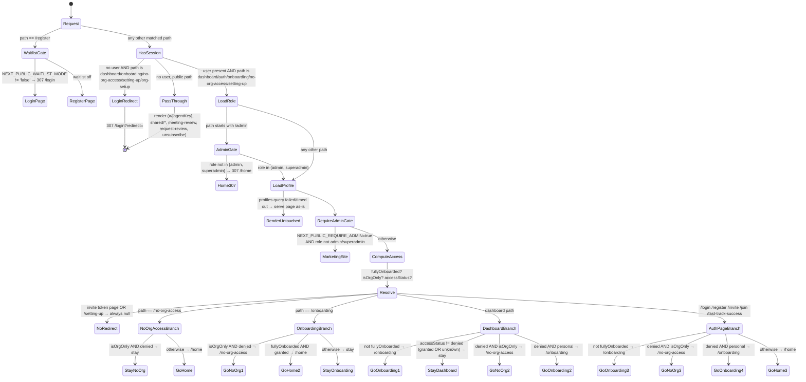
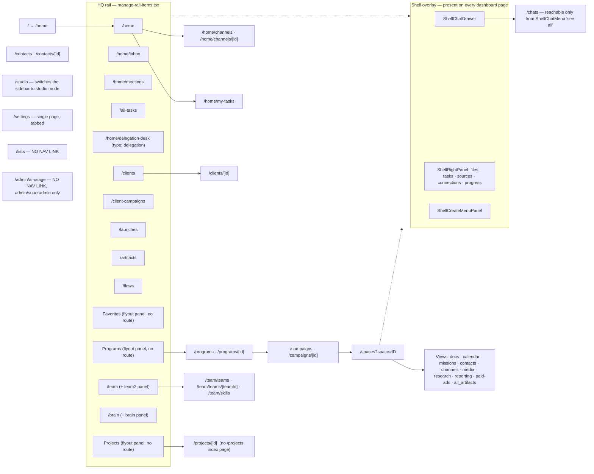

# User Flows

**Scope:** `apps/web` (the product surface, Next.js 16 App Router, port 3000) plus the public
surfaces it serves. Everything here is derived from code read in the working tree — no running app
was used. Where a flow depends on a backend that was never exercised locally, it is labelled.

**Read alongside:**
`project-mapping/08-auth-security.md` (guards, roles, tenancy),
`project-mapping/10-background-processes.md` (the technical agent-run trace),
`project-mapping/05-api-map.md` (the proxy layer and endpoint inventory),
`project-mapping/11-configuration.md` (the env vars that switch these flows on and off).

---

## Roles Discovered

There are **two independent role systems**, plus a third quasi-role (account mode) that gates
routing. They do not reference each other.

| Role                                  | Where defined                                                                                        | How assigned                                                                                               | What it unlocks                                                                                                                                                                   |
| ------------------------------------- | ---------------------------------------------------------------------------------------------------- | ---------------------------------------------------------------------------------------------------------- | --------------------------------------------------------------------------------------------------------------------------------------------------------------------------------- |
| `user` (default)                      | `packages/api-shared/src/guards/role.guard.ts:12` (`UserRole` union); read from `user_profiles.role` | Default when the `user_profiles` row has no role — `apps/web/src/middleware.ts:139` falls back to `'user'` | Everything the org/subscription checks allow. Nothing admin                                                                                                                       |
| `power`                               | same union                                                                                           | Manual DB edit (no UI found)                                                                               | Only meaningful where a controller writes `@Roles('power', …)`                                                                                                                    |
| `enterprise`                          | same union                                                                                           | Manual DB edit                                                                                             | Same — decorator-driven only                                                                                                                                                      |
| `admin` (platform)                    | same union                                                                                           | Manual DB edit / `apps/api/src/modules/admin/controllers/admin.controller.ts` surface                      | Passes the `/admin` gate in `apps/web/src/middleware.ts:141`; `RoleGuard` short-circuits to allow-all for `admin`                                                                 |
| `superadmin` (platform)               | same union                                                                                           | Manual DB edit                                                                                             | Everything `admin` unlocks, **plus** impersonation (`apps/api/src/modules/admin/controllers/impersonation.controller.ts`). `@Roles('superadmin')` correctly rejects plain `admin` |
| `owner` (org, rank 5)                 | `packages/api-shared/src/guards/org-role.guard.ts:27-32`; stored on `org_members.role`               | Set on the user who creates the org; transferable                                                          | Org billing, member management, all lower-rank powers. Also sets `organizationWideDataAccess`                                                                                     |
| `admin` (org, rank 4)                 | same                                                                                                 | Org invite                                                                                                 | Member management, org settings                                                                                                                                                   |
| `creator` (org, rank 3)               | same                                                                                                 | Org invite                                                                                                 | Create campaigns/spaces/artifacts. Also **runtime-eligible** — see below                                                                                                          |
| `editor` (org, rank 2)                | same                                                                                                 | Org invite                                                                                                 | Edit existing content. Also runtime-eligible                                                                                                                                      |
| `viewer` (org, rank 1)                | same                                                                                                 | Org invite                                                                                                 | Read only. **Not** runtime-eligible — an org can seat a viewer who still hits the paywall                                                                                         |
| `ai_data_admin` (boolean, not a role) | `org_members` column, read at `packages/api-shared/src/guards/org-context.guard.ts:62-63`            | Org owner grants it                                                                                        | Org-wide data access in agent context                                                                                                                                             |

**Runtime eligibility** is a separate concept from org role rank and is defined in
`apps/web/src/app/(auth)/onboarding/lib/onboarding-access.ts:31`:

```31:31:apps/web/src/app/(auth)/onboarding/lib/onboarding-access.ts
const RUNTIME_ELIGIBLE_ORG_ROLES = new Set(['owner', 'admin', 'creator', 'editor'])
```

An active membership in one of those four roles lets a user **skip the subscribe step entirely**.
A `viewer` does not.

### Account mode — the third axis

`profiles.account_mode` is either `personal` (the default when null) or `org_only`
(`apps/web/src/middleware.ts:177-179`). `org_only` users **never onboard**: `fullyOnboarded` is
forced true for them and they are routed purely on whether they still hold an active org
membership. This is the seat-based/enterprise path.

---

## The Access State Machine

Two files own this: `apps/web/src/middleware.ts` gathers the facts, and
`apps/web/src/lib/auth/access-routing.ts` (110 lines, pure functions, no I/O) decides the
destination. The middleware never decides on its own except for the two hard gates
(waitlist and platform-admin).

**The four facts the machine runs on:**

| Fact             | Source                               | Definition                                                                                                                                                                                           |
| ---------------- | ------------------------------------ | ---------------------------------------------------------------------------------------------------------------------------------------------------------------------------------------------------- |
| `role`           | `user_profiles.role`                 | defaults to `'user'` (`middleware.ts:139`)                                                                                                                                                           |
| `fullyOnboarded` | `profiles`                           | `isOrgOnly \|\| (onboarding_completed === true && hasRuntime)` (`middleware.ts:179`)                                                                                                                 |
| `hasRuntime`     | `profiles`                           | a non-empty `fly_machine_id`, **or** `agent_runtime_type === 'shared_railway'` with a non-empty `agent_runtime_url` (`middleware.ts:172-175`, via `apps/web/src/lib/runtime/machine-profile-env.ts`) |
| `accessStatus`   | `user_subscriptions` + `org_members` | `granted` if either an `active`/`trialing` subscription or an `active` org membership exists; `denied` if neither; **`unknown`** if either query timed out (`access-routing.ts:65-72`)               |

Every Supabase call in the middleware is wrapped in a 4 s timeout that resolves to `null` rather
than throwing (`middleware.ts:16, 21-27`). A `null` result is what makes `accessStatus` become
`unknown` — and `unknown` is deliberately treated as _not denied_, i.e. **the app fails open**
(`access-routing.ts:98`, `:104`). If the `profiles` query itself fails, the middleware returns the
response untouched and skips routing entirely (`middleware.ts:167-169`).



### Exact redirect targets

| Constant                                    | Value                                                                                                                                    | Defined at                                  |
| ------------------------------------------- | ---------------------------------------------------------------------------------------------------------------------------------------- | ------------------------------------------- |
| `APP_HOME_PATH`                             | `/home`                                                                                                                                  | `apps/web/src/lib/auth/access-routing.ts:1` |
| `ONBOARDING_PATH`                           | `/onboarding`                                                                                                                            | `:2`                                        |
| `NO_ORG_ACCESS_PATH`                        | `/no-org-access`                                                                                                                         | `:3`                                        |
| unauthenticated                             | `/login?redirect=<pathname+search>`                                                                                                      | `middleware.ts:29-36`                       |
| non-admin hitting `/admin*`                 | `/home` (search cleared)                                                                                                                 | `middleware.ts:141-146`                     |
| `NEXT_PUBLIC_REQUIRE_ADMIN=true`, non-admin | the marketing site origin, via `resolveMarketingSiteUrl()`                                                                               | `middleware.ts:181-183`                     |
| `/`                                         | `/home` — twice: middleware treats `/` as a dashboard path (`:88`), and `apps/web/src/app/(dashboard)/page.tsx` also `redirect('/home')` |                                             |

Every redirect the machine emits **clears the query string** (`url.search = ''`,
`middleware.ts:244`). Only the unauthenticated `/login` redirect preserves the original path, and it
does so by re-encoding it into `?redirect=`.

### The two escape hatches

`resolveAuthenticatedRedirect` returns `null` unconditionally for two paths
(`access-routing.ts:85`):

- `/invite/<token>` — an invited user must be able to land on the accept page in any account state.
- `/setting-up` — the page that polls for machine provisioning would otherwise bounce itself.

### Redirect-target validation

`resolveAppRedirectPath` (`access-routing.ts:28-37`) rejects anything not starting with `/` and
re-parses the value against a throwaway origin (`https://app.roas.invalid`), returning `/home` if
the origin changes. This is what blocks open-redirect via `?redirect=`.

---

## Flow: New User Onboarding

**Entry is not `/register`.** With `NEXT_PUBLIC_WAITLIST_MODE` anything other than the string
`'false'`, `/register` 307s to `/login` (`middleware.ts:93-99`). The live entry points are
`/join?code=<invite code>` and the org invite link.

1. **`/join?code=…`** (`apps/web/src/app/(auth)/join/page.tsx`). On mount it calls
   `GET {API_URL}/api/auth/invite-codes/<code>` unauthenticated. If `valid === true`, it writes two
   localStorage keys — `vibey-direct-invite` and `vibey-direct-invite-code`
   (`apps/web/src/app/(auth)/onboarding/lib/onboarding-access.ts:4,7`). An invalid code clears both
   and the sign-up form does not render.
2. **Sign up** — email+password `supabase.auth.signUp`, or OAuth (`google` / `github`) with
   `redirectTo = <origin>/callback`. The chosen provider is remembered in
   `vibey-last-auth-provider`.
3. **`/callback`** (`apps/web/src/app/(auth)/callback/route.ts`, a route handler, excluded from the
   middleware matcher at `middleware.ts:264`). It exchanges the code (or the
   `access_token`/`refresh_token` pair) for a session, then, still server-side:
   - fetches `GET /api/profile` from the backend with the fresh JWT to learn whether a runtime
     already exists;
   - if an `active`/`trialing` `user_subscriptions` row exists **and** no runtime does, fires
     `POST /api/machines/provision` fire-and-forget;
   - fires `POST /api/waitlist/fast-track-link` with the `vibey-ft-session` cookie;
   - redirects to `buildAppRedirectUrl(origin, redirect, { promo, message })`, default `/home`.
     `/home` immediately hits the middleware, which sees `fullyOnboarded === false` and sends the user
     to `/onboarding`.
4. **`/onboarding`** (`apps/web/src/app/(auth)/onboarding/page.tsx`). Steps are a local state
   machine, order defined at `apps/web/src/app/(auth)/onboarding/hooks/useOnboardingStep.ts:15-23`:
   `awakening → lets-start → customize → questions → channels → subscribe → setup-wait`
   (plus an off-order `welcome-back` state).
   - **awakening** — `VibeyAwakeningContainer`; on completion `PATCH /api/profile/onboarding`
     with `onboarding_animation_seen: true`.
   - **customize** — agent style (`bold`/`balanced`/`calm`) and avatar mode
     (`animation`/`portrait`). Held in React state, not persisted until later.
   - **questions** — `OnboardingQuestions` (or `OrgOnboardingQuestions`); writes profile data.
   - **channels** — `OnboardingChannels`; on completion calls `handleFinishFlow()`.
   - **subscribe gate** — `handleFinishFlow` (`page.tsx:247-261`) skips straight to `setup-wait`
     if a stored direct-invite code exists, or if `hasRuntimeEligibleOrgMembership()` returns true
     (`GET /api/org/my`). Otherwise it shows `subscribe`. A "Continue free" button appears only when
     `NEXT_PUBLIC_ALLOW_FREE_ONBOARDING === 'true'` (`page.tsx:335`).
   - **setup-wait** — on entry, fires `POST /api/agents/onboard { archetype: 'ceo', style, … }`
     (non-blocking, failures swallowed) and `POST /api/machines/provision`. Polls via
     `useProvisionStatus`. When ready, waits a 500 ms minimum display, then
     `PATCH /api/profile/onboarding { onboarding_completed: true }` and `router.replace('/home')`.
5. **Resume behaviour.** On every mount the page re-reads `GET /api/profile` and jumps to the saved
   `onboarding_data.onboarding_step` (`page.tsx:120-162`). `?subscription=success` combined with a
   saved step of `subscribe` skips the paywall and goes to `setup-wait`.

**Failure path:** if provisioning throws, `OnboardingSetupWait` renders with `isError` and a Retry
button. Retry with a stored invite code re-calls `provisionMachine()` directly; otherwise it calls
the hook's `retry()`.

---

## Flow: Returning User Login

1. `/login` (`apps/web/src/app/(auth)/login/page.tsx`, 259 lines; copy in
   `apps/web/src/app/(auth)/config/auth-messages.config.ts`). Title is `Account | ROAS`.
2. Email+password or OAuth. OAuth goes out to Supabase and comes back to `/callback`.
   Some providers return tokens in the URL **fragment**, which a server route cannot read — hence
   `apps/web/src/app/(auth)/oauth-callback/page.tsx`, a client page that reads
   `window.location.hash`, moves `access_token`/`refresh_token` into query params, and
   `window.location.replace`s to `/callback`.
3. Session cookies land; the next navigation hits the middleware, which runs the state machine
   above. A healthy returning user is `fullyOnboarded` + `granted` → `/home`.
4. **Lapsed subscription, personal account:** `accessStatus === 'denied'` and `isOrgOnly === false`
   → `/onboarding`. The onboarding page detects `onboarding_completed === true` with a denied home
   access and parks the user on the `subscribe` step (`page.tsx:108-115`). The paywall is the
   onboarding screen, not a dedicated billing page.
5. **Lapsed org membership, org_only account:** → `/no-org-access`.
6. **Onboarded but the machine disappeared:** `onboarding_completed === true` and
   `hasRuntime === false` → `fullyOnboarded` is false → `/onboarding`, which renders the
   `welcome-back` screen (`OnboardingWelcomeBack`) rather than restarting the wizard.
7. **Password reset:** `/forgot-password` → `/reset-password`. `buildAuthContinuationPath`
   (`access-routing.ts:51-63`) is what preserves `?redirect=` and `?promo=` across those hops.

---

## Flow: Invited User Joining An Org

Two different invitations exist and they are not the same thing.

**(a) Org invitation — `/invite/<token>`**
(`apps/web/src/app/(auth)/invite/[token]/page.tsx`)

1. The page loads the invitation via `orgService.getInvitationByToken(token)` and checks whether a
   session exists. The middleware explicitly refuses to redirect this path
   (`access-routing.ts:85`), so it renders in any account state.
2. If not logged in, the same sign-up/OAuth block as `/join` is shown inline.
3. Accepting calls `orgService.acceptInvitationAndBootstrap(token)`. On success it refreshes
   memberships, calls `setActiveOrg(res.org_id)`, clears org-sensitive client state
   (`apps/web/src/lib/utils/clear-org-state.ts`), and routes on a single backend-supplied flag:

   ```103:104:apps/web/src/app/(auth)/invite/[token]/page.tsx
   const destination = res.requires_machine_setup === false ? '/home' : '/setting-up'
   router.replace(destination)
   ```

4. `/setting-up` (`apps/web/src/app/(auth)/setting-up/page.tsx`) reuses the onboarding
   `OnboardingSetupWait` component and `useProvisionStatus`. It short-circuits to `/home` if the
   profile already shows `onboarding_completed` + a runtime; otherwise it polls until ready, then
   `fetchMemberships()` and `/home`. It never runs the onboarding wizard — an invited member skips
   `awakening`/`customize`/`questions` entirely.
5. A 404/"not found" from the token lookup is surfaced as _"This invitation does not exist or has
   already been used"_; other failures use `AUTH_MESSAGES.ORGANIZATION_INVITE.loadError`.

**(b) Direct platform invite code — `/join?code=…`**
This is a waitlist bypass, not an org membership. It only stores a localStorage code that later
suppresses the subscribe step and is forwarded as `{ invite_code }` on
`POST /api/machines/provision` (`onboarding/page.tsx:79-89`).

**`/org-setup`** (`apps/web/src/app/(auth)/org-setup/page.tsx`) is the create-an-org counterpart.
It is auth-gated (`middleware.ts:125-128`) but is **not** in `isAuthPage`, so the authenticated
state machine never touches it once you have a session.

---

## Flow: Core Product Loop

**Verified shape of the day-to-day loop:** the unit of work is a **Space**, spaces are grouped under
**Campaigns**, campaigns under **Programs**, and each Space is a set of typed **Views** that hold
artifacts. Chat is a shell-level drawer that overlays whatever page you are on, so "talk to the
agent" and "look at the work" are the same screen, not two destinations.

Evidence: `apps/web/src/components/layout/sidebar/group-sidebar-campaigns-by-program.ts` groups
campaigns by `program_id`; `apps/web/src/features/spaces/views/registry.ts` maps a
`ViewDef['type']` to a toolbar; `apps/web/src/components/shell/ShellChatDrawer.tsx` and
`ShellWorkspace.tsx` render chat beside page content.

1. **Pick a Space.** Canonical URL is `/spaces?space=<id>`. The path form `/spaces/<spaceId>` still
   exists but only as a redirect shim — `apps/web/src/app/(dashboard)/spaces/[spaceId]/page.tsx`
   rewrites it to the query form and notes in a comment that "Portal/ClickUp still emit
   `/spaces/{spaceId}?item=…`".
2. **Choose a View.** Registered view types include `docs`, `calendar`, `missions`, `contacts`,
   `channels`, `media`, `ads_research`, `instagram_research` / `tiktok_research` /
   `youtube_research` / `twitter_research` / `all_social_research`, `all_artifacts`, the
   `REPORTING_VIEW_TYPES` set and the paid-ads set (`views/registry.ts:26-47`).
3. **Chat with the agent.** `ShellChatDrawer` opens over the current page; `ShellNewChatAgentBar`
   picks the agent, `ShellEmptyChatPrompts` seeds a first message. The conversation is bound to the
   space/campaign context — the backend even auto-binds a campaign when the message _names_ a client
   (`apps/agent-api/src/modules/chat/services/chat.service.ts:414-428`, logged as `[CONNECTIONS]`).
4. **The agent produces artifacts.** They appear without a refresh via Supabase Realtime, and are
   rendered in the right-hand column: `ShellArtifactViewerColumn.tsx`,
   `ShellArtifactViewerPanel.tsx`, `ShellCodeArtifactViewer.tsx`.
5. **Review / approve.** Two review surfaces exist: `YourTurnContainer.tsx`
   (`apps/web/src/features/spaces/containers/`) for items waiting on the user, and the mission
   statuses `awaiting_human` / `pending_approval` documented in
   `project-mapping/10-background-processes.md`. `/all-tasks` and `/home/inbox` aggregate these
   across spaces.
6. **Delegate longer work.** The Delegation Desk (`/home/delegation-desk`,
   `DelegationDeskWorkspace.tsx`) hands work to a mission, which runs asynchronously through the
   mission-worker rather than in the chat stream.
7. **Publish / export.** Per-surface: `apps/web/src/app/api/spaces/export-docx/route.ts` for
   documents, the funnels/site surfaces for published pages, and the integration modules for
   posting outward.

---

## Flow: Agent Chat Round Trip

User-visible steps only. The hop-by-hop technical trace (SSE framing, single-flight Redis lock,
stall watchdogs, the shadow BullMQ path) is in
`project-mapping/10-background-processes.md` → _Agent Run Lifecycle_.

1. User types a message in the shell chat drawer and hits send.
2. The message appears immediately; the composer locks. A second send is rejected — the backend
   returns `409 "A generation is already in progress"` per conversation.
3. **If the user's Fly machine is cold**, the UI shows rotating status lines ("Turning on your
   agents…") roughly every 8 seconds while it boots. This is generated by the web proxy itself
   (`proxyChatWithWarmup`), not by the agent.
4. Assistant text streams in token by token. Tool calls surface as inline activity rows.
5. Artifacts the agent creates appear in the right-hand panel as they are written, arriving over
   Supabase Realtime independently of the chat stream.
6. A "stop" control cancels the run (`POST /api/chat/stop`).
7. Credit warnings ride along as response headers (`x-credits-low`, `x-credits-remaining`) which the
   proxy surfaces to the UI (`project-mapping/05-api-map.md` → _Response handling_).

**Two failure modes worth knowing as a user-facing behaviour:**

- A failed chat request still returns **HTTP 200**; the error arrives in-band as an SSE
  `{type:'error'}` event. Anything watching HTTP status codes will believe chat is healthy.
- If the agent stalls, the server aborts at 120 s (or 300 s if nothing was ever emitted). The user
  sees the stream simply stop.

---

## Flow: Connecting An Integration (OAuth)

1. User opens the connections surface — `ShellRightPanelConnections.tsx` in the shell, or
   `/settings`.
2. Clicking "Connect" opens a **popup window** to the provider. For the ~15 Composio-fronted
   toolkits the URL comes back from the backend Composio bridge
   (`apps/api/src/modules/integrations/controllers/integrations-composio.controller.ts`); native
   integrations (Slack, Meta, Google Drive, GoHighLevel, Stripe Connect, …) have their own
   controllers under `apps/api/src/modules/integrations/<provider>/`.
3. The provider redirects back to **`/integrations/connected`**
   (`apps/web/src/app/(auth)/integrations/connected/page.tsx`) with
   `?integration=<id>&composio_connected=1`, or with `composio_error` /
   `composio_error_message` on failure.
4. That page does not render a real screen. It calls `broadcastIntegrationOAuthEvent`
   (`apps/web/src/lib/integrations/composio-oauth.ts`) to notify the opener window, shows a
   check or cross, and **closes itself after 1500 ms** (`CLOSE_DELAY_MS`).
5. The opener receives the event and refreshes its connection list. Tokens themselves never touch
   the browser — they are stored server-side in the vault (`apps/api/src/modules/vault`).
6. Slack, Telegram and MCP consent are special-cased in the proxy: they are the only non-agent
   paths allowed to forward `x-supabase-refresh-token`
   (`project-mapping/05-api-map.md` → _Auth and headers attached_).

**MCP consent** is its own two-page flow: `/mcp/consent` → `/mcp/success`
(`apps/web/src/app/(auth)/mcp/consent/page.tsx`, `.../mcp/success/page.tsx`).

---

## Flow: Admin / Platform Operator

There are **two** admin surfaces and they are easy to confuse.

**(a) Inside `apps/web`, under `/admin`.** The middleware gate is real
(`middleware.ts:140-146`: role must be `admin` or `superadmin`, else `/home`), but the only page
that exists behind it is `apps/web/src/app/(dashboard)/admin/ai-usage/page.tsx`. There is no
`/admin` index page, and **no link to `/admin/ai-usage` exists anywhere in `apps/web/src`** — it is
URL-only. See _Dead Ends_.

**(b) `apps/admin`, a separate Next.js app on port 3002.** This is the actual operator console:

| Route                                                                                 | Purpose                           |
| ------------------------------------------------------------------------------------- | --------------------------------- |
| `/(protected)/dashboard`                                                              | operator overview                 |
| `/(protected)/users`, `/(protected)/users/[kind]/[id]`                                | user lookup and detail            |
| `/(protected)/waitlist`                                                               | waitlist / invite-code management |
| `/(protected)/finances`                                                               | revenue                           |
| `/(protected)/operations`, `/(protected)/mission-reliability`                         | run health                        |
| `/(protected)/errors`, `/(protected)/traces`                                          | incident triage                   |
| `/(protected)/instruction-governance`                                                 | agent instruction audit           |
| `/(protected)/enterprise-applications`, `/(protected)/enterprise-tools/skill-builder` | enterprise                        |
| `/(protected)/dev-dashboard`, `/(protected)/settings/platform-email`                  | internal                          |

Per `project-mapping/01-repository-overview.md`, `apps/admin` is **stale (last commit 2026-07-28) and
absent from the deploy map** — treat it as local-only until proven otherwise.

**Impersonation** (superadmin only) is started via
`apps/api/src/modules/admin/controllers/impersonation.controller.ts`, writes to
`superadmin_audit_log`, and afterwards every request carries `x-impersonate-user-id`. The web proxy
forwards that header on everything **except** paths starting with `/api/admin/impersonation`
(so you can always stop). The frontend affordance lives in
`apps/web/src/features/impersonation/`. Note the audit gap documented in
`project-mapping/08-auth-security.md` §Finding 6: the guard honours the header without requiring
`/start` to have been called first.

---

## Flow: Public Visitor

None of these require a session. All are outside the `(auth)` / `(dashboard)` groups, so the
middleware's authenticated branch never runs for them.

| Surface                 | Route                     | Behaviour                                                                                                                                                                                                                                                                                                                                                                                                                                 |
| ----------------------- | ------------------------- | ----------------------------------------------------------------------------------------------------------------------------------------------------------------------------------------------------------------------------------------------------------------------------------------------------------------------------------------------------------------------------------------------------------------------------------------- |
| **Public agent page**   | `/a/[agentKey]`           | `apps/web/src/app/a/[agentKey]/page.tsx`. Renders `PublicAgentContainer`, or `EmbeddedAgentContainer` when embedded. Metadata comes from headers **injected by the Cloudflare worker**: `x-vibey-agent-name` / `x-vibey-agent-role`, set at `workers/apps-proxy/src/index.ts:289` for the `*.agents.roas.io` host suffix. Hitting `app.roas.io/a/<key>` directly gets the fallback title `Agent \| ROAS` because those headers are absent |
| **Shared space**        | `/shared/space/[token]`   | **Deliberately disabled.** The page renders a "SHARING PAUSED" notice; the real `SharedSpaceItemsView` import is commented out, pointing at `.documentation/sharing/external-sharing-paused.md`. Links to it are still generated by `ShareModal.tsx` and `SharedSpaceItemsView.tsx` — so live share links land on the paused notice                                                                                                       |
| **Shared item**         | `/shared/item/[token]`    | Still live. Renders `SharedItemView`                                                                                                                                                                                                                                                                                                                                                                                                      |
| **Meeting review**      | `/meeting-review/[token]` | `PublicMeetingFollowUpReviewPage` — an external attendee approves/edits agent-drafted meeting follow-ups                                                                                                                                                                                                                                                                                                                                  |
| **Work request review** | `/request-review/[token]` | `WorkRequestReviewPage` — a client reviews a service request                                                                                                                                                                                                                                                                                                                                                                              |
| **Unsubscribe**         | `/unsubscribe/[token]`    | Talks to the backend **directly**, not through the proxy: `GET`/`POST {NEXT_PUBLIC_BACKEND_URL}/api/email/unsubscribe/<token>`. States: `loading / ready / success / already / error / invalid`                                                                                                                                                                                                                                           |

---

## Navigation Map

The sidebar has **three modes**, chosen in `apps/web/src/components/layout/Sidebar.tsx:131-182`:
`studio` (when the path starts with `/studio`), `simple`, and the default `hq` rail. The mode is
seeded server-side from the `x-pathname` header the middleware sets
(`apps/web/src/app/(dashboard)/layout.tsx:43-44`). The HQ rail is driven by
`apps/web/src/components/layout/sidebar/manage-rail-items.tsx`; the flat list is
`apps/web/src/components/layout/sidebar/SidebarSimpleSection.tsx:46-57`.



`/spaces` (index) and the space hierarchy are the centre of gravity; `/home` is the daily landing
page. `/settings` is a single 22-line page that mounts a tabbed container rather than nested routes.

---

## Dead Ends & Broken Flows

Verified by enumerating every `page.tsx` / `route.ts` under `apps/web/src/app` and grepping the
whole of `apps/web/src` for references to each path.

| #   | Finding                                                                                                                                                                                                                                                                                   | Evidence                                                                                 | Consequence                                                                                                                                                                                                        |
| --- | ----------------------------------------------------------------------------------------------------------------------------------------------------------------------------------------------------------------------------------------------------------------------------------------- | ---------------------------------------------------------------------------------------- | ------------------------------------------------------------------------------------------------------------------------------------------------------------------------------------------------------------------ |
| 1   | **`/lists` has no navigation link.** The page exists (`apps/web/src/app/(dashboard)/lists/page.tsx`) but the only two references in the codebase are the middleware's dashboard-path list (`middleware.ts:80`) and a breadcrumb label (`components/shell/shell-screen-chat.config.ts:32`) | grep for `/lists` returns 2 files, neither a link                                        | Reachable only by typing the URL                                                                                                                                                                                   |
| 2   | **`/admin/ai-usage` has zero references.** `rg "'/admin"` in `apps/web/src` matches only `middleware.ts:67` and `:140`                                                                                                                                                                    | —                                                                                        | The one page behind the platform-admin gate is unlinked                                                                                                                                                            |
| 3   | **`/admin` itself 404s.** `(dashboard)/admin/` contains only `ai-usage/`; there is no `admin/page.tsx`                                                                                                                                                                                    | `find apps/web/src/app -name page.tsx`                                                   | An admin who follows the gate lands on Next's not-found                                                                                                                                                            |
| 4   | **`/dashboard` is in the middleware's protected list but is not a route.** `(dashboard)` is a route _group_ — the parentheses strip it from the URL                                                                                                                                       | `middleware.ts:70` vs. the route listing                                                 | Dead entry; harmless but misleading                                                                                                                                                                                |
| 5   | **`/(auth)/verify-email/page.tsx` is referenced nowhere.** Zero matches for `verify-email` in `apps/web/src`                                                                                                                                                                              | grep                                                                                     | Orphan page — either Supabase email templates link to it externally, or it is dead. **NEEDS VERIFICATION** against the Supabase Auth email template config                                                         |
| 6   | **`/fast-track-success` is referenced only by the middleware.** It is listed in `isAuthPage` (`middleware.ts:107`) but nothing in `apps/web` or `apps/website` links to it                                                                                                                | grep across both apps                                                                    | Reachable only from an external waitlist email                                                                                                                                                                     |
| 7   | **`/register` is unreachable by design.** `middleware.ts:93-99` 307s it to `/login` unless `NEXT_PUBLIC_WAITLIST_MODE === 'false'` — note the check is a string comparison, so unset ⇒ closed                                                                                             | `middleware.ts:94`                                                                       | Correct behaviour, but the page and its OAuth handlers are dead code while the flag is on                                                                                                                          |
| 8   | **`/shared/space/[token]` is a live link target that renders a "paused" notice.** `ShareModal.tsx:605` and `SharedSpaceItemsView.tsx:215-216` still build `/shared/space/:token` URLs; the page's real view is commented out                                                              | `apps/web/src/app/shared/space/[token]/page.tsx:4-6`                                     | Every previously-issued public space link is now a dead end for the recipient                                                                                                                                      |
| 9   | **`/chats` is not in the middleware's `dashboardPaths`.** The list at `middleware.ts:66-86` omits it, so the middleware does not force a login redirect for `/chats`                                                                                                                      | `middleware.ts:66-86`                                                                    | Not an auth hole — `(dashboard)/layout.tsx:38-40` server-side `redirect('/login')`s when there is no user — but it _is_ an inconsistency, and it means `/chats` skips the onboarding/subscription routing entirely |
| 10  | **`/projects` has no index page**, only `/projects/[id]`, yet `/projects` is a protected middleware path                                                                                                                                                                                  | route listing vs. `middleware.ts:81`                                                     | `/projects` 404s; the sidebar correctly exposes Projects as a flyout panel with no `href` (`manage-rail-items.tsx:114-120`)                                                                                        |
| 11  | **`/a/[agentKey]` degrades silently when not served through the Cloudflare worker.** The title falls back to `Agent \| ROAS` because `x-vibey-agent-name` is missing                                                                                                                      | `apps/web/src/app/a/[agentKey]/page.tsx:17-24` vs. `workers/apps-proxy/src/index.ts:289` | Testing the public agent page on `localhost` or `app.roas.io` does not reproduce production                                                                                                                        |
| 12  | **Nothing in the app works without the agent runtime.** `fullyOnboarded` requires `hasRuntime`, which requires either a provisioned Fly machine or a `shared_railway` URL on the profile. With neither, every dashboard path bounces to `/onboarding` forever                             | `middleware.ts:172-179`                                                                  | Local development without Fly/Railway credentials cannot reach the dashboard at all — consistent with the boot blockers in `project-mapping/02-how-to-run.md`                                                      |
| 13  | **The middleware fails open.** If Supabase is slow, `accessStatus` becomes `unknown` and `unknown` is not `denied`, so dashboard access is allowed (`access-routing.ts:98`). If the `profiles` query fails outright, routing is skipped entirely (`middleware.ts:167-169`)                | —                                                                                        | Deliberate availability trade-off, but it means a Supabase brownout grants dashboard access to lapsed accounts                                                                                                     |
| 14  | **`/setting-up` and `/invite/<token>` are permanently exempt from routing.** `resolveAuthenticatedRedirect` returns `null` for both before any other check                                                                                                                                | `access-routing.ts:85`                                                                   | Necessary, but it means a user parked on `/setting-up` with a broken provisioner is never rescued by the router — only by the page's own polling                                                                   |

**Flows that require a service that is not running locally:** chat (needs `apps/agent-api` +
OpenClaw on 18789 + an LLM key), onboarding completion (needs Fly or shared-Railway provisioning),
missions and delegation (need Redis + `apps/mission-worker`), email/CRM/social actions (need
`apps/queue-worker` + Redis). See `project-mapping/10-background-processes.md` → _What Must Be
Running For The App To Work_.

---

## Glossary Pointer

Terminology — Vibey vs. ROAS vs. NeuralSnap, Space vs. Campaign vs. Program, OpenClaw, mission,
artifact, brain — is collected in `project-mapping/18-glossary.md`.
**That file does not exist yet** as of this pass; the naming warning at the top of
`project-mapping/01-repository-overview.md` is the current stand-in.
