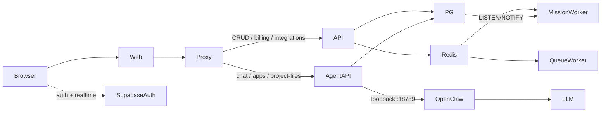

# Project Mapping

> Reverse-engineered technical map of the ROAS platform (repo package name `vibey-v2`).
> Mapped from source at commit `f4757c2b` on `main`. No source was refactored.
> Evidence tags used throughout this folder: **CONFIRMED** · **LIKELY** · **UNUSED / DEAD CODE CANDIDATE** · **BROKEN** · **UNKNOWN**.

This folder is the onboarding guide. Start here, then follow the [Documentation Index](#documentation-index).

---

## What This Application Is

ROAS is an **agent-run marketing agency in software**. A customer's organization hires a roster of named AI employees (agents). Each agent has a markdown role definition, a set of skills, its own memory, and communication channels. The human delegates work; agents execute it; the human reviews the output.

The product is mid-rebrand. Three names refer to the same system:

| Name                    | Where it appears                                                 |
| ----------------------- | ---------------------------------------------------------------- |
| **ROAS**                | Product, domains (`roas.io`, `api.roas.io`), page titles         |
| **Vibey / `@vibey/*`**  | npm workspace names, root package `vibey-v2`, many code comments |
| **NeuralSnap (`ns_*`)** | Older Brain/memory table prefix                                  |

See [`18-glossary.md`](./18-glossary.md) for the full alias list.

The root `README.md` is **outdated** (says Next.js 14 + single VM). Reality is Next.js 16 + NestJS + Vercel + Fly.io + Railway + one shared Supabase Postgres.

---

## Product Capabilities

**CONFIRMED from code + reachable routes:**

1. **AI team** — hire/fire agents, edit skills, chat with streaming SSE, public agent widgets.
2. **Work containers** — Spaces (ClickUp-like, 12 view types), Programs (folders), Campaigns (strategy + artifacts).
3. **Memory (Brain)** — four families (user / agent / company / customer) over pgvector 768-dim hybrid search.
4. **Missions** — long-running agent jobs with a DAG of subtasks, transactional outbox, BullMQ worker.
5. **CRM** — contacts, segments, lead ingest from published funnels.
6. **Content** — ads, social posts, docs, presentations, media generation, funnel pages.
7. **Distribution** — SendGrid email + sequences, Meta ads, Composio social publish, custom domains.
8. **Integrations** — ~40 providers (Composio-brokered + bespoke), plus ROAS-as-MCP-server.
9. **Billing** — Stripe subscriptions + a credit ledger that meters LLM spend.
10. **Agency console** — `/clients`, `/launches` backed by a Page Grader partner API, not an internal `clients` table.
11. **Admin console** — separate `apps/admin` for platform staff (users, finances, traces, waitlist).

Self-serve signup is **closed**. Entry is waitlist, invite code, or org invitation (`NEXT_PUBLIC_WAITLIST_MODE` default).

---

## Technology Stack

| Layer              | Technology                                                                     | Evidence                          |
| ------------------ | ------------------------------------------------------------------------------ | --------------------------------- |
| Language / runtime | TypeScript 5.7, **Node 22.x** (hard requirement)                               | per-app `engines`; Node 20 fails  |
| Monorepo           | pnpm 9.15.4 + Turborepo 2                                                      | `package.json`, `turbo.json`      |
| Product UI         | Next.js 16, React 19, Zustand (no react-query)                                 | `apps/web`                        |
| Platform API       | NestJS 11, 336 controllers, 1,632 routes                                       | `apps/api` boot log               |
| Agent API          | NestJS 11 + `ws`                                                               | `apps/agent-api`                  |
| Agent runtime      | Vendored OpenClaw `2026.2.16` (673k LOC)                                       | `apps/openclaw`                   |
| Database           | Supabase Postgres + pgvector + Auth + Realtime + Storage                       | `supabase/migrations` (937 files) |
| ORM                | **None** — `@supabase/supabase-js` + raw `pg`                                  | no Prisma/TypeORM                 |
| Queues             | BullMQ + Redis + Postgres LISTEN/NOTIFY outbox                                 | `mission-worker`, `queue-worker`  |
| LLM                | OpenRouter primary; Anthropic / OpenAI / Gemini                                | `docker/openclaw.json`            |
| Deploy             | Vercel (web + api), Fly.io (agent stack), Railway (workers), Cloudflare (edge) | `CLAUDE.md` + config files        |

---

## Repository Structure

**Type: monorepo + hybrid architecture.** A modular-monolith platform API, a second agent backend, a vendored runtime, two workers, five Next.js surfaces, one Cloudflare worker. All share one Postgres. It is **not** a clean microservice system.

| Path                              | Role                                                                 |
| --------------------------------- | -------------------------------------------------------------------- |
| `apps/web`                        | Primary product (port 3000)                                          |
| `apps/api`                        | Platform API (port 3001)                                             |
| `apps/agent-api`                  | Agent backend (port 3003)                                            |
| `apps/openclaw`                   | Vendored agent gateway (port 18789)                                  |
| `apps/mission-worker`             | Mission / brain / dream queues (port 3005)                           |
| `apps/queue-worker`               | Email / social / CRM / Slack queues (port 3004)                      |
| `apps/admin`                      | Platform staff console (port 3002, **collides with funnels**)        |
| `apps/funnels`                    | Public funnel renderer (port 3002 hardcoded)                         |
| `apps/website`, `apps/docs`       | Marketing + docs                                                     |
| `packages/api-shared`             | Guards, filters, shared Nest providers — **live**                    |
| `packages/agent-policy`           | Agent access policy — **live**                                       |
| `packages/{ui,db,widget-catalog}` | **DEAD CODE CANDIDATES** (zero runtime importers)                    |
| `supabase/migrations`             | Schema source of truth (no `config.toml`, no local `supabase start`) |
| `docker/`                         | Fly image, `openclaw.json`, agent workspaces                         |
| `workers/apps-proxy`              | `*.agents.roas.io` edge routing                                      |

Full table: [`01-repository-overview.md`](./01-repository-overview.md).

---

## Architecture Summary

The single most important routing fact: almost every frontend call goes through
`apps/web/src/app/api/proxy/[...path]/route.ts`. The proxy inserts `/api` and
sends `chat` / `apps` / `project-files` to `apps/agent-api`; everything else to
`apps/api`. Searching the backend for the literal frontend path will miss.

Auth is **opt-in per controller** — there is no Nest `APP_GUARD`.
RLS is **not** the security boundary: many repositories use the service-role client.

Full map: [`03-architecture.md`](./03-architecture.md).
Execution-critical files: [`15-code-navigation-guide.md`](./15-code-navigation-guide.md#execution-critical-files).

---

## How to Run

You do **not** need the whole platform.

| Level               | What you get     | Command                                                            |
| ------------------- | ---------------- | ------------------------------------------------------------------ |
| 1. Frontend only    | `/login` renders | `pnpm --filter @vibey/web run dev`                                 |
| 2. Frontend + API   | Real CRUD        | `VERCEL=1 PORT=3001 pnpm --filter @vibey/api run dev` then web     |
| 3. Full agent stack | Chat works       | Level 2 + Redis + `pnpm dev:agentapi` + `pnpm dev:agent` + workers |

**Never run bare `pnpm dev`** — admin and funnels both bind 3002.

**Never start `apps/api` without `VERCEL=1`.** Locally, unset `VERCEL` turns on in-process crons that mutate whatever database `.env` points at, every 30 seconds.

**Confirm the Supabase project before any write.** Docs say production is `lhfgtsjetcardinpgouq`. On-disk `.env` points at a third undocumented project `sicxiwyukxtqicevlwuc`. Treat every local write as production until that is resolved.

Exact sequence: [`02-how-to-run.md`](./02-how-to-run.md).

---

## Main Applications / Services

| App                     | Port  | Deploy                  | Status                           |
| ----------------------- | ----- | ----------------------- | -------------------------------- |
| `apps/web`              | 3000  | Vercel                  | ACTIVE — primary surface         |
| `apps/api`              | 3001  | Vercel `api.roas.io`    | ACTIVE — 1,632 routes            |
| `apps/agent-api`        | 3003  | Fly.io `roas-runtimes`  | ACTIVE                           |
| `apps/openclaw`         | 18789 | same Fly machine        | ACTIVE, vendored                 |
| `apps/mission-worker`   | 3005  | Railway `roas-platform` | ACTIVE                           |
| `apps/queue-worker`     | 3004  | Railway `queue-worker`  | ACTIVE                           |
| `workers/apps-proxy`    | edge  | Cloudflare              | ACTIVE (`*.agents.roas.io` only) |
| `apps/funnels`          | 3002  | Vercel `sites.roas.io`  | DEPLOYED, source stale           |
| `apps/admin`            | 3002  | **not in deploy map**   | STALE / local-only               |
| `apps/website`          | 3010  | not in deploy map       | ACTIVE                           |
| `apps/docs`             | 3011  | not in deploy map       | ACTIVE                           |
| `apps/chrome-extension` | —     | sideload                | STALE                            |

---

## Major Features

| Module                         | Feature map                                                                          | Status                       |
| ------------------------------ | ------------------------------------------------------------------------------------ | ---------------------------- |
| Authentication / onboarding    | [`features/authentication.md`](./features/authentication.md)                         | WORKING (signup closed)      |
| Organizations / teams          | [`features/organizations-teams.md`](./features/organizations-teams.md)               | WORKING                      |
| Agent runtime / chat           | [`features/agent-runtime-chat.md`](./features/agent-runtime-chat.md)                 | WORKING                      |
| Spaces / campaigns / programs  | [`features/spaces-campaigns.md`](./features/spaces-campaigns.md)                     | WORKING                      |
| Brain / memory                 | [`features/brain-memory.md`](./features/brain-memory.md)                             | WORKING                      |
| Missions / tasks               | [`features/missions-and-tasks.md`](./features/missions-and-tasks.md)                 | WORKING                      |
| Contacts / CRM                 | [`features/contacts-crm.md`](./features/contacts-crm.md)                             | WORKING                      |
| Content / artifacts            | [`features/content-artifacts-studio.md`](./features/content-artifacts-studio.md)     | WORKING                      |
| Funnels / domains              | [`features/funnels-domains.md`](./features/funnels-domains.md)                       | WORKING                      |
| Email / sequences              | [`features/email-sequences.md`](./features/email-sequences.md)                       | WORKING                      |
| Home / inbox / channels        | [`features/home-inbox-channels.md`](./features/home-inbox-channels.md)               | WORKING                      |
| Flows / automations / meetings | [`features/flows-automations-meetings.md`](./features/flows-automations-meetings.md) | PARTIAL (flows)              |
| Integrations / OAuth           | [`features/integrations-oauth.md`](./features/integrations-oauth.md)                 | WORKING                      |
| Billing / credits              | [`features/billing-credits.md`](./features/billing-credits.md)                       | WORKING + CRITICAL auth hole |
| Admin / platform ops           | [`features/admin-platform.md`](./features/admin-platform.md)                         | WORKING (stale app)          |
| Projects (AI app builder)      | [`features/projects-app-builder.md`](./features/projects-app-builder.md)             | PARTIALLY IMPLEMENTED        |
| Public agent widgets           | [`features/public-agent-widgets.md`](./features/public-agent-widgets.md)             | WORKING                      |

Full inventory + cross-reference matrix: [`04-feature-inventory.md`](./04-feature-inventory.md).

---

## Database

- **937 migrations**, no ORM, no local Supabase. The repo **cannot rebuild its own database**: at least 10 live tables (`user_notifications`, `social_posts`, `skill_library`, …) were created in production and only reconstructed in `scripts/roas/roas-drift-recovery.sql`. Seven more foundational tables exist only in non-migration `supabase/schema.sql`.
- Tenant root is `organizations`. `org_id IS NULL` = personal scope. Only ~190 of ~328 tables carry `org_id`.
- Brain tables use `ns_*` prefix (NeuralSnap lineage). pgvector is uniformly 768-dim.
- **45 tables have no code access path** (dead or never wired). Meeting tables and `orders`/`order_items` have **no RLS**.
- `user_integrations` stores OAuth tokens as plain `TEXT` even though `vault_secrets` exists.
- Live schema was **never queried**. [`06-database-map.md`](./06-database-map.md) is file-derived.

---

## Authentication

- Identity: **Supabase GoTrue**. Browser talks to Supabase directly; JWT is forwarded as `Authorization: Bearer`.
- Verification: remote JWKS (asymmetric). `SUPABASE_JWT_SECRET` is unused by live TypeScript.
- Session: `@supabase/ssr` cookies.
- Authorization: opt-in `@UseGuards(AuthGuard)` + `OrgContextGuard` + `OrgRoleGuard` + `RoleGuard`.
- Tenant context: `x-org-id` header from `localStorage`.
- **CRITICAL:** `OrgRoleGuard` returns `true` when `request.orgId` is null (`packages/api-shared/src/guards/org-role.guard.ts:63-65`). Combined with service-role Stripe services, an authenticated user can act on another org's billing if they omit the header and pass `:orgId` / `body.orgId`.
- **CRITICAL:** `InternalAuthGuard` accepts `x-openclaw-internal: true` (not a secret). `apps/agent-api` is on a public Fly hostname.

Full analysis: [`08-auth-security.md`](./08-auth-security.md).

---

## External Integrations

~45 integrations catalogued in [`09-integrations.md`](./09-integrations.md). Highest-traffic:

| Integration                   | Role                                  |
| ----------------------------- | ------------------------------------- |
| OpenRouter                    | LLM routing + after-the-fact cost     |
| Stripe                        | subscriptions, credit packs, webhooks |
| SendGrid                      | transactional + marketing email       |
| Meta Marketing API            | ads                                   |
| Slack / Telegram              | channels + observation → Brain        |
| Composio                      | LinkedIn / YouTube / IG / X publish   |
| Fly.io Machines               | per-user agent runtime                |
| Cloudflare + Vercel           | custom domains, public widgets        |
| Fathom / Fireflies / Deepgram | meetings / transcription              |
| Page Grader                   | entire `/clients` agency console      |

---

## Background Processes

| Process                                                    | Host                                     | Trigger              |
| ---------------------------------------------------------- | ---------------------------------------- | -------------------- |
| `mission-worker` 5 queues + 3 outbox dispatchers           | Railway                                  | BullMQ + `pg_notify` |
| `queue-worker` 5 queues (email, social, CRM, Slack, Drive) | Railway                                  | BullMQ               |
| ~20 Vercel crons on `apps/api`                             | Vercel                                   | `vercel.json`        |
| 10 in-process `@Cron` jobs                                 | **local API only** (when `VERCEL` unset) | Nest ScheduleModule  |
| OpenClaw gmail-watcher                                     | Fly / local gateway                      | in-process           |

Some queues have producers and **no live consumer**. Jobs then fail silently.

Full map: [`10-background-processes.md`](./10-background-processes.md).

---

## Testing

| Suite                                                    | Result (2026-09-05)                              |
| -------------------------------------------------------- | ------------------------------------------------ |
| `packages/agent-policy`                                  | 53/53 PASS                                       |
| `apps/funnels`, `openrouter-model-scout`, `queue-worker` | PASS (queue-worker is mostly `todo`)             |
| `apps/api`                                               | 2,191 pass / 23 fail / flaky (~3 files variance) |
| `apps/agent-api`                                         | 1,736 pass / 22 fail                             |
| `packages/api-shared`                                    | 117 pass / 2 fail (stale `.js` in `src/`)        |
| `apps/web`                                               | **981/981 fail at setup** (`util`/`TextEncoder`) |
| Playwright E2E                                           | not run (would hit live systems)                 |
| CI                                                       | **none** — `.github/` has only a PR template     |

Inventory: [`12-existing-tests.md`](./12-existing-tests.md).
Scenarios: [`13-testing-scenarios.md`](./13-testing-scenarios.md).
Runs: [`testing/test-run-01.md`](./testing/test-run-01.md), [`testing/test-run-02.md`](./testing/test-run-02.md).

---

## Known Risks

Ranked. Do not treat this as a fix list — it is a map.

| Severity | Risk                                                                                          | Where                                                |
| -------- | --------------------------------------------------------------------------------------------- | ---------------------------------------------------- |
| CRITICAL | Org billing takeover via `OrgRoleGuard` pass-through + `:orgId` path / `body.orgId`           | `08-auth-security.md`, `features/billing-credits.md` |
| CRITICAL | Agent-api internal surface guarded by a boolean header                                        | `InternalAuthGuard`                                  |
| CRITICAL | Local `apps/api` boot starts production crons                                                 | `02-how-to-run.md`                                   |
| CRITICAL | Undocumented third Supabase project in local `.env`                                           | `17-open-questions.md` #1                            |
| CRITICAL | Dual live profile tables (`profiles` + `user_profiles`)                                       | `16-code-health-findings.md`                         |
| CRITICAL | Repo cannot rebuild DB — live tables missing from migrations                                  | `06-database-map.md`                                 |
| HIGH     | Auth is opt-in; 20 controllers have no guard                                                  | `08-auth-security.md`                                |
| HIGH     | Impersonation header swap skips allowlist + audit                                             | `08-auth-security.md`                                |
| HIGH     | `INTERNAL_API_TOKEN` compared with `!==`; grants any `x-user-id` + service-role               | `08-auth-security.md`                                |
| HIGH     | Plaintext OAuth tokens in `user_integrations` (Meta, Stripe, Calendly, …)                     | `09-integrations.md`                                 |
| HIGH     | Seven `@Cron` jobs have no Vercel-cron mirror — never run in production                       | `10-background-processes.md`                         |
| HIGH     | `apps/web/.env` is a byte-identical copy of `apps/api/.env` (full secret set in the Next app) | `11-configuration.md`                                |
| HIGH     | `*.base.ts` inheritance chains (~32k LOC) bypass the architecture LOC gate                    | `07-dependency-map.md`                               |
| HIGH     | `team` + `team-2` both live (55k LOC)                                                         | `04-feature-inventory.md`                            |
| HIGH     | 52 circular dependencies; 146 files over LOC gate                                             | `07-dependency-map.md`                               |
| HIGH     | Stale compiled `.js` inside `packages/api-shared/src/` shadows TypeScript in tests            | `12-existing-tests.md`                               |
| HIGH     | No CI; frontend suite is dead (981 files fail at setup)                                       | `12-existing-tests.md`                               |
| HIGH     | Meeting tables have no RLS; `projects` has no RLS                                             | `06-database-map.md`                                 |
| HIGH     | Checkout success URLs still point at deleted `/studio`                                        | `billing.controller.ts:49`                           |
| HIGH     | Sentry is a dependency in five apps but `Sentry.init` is never called                         | `09-integrations.md`                                 |
| MEDIUM   | Port 3002 collision; `turbo.json` omits `NEXT_PUBLIC_*` from `build.env` (cache risk)         | `11-configuration.md`                                |
| MEDIUM   | 45 tables with no code path; 4 shim-only feature folders                                      | `04-feature-inventory.md`                            |
| MEDIUM   | Calendly webhook: no signature, no guard, both branches are `// Future:` TODOs                | `05-api-map.md`                                      |

---

## Current Understanding Confidence

| Area            | Confidence                            | Why not 100%                                                        |
| --------------- | ------------------------------------- | ------------------------------------------------------------------- |
| Architecture    | **90%**                               | Runtime topology confirmed; some queue consumers unverified in prod |
| Core features   | **85%**                               | Code-traced end-to-end; most user flows not exercised authenticated |
| Database        | **70%**                               | Migrations read; live schema never queried                          |
| APIs            | **90%**                               | 1,632 routes inventoried from boot + controllers                    |
| Authentication  | **90%**                               | Guard stack read; cookie flags in prod not inspected                |
| Integrations    | **75%**                               | Catalogued from code; most OAuth callbacks not runtime-tested       |
| Background jobs | **80%**                               | Code + vercel.json; which flags are on in prod is UNKNOWN           |
| Deployment      | **75%**                               | Config files + `CLAUDE.md`; live dashboards not opened              |
| Testing         | **85%** inventory / **40%** execution | Safe suites run; E2E and smoke scripts skipped                      |

---

## Documentation Index

| File                                                           | Contents                                     |
| -------------------------------------------------------------- | -------------------------------------------- |
| [`00-progress.md`](./00-progress.md)                           | Session log, blockers, next investigations   |
| [`01-repository-overview.md`](./01-repository-overview.md)     | Folders, apps, stack, deploy tech            |
| [`02-how-to-run.md`](./02-how-to-run.md)                       | Boot sequence, env, ports, verified commands |
| [`03-architecture.md`](./03-architecture.md)                   | Runtime diagram, request lifecycle           |
| [`04-feature-inventory.md`](./04-feature-inventory.md)         | Every feature + cross-reference matrix       |
| [`05-api-map.md`](./05-api-map.md)                             | Endpoint inventory by module                 |
| [`06-database-map.md`](./06-database-map.md)                   | Tables, FKs, suspicious issues               |
| [`07-dependency-map.md`](./07-dependency-map.md)               | God files, cycles, hotspots                  |
| [`08-auth-security.md`](./08-auth-security.md)                 | Authn/authz + security findings              |
| [`09-integrations.md`](./09-integrations.md)                   | External services                            |
| [`10-background-processes.md`](./10-background-processes.md)   | Workers, queues, crons                       |
| [`11-configuration.md`](./11-configuration.md)                 | Env vars, precedence, conflicts              |
| [`12-existing-tests.md`](./12-existing-tests.md)               | Test inventory + results                     |
| [`13-testing-scenarios.md`](./13-testing-scenarios.md)         | Manual familiarization scenarios             |
| [`14-user-flows.md`](./14-user-flows.md)                       | Journeys by role                             |
| [`15-code-navigation-guide.md`](./15-code-navigation-guide.md) | "If I want to X, start here"                 |
| [`16-code-health-findings.md`](./16-code-health-findings.md)   | Dead/legacy/duplicate/risk                   |
| [`17-open-questions.md`](./17-open-questions.md)               | Unresolved questions                         |
| [`18-glossary.md`](./18-glossary.md)                           | Terms and aliases                            |
| [`features/`](./features/)                                     | Per-module end-to-end traces                 |
| [`testing/`](./testing/)                                       | Test-run journals                            |

---

## Execution-Critical Files

If one of these is wrong, the blast radius is the product, not a feature.

| File                                                                           | Role                                          |
| ------------------------------------------------------------------------------ | --------------------------------------------- |
| `apps/web/src/middleware.ts`                                                   | Session + onboarding + paywall gate           |
| `apps/web/src/lib/auth/access-routing.ts`                                      | Redirect state machine                        |
| `apps/web/src/app/api/proxy/[...path]/route.ts`                                | Browser → backend hinge                       |
| `apps/web/src/lib/api/backend-client.ts`                                       | Only sanctioned frontend HTTP client          |
| `apps/api/src/main.ts` + `apps/api/api/index.ts`                               | Local vs Vercel entry                         |
| `apps/api/src/app.module.ts`                                                   | 57-module wiring                              |
| `packages/api-shared/src/guards/auth.guard.ts`                                 | Security boundary (opt-in)                    |
| `packages/api-shared/src/guards/org-context.guard.ts`                          | Tenant header → `request.orgId`               |
| `packages/api-shared/src/guards/org-role.guard.ts`                             | Org RBAC — **passes through if `orgId` null** |
| `apps/agent-api/src/modules/chat/services/openclaw-gateway-request.service.ts` | Hop into OpenClaw                             |
| `docker/openclaw.json`                                                         | Model + tool policy                           |
| `apps/mission-worker/src/modules/missions`                                     | Async agent work engine                       |
| `eslint.config.mjs` + `scripts/arch/check-loc.mjs`                             | Only automated quality gate                   |

---

## Functionality Cross-Reference

The full matrix (chat, spaces, missions, brain, CRM, ads, funnels, email, billing, …) lives in
[`04-feature-inventory.md` § Functionality Cross-Reference Matrix](./04-feature-inventory.md#functionality-cross-reference-matrix).
Use it to jump from a business capability to UI + API + service + table + tests in one row.
