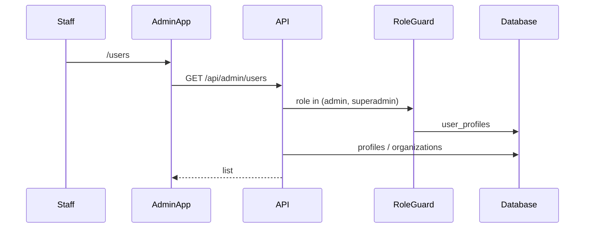

# Feature: Admin Console & Platform Ops

> Read-only reverse-engineering, 2026-09-06.

## Purpose

A separate Next.js app (`apps/admin`, port 3002) for ROAS staff: users, finances, observability, waitlist, machines, skill builder. Also a small in-product `/admin/ai-usage` page inside `apps/web`.

## User Capabilities

Platform `admin` / `superadmin` can:

- Browse users and orgs; open a per-user dashboard.
- Impersonate a user (control-plane endpoints + header).
- View unit economics, AI usage, errors, traces, mission reliability.
- Approve waitlist / issue invite codes.
- Author enterprise skills with an agent (`skill-builder`).
- Configure platform transactional email.
- Trigger machine pool replenish / idle-check.

## Entry Points

### Frontend (`apps/admin`)

| Path                                | File                             |
| ----------------------------------- | -------------------------------- |
| `/`                                 | `src/app/page.tsx` → dashboard   |
| `/dashboard`                        | `(protected)/dashboard/page.tsx` |
| `/users`, `/users/[kind]/[id]`      | users                            |
| `/finances`                         | finances                         |
| `/operations`, `/errors`, `/traces` | observability                    |
| `/waitlist`                         | waitlist                         |
| `/enterprise-applications`          | enterprise apps                  |
| `/mission-reliability`              | missions                         |
| `/instruction-governance`           | instruction gov                  |
| `/enterprise-tools/skill-builder`   | skill builder                    |
| `/settings/platform-email`          | platform email                   |
| `/dev-dashboard`                    | dev                              |
| `/login`, `/no-access`              | auth                             |

**No `/orgs` page exists** despite older docs mentioning one. **CONFIRMED** by glob of `apps/admin/src/app/**/page.tsx`.

`apps/admin` is **not in the deploy map** (`CLAUDE.md`). Last meaningful commit 2026-07-28 — **STALE**. Port **collides with `apps/funnels`**.

### Backend

`apps/api/src/modules/admin/` (~60 routes), `machines` (9), `waitlist`, `enterprise-applications`, plus `agent-api/modules/admin-skill-builder`.

## API Endpoints

Guarded with `AuthGuard, RoleGuard` and `@Roles('admin','superadmin')` unless noted.

| Area                         | Base                                                 |
| ---------------------------- | ---------------------------------------------------- |
| Users / orgs / impersonation | `/api/admin/**`                                      |
| Finances / billing health    | `/api/admin/billing-health/**`                       |
| AI usage                     | `/api/admin/ai-usage`, also `/admin/ai-usage` in web |
| Machines                     | `/api/machines/**`                                   |
| Waitlist / invite codes      | `/api/admin/waitlist`, `/api/admin/invite-codes`     |
| Skill builder                | `/api/admin/enterprise/skill-builder/**`             |
| Platform email               | `/api/admin/platform-email/**`                       |
| Client error sink            | `POST /api/log/client-error` (product app)           |

Impersonation: `/api/admin/impersonation/**`. The proxy **strips** the impersonation header on those paths so a user cannot impersonate via the control plane by forging headers through the proxy — but `AuthGuard` still honors the header on every other path. See `08-auth-security.md`.

## Main Files

| File                                    | Responsibility          |
| --------------------------------------- | ----------------------- |
| `apps/admin/src/app/`                   | Staff UI                |
| `apps/api/src/modules/admin/`           | Staff API               |
| `apps/web/src/features/admin-ai-usage/` | In-product usage charts |
| `apps/web/src/features/impersonation/`  | Impersonation banner    |

## Database Models / Tables

`organizations`, `profiles`, `user_profiles`, `ai_usage_events`, `app_errors`, `request_trace_events`, `vb_agent_traces`, `machine_pool`, `machine_status_snapshots`, `machine_wake_attempts`, `enterprise_applications`, `admin_skill_builder_sessions`, `admin_skill_builder_messages`, `skill_library`, `platform_email_config`, `superadmin_audit_log`.

## Business Logic

Staff JWT + `user_profiles.role ∈ {admin,superadmin}`. Impersonation sets a header that `AuthGuard` swaps onto `request.user`. Machine pool talks to Fly Machines API.

## Validation

RoleGuard is the gate. Some admin controllers also take raw ids from the path with service-role access — treat as break-glass.

## Permissions

Platform roles only. `admin` and `superadmin` short-circuit `RoleGuard` to allow-all. Org roles do not apply here.

## External Dependencies

Fly.io Machines, Stripe (finances), SendGrid (platform email), OpenRouter (usage).

## Background Jobs

Machine idle-check / pool replenish (cron + `MACHINE_POOL_REPLENISH_ENABLED`). Billing health nightly cron (LIKELY BROKEN — see billing).

## Frontend Flow

Staff logs into `apps/admin` → same Supabase session → calls `apps/api` admin routes.

## Backend Flow

`RoleGuard` reads `user_profiles.role` → service-role queries across tenants.

## Full Request Flow

## Error Handling

Non-staff → `/no-access`. Missing Fly key → machine console degrades.

## Test Scenarios

`apps/admin` has **zero tests**. `apps/api` admin module ~5 tests (impersonation). Console was **not started** this session.

## Known Problems

1. App not in deploy map; source stale.
2. Port 3002 collision with funnels.
3. Impersonation guard-level swap skips allowlist + audit log.
4. Inventory mentioned `/orgs` — route does not exist.
5. `POST /api/freeze-debug` in the **product** app is an unauthenticated debug sink.

## Related Features

Authentication, Billing, Machines / onboarding, Brain skill builder.

## Status

**WORKING** in code. **STALE / local-only** as a deployed surface. **UNVERIFIED** at runtime in this mapping.
