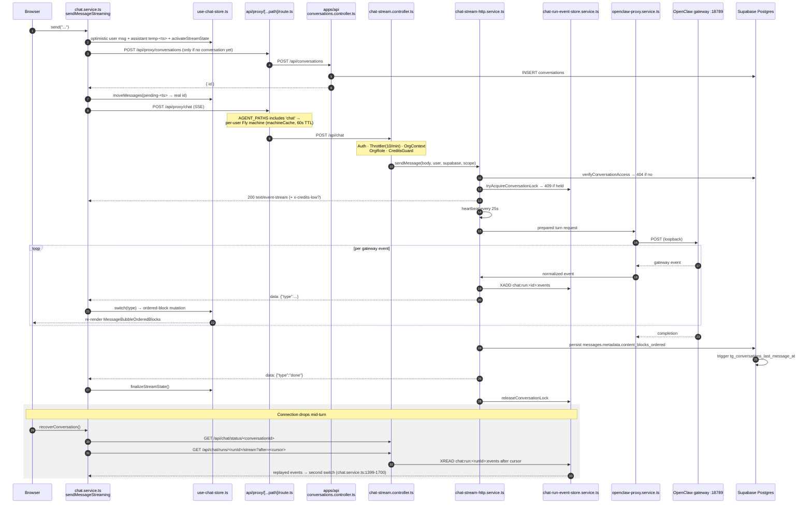

# Feature: Agent Runtime & Chat (SSE)

> Read-only reverse-engineering, 2026-09-05. Evidence tags: **CONFIRMED** (read in code),
> **LIKELY** (one inference hop), **UNKNOWN** (needs runtime access).
>
> **This document is the _feature_ view.** The hop-by-hop transport trace already exists in
> [`../10-background-processes.md`](../10-background-processes.md) § _Agent Run Lifecycle_ — read that
> for the wire protocol, the Redis run-event store internals and the queue/worker topology. What
> follows covers the chat **product**: the UI surfaces, conversation persistence, block rendering,
> streaming UX, stop/cancel/recovery, and the duplication in the frontend chat layer.

## Status

**WORKING, but the frontend chat layer is dangerously concentrated and internally duplicated.**
The pipeline is live end-to-end (browser → proxy → `apps/agent-api` → OpenClaw on loopback :18789 →
SSE back), with a Redis conversation lock, heartbeats, resumable run streams and per-user Fly.io
machine pinning. The problem is not the transport, it is the client: **one 2,993-line
`chat.service.ts` contains three separate SSE event switch statements**, a single 2,474-line Zustand
store is imported by five different features, and `/conversations` is implemented **twice** — once in
`apps/api` (reachable) and once in `apps/agent-api` (not routed to by the proxy).

## Purpose

One streaming agent conversation engine, reused by every chat surface in the product. A turn is:
persist the user message → assemble context (profile, campaign, space, brain, documents, references)
→ call the OpenClaw gateway → translate gateway output into a stable **SSE event vocabulary of 21
types** → mirror those events into a Redis stream so the turn survives a dropped connection → merge
them into an append-only **ordered content-block timeline** on the assistant message → persist and
render.

The key design decision is that **the assistant message is not a string**. It is an ordered array of
typed blocks (`text`, `tool`, `thinking_transcript`, `generation`, `session_compaction`, plus ~29
interactive card types) stored in `messages.metadata.content_blocks_ordered`. Streaming appends
blocks; rendering is a switch over block type. That is what makes tool traces, artifact previews,
confirm cards and clarification prompts all live inline in one thread.

## User Capabilities

Read from the chat UI code (`ChatInterface.tsx`, `ChatInput.tsx`, `MessageBubble.tsx`,
`SpaceVibeyChatPanel.tsx`):

- **Send a message and watch it stream** — thinking text, then tool calls with live progress, then
  the answer, with a phase-driven "orb" (`thinking` / `executing` / …) and rotating working labels
  (`CHAT_WORKING_LABELS`, `chat.service.ts:563`).
- **Stop a running generation** — `requestStopStream` (`chat.service.ts:882`) →
  `POST /api/chat/stop`; the local `AbortController` is also torn down (`abortStream`, line 846).
- **Queue messages while the agent is working** — `QueueItem` + `enqueueMessage`
  (`use-chat-store.ts:104`); used by `ProjectChatPane.tsx:74-77`.
- **Recover an interrupted turn** — a "resume" affordance driven by `needsStreamRecovery`
  (line 918) / `recoverConversation` (line 1017), which replays the run's Redis event stream via
  `GET /api/chat/runs/:runId/stream`.
- **Pick a model per conversation** — `ComposerModelPicker.tsx`,
  `persistConversationModelPrefs` (line 1839) → `conversations.default_model_id`.
- **Attach documents / reference artifacts / @-mention entities** — `documents`,
  `highlighted_artifacts`, `message_references`, `ui_selected_artifact` on the send body;
  `chat-input-at-mention-menu-view.tsx`, `chat-input-plus-menu-view.tsx`.
- **Answer inline interactive cards** without leaving the thread — `clarification`, `single_choice`,
  `email_send_confirm`, `delete_confirm`, `meta_publish_confirm`, `integration_connect`,
  `agent_access_request`, `agent_hire_suggestion`, `work_request` (see [Rendering](#main-files)).
- **See what the agent read** — `retrieval_receipt` and `web_source` events populate a sources panel
  (`apply-retrieval-receipt-event.ts`, `lib/conversations/retrieval-receipts.ts`).
- **See context-window usage** — `context_update` events carry a `ContextBreakdown`;
  `useLiveContextEstimate.ts` and `GET /api/chat/conversations/:id/context-baseline` back the meter.
- **Fork, duplicate, rename, delete, auto-title, archive conversations** — `forkConversation`
  (line 1783), `duplicateConversation` (1817), `suggestConversationTitle` (1777),
  `conversation-title-scheduler.ts`.
- **Share a conversation / hand it off** — `POST /api/conversations/:id/shares` and
  `…/shares/pass-off` (`conversation-shares.controller.ts:47,66`).
- **Attach a conversation to a Space or Campaign** — `assignConversationSpace` (line 1827);
  the scope is stored in `conversations.metadata.space_id`.
- **Browse conversation assets** — `GET /api/conversations/assets`
  (`conversations.controller.ts:115`), `fetchConversationAssets` (line 2018).
- **Delete a message and everything after it** ("rewind") —
  `DELETE /api/conversations/:id/messages-from/:messageId` (`conversation-messages.controller.ts:91`).
- **Chat with a _specific_ agent** — `getOrCreateAgentConversation` (line 1747),
  `AgentChatPanel.tsx`; see [`agents-and-teams.md`](./agents-and-teams.md).

## Entry Points

### Frontend

Five distinct chat surfaces, **all sharing one engine**:

| Surface             | Component                                                                                                             | Lines       | Notes                                                                                           |
| ------------------- | --------------------------------------------------------------------------------------------------------------------- | ----------- | ----------------------------------------------------------------------------------------------- |
| `/studio`           | `app/(dashboard)/studio/page.tsx` → `features/studio/containers/StudioContainer.tsx` → `components/ChatInterface.tsx` | 609 / 1,077 | The canonical chat + artifact-preview workspace                                                 |
| Space chat panel    | `features/spaces/components/chat/SpaceVibeyChatPanel.tsx`                                                             | 2,664       | Imports `@/features/studio/store/use-chat-store` (line 68) and `sendMessageStreaming` (line 59) |
| Per-agent chat      | `features/team/components/AgentChatPanel.tsx`                                                                         | 1,514       | Imports the same engine (lines 36-39)                                                           |
| Team-2 HR side chat | `features/team-2/components/hr-side-chat/TeamHrSideChatPanel.tsx`                                                     | 694         | Imports `useChatStore` (line 41)                                                                |
| Project chat        | `features/projects/components/ProjectChatPane.tsx`                                                                    | 586         | Imports the same engine (lines 21-25)                                                           |
| Global chat drawer  | `components/global-chat/containers/GlobalChatPanel.tsx` + `components/shell/ShellChatDrawer.tsx`                      | —           | Owns _work context_ (`store/use-global-chat-store.ts`, 359 lines), not the stream               |
| Channel chat        | `features/channels/containers/ChannelChatContainer.tsx`                                                               | 399         | **Does not** use this engine — Slack/Telegram inbound goes to `channel-chat.controller.ts`      |

**CONFIRMED cross-feature coupling.** `features/studio` is a de facto shared surface: four other
features import its private internals (`store/use-chat-store`, `services/chat.service`). AGENTS.md §4
forbids exactly this ("never import private feature internals"), and
`documentation/frontend-shared-surfaces.md` is the register this should have been promoted into.

### Backend

`apps/agent-api/src/modules/chat` — **168 files, 31,652 lines**, six controllers:

| Controller                            | Base path                       | Guards                                                                             |
| ------------------------------------- | ------------------------------- | ---------------------------------------------------------------------------------- |
| `chat-stream.controller.ts`           | `chat`                          | `AuthGuard, ThrottlerGuard, OrgContextGuard, OrgRoleGuard, CreditsGuard` (line 31) |
| `chat.controller.ts`                  | `chat` (prewarm)                | same (line 34)                                                                     |
| `chat-status.controller.ts`           | `chat` (status/baseline/resume) | same (line 30)                                                                     |
| `browser-media.controller.ts`         | `chat/browser-media`            | `AuthGuard, ThrottlerGuard, OrgContextGuard, OrgRoleGuard` (line 12)               |
| `channel-chat.controller.ts`          | `channel-chat`                  | `ChannelServiceGuard` (line 23) — service-to-service                               |
| `internal-chat-runtime.controller.ts` | `internal/chat`                 | `RuntimeIdentityGuard` (line 22) — worker callback                                 |

`apps/api/src/modules/conversations` — five controllers, all
`AuthGuard, ThrottlerGuard, OrgContextGuard, OrgRoleGuard`: `conversations`, `conversation-messages`,
`conversation-records`, `conversation-shares`, `conversation-connections`.

**Routing.** `apps/web/src/app/api/proxy/[...path]/route.ts:34` sets
`AGENT_PATHS = ['chat', 'apps', 'project-files']` and line 37
`AGENT_SUBPATHS = ['brain/live-session']`. So `/api/chat*` → agent backend, `/api/conversations*` →
platform API. The proxy resolves the agent target **per user to a dedicated Fly.io machine**
(`machineCache`, 60 s TTL, line 47-49; `AgentRuntimeSource = 'fly' | 'shared-railway' |
'fallback-agent'`, line 39), falling back to `AGENT_BACKEND_URL`.

## API Endpoints

| Method          | Route                                                      | Handler                                              | Purpose                                                      |
| --------------- | ---------------------------------------------------------- | ---------------------------------------------------- | ------------------------------------------------------------ |
| POST            | `/api/chat`                                                | `chat-stream.controller.ts:36` — throttle **10/min** | Send a message, return an SSE stream                         |
| POST            | `/api/chat/stop`                                           | `chat-stream.controller.ts:49` — throttle 30/min     | Cancel the active run                                        |
| POST            | `/api/chat/prewarm`                                        | `chat.controller.ts:39` — throttle 60/min            | Warm the turn context cache before the user sends            |
| GET             | `/api/chat/status/:conversationId`                         | `chat-status.controller.ts:63`                       | Is a run active, and which one                               |
| GET             | `/api/chat/conversations/:conversationId/context-baseline` | `chat-status.controller.ts:38`                       | Context-window baseline for the meter                        |
| GET             | `/api/chat/runs/:runId/stream`                             | `chat-status.controller.ts:98`                       | **Resume**: replay a run's Redis event stream after a cursor |
| GET             | `/api/chat/browser-media/:filename`                        | `browser-media.controller.ts:24`                     | Serve agent browser screenshots                              |
| POST            | `/api/channel-chat`                                        | `channel-chat.controller.ts:34`                      | Inbound Slack/Telegram turn (service guard)                  |
| POST            | `/api/internal/chat/runs/:runId/execute`                   | `internal-chat-runtime.controller.ts:36`             | Worker claims and executes a queued run                      |
| POST            | `/api/internal/chat/runs/:runId/fail`                      | `internal-chat-runtime.controller.ts:139`            | Worker reports failure                                       |
| GET             | `/api/conversations`                                       | `conversations.controller.ts:43`                     | List, ordered by `last_message_at DESC`                      |
| GET             | `/api/conversations/shared-with-me`                        | `conversations.controller.ts:66`                     | Conversations shared to me                                   |
| POST            | `/api/conversations`                                       | `conversations.controller.ts:75`                     | Create                                                       |
| POST            | `/api/conversations/suggest-title`                         | `conversations.controller.ts:93`                     | LLM title suggestion                                         |
| GET             | `/api/conversations/assets`                                | `conversations.controller.ts:115`                    | Assets across conversations                                  |
| GET             | `/api/conversations/:id/messages`                          | `conversation-messages.controller.ts:29`             | Paged message history                                        |
| PATCH           | `/api/conversations/:id/messages/:messageId`               | `conversation-messages.controller.ts:53`             | Patch message metadata (block state)                         |
| POST            | `/api/conversations/:id/mission-receipts`                  | `conversation-messages.controller.ts:73`             | Attach mission receipts to a turn                            |
| DELETE          | `/api/conversations/:id/messages-from/:messageId`          | `conversation-messages.controller.ts:91`             | Rewind                                                       |
| PATCH/DELETE    | `/api/conversations/:id`                                   | `conversation-records.controller.ts:121,104`         | Rename/metadata; delete                                      |
| POST            | `/api/conversations/:id/read` · `…/auto-title` · `…/fork`  | `conversation-records.controller.ts:36,53,85`        | Read receipts, auto-title, fork                              |
| GET/POST/DELETE | `/api/conversations/:id/shares[/:shareId]`                 | `conversation-shares.controller.ts:30,47,85`         | Sharing                                                      |
| POST            | `/api/conversations/:id/shares/pass-off`                   | `conversation-shares.controller.ts:66`               | Hand a conversation to someone else                          |
| GET/POST/DELETE | `/api/conversations/:id/connections[/…]`                   | `conversation-connections.controller.ts:27,37,56`    | Link a conversation to entities                              |

Full inventory: [`../05-api-map.md`](../05-api-map.md).

## Main Files

### Frontend engine

| File                                                                                                                              | Lines     | Responsibility                                                                                                                                   |
| --------------------------------------------------------------------------------------------------------------------------------- | --------- | ------------------------------------------------------------------------------------------------------------------------------------------------ |
| `apps/web/src/features/studio/services/chat.service.ts`                                                                           | **2,993** | The whole client protocol: send, SSE parse, recovery, stop, conversation CRUD. **Three SSE switches** — see [Known Problems](#known-problems) #1 |
| `apps/web/src/features/studio/store/use-chat-store.ts`                                                                            | **2,474** | Per-conversation streaming state, message maps, ordered-block mutators, queue, unread, credits                                                   |
| `apps/web/src/features/studio/services/stream-resilience.ts`                                                                      | 60        | Stall watchdog: `STREAM_STALL_CHECK_INTERVAL_MS = 5_000`, `STREAM_STALL_TIMEOUT_MS = 60_000`                                                     |
| `apps/web/src/features/studio/services/chat-resume-context.ts`                                                                    | —         | Cursor bookkeeping for resume                                                                                                                    |
| `apps/web/src/features/studio/services/conversation-load-errors.ts`                                                               | —         | Load-failure classification                                                                                                                      |
| `apps/web/src/features/studio/services/conversation-title-scheduler.ts`                                                           | —         | Debounced auto-title                                                                                                                             |
| `apps/web/src/features/studio/services/apply-retrieval-receipt-event.ts`                                                          | —         | `retrieval_receipt` / `web_source` → sources panel                                                                                               |
| `apps/web/src/features/studio/config/chat-stream-errors.config.ts`                                                                | —         | User-facing stream failure copy (`resolveChatStreamFailure`)                                                                                     |
| `apps/web/src/features/studio/config/chat-toast-errors.config.ts`, `studio-inline-errors.config.ts`, `chat-file-status.config.ts` | —         | The rest of the user-facing copy                                                                                                                 |
| `apps/web/src/lib/conversations/*` (25 files)                                                                                     | —         | Conversation list sectioning, activity, titles, retrieval receipts — correctly extracted out of the feature                                      |

### Frontend rendering

| File                                                                                                                                      | Responsibility                                 |
| ----------------------------------------------------------------------------------------------------------------------------------------- | ---------------------------------------------- |
| `features/studio/components/MessageBubble.tsx`                                                                                            | Message shell                                  |
| `features/studio/components/message-bubble/MessageBubbleOrderedBlocks.tsx`                                                                | Walks `content_blocks_ordered`                 |
| `…/MessageContentBlockSwitch.tsx` + `…SwitchPartA.tsx` + `…SwitchPartB.tsx` + `…SwitchMeta.tsx`                                           | The block-type switch, split across four files |
| `…/FinalOutputCards.tsx`, `DraftVersionsCard.tsx`, `PdfCard.tsx`, `MarkdownContent.tsx`, `AssistantActions.tsx`                           | Terminal-block renderers                       |
| `features/studio/components/chat/AgentConversationThread.tsx` (1,063)                                                                     | Thread layout                                  |
| `features/studio/components/chat/StatusIndicator.tsx`                                                                                     | Phase orb / working label                      |
| `features/studio/components/chat/EmailSendConfirmCard.tsx` (635), `IntegrationConnectCard.tsx` (397), `meta/MetaPublishConfirm.tsx` (395) | Interactive cards                              |
| `components/chat/PlanStickyTracker.tsx`                                                                                                   | Pins the `chat_plan` block                     |

**34 renderable block types** (CONFIRMED, enumerated from the switch files):
`text`, `thinking_transcript`, `tool`, `generation`, `session_compaction`, `image`, `file`, `pdf`,
`pdf_file`, `docx_file`, `document_card`, `media_asset`, `artifact_preview`, `widget_preview`,
`project_preview`, `browser_screenshot`, `calculator`, `chat_plan`, `clarification`, `single_choice`,
`work_request`, `email_send_confirm`, `email_send_status`, `delete_confirm`, `delete_status`,
`integration_connect`, `agent_integration_confirm`, `agent_access_request`, `agent_hire_suggestion`,
`agent_conversation`, `meta_config`, `meta_ad_accounts`, `meta_publish_confirm`, `meta_status`.

### Backend (`apps/agent-api/src/modules/chat`)

Well decomposed — the largest non-test service is 638 lines, in sharp contrast to the frontend.

| File                                                                                                                     | Lines     | Responsibility                                                                                                                                                                                           |
| ------------------------------------------------------------------------------------------------------------------------ | --------- | -------------------------------------------------------------------------------------------------------------------------------------------------------------------------------------------------------- |
| `services/chat-stream-http.service.ts`                                                                                   | 410       | The SSE endpoint body: access check, Redis lock, headers, heartbeat, `writeSse`, Redis reader, `stopStream`                                                                                              |
| `services/chat-run-event-store.service.ts`                                                                               | 638       | Redis run-event store — keys `chat:run:<id>:events` (XADD/XREAD stream), `chat:run:<id>:meta`, `chat:conversation:<id>:active_run`, `chat:conversation:<id>:lock` (`chat-run-event-store-utils.ts:6-20`) |
| `services/chat.service.ts`                                                                                               | 602       | `verifyConversationAccess`, message persistence, turn orchestration                                                                                                                                      |
| `services/chat-stream-execution.service.ts`                                                                              | 568       | Drives one turn through the gateway                                                                                                                                                                      |
| `services/chat-turn-gateway-preparation.service.ts`                                                                      | 577       | Builds the gateway request                                                                                                                                                                               |
| `services/chat-prewarm-context.service.ts` + `chat-prewarm-cache.service.ts`                                             | 595 + 412 | Pre-assembled turn context                                                                                                                                                                               |
| `services/chat-stable-turn-context.service.ts`                                                                           | —         | Stable per-turn context (incl. user-brain access)                                                                                                                                                        |
| `services/openclaw-proxy.service.ts` + `openclaw-stream-{reader,content,tool,lifecycle,state}.service.ts`                | —         | Gateway transport and gateway→SSE translation                                                                                                                                                            |
| `services/openclaw-gateway-request.service.ts`                                                                           | 473       | Request assembly for OpenClaw                                                                                                                                                                            |
| `services/chat-ordered-blocks.service.ts`                                                                                | —         | Server-side authority on `content_blocks_ordered` (`text`, `tool`, `generation`, `session_compaction`, `thinking_transcript`)                                                                            |
| `services/chat-stream-recovery.service.ts`                                                                               | —         | Resume-from-cursor                                                                                                                                                                                       |
| `services/chat-stream-mirror.service.ts` · `chat-progressive-stream.service.ts` (436)                                    | —         | Event mirroring / progressive delivery                                                                                                                                                                   |
| `services/stream-registry.service.ts`                                                                                    | 84        | **In-process** `Map` of active streams + `AbortController`s                                                                                                                                              |
| `services/agent-runtime-queue.service.ts`                                                                                | —         | Enqueue a run for the mission/queue worker path                                                                                                                                                          |
| `services/chat-context-accounting.service.ts` · `openrouter-cost.service.ts`                                             | —         | Token/context accounting, cost                                                                                                                                                                           |
| `services/chat-completion-side-effects.service.ts` · `chat-turn-completion.service.ts` · `chat-turn-terminal.service.ts` | —         | Post-turn effects and terminal states                                                                                                                                                                    |
| `chat-stream-errors.ts` + `config/errors.config.ts`                                                                      | —         | Structured error contract (AGENTS.md §8.6)                                                                                                                                                               |
| `utils/secret-redaction.util.ts`                                                                                         | —         | Redacts secrets from streamed tool output                                                                                                                                                                |

## Database Tables

Cross-reference [`../06-database-map.md`](../06-database-map.md).

| Table                           | Columns that matter here                                                                                                                                                                                                                                                                                                                                                                                                                             |
| ------------------------------- | ---------------------------------------------------------------------------------------------------------------------------------------------------------------------------------------------------------------------------------------------------------------------------------------------------------------------------------------------------------------------------------------------------------------------------------------------------- |
| `conversations`                 | `id`, `user_id`, `campaign_id`, `org_id` (added `20260327100001_add_org_id_to_existing_tables.sql:13`), `title`, `agent_id` (**TEXT**, e.g. `'vibey'`), `status ∈ {active, archived}`, `metadata` JSONB, `default_model_id` (`20260217093137_add_model_selection_columns.sql`), `last_message_at` + index + trigger `tg_conversations_last_message_at` (`20260804161000_conversations_last_message_at.sql`). Base shape at `supabase/schema.sql:278` |
| `messages`                      | `conversation_id`, `role ∈ {user, assistant, system, tool}`, `content` TEXT, `content_blocks` JSONB, **`metadata` JSONB** — this is where `content_blocks_ordered` lives. `supabase/schema.sql:292`                                                                                                                                                                                                                                                  |
| `vb_message_timeline_events`    | Append-only per-turn UI timeline: `seq bigint GENERATED ALWAYS AS IDENTITY`, `message_id`, `type`, `payload`; indexed `(message_id, seq)` and `(conversation_id, seq)`. `supabase/migrations/025_vb_message_timeline_events.sql`                                                                                                                                                                                                                     |
| `agent_runtime_runs`            | `run_id` UNIQUE, `idempotency_key` UNIQUE, `workload_type ∈ {chat, brain, mission, artifact, automation, sub_agent}`, `status ∈ {queued, active, claimed, running, done, failed, cancelled, stale}`, `conversation_id`, `message_id`, `agent_key`, `gateway_agent_id`, `session_key`, `queue_name`, `job_id`, `worker_id`, `claimed_at`, `claim_expires_at`, `heartbeat_at`. `supabase/migrations/20260608192301_agent_runtime_runs.sql`             |
| `agent_runtime_run_checkpoints` | Mid-run checkpoints (`chat-run-checkpoint.service.ts`, `agent-edit-checkpoint.repository.ts`)                                                                                                                                                                                                                                                                                                                                                        |
| `conversation_shares`           | `conversation-permissions.repository.ts:54`                                                                                                                                                                                                                                                                                                                                                                                                          |
| `conversation_reads`            | Unread state — `conversation-activity.repository.ts:25`, `is_unread`                                                                                                                                                                                                                                                                                                                                                                                 |
| `conversation_connections`      | Conversation ↔ entity links — `conversation-connections.controller.ts`                                                                                                                                                                                                                                                                                                                                                                               |
| `conversation_documents`        | Artifacts produced in a conversation: `document_type`, `content` JSONB, `resource_id`, `archived_at`. `supabase/schema.sql:302`                                                                                                                                                                                                                                                                                                                      |

**`conversations` has no `space_id` column.** Space scoping is a JSONB filter:
`query.eq('metadata->>space_id', filters.space_id)` (`conversations.repository.ts:82`) — unindexed
unless a JSONB expression index exists (**UNKNOWN**).

## Business Logic

**Backend: correct.** 168 files, largest service 638 lines, clear seams (context assembly → gateway
preparation → gateway proxy → stream translation → ordered blocks → completion side effects), and it
honours the repo's error contract (`chat-stream-errors.ts`, `config/errors.config.ts`).

**Frontend: not correct.** The protocol logic sits in two enormous modules:

1. **`chat.service.ts` (2,993 lines) is a protocol implementation posing as a service.** It holds
   module-level mutable state (`activeControllers`, `activeRecoveries`,
   `activeRecoveryContinuations`, `automaticRecoveryTurnIds`), the full SSE parser, and the
   conversation REST client. `sendMessageStreaming` alone runs lines **2049-2900+**.
2. **`use-chat-store.ts` (2,474 lines) is the state machine.** Per-conversation maps for streaming /
   reconnecting / interrupted / stopping / stream-failure, the ordered-block mutators
   (`pushToolToOrderedBlocks`, `appendToolProgressToOrderedBlocks`,
   `completeThinkingTranscriptInOrderedBlocks`, `pushSessionCompactionToOrderedBlocks`), the message
   queue, unread flags, and truncation budgets (`MAX_TOOL_PROGRESS_ENTRIES = 20`,
   `MAX_TOOL_PREVIEW_CHARS = 8_000`, lines 646-648).

Pure logic _is_ extracted where it can be — `mergeOrderedContentBlocks` (line 276),
`bucketChatStatusMessage` (725), `shouldApplyStatusUpdate` (770), `isRealAgentStreamEvent` (530) —
and each has a co-located test (`chat-message-merge.test.ts`, `chat-stream-interruption.test.ts` at
906 lines, `stream-resilience.test.ts`, `chat-resume-context.test.ts`). The ordered-block
vocabulary is defined on **both** sides (`chat-ordered-blocks.service.ts` server, `use-chat-store.ts`
client) with no shared package type — a contract maintained by convention.

## Validation

- **Send body**: hand-checked, not Zod — `if (!conversation_id || !content) → 400`
  (`chat-stream-http.service.ts:108-111`). `ChatStopBody` likewise: missing `conversation_id` → 400
  (line 367).
- **Access**: `chatService.verifyConversationAccess(supabase, conversation_id, user.id, scope.orgId,
scope.orgRole, 'edit')` before both send (line 113) and stop (line 373); failure returns **404**,
  not 403 — deliberate existence-hiding.
- **Concurrency**: `tryAcquireConversationLock` (Redis) **or** `streamRegistry.isActive` → **409**
  with `'A generation is already in progress.'` (lines 127-137). The client retries a 409 three times
  with `CHAT_SEND_CONFLICT_RETRY_DELAYS_MS = [100, 250, 500]` (`chat.service.ts:577`).
- **Credits**: `CreditsGuard` on every authenticated chat controller; **402** is the credits-exhausted
  signal, converted client-side into the sentinel `'__CREDITS_EXHAUSTED__'` (`chat.service.ts:2389`),
  and `x-credits-low` / `x-credits-remaining` response headers drive a warning banner (2397-2401).
- **Rate limits**: `@Throttle` 10/min on send, 30/min on stop, 60/min on prewarm.
- **Output**: `response-filter.service.ts` and `utils/secret-redaction.util.ts` scrub the stream.
- **Pending IDs**: the client validates its own optimistic IDs — `isPendingConversationId` treats
  `pending-*` as "no conversation exists yet" (`chat.service.ts:2055-2062`).

## Permissions

| Layer              | Mechanism                                                                                                                                   |
| ------------------ | ------------------------------------------------------------------------------------------------------------------------------------------- |
| Auth               | `AuthGuard` on all user-facing chat and conversation controllers (no global guard — see [`../08-auth-security.md`](../08-auth-security.md)) |
| Org scope          | `OrgContextGuard` + `OrgRoleGuard`; `apps/agent-api/src/modules/chat/__tests__/chat-org-scoping.test.ts` exists for this                    |
| Per-conversation   | `verifyConversationAccess(..., 'edit')`, backed by `conversation_shares` (`conversation-permissions.repository.ts`)                         |
| Sharing            | `conversation_shares` + `POST …/shares/pass-off` for handoff                                                                                |
| Service-to-service | `ChannelServiceGuard` (Slack/Telegram), `RuntimeIdentityGuard` (worker → `internal/chat`)                                                   |
| Credits            | `CreditsGuard` → 402                                                                                                                        |
| Agent runtime      | Per-user Fly machine pinning in the proxy; `machine-target` lookup via `/api/admin/impersonation/machine-target/:userId` (`route.ts:277`)   |

⚠️ Same caveat as everywhere else: `OrgRoleGuard` passes through when `x-org-id` is absent
([`../08-auth-security.md`](../08-auth-security.md) finding #3). Chat is partly protected by
`verifyConversationAccess`, which checks `user.id` independently of the org header.

## External Dependencies

| Dependency                                              | Role                                                                                                                                                                           |
| ------------------------------------------------------- | ------------------------------------------------------------------------------------------------------------------------------------------------------------------------------ |
| **OpenClaw gateway** (`apps/openclaw`, loopback :18789) | The actual agent runtime. `integrations/openclaw-gateway.client.ts`, `openclaw-proxy.service.ts`                                                                               |
| **OpenRouter** (+ provider keys)                        | Model calls; cost accounting in `openrouter-cost.service.ts`, catalog in `model-registry.ts`                                                                                   |
| **Anthropic Claude / OpenAI Codex admin auth**          | `anthropic-claude-admin-auth.service.ts`, `openai-codex-admin-auth.service.ts`                                                                                                 |
| **Redis**                                               | Run event streams, conversation locks, prewarm cache                                                                                                                           |
| **Supabase Postgres**                                   | `conversations`, `messages`, `vb_message_timeline_events`, `agent_runtime_runs`                                                                                                |
| **Fly.io**                                              | Per-user agent machines (`AgentRuntimeSource = 'fly'`) — [`../02-how-to-run.md`](../02-how-to-run.md)                                                                          |
| **Slack / Telegram**                                    | Inbound turns via `channel-chat.controller.ts`                                                                                                                                 |
| **Composio, Meta, Gmail/Outlook, Stripe, …**            | Reached as agent tools; the confirm cards (`meta_publish_confirm`, `email_send_confirm`, `integration_connect`) are their UI. [`../09-integrations.md`](../09-integrations.md) |

## Background Jobs

Full detail in [`../10-background-processes.md`](../10-background-processes.md).

| Job                        | Trigger                                                                                   | Relationship to chat                                                                                    |
| -------------------------- | ----------------------------------------------------------------------------------------- | ------------------------------------------------------------------------------------------------------- |
| Redis run-event mirror     | Every SSE event during a turn                                                             | Makes the turn resumable; TTL-bounded (`this.ttlSeconds`, `chat-run-event-store.service.ts:237,269`)    |
| `agent-runtime-queue` runs | `agent-runtime-queue.service.ts` → worker → `POST /api/internal/chat/runs/:runId/execute` | The **async** path for long turns; `agent_runtime_runs.claim_expires_at` + `heartbeat_at` are the lease |
| Stall watchdog (client)    | `setInterval` 5 s, 60 s timeout (`stream-resilience.ts:16-17`)                            | Marks a silent stream interrupted and offers resume                                                     |
| Heartbeat (server)         | `setInterval` 25 s writing `': heartbeat\n\n'` (`chat-stream-http.service.ts:154-162`)    | Keeps proxies from closing the SSE connection                                                           |
| Auto-title                 | `conversation-title-scheduler.ts` → `POST /api/conversations/:id/auto-title`              | Names the conversation after the first turn                                                             |
| Prewarm                    | `createChatPrewarmScheduler` (`chat.service.ts:688`) → `POST /api/chat/prewarm`           | Assembles context while the user is still typing                                                        |

## Frontend Flow

`sendMessageStreaming` (`chat.service.ts:2049`), in the order the code actually does it — the
optimistic UI is deliberately ahead of the network:

```text
1. Resolve conversation id; `pending-<ts>` if none exists yet     (:2055-2065)
2. abortStream(conversationId); new AbortController               (:2070-2073)
3. Auto-skip any unanswered `clarification` blocks                (:2075-2100)
4. Optimistic USER message + immediate title from first message   (:2102-2154)
5. Optimistic ASSISTANT placeholder `temp-<ts>` + activateStreamState (:2156-2196)
6. IF no conversation: POST /api/conversations, then moveMessages(pending → real) (:2242-2288)
7. POST /api/chat  (+ up to 3 retries on 409)                     (:2385-2395)
8. Read response.body as a stream; split on '\n'; parse `data:` lines (:2404-2436)
9. switch (event.type) over 21 event types → store mutations      (:2440-2834)
10. finalizeStreamState(): drop controller, merge messages, set unread if backgrounded (:2314-2330)
```

Every event calls `touchSse()` → `touchAgentEvent` + `touchStreamActivity`, which is what the 60 s
stall watchdog reads. Status transitions are rate-limited to `CHAT_STATUS_MIN_DISPLAY_MS = 900`
(line 576) so labels do not flicker; `bucketChatStatusMessage` collapses raw gateway phases into the
small UI vocabulary.

**Recovery** is a second, parallel implementation: `recoverConversation` (line 1017) checks
`GET /api/chat/status/:conversationId`, then replays `GET /api/chat/runs/:runId/stream?after=<cursor>`
through its **own** switch (lines 1399-1700), and `applyRecoveredTimelineEvents` (line 100) has a
**third** switch (lines 128-246) for the `vb_message_timeline_events` replay.

## Backend Flow

```text
POST /api/chat                                chat-stream.controller.ts:36
  guards: Auth · Throttler(10/min) · OrgContext · OrgRole · Credits
  → ChatStreamHttpService.sendMessage         chat-stream-http.service.ts
      400 if !conversation_id || !content
      verifyConversationAccess(...,'edit')    → 404
      tryAcquireConversationLock (Redis)      → 409 if held or streamRegistry.isActive
      SSE headers: text/event-stream, no-cache/no-transform,
                   keep-alive, X-Accel-Buffering: no, x-vibey-request-id
      res.flushHeaders(); heartbeat every 25s; res.req.on('close') → clientAlive=false
      streamRegistry.setAbortController(conversationId, generationAbort)
  → chat-turn-bootstrap / chat-stable-turn-context / chat-prewarm-cache
      assemble: profile · campaign · space · integrations · documents · references · brain
  → chat-turn-gateway-preparation → openclaw-gateway-request → openclaw-proxy
      POST to the OpenClaw gateway on loopback :18789
  → openclaw-stream-reader / -content / -tool / -lifecycle
      translate gateway output → the 21-type SSE vocabulary
      each event: writeSse(type, data)  AND  chatRunEvents.append (Redis XADD)
      (if CHAT_STREAM_REDIS_READER is on, the HTTP response is fed from the
       Redis stream instead of directly — `directSseForwarding`, :165-168)
  → chat-ordered-blocks.service       authoritative content_blocks_ordered
  → chat-turn-completion / chat-completion-side-effects
      persist message, update conversations.last_message_at (DB trigger),
      credits, cost, skill-recommendation events, contact linking
  finally: release conversation lock, clearInterval(heartbeat)
```

## Full Request Flow



## Error Handling

| Failure                             | Behaviour                                                                                                                             | Evidence                                      |
| ----------------------------------- | ------------------------------------------------------------------------------------------------------------------------------------- | --------------------------------------------- |
| Missing `conversation_id`/`content` | 400 JSON                                                                                                                              | `chat-stream-http.service.ts:108-111`         |
| No access to conversation           | **404** (not 403)                                                                                                                     | `chat-stream-http.service.ts:114-125`         |
| Generation already running          | 409 + message; client retries 3× at 100/250/500 ms                                                                                    | `:127-137`; `chat.service.ts:577`             |
| Credits exhausted                   | 402 → `'__CREDITS_EXHAUSTED__'` → upsell UI                                                                                           | `chat.service.ts:2387-2389`                   |
| Credits low                         | `x-credits-low` header → `setCreditsLow(true, n)` banner                                                                              | `chat.service.ts:2397-2401`                   |
| Any other non-OK                    | `resolveChatStreamFailure({code:'generic'})` → `ChatStreamUserError` with user-facing copy from `config/chat-stream-errors.config.ts` | `chat.service.ts:2392`                        |
| Client disconnect                   | `res.req.on('close')` → `clientAlive = false`; writes become no-ops; **the gateway turn keeps running** and keeps mirroring to Redis  | `chat-stream-http.service.ts:149-152,170-180` |
| Redis lock unavailable              | `.catch(() => true)` — **fails open**, concurrency guard silently degrades to the in-process registry                                 | `chat-stream-http.service.ts:127-129`         |
| Redis reader failure                | Logged warning, returns `[]`, loop re-checks run meta and breaks if not active                                                        | `:185-190`                                    |
| Stream silent >60 s                 | Client marks the conversation interrupted and offers resume                                                                           | `stream-resilience.ts:16-17`                  |
| `error` SSE event                   | `shouldMarkConversationInterruptedForStreamError` decides interrupted vs terminal                                                     | `chat.service.ts:547`                         |
| Conversation create fails           | `reportStudioError('conversation_creation_failed')`, message marked with that metadata, stream state torn down, error rethrown        | `chat.service.ts:2276-2288`                   |
| `stop` on a run that is not current | `{ stopped: false }` unless `run_id` matches or falls back to `abortIfMessageId`                                                      | `chat-stream-http.service.ts:386-399`         |
| Tool output too large               | Truncated at `MAX_TOOL_PREVIEW_CHARS = 8_000`, `MAX_TOOL_PROGRESS_ENTRIES = 20`                                                       | `use-chat-store.ts:646-648`                   |
| Secrets in tool output              | Redacted before streaming                                                                                                             | `utils/secret-redaction.util.ts`              |
| Structured tool errors              | `chat-stream-errors.ts` + `config/errors.config.ts` per AGENTS.md §8.6                                                                | both files                                    |

## Test Scenarios

1. **Watch the SSE wire.** Open `/studio`, DevTools → Network → the `/api/proxy/chat` request →
   _EventStream_. Send "list my spaces". You will see `message_start`, `status`, `tool_start`,
   `tool_update`, `tool_end`, `content_delta`, `done`, plus `: heartbeat` lines every 25 s. This one
   exercise teaches the whole protocol.
2. **Prove the optimistic UI is ahead of the network.** Throttle to "Slow 3G" and send. Your message
   and the thinking orb appear **before** `POST /api/conversations` returns — steps 4-5 of
   [Frontend Flow](#frontend-flow) precede step 6.
3. **Trigger the 409 lock.** With a turn in flight, `POST /api/chat` again with the same
   `conversation_id` from a REST client. You get
   `409 "A generation is already in progress."`. Watch the browser retry at 100/250/500 ms.
4. **Stop mid-turn.** Start a long turn, hit stop, and confirm `POST /api/chat/stop` returns
   `{ stopped: true }` and the Redis run is cancelled (`cancelRun(runId, 'cancelled by user')`).
5. **Kill the connection and resume.** Start a long turn, then close the tab. Reopen the
   conversation: `GET /api/chat/status/:id` reports an active run and
   `GET /api/chat/runs/:runId/stream` replays it. This proves the Redis mirror is the durable copy,
   not the HTTP response.
6. **Break the stall watchdog on purpose.** Suspend the machine mid-turn for >60 s. The conversation
   flips to interrupted via `stream-resilience.ts`, not via any server signal.
7. **Read one message's real shape.** `GET /api/conversations/:id/messages`, then inspect
   `metadata.content_blocks_ordered` on an assistant message that used tools. Compare the array to
   what `MessageContentBlockSwitch*.tsx` renders — this is the core data model.
8. **Confirm one engine, five surfaces.** Open `/studio`, a Space chat panel, and an agent chat panel.
   All three read the same `useChatStore`; a turn started in one is visible as streaming state in the
   others. `SpaceVibeyChatPanel.tsx:68` is the import that makes this true.
9. **Find the duplicate conversations API.** `POST /api/conversations` (platform) works. Now call
   `apps/agent-api` directly on `/api/conversations` — the same route exists there
   (`apps/agent-api/src/modules/conversations/controllers/conversations.controller.ts:58`) but the
   proxy never sends traffic to it, because `conversations` is not in `AGENT_PATHS`.
10. **Rewind a thread.** `DELETE /api/conversations/:id/messages-from/:messageId` and confirm the
    tail is removed both in the DB and in the store.
11. **Exhaust credits (staging).** Drop the credit balance to zero and send: `CreditsGuard` returns
    402 and the client throws `__CREDITS_EXHAUSTED__` rather than a generic stream error.

## Known Problems

| #   | Problem                                                                                                                                                                                                                                                                                                                                                                                                                                                                                                                                                                                                                                      | Severity                       | Evidence                                                                                                                     |
| --- | -------------------------------------------------------------------------------------------------------------------------------------------------------------------------------------------------------------------------------------------------------------------------------------------------------------------------------------------------------------------------------------------------------------------------------------------------------------------------------------------------------------------------------------------------------------------------------------------------------------------------------------------- | ------------------------------ | ---------------------------------------------------------------------------------------------------------------------------- |
| 1   | **`chat.service.ts` contains three separate SSE `switch` statements** — send (`:2440-2834`, all 21 event types), recovery (`:1399-1700`, ~15 types), timeline replay (`:128-246`, ~10 types). Adding an event type means editing three places, and the recovery switch is already behind (no `credit_update`, `file_changed`, `file_deleted`, `rate_limit_notice`, `credits_exhausted`)                                                                                                                                                                                                                                                      | **CRITICAL (correctness)**     | `rg "case '"` over the three ranges                                                                                          |
| 2   | **A 2,993-line service and a 2,474-line store are the single point of failure for all chat.** Both far exceed the architecture LOC limits, and four other features import them directly                                                                                                                                                                                                                                                                                                                                                                                                                                                      | **CRITICAL (maintainability)** | `wc -l`; `SpaceVibeyChatPanel.tsx:68`, `AgentChatPanel.tsx:36-39`, `TeamHrSideChatPanel.tsx:41`, `ProjectChatPane.tsx:21-25` |
| 3   | **`/conversations` is implemented twice.** `apps/agent-api/src/modules/conversations/controllers/conversations.controller.ts` re-implements `GET /`, `POST /`, `GET :id/messages`, `PATCH :id/messages/:messageId`, `POST :id/fork`, `DELETE :id`, `PATCH :id`, `DELETE :id/messages-from/:messageId` — all of which also exist in `apps/api/src/modules/conversations`. The proxy routes `conversations` to `apps/api`, so the agent-api copy is unreachable from the web app                                                                                                                                                               | **HIGH (duplication)**         | both controllers; `route.ts:34,37`                                                                                           |
| 4   | **The Redis conversation lock fails open.** `tryAcquireConversationLock(...).catch(() => true)` means a Redis outage silently downgrades the concurrency guard to the in-process `streamRegistry`, which is per-machine                                                                                                                                                                                                                                                                                                                                                                                                                      | **HIGH**                       | `chat-stream-http.service.ts:127-129`                                                                                        |
| 5   | **`StreamRegistryService` is in-process memory.** Stop/abort only works if the stop request lands on the machine holding the `AbortController`. This is safe _because_ the proxy pins each user to one Fly machine — the correctness of stop depends on a routing detail three layers away                                                                                                                                                                                                                                                                                                                                                   | **HIGH (fragile coupling)**    | `stream-registry.service.ts:14-19`; `route.ts:39-49,299-368`                                                                 |
| 6   | **Cross-feature imports of `features/studio` internals** violate AGENTS.md §4 and are not registered in `documentation/frontend-shared-surfaces.md`                                                                                                                                                                                                                                                                                                                                                                                                                                                                                          | **HIGH (architecture)**        | the four importing files above                                                                                               |
| 7   | **The ordered-block vocabulary is duplicated across the process boundary** with no shared type. The server knows 5 structural block types (`chat-ordered-blocks.service.ts`); the client renders 34. A server-emitted type the client does not know renders as nothing                                                                                                                                                                                                                                                                                                                                                                       | MEDIUM                         | both files; the 34-type enumeration above                                                                                    |
| 8   | **Six near-duplicate satellite stores.** `store/use-{funnel,presentation}-{design,comments,tweaks}-chat-store.ts` are pairwise copies: `use-funnel-tweaks-chat-store.ts` (65 lines) and `use-presentation-tweaks-chat-store.ts` (53) are identical modulo `funnelId`/`presentationId`, and the pair already **drifted** — the funnel design store gained a save queue (`fileSaveQueues`), `pendingSaveCount`/`saveStatus` and bundle-file helpers that the presentation one lacks. Same for `use-{funnel,presentation}-full-mode-store.ts`. **These are not duplicates of `use-chat-store.ts`** — they hold artifact-editor side-panel state | MEDIUM                         | `diff` with name normalisation across all three pairs                                                                        |
| 9   | **`MessageContentBlockSwitch` is split into `PartA` / `PartB` / `Meta`.** Same anti-pattern as the spaces automation chain: a per-file LOC limit satisfied by splitting one switch, so a new block type must be routed to the right part                                                                                                                                                                                                                                                                                                                                                                                                     | MEDIUM                         | `ls features/studio/components/message-bubble/`                                                                              |
| 10  | **`SpaceVibeyChatPanel.tsx` at 2,664 lines** is the largest component in the repo and is a _second_ chat shell alongside `ChatInterface.tsx` (1,077) rather than a reuse of it                                                                                                                                                                                                                                                                                                                                                                                                                                                               | MEDIUM                         | `wc -l`                                                                                                                      |
| 11  | **Space scoping of conversations is an unindexed JSONB filter** — `metadata->>space_id` rather than a column, on a table ordered by `last_message_at DESC`                                                                                                                                                                                                                                                                                                                                                                                                                                                                                   | MEDIUM                         | `conversations.repository.ts:82`                                                                                             |
| 12  | **Send-body validation is hand-rolled**, not Zod, unlike the rest of the API                                                                                                                                                                                                                                                                                                                                                                                                                                                                                                                                                                 | LOW-MEDIUM                     | `chat-stream-http.service.ts:108-111`                                                                                        |
| 13  | **`conversations.agent_id` is untyped TEXT with no FK** to `agent_definitions`; the client hardcodes `agent_id: 'vibey'` when creating a conversation                                                                                                                                                                                                                                                                                                                                                                                                                                                                                        | LOW                            | `supabase/schema.sql:283`; `chat.service.ts:2248`                                                                            |
| 14  | **Client disconnect does not cancel the turn.** `clientAlive = false` only stops writes; the gateway call continues and burns credits until it completes. Deliberate (it makes resume work) but easy to mistake for a leak                                                                                                                                                                                                                                                                                                                                                                                                                   | LOW (by design — document it)  | `chat-stream-http.service.ts:149-152,170-180`                                                                                |
| 15  | **`CHAT_STREAM_REDIS_READER` gates two different delivery paths** in one method (`directSseForwarding`), so production and dev may exercise different code                                                                                                                                                                                                                                                                                                                                                                                                                                                                                   | LOW — verify which is set      | `chat-stream-http.service.ts:164-168`                                                                                        |

## Related Features

- [`agents-and-teams.md`](./agents-and-teams.md) — `agent_runtime_runs.agent_key` /
  `gateway_agent_id`, the `agent_conversation` / `agent_hire_suggestion` / `agent_access_request`
  blocks, and `AgentChatPanel.tsx`.
- [`brain-memory.md`](./brain-memory.md) — turn context assembly pulls Brain content
  (`chat-stable-turn-context.user-brain-access.test.ts`); `retrieval_receipt` events are the
  user-visible proof. `brain/live-session` is the only non-`chat` path the proxy sends to the agent
  backend (`route.ts:37`).
- [`spaces-campaigns.md`](./spaces-campaigns.md) — `SpaceVibeyChatPanel.tsx` lives in the spaces
  feature folder; the `send_to_agent` automation action enters this pipeline; `campaign-context.service.ts`
  and `conversation-extra-campaigns.ts` bind conversations to campaigns.
- [`authentication.md`](./authentication.md) — `AuthGuard` + the `x-supabase-refresh-token` header
  the SSE handler reads (`chat-stream-http.service.ts:205-212`) so long turns survive token expiry.
- [`../10-background-processes.md`](../10-background-processes.md) § _Agent Run Lifecycle_ — the
  authoritative transport trace and the queue/worker topology.
- [`../06-database-map.md`](../06-database-map.md) — `agent_runtime_runs`,
  `vb_message_timeline_events`, `conversations`, `messages`.

## Open Questions

1. **Is `apps/agent-api`'s `conversations.controller.ts` reachable at all?** Not via the proxy. Does
   OpenClaw, `mission-worker`, or `workers/apps-proxy` call the agent backend's `/api/conversations`
   directly — or is it ~200 lines of dead code?
2. **Is `CHAT_STREAM_REDIS_READER` enabled in production?** It switches SSE delivery from direct
   forwarding to a Redis-stream reader. Different code path, different failure modes.
3. **Are `vb_message_timeline_events` still written?** The table and `message-timeline.service.ts`
   exist and `applyRecoveredTimelineEvents` reads them, but the Redis run-event store looks like the
   newer mechanism. Two durable event logs for one turn.
4. **What actually populates the 29 interactive block types?** They are rendered client-side, but
   `chat-ordered-blocks.service.ts` only emits 5. **LIKELY** the agent emits them as `ui_block`
   events (13 `kind` values found in the chat services) — needs an event-by-event trace.
5. **Is there a JSONB index on `conversations.metadata->>space_id`?** Needs the Supabase MCP.
6. **How does the per-user Fly machine interact with `POST /api/chat/stop` during a machine
   migration?** If the pin changes between send and stop, the in-process `AbortController` is on the
   old machine and only the Redis `cancelRun` takes effect.
7. **Is the 10/min send throttle per user or per IP?** Ten messages a minute is low for a power user
   if it is per user.
8. **Who owns `use-chat-store.ts`?** Five features depend on it. Until it is promoted into a shared
   package or `documentation/frontend-shared-surfaces.md`, any change to it is an unversioned
   cross-feature breaking change.
