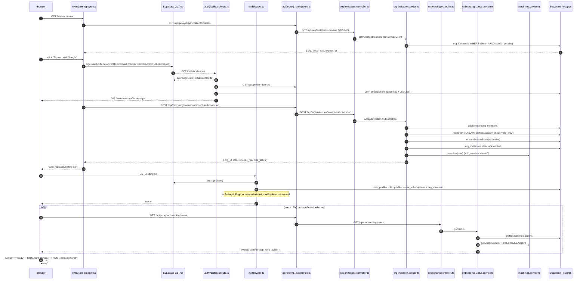

# Feature: Authentication, Onboarding & Access Routing

> Read-only reverse-engineering, 2026-09-05. Evidence tags: **CONFIRMED** (read in code),
> **LIKELY** (one inference hop), **UNKNOWN**.
> Security analysis of the guard stack, impersonation, vault and findings lives in
> [`../08-auth-security.md`](../08-auth-security.md) — this document covers the _feature_:
> the screens a user sees, the state machine that decides which one, and the endpoints behind them.

## Status

**WORKING (with one deliberate lock)** — every screen in the flow exists, is wired to a real
endpoint, and the routing state machine has unit tests
(`apps/web/src/lib/auth/access-routing.test.ts`, 180 lines). The one intentional gap is that
**public self-serve registration is disabled**: `apps/web/src/middleware.ts:95` redirects
`/register` → `/login` whenever `NEXT_PUBLIC_WAITLIST_MODE !== 'false'` (i.e. by default), so the
only live signup entry points are org invitations (`/invite/:token`) and direct invite codes
(`/join?code=…`).

## Purpose

Establish who the user is (Supabase GoTrue), then answer three follow-up questions before any
dashboard route renders:

1. **Is the account onboarded?** (`profiles.onboarding_completed` + does it have an agent runtime?)
2. **Does it have access?** (an `active`/`trialing` `user_subscriptions` row **or** an `active`
   `org_members` row)
3. **Where should it land?** (`/home`, `/onboarding`, `/setting-up`, `/no-org-access`, `/org-setup`)

Those answers are computed in one place — `resolveAuthenticatedRedirect()` in
`apps/web/src/lib/auth/access-routing.ts` — and applied by the Next.js middleware.

## User Capabilities

From the UI code, a user can:

- **Sign in with email + password** — `apps/web/src/app/(auth)/login/page.tsx:91`
  (`supabase.auth.signInWithPassword`), wrapped in `withAuthLoginTimeout`.
- **Sign in / sign up with Google or GitHub** — `login/page.tsx:65`, `register/page.tsx:72`,
  `invite/[token]/page.tsx:142`, `join/page.tsx:109`. Exactly two providers; the last-used one is
  remembered in `localStorage` under `vibey-last-auth-provider` and badged "Last used".
- **Register** — only reachable when `NEXT_PUBLIC_WAITLIST_MODE === 'false'`; otherwise the page
  itself also self-redirects (`register/page.tsx:44`).
- **Accept an organization invitation** — `/invite/:token`, including "sign up and accept in one
  step" via `?bootstrap=1` (`invite/[token]/page.tsx:130`).
- **Redeem a direct invite code** — `/join?code=…` validates the code, then stores it in
  `localStorage` so onboarding can skip the paywall (`join/page.tsx:68`).
- **Request a password reset email** and **set a new password** —
  `forgot-password/page.tsx` (`resetPasswordForEmail`), `reset-password/page.tsx` (`updateUser`).
- **Resend an email-verification message** — `verify-email/page.tsx`, and inline on
  `register`/`join` via `supabase.auth.resend({ type: 'signup' })`.
- **Run first-time onboarding** — an 8-step wizard (awakening animation → customize agent →
  questions → channels → subscribe → setup-wait), `onboarding/page.tsx`.
- **Run org-scoped setup** — `/org-setup`, a 4-step variant for users whose first agent belongs to
  an organization.
- **Watch provisioning progress** — `/setting-up` polls onboarding status every 1.5 s and shows a
  labelled step ("Joining your workspace", "Building your team", …).
- **Retry a failed provision** — the retry button calls `POST /api/onboarding/retry`, which
  re-dispatches whichever action the backend says is needed.
- **Sign out** — `AvatarAccountMenuPanel.tsx:92`, `no-org-access/NoOrgAccessContent.tsx:19`,
  `onboarding/components/OnboardingSwitchAccountButton.tsx:18`.
- **Grant MCP consent** — `/mcp/consent`, `/mcp/success` (the Vibey-as-OAuth-provider flow).

## Entry Points

### Frontend

| Path                                   | File                                                                        | Role                                                                                                  |
| -------------------------------------- | --------------------------------------------------------------------------- | ----------------------------------------------------------------------------------------------------- |
| `/login`                               | `apps/web/src/app/(auth)/login/page.tsx`                                    | Email + OAuth sign-in                                                                                 |
| `/register`                            | `apps/web/src/app/(auth)/register/page.tsx`                                 | Sign-up — **gated off by default**                                                                    |
| `/join?code=…`                         | `apps/web/src/app/(auth)/join/page.tsx`                                     | Direct invite-code sign-up                                                                            |
| `/invite` · `/invite/:token`           | `apps/web/src/app/(auth)/invite/page.tsx`, `invite/[token]/page.tsx`        | Org invitation accept                                                                                 |
| `/callback`                            | `apps/web/src/app/(auth)/callback/route.ts`                                 | **Route handler** — exchanges the OAuth code for a session, kicks off provisioning                    |
| `/oauth-callback`                      | `apps/web/src/app/(auth)/oauth-callback/page.tsx`                           | Client shim that moves Supabase's URL **hash** fragment into query params and forwards to `/callback` |
| `/forgot-password` · `/reset-password` | respective `page.tsx`                                                       | Password reset pair                                                                                   |
| `/verify-email`                        | `apps/web/src/app/(auth)/verify-email/page.tsx`                             | Resend confirmation                                                                                   |
| `/onboarding`                          | `apps/web/src/app/(auth)/onboarding/page.tsx`                               | Personal onboarding wizard                                                                            |
| `/org-setup`                           | `apps/web/src/app/(auth)/org-setup/page.tsx`                                | Org-scoped agent setup                                                                                |
| `/setting-up`                          | `apps/web/src/app/(auth)/setting-up/page.tsx`                               | Provisioning wait screen                                                                              |
| `/no-org-access`                       | `apps/web/src/app/(auth)/no-org-access/page.tsx` + `NoOrgAccessContent.tsx` | Terminal state for `account_mode = 'org_only'` users with no access                                   |
| `/fast-track-success`                  | `apps/web/src/app/(auth)/fast-track-success/page.tsx`                       | Post-Stripe waitlist fast-track landing                                                               |
| `/mcp/consent` · `/mcp/success`        | `apps/web/src/app/(auth)/mcp/**/page.tsx`                                   | MCP OAuth consent screens                                                                             |
| **gatekeeper**                         | `apps/web/src/middleware.ts`                                                | Runs on nearly every request; see [Frontend Flow](#frontend-flow)                                     |

### Backend

Three surfaces, and they are **not** equivalent:

1. **Supabase GoTrue, called directly from the browser** — this is the real auth path. Every
   sign-in/sign-up/reset in the UI uses `@supabase/supabase-js` via
   `apps/web/src/lib/supabase/client.ts`.
2. **`apps/api` `/api/auth/*`** — a parallel server-side auth surface
   (`apps/api/src/modules/auth/controllers/auth.controller.ts`). Throttled, Zod-validated, no
   guard by design. **No frontend caller was found for `register`/`login`/`oauth`/`forgot-password`.**
3. **`apps/api` onboarding/provisioning endpoints** — the part the frontend actually depends on
   after a session exists (`/api/onboarding/status`, `/api/machines/provision`, `/api/agents/onboard`).

## API Endpoints

| Method | Route                                                                                                 | Handler                                                                   | Purpose                                                                                           |
| ------ | ----------------------------------------------------------------------------------------------------- | ------------------------------------------------------------------------- | ------------------------------------------------------------------------------------------------- |
| GET    | `/callback` (Next)                                                                                    | `apps/web/src/app/(auth)/callback/route.ts:8`                             | `exchangeCodeForSession` or `setSession`, then fire-and-forget profile/provision/fast-track calls |
| GET    | `/api/auth/session` (Next)                                                                            | `apps/web/src/app/api/auth/session/route.ts`                              | Returns the cookie session's tokens as JSON to same-origin callers (browser-extension bridge)     |
| POST   | `/api/auth/register`                                                                                  | `auth.controller.ts:15`                                                   | Throttle 5/min, `RegisterDto`                                                                     |
| POST   | `/api/auth/login`                                                                                     | `auth.controller.ts:27`                                                   | Throttle 10/min                                                                                   |
| POST   | `/api/auth/oauth`                                                                                     | `auth.controller.ts:39`                                                   | Returns a provider URL; redirects to `/oauth-callback?redirect=/mission-control`                  |
| POST   | `/api/auth/forgot-password`                                                                           | `auth.controller.ts:57`                                                   | Throttle 3/min                                                                                    |
| POST   | `/api/auth/register-with-invite`                                                                      | `apps/api/src/modules/waitlist/controllers/waitlist.controller.ts:87`     | Signup bound to a direct invite code                                                              |
| GET    | `/api/auth/invite-codes/:code`                                                                        | `waitlist.controller.ts:99`                                               | `{ valid: boolean }`; throttle 30/min. Called by `/join`                                          |
| POST   | `/api/waitlist/join` · GET `/api/waitlist/count`                                                      | `waitlist.controller.ts:27,40`                                            | Waitlist capture                                                                                  |
| POST   | `/api/waitlist/fast-track-checkout` · GET `…/fast-track-status/:sessionId` · POST `…/fast-track-link` | `waitlist.controller.ts:48,64,71`                                         | Paid queue-jump; `fast-track-link` is the only guarded one (`AuthGuard`)                          |
| GET    | `/api/onboarding/status`                                                                              | `apps/api/src/modules/onboarding/controllers/onboarding.controller.ts:20` | The provisioning state machine (see below)                                                        |
| POST   | `/api/onboarding/retry`                                                                               | `onboarding.controller.ts:29`                                             | Re-runs `retry_action` then re-reads status                                                       |
| GET    | `/api/profile`                                                                                        | `apps/api/src/modules/users/controllers/profile.controller.ts:26`         | `onboarding_completed`, `account_mode`, runtime columns                                           |
| PATCH  | `/api/profile/onboarding`                                                                             | `profile.controller.ts:71`                                                | Persists `onboarding_animation_seen`, `onboarding_completed`, `onboarding_data.onboarding_step`   |
| POST   | `/api/machines/provision`                                                                             | `apps/api/src/modules/machines/controllers/machines.controller.ts:43`     | Creates/claims the user's agent runtime                                                           |
| POST   | `/api/machines/ensure-running`                                                                        | `machines.controller.ts:69`                                               | Wakes a suspended machine                                                                         |
| GET    | `/api/agents/onboarding-status` · POST `/api/agents/onboard`                                          | `apps/api/src/modules/agents/controllers/agents.controller.ts:56,110`     | Creates the first ("CEO"/Pixel) agent                                                             |
| POST   | `/api/org/:orgId/invitations`                                                                         | `apps/api/src/modules/org/controllers/org-invitations.controller.ts:42`   | `@RequireOrgRole('admin')`; 412 if the org is not onboarded                                       |
| GET    | `/api/org/:orgId/invitations` · DELETE `…/:invitationId`                                              | `org-invitations.controller.ts:80,90`                                     | List / revoke                                                                                     |
| POST   | `/api/org/invitations/accept`                                                                         | `org-invitations.controller.ts:100`                                       | Adds `org_members` row                                                                            |
| POST   | `/api/org/invitations/accept-and-bootstrap`                                                           | `org-invitations.controller.ts:124`                                       | Accept **+** mark `account_mode='org_only'` **+** default brain **+** provision                   |
| GET    | `/api/org/invitations/:token`                                                                         | `org-invitations.controller.ts:148`                                       | **`@Public()`** — token is the capability                                                         |
| GET    | `/api/org/my`                                                                                         | `apps/api/src/modules/org/controllers/`                                   | Memberships; drives the subscribe-step skip                                                       |
| GET    | `/api/billing/status`                                                                                 | `apps/api/src/modules/billing/`                                           | Subscription status for the access gate                                                           |

The full route inventory (1,632 routes, path-prefix conventions, what bypasses the proxy) is in
[`../05-api-map.md`](../05-api-map.md).

## Main Files

| File                                                                                                                               | Responsibility                                                                                                                                      |
| ---------------------------------------------------------------------------------------------------------------------------------- | --------------------------------------------------------------------------------------------------------------------------------------------------- |
| `apps/web/src/middleware.ts` (266 lines)                                                                                           | The gate. Session read, platform-admin check, profile read, access read, redirect                                                                   |
| `apps/web/src/lib/auth/access-routing.ts` (110 lines)                                                                              | Pure functions: `resolveAccessStatus`, `resolveAuthenticatedRedirect`, `resolveAppRedirectPath`, `buildAppRedirectUrl`, `buildAuthContinuationPath` |
| `apps/web/src/lib/auth/access-routing.test.ts`                                                                                     | The only unit-tested part of this feature                                                                                                           |
| `apps/web/src/lib/supabase/client.ts` (8 lines) · `server.ts` (24 lines)                                                           | `@supabase/ssr` browser and server clients                                                                                                          |
| `apps/web/src/lib/api/backend-client.ts` (709 lines)                                                                               | Attaches `Authorization`, `x-org-id`, `x-impersonate-user-id`; proactive refresh at `exp − 120 s`; one-shot 401 retry                               |
| `apps/web/src/app/(auth)/callback/route.ts` (183 lines)                                                                            | Code→session exchange plus three background POSTs                                                                                                   |
| `apps/web/src/app/(auth)/oauth-callback/page.tsx` (55 lines)                                                                       | Hash-fragment → query-param bridge                                                                                                                  |
| `apps/web/src/app/(auth)/onboarding/page.tsx` (357 lines)                                                                          | The wizard's resume logic and step orchestration                                                                                                    |
| `apps/web/src/app/(auth)/onboarding/hooks/useOnboardingStep.ts`                                                                    | Step enum + linear order                                                                                                                            |
| `apps/web/src/app/(auth)/onboarding/hooks/useProvisionStatus.ts` (122 lines)                                                       | 1.5 s poll of `/api/onboarding/status`, 45 s "slow" flag, retry                                                                                     |
| `apps/web/src/app/(auth)/onboarding/lib/onboarding-access.ts` (108 lines)                                                          | `shouldSkipSubscribeStep`, `resolveOnboardedHomeAccess`, direct-invite-code storage keys                                                            |
| `apps/web/src/app/(auth)/config/auth-messages.config.ts` (98 lines) · `auth-toast-errors.config.ts` · `login/config/auth-login.ts` | All user-facing auth copy and error mapping                                                                                                         |
| `apps/web/src/lib/runtime/machine-profile-env.ts` (109 lines)                                                                      | Resolves which `profiles` columns hold the runtime pointer (env-configurable)                                                                       |
| `apps/api/src/modules/auth/**`                                                                                                     | The parallel server-side auth surface (controller, service, repository, DTOs)                                                                       |
| `apps/api/src/modules/onboarding/services/onboarding-status.service.ts` (176 lines)                                                | The authoritative provisioning state machine                                                                                                        |
| `apps/api/src/modules/waitlist/services/waitlist.service.ts`                                                                       | Waitlist, direct invite codes, Stripe fast-track                                                                                                    |
| `apps/api/src/modules/org/services/org-invitation.service.ts`                                                                      | Invitation lifecycle incl. `accept-and-bootstrap`                                                                                                   |
| `packages/api-shared/src/services/supabase-jwt-verifier.service.ts`                                                                | JWKS verification — see [`../08-auth-security.md`](../08-auth-security.md)                                                                          |

## Database Tables

Cross-reference [`../06-database-map.md`](../06-database-map.md) for full column lists.

| Table                           | Columns that matter here                                                                                                                                                                                                                                                                      |
| ------------------------------- | --------------------------------------------------------------------------------------------------------------------------------------------------------------------------------------------------------------------------------------------------------------------------------------------- |
| `auth.users` (Supabase-managed) | Identity of record; `handle_new_user` trigger mirrors into `profiles`                                                                                                                                                                                                                         |
| `profiles`                      | `id`, `onboarding_completed`, `onboarding_animation_seen`, `onboarding_data` (JSONB, holds `onboarding_step`), `account_mode` (`personal` \| `org_only`), plus the runtime pointer columns resolved by `machine-profile-env.ts` (`fly_machine_id`, `agent_runtime_type`, `agent_runtime_url`) |
| `user_profiles`                 | `role` — the **platform** role (`user`/`power`/`admin`/`enterprise`/`superadmin`). A different table from `profiles`; the middleware reads both on the same request                                                                                                                           |
| `user_subscriptions`            | `status ∈ {active, trialing}` → one half of the access gate                                                                                                                                                                                                                                   |
| `org_members`                   | `status = 'active'` → the other half; `role`, `org_id`                                                                                                                                                                                                                                        |
| `org_invitations`               | `token` (unique), `email`, `role`, `status ∈ {pending, accepted, expired, revoked}`, `expires_at`                                                                                                                                                                                             |
| `organizations`                 | `id`, `name`, `slug` — joined into the invitation payload for the accept screen                                                                                                                                                                                                               |
| `ns_brains`                     | `accept-and-bootstrap` calls `ensureDefaultBrain` so an invited user has a Brain on day one                                                                                                                                                                                                   |
| `superadmin_audit_log`          | Impersonation start/stop (see security doc)                                                                                                                                                                                                                                                   |
| Waitlist / invite-code tables   | Reached via `waitlist.repository.ts`. **UNKNOWN** whether their `CREATE TABLE` exists in `supabase/migrations` — `../06-database-map.md` documents that ~10 live tables were created directly in production                                                                                   |

## Business Logic

**Mostly in the right places, with one significant exception.**

- **Routing decisions are pure and centralised.** `access-routing.ts` contains no I/O; the
  middleware supplies booleans. This is the cleanest part of the feature and the only tested part.
- **Provisioning state is decided on the backend.** `OnboardingStatusService.getStatus()` returns
  `{ overall, current_step, runtime, org, retry_action }`, and the frontend renders whatever it is
  told. `retry` re-dispatches the same `retry_action` rather than letting the client choose. Good.
- **Onboarding _resume_ logic lives in a component.**
  `apps/web/src/app/(auth)/onboarding/page.tsx:91-169` is a ~78-line `useEffect` that reads
  `/api/profile`, `/api/org/my` and `/api/billing/status`, then decides which of eight steps to
  restore. There is no service or store behind it — this is business logic in a page component,
  and it duplicates part of the middleware's own reasoning.
- **The subscribe-step skip is duplicated.** `shouldSkipSubscribeStep()` (frontend,
  `onboarding-access.ts:60`) and `OnboardingStatusService`'s org/runtime checks (backend) encode
  overlapping rules about who needs to pay. They can disagree.
- **Invitation logic is properly in a service** (`org-invitation.service.ts`), and the controller
  only maps error strings to HTTP codes.

## Validation

| Surface                   | Mechanism                                                                                                                                                                                                                                            |
| ------------------------- | ---------------------------------------------------------------------------------------------------------------------------------------------------------------------------------------------------------------------------------------------------- |
| `apps/api` auth endpoints | Zod via `ZodValidationPipe` — `RegisterDto`, `LoginDto`, `OAuthDto`, `ForgotPasswordDto` (`apps/api/src/modules/auth/dto/auth.dto.ts`)                                                                                                               |
| Waitlist / invite codes   | Zod — `WaitlistJoinDto`, `RegisterWithInviteDto`, `FastTrackCheckoutDto`                                                                                                                                                                             |
| Org invitations           | Zod on both params and body — `OrgIdParamSchema`, `InviteMemberSchema`, `AcceptInvitationSchema`                                                                                                                                                     |
| Password strength         | **None server-side in this repo.** Delegated entirely to Supabase project settings. The only client-side rule is `minLength={6}` on `/join` (`join/page.tsx:321`) — `login` and `register` have no `minLength` at all                                |
| Password confirmation     | Client-side equality check only (`reset-password/page.tsx:35`)                                                                                                                                                                                       |
| Open-redirect defence     | `resolveAppRedirectPath()` requires a leading `/` and re-parses against a sentinel origin (`https://app.roas.invalid`), returning `/home` on any mismatch — `access-routing.ts:28-37`. Applied on `login`, `register`, `callback`, `forgot-password` |
| Invitation email binding  | `invitation.email.toLowerCase() !== userEmail.toLowerCase()` → 403 (`org-invitation.service.ts:104,154`)                                                                                                                                             |
| Invitation expiry         | `expires_at < now` → status flipped to `expired`, then 410                                                                                                                                                                                           |

Note: `apps/api` has **no global `ValidationPipe`** (see [`../03-architecture.md`](../03-architecture.md)),
so validation is per-controller. The auth module is one of the better-covered ones.

## Permissions

| Check                            | Where                                              | Effect                                                                                                                           |
| -------------------------------- | -------------------------------------------------- | -------------------------------------------------------------------------------------------------------------------------------- |
| Authenticated?                   | `middleware.ts:109-128`                            | Any dashboard / onboarding / setting-up / no-org-access / org-setup path without a user → `/login?redirect=<path>`               |
| Platform admin                   | `middleware.ts:140-146` reads `user_profiles.role` | `/admin*` for a non-`admin`/`superadmin` → `/home`. **UI routing only**; the server-side control is `RoleGuard`                  |
| `NEXT_PUBLIC_REQUIRE_ADMIN=true` | `middleware.ts:181-184`                            | Whole app becomes admin-only; everyone else is bounced to the marketing site                                                     |
| Access gate                      | `middleware.ts:190-229` + `resolveAccessStatus`    | `granted` if active subscription **or** active org membership; `unknown` if either lookup timed out (fails **open** for routing) |
| Org invite admin                 | `@RequireOrgRole('admin')` on invite/list/revoke   | Note `OrgRoleGuard` no-ops when `x-org-id` is absent — see [`../08-auth-security.md`](../08-auth-security.md) finding #3         |
| Invitation accept                | Token + email match, no role needed                | Any authenticated user with a valid pending token whose email matches                                                            |
| Public invitation lookup         | `@Public()` on `GET /api/org/invitations/:token`   | Token is the capability                                                                                                          |

**Invitation-token strength — CONFIRMED, and it closes open question #5 in
[`../08-auth-security.md`](../08-auth-security.md):** tokens are
`randomBytes(32).toString('hex')` (256 bits of entropy —
`apps/api/src/modules/org/services/org-invitation.service.ts:52`) and are **single-use**, because
`findInvitationByToken` filters `.eq('status', 'pending')`
(`apps/api/src/modules/org/repositories/org.repository.ts:225`), so accepted, revoked and expired
tokens return `null` → 404.

## External Dependencies

- **Supabase GoTrue** — the identity provider. Email/password, magic-link (used internally by
  impersonation), OAuth broker for Google and GitHub, password-reset and confirmation emails.
- **Google OAuth** and **GitHub OAuth** — the only two social providers offered.
- **Stripe** — the access gate reads `user_subscriptions`, and the waitlist fast-track creates a
  Checkout session (`/api/waitlist/fast-track-checkout`). See [`../09-integrations.md`](../09-integrations.md).
- **Fly.io Machines API** — indirectly: onboarding is not "complete" until the user has an agent
  runtime, which `/api/machines/provision` creates. See [`../10-background-processes.md`](../10-background-processes.md) §Fly.io Machine Orchestration.
- **Transactional email** — invitation emails are sent from `org-invitation.service.ts:330`
  (`sendInvitationEmail`, building `${APP_URL}/invite/${token}`).

## Background Jobs

Authentication itself has no queue. Two adjacent jobs matter:

| Job                                                        | Where                             | Relevance                                                                                                                                                                                                                                                                                                        |
| ---------------------------------------------------------- | --------------------------------- | ---------------------------------------------------------------------------------------------------------------------------------------------------------------------------------------------------------------------------------------------------------------------------------------------------------------- |
| `/api/machines/idle-check` (Vercel cron, every 5 min)      | `machines.controller.ts:89`       | Suspends idle runtimes. A returning user's machine may be suspended, which is why `/setting-up` and the chat proxy both have wake paths                                                                                                                                                                          |
| `/api/machines/pool-replenish` (Vercel cron, every 10 min) | `machines.controller.ts:99`       | Keeps warm machines available for `provision`; **no-op unless `MACHINE_POOL_REPLENISH_ENABLED=true`**                                                                                                                                                                                                            |
| `repairStaleAgentSetups` (`@Cron`, every 10 min)           | `apps/api/src/cron.service.ts:57` | 🔴 **Never runs in production** — in-process scheduling is disabled when `VERCEL=1` and this job has no Vercel-cron mirror ([`../10-background-processes.md`](../10-background-processes.md) risk #2). A user stuck mid-provision is therefore not auto-repaired; only the manual **Retry** button recovers them |

Provisioning is also kicked off _fire-and-forget_ from `/callback` (`route.ts:126`) with
`void fetch(...)` — no retry, no queue, only a logged error.

## Frontend Flow

```text
/login  ──signInWithPassword──▶  Supabase GoTrue  ──cookies via @supabase/ssr──▶  window.location = redirect
/login  ──signInWithOAuth────▶  provider  ──▶  /callback?redirect=…  (or /oauth-callback for hash tokens)
```

`/callback` (server route handler) does five things in order:

1. `exchangeCodeForSession(code)` — or, if no code, `setSession({access_token, refresh_token})`.
2. `GET {BACKEND_URL}/api/profile` to learn whether a runtime already exists.
3. Reads `user_subscriptions` (anon key + the fresh user JWT).
4. If subscribed **and** no runtime → `void fetch(POST /api/machines/provision)`.
5. `void fetch(POST /api/waitlist/fast-track-link)` with the `vibey-ft-session` cookie.

Then redirects to the validated `redirect` param, or to the marketing site if authentication failed.

On every subsequent navigation, `middleware.ts` runs and performs **up to four serialised Supabase
round-trips** (`getUser` → `user_profiles.role` → `profiles` → `user_subscriptions` + `org_members`
in parallel), each wrapped in a 4 s `withTimeout` that swallows errors and resolves `null`. The
result is fed to `resolveAuthenticatedRedirect()`:

| Current page                      | `fullyOnboarded` | `accessStatus`         | Result                                              |
| --------------------------------- | ---------------- | ---------------------- | --------------------------------------------------- |
| `/invite/:token` or `/setting-up` | —                | —                      | `null` (never redirected)                           |
| `/no-org-access`                  | —                | `denied` + `isOrgOnly` | `null` (stay)                                       |
| `/no-org-access`                  | —                | anything else          | `/home`                                             |
| `/onboarding`                     | `false`          | any                    | `null` (stay)                                       |
| `/onboarding`                     | `true`           | `granted`              | `/home`                                             |
| `/onboarding`                     | —                | `denied` + `isOrgOnly` | `/no-org-access`                                    |
| dashboard                         | `false`          | —                      | `/onboarding`                                       |
| dashboard                         | `true`           | `denied`               | `/no-org-access` if `isOrgOnly`, else `/onboarding` |
| dashboard                         | `true`           | `granted` / `unknown`  | `null` (render)                                     |
| auth page                         | `true`           | `granted`              | `/home`                                             |

`fullyOnboarded = isOrgOnly || (profiles.onboarding_completed && hasRuntime)` —
`middleware.ts:179`. **`org_only` accounts skip the runtime requirement entirely.**

The onboarding wizard then resumes from `profiles.onboarding_data.onboarding_step` and walks:
`awakening → lets-start → customize → questions → channels → (subscribe) → setup-wait → /home`,
calling `POST /api/agents/onboard` (archetype `ceo`) when it enters `setup-wait` and
`PATCH /api/profile/onboarding {onboarding_completed: true}` before the final redirect.

## Backend Flow

`GET /api/onboarding/status` is the state machine (`onboarding-status.service.ts:31-70`), evaluated
strictly in this order:

1. `org.ready === false` → `working` / `building_team` / retry `onboard_org`
2. `runtime.ready` → `ready` / `running_final_check`
3. no `machineId` → `working` / `preparing_workspace` / retry `provision_machine`
4. state `destroyed`|`destroying` → **`recoverable_error`** / retry `provision_machine`
5. state ≠ `started` → `working` / `turning_things_on` / retry `ensure_running`
6. otherwise → `working` / `running_final_check` / retry `ensure_running`

`runtime.ready` short-circuits to `true` when the profile has a _shared Railway_ runtime
(`hasSharedRailwayRuntime`, `onboarding-status.service.ts:133`); for a Fly machine it requires
`getMachineState() === 'started'` **and** a successful `probeReadyEndpoint()`.

`POST /api/onboarding/retry` reads the status, executes the indicated action, swallows any error
into a `logger.warn`, then returns a **fresh** status — so the client never sees the retry's own
exception, only the resulting state.

## Full Request Flow

Org invitation → first dashboard render, built from the files above:



## Error Handling

| Failure                                              | Behaviour                                                                                                                                   | Evidence                                                                                |
| ---------------------------------------------------- | ------------------------------------------------------------------------------------------------------------------------------------------- | --------------------------------------------------------------------------------------- |
| Supabase unreachable during middleware               | `withTimeout` resolves `null` → `user` is `null` → protected routes redirect to `/login`. Fails **closed** for authentication               | `middleware.ts:21-27,61-64`                                                             |
| `profiles` lookup fails or is empty                  | `return supabaseResponse` — the request proceeds with **no** access gating                                                                  | `middleware.ts:167-169`                                                                 |
| Access lookups time out                              | `accessStatus = 'unknown'` → dashboard renders. Fails **open** for authorization (routing only; the backend re-checks)                      | `access-routing.ts:70`; `middleware.ts:224-229`                                         |
| Bad login credentials                                | Mapped through `resolveAuthLoginErrorMessage` and rendered inline; also `reportClientError({feature:'ui/auth_login'})`                      | `login/page.tsx:99-105`                                                                 |
| Login hangs                                          | `withAuthLoginTimeout` rejects; caught and shown as "unavailable"                                                                           | `login/config/auth-login.ts`                                                            |
| Duplicate email on signup                            | Detected via Supabase's empty-`identities` tell → "An account with this email already exists."                                              | `register/page.tsx:121-127`, `join/page.tsx:150-156`, `invite/[token]/page.tsx:184-190` |
| OAuth provider error                                 | `/oauth-callback` reads `error_code`/`error_description` from the hash and forwards to `/login?auth_error=…`, which the login page surfaces | `oauth-callback/page.tsx:38-45`; `login/page.tsx:42-47`                                 |
| Code exchange fails in `/callback`                   | `reportWebServerError` + redirect to the marketing site (**not** to `/login`)                                                               | `callback/route.ts:48-58,182`                                                           |
| Invalid/absent invite code on `/join`                | Renders "INVALID INVITE" and clears the stored code                                                                                         | `join/page.tsx:199-213,90-97`                                                           |
| Invitation expired / wrong email / already a member  | 410 / 403 / 409 from the controller; the UI shows a single generic `messages.acceptError`                                                   | `org-invitations.controller.ts:114-121`; `invite/[token]/page.tsx:113`                  |
| Provision fails                                      | `setProvisionFailed(true)` → `OnboardingSetupWait` renders a recoverable error with **Retry**                                               | `onboarding/page.tsx:212-218`                                                           |
| Provision slow                                       | `isSlow` after 45 s, purely cosmetic                                                                                                        | `useProvisionStatus.ts:90-92`                                                           |
| Background provision/fast-track fails in `/callback` | Logged only; the user still lands in the app and depends on `/setting-up` polling to notice                                                 | `callback/route.ts:132-144,155-166`                                                     |

All user-facing copy is centralised in `apps/web/src/app/(auth)/config/auth-messages.config.ts`
and `auth-toast-errors.config.ts`, which matches the repo's error/message-config convention.

## Test Scenarios

Run these by hand against a local stack (`pnpm dev:app` + `pnpm dev:back`, see
[`../02-how-to-run.md`](../02-how-to-run.md) — and read its **CRITICAL** warning about
`apps/api` starting production cron jobs first).

1. **Waitlist lock.** Visit `/register`. You should be bounced to `/login` before the page paints.
   Set `NEXT_PUBLIC_WAITLIST_MODE=false` in `apps/web/.env.local`, restart, and confirm the form
   now renders. This is the single highest-value thing to know about this feature.
2. **Redirect preservation.** Visit `/spaces` while signed out → `/login?redirect=/spaces`. Sign in
   → you land on `/spaces`, not `/home`.
3. **Open-redirect defence.** Visit `/login?redirect=https://evil.example/x` and
   `/login?redirect=//evil.example`. After sign-in you must land on `/home`
   (`resolveAppRedirectPath` rejects both).
4. **The onboarding gate.** Set `profiles.onboarding_completed = false` for your test user, then
   visit `/home`. You should be redirected to `/onboarding` and resumed at the step stored in
   `profiles.onboarding_data.onboarding_step`.
5. **The `org_only` terminal state.** Set `profiles.account_mode = 'org_only'` and remove every
   `active` `org_members` row plus any `active`/`trialing` subscription. Visit `/home` →
   `/no-org-access`. Click "Check again" and watch it bounce back.
6. **Invitation happy path.** As an org admin, `POST /api/org/:orgId/invitations`, copy the token
   from `org_invitations`, then open `/invite/<token>` in a fresh browser profile. Verify the org
   name and role render from the `@Public()` lookup **before** you authenticate.
7. **Invitation single-use.** Accept the invitation, then reload `/invite/<token>`. Because
   `findInvitationByToken` filters on `status='pending'`, the public lookup now 404s and the page
   shows the generic error — **not** the "already accepted" panel that
   `InviteAcceptSections.tsx` implements. That branch is unreachable.
8. **Wrong-email invitation.** Invite `a@example.com`, then accept while signed in as
   `b@example.com`. Expect 403 with "Invitation email does not match your account".
9. **Direct invite code.** Hit `/join?code=<bogus>` and confirm "INVALID INVITE"; then use a real
   code from the admin invite-codes surface and confirm `localStorage` gains
   `vibey-direct-invite-code`, and that onboarding subsequently **skips** the `subscribe` step
   (`shouldSkipSubscribeStep`).
10. **Provisioning retry.** While sitting on `/setting-up`, break the Fly credentials so
    `/api/onboarding/status` returns `recoverable_error`. Confirm the Retry button calls
    `POST /api/onboarding/retry` and that the backend — not the client — chooses the action.
11. **Middleware cost.** Open devtools' network panel and navigate between two dashboard pages.
    Note the latency floor contributed by the four serialised Supabase calls before HTML streams.

## Known Problems

| #   | Problem                                                                                                                                                                                                                                                         | Severity                                                     | Evidence                                                                                                                                          |
| --- | --------------------------------------------------------------------------------------------------------------------------------------------------------------------------------------------------------------------------------------------------------------- | ------------------------------------------------------------ | ------------------------------------------------------------------------------------------------------------------------------------------------- |
| 1   | **`profiles` and `user_profiles` are two different tables, both queried on every gated request.** One holds onboarding/runtime state, the other the platform role. Repo-wide: 103 `from('profiles')` vs 26 `from('user_profiles')`                              | HIGH (correctness + latency)                                 | `middleware.ts:135,151`; [`../03-architecture.md`](../03-architecture.md) §middleware; [`../06-database-map.md`](../06-database-map.md) issue #12 |
| 2   | **Four serialised Supabase round-trips in the middleware on every navigation**, each with a 4 s timeout — the most likely cause of "the app feels slow"                                                                                                         | HIGH (performance)                                           | `middleware.ts:134-215`                                                                                                                           |
| 3   | **A failed `profiles` read disables access gating for that request.** `return supabaseResponse` skips the subscription/org check entirely rather than degrading to `unknown`                                                                                    | MEDIUM                                                       | `middleware.ts:167-169`                                                                                                                           |
| 4   | **`repairStaleAgentSetups` never runs in production**, so a half-provisioned account is only recoverable through the manual Retry button                                                                                                                        | MEDIUM                                                       | `apps/api/src/cron.service.ts:57`; [`../10-background-processes.md`](../10-background-processes.md) risk #2                                       |
| 5   | **`apps/api` `/api/auth/{register,login,oauth,forgot-password}` has no frontend caller.** Every UI path talks to Supabase directly. It is a live, throttled, unguarded surface with no consumer — either dead code or an undocumented API for another client    | MEDIUM (dead-code / attack-surface)                          | `auth.controller.ts`; no matching `backendPost('/api/auth/...')` in `apps/web/src`                                                                |
| 6   | **`/api/auth/oauth` redirects to `/mission-control`**, a path that is not in the middleware's `dashboardPaths` array and has no `apps/web/src/app/(dashboard)` route group entry under that name                                                                | MEDIUM (broken if used)                                      | `auth.controller.ts:43` vs `middleware.ts:66-86`                                                                                                  |
| 7   | **`/join` bypasses the proxy** and calls `${NEXT_PUBLIC_API_URL \|\| NEXT_PUBLIC_BACKEND_URL}/api/auth/invite-codes/…` from the browser. If neither env var is set, `codeValid` is forced `false` and every invite link reads as invalid — a silent config trap | MEDIUM                                                       | `join/page.tsx:18,46-48`                                                                                                                          |
| 8   | **Onboarding resume logic lives in a 78-line `useEffect` inside a page component**, duplicating middleware reasoning and fanning out three API calls                                                                                                            | MEDIUM (architecture)                                        | `onboarding/page.tsx:91-169`                                                                                                                      |
| 9   | **Two competing definitions of "does this user need to pay"**: `shouldSkipSubscribeStep` (frontend) and `OnboardingStatusService` (backend)                                                                                                                     | MEDIUM                                                       | `onboarding-access.ts:60`; `onboarding-status.service.ts:38-70`                                                                                   |
| 10  | **The invite page implements three states it can never reach.** `isExpired`, `isAlreadyAccepted` and `isRevoked` are computed and passed into `InviteAcceptReadyPanel`, but the public lookup only ever returns `status='pending'` rows                         | LOW (dead UI)                                                | `invite/[token]/page.tsx:210-212` vs `org.repository.ts:225`                                                                                      |
| 11  | **No server-side password policy in this repo**, and inconsistent client-side minimums (`minLength=6` on `/join` only)                                                                                                                                          | LOW                                                          | `join/page.tsx:321`; `login/page.tsx:220`; `register/page.tsx:275`                                                                                |
| 12  | **A failed `/callback` code exchange redirects to the marketing site**, not to `/login` with an error, so the user gets no explanation                                                                                                                          | LOW (UX)                                                     | `callback/route.ts:182`                                                                                                                           |
| 13  | **`/api/auth/session` returns access + refresh tokens as JSON** to same-origin callers for a browser-extension bridge                                                                                                                                           | LOW — see [`../08-auth-security.md`](../08-auth-security.md) | `apps/web/src/app/api/auth/session/route.ts`                                                                                                      |
| 14  | **Provisioning is kicked off with `void fetch(...)` and no retry** from `/callback`; recovery depends entirely on the `/setting-up` poller                                                                                                                      | LOW                                                          | `callback/route.ts:126-144`                                                                                                                       |

## Related Features

- [`../08-auth-security.md`](../08-auth-security.md) — the guard chain, JWKS verification,
  impersonation, the vault, and all severity-ranked security findings. **Read it before changing
  anything in this feature.**
- [`../05-api-map.md`](../05-api-map.md) — the proxy's `/api` prefix insertion, and the full list of
  `@Public()` endpoints.
- [`../03-architecture.md`](../03-architecture.md) — where the middleware sits in the four-tier request path.
- [`agents-and-teams.md`](./agents-and-teams.md) — `POST /api/agents/onboard` creates the first
  ("CEO"/Pixel) agent; onboarding is not complete until it exists.
- [`brain-memory.md`](./brain-memory.md) — `accept-and-bootstrap` calls `ensureDefaultBrain`.
- [`spaces-campaigns.md`](./spaces-campaigns.md) — the destination of `/home` and the surface most
  affected by the middleware's latency.
- [`../10-background-processes.md`](../10-background-processes.md) — machine idle-check, pool
  replenish, and the unmirrored `@Cron` jobs that affect provisioning recovery.

## Open Questions

1. **Who calls `apps/api` `/api/auth/*`?** No `apps/web` caller exists. Candidates: the ROAS Chrome
   extension (which is also why `/api/auth/session` exists), a mobile client, or a partner
   integration. If none, four unguarded endpoints should be deleted.
2. **Is `/mission-control` a real route?** `/api/auth/oauth` redirects there, but it is absent from
   `dashboardPaths`. Was it renamed to `/home`?
3. **What is `account_mode = 'org_only'` meant to mean long-term?** It bypasses the runtime
   requirement in `fullyOnboarded`, so an org-only user reaches the dashboard with no agent runtime
   — which chat then needs. Is that intended, or does something else provision them later?
4. **Which `profiles` columns hold the runtime pointer in production?**
   `machine-profile-env.ts` makes them env-configurable (`resolveMachineProfileColumns`), so the
   literal column names in `middleware.ts:153` are only the defaults.
5. **Are the waitlist / invite-code tables in `supabase/migrations`?** They are reached through
   `waitlist.repository.ts`; [`../06-database-map.md`](../06-database-map.md) documents that ~10
   live tables exist only in production.
6. **What is `NEXT_PUBLIC_ALLOW_FREE_ONBOARDING` set to in production?** It controls whether the
   "Continue free" button appears on the subscribe step (`onboarding/page.tsx:335`), which is the
   difference between a hard and a soft paywall.
7. **Does anything expire or clean up `org_invitations` rows?** `expires_at` is only checked
   lazily at accept time; no sweeper was found.
8. **Are the Supabase session cookie flags correct in production?** Entirely `@supabase/ssr`
   defaults; no app-level override exists to inspect (also open in the security doc).
