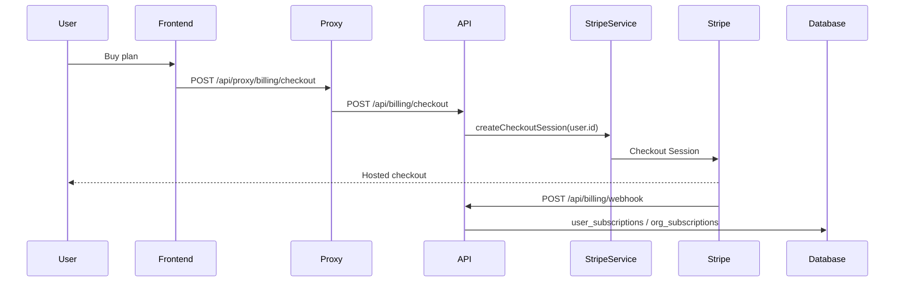

# Feature: Billing & Credits

> Read-only reverse-engineering, 2026-09-06. Evidence tags: **CONFIRMED** · **LIKELY** · **UNKNOWN**.
> Security detail: [`../08-auth-security.md`](../08-auth-security.md).

## Purpose

Meter platform access (Stripe subscriptions) and LLM spend (credit ledger). A chat turn or artifact generation is allowed only when the user/org has remaining credits; actual OpenRouter cost is reconciled after the fact.

## User Capabilities

- Subscribe / upgrade / switch monthly↔annual / cancel at period end / reactivate.
- Open the Stripe customer portal.
- Buy credit packs; configure auto-recharge.
- See low-credit banners and a depleted-credits dialog.
- Add an "agent brain" Stripe addon per agent (personal or org).
- Redeem a promo code; activate a free plan (flag-gated).

## Entry Points

### Frontend

| Path                                       | File                                                   | Role                          |
| ------------------------------------------ | ------------------------------------------------------ | ----------------------------- |
| Settings modal → billing                   | `apps/web/src/features/billing/` + `features/settings` | Plans, credits, invoices      |
| `CreditPurchaseDialog`                     | `features/billing/CreditPurchaseDialog.tsx`            | Pack checkout                 |
| `CreditLowBanner` / `CreditDepletedDialog` | `features/billing/`                                    | Runtime credit UX             |
| `/fast-track-success`                      | `app/(auth)/fast-track-success`                        | Waitlist skip checkout return |

Settings is **not** a page — `app/(dashboard)/settings/page.tsx` redirects into `/home?tab=manage&settings=…`.

### Backend

`apps/api/src/modules/billing/` (6 controllers) and `apps/api/src/modules/org/controllers/org-billing-*.ts`.

## API Endpoints

| Method | Route                                             | Handler                                 | Auth                  | Purpose                                                                                      |
| ------ | ------------------------------------------------- | --------------------------------------- | --------------------- | -------------------------------------------------------------------------------------------- |
| POST   | `/api/billing/checkout`                           | `billing.controller.ts:32`              | AuthGuard + Throttler | Stripe checkout session                                                                      |
| POST   | `/api/billing/portal`                             | `billing.controller.ts:83`              | AuthGuard             | Customer portal                                                                              |
| GET    | `/api/billing/invoices`                           | `billing.controller.ts:105`             | AuthGuard             | Invoice list                                                                                 |
| GET    | `/api/billing/session-status`                     | `billing.controller.ts:115`             | AuthGuard             | Checkout session poll                                                                        |
| POST   | `/api/billing/switch-interval`                    | `billing.controller.ts:129`             | AuthGuard             | month ↔ year                                                                                 |
| POST   | `/api/billing/cancel-subscription`                | `billing.controller.ts:143`             | AuthGuard             | Cancel at period end                                                                         |
| POST   | `/api/billing/reactivate-subscription`            | `billing.controller.ts:158`             | AuthGuard             | Undo cancel                                                                                  |
| POST   | `/api/billing/activate-free-plan`                 | `billing.controller.ts:62`              | AuthGuard             | Free plan                                                                                    |
| POST   | `/api/billing/redeem-promo`                       | `billing.controller.ts:72`              | AuthGuard             | Promo                                                                                        |
| POST   | `/api/billing/agent-brain/checkout`               | `billing-agent-brain.controller.ts:55`  | AuthGuard only        | **Caller-supplied `body.orgId`**                                                             |
| GET    | `/api/billing/agent-brain/status`                 | same                                    | AuthGuard             | Status; `orgId` is a query param                                                             |
| POST   | `/api/org/:orgId/billing/checkout`                | `org-billing-checkout.controller.ts:30` | Auth + OrgRole owner  | Org checkout                                                                                 |
| POST   | `/api/org/:orgId/billing/purchase-credits`        | same `:60`                              | Auth + OrgRole admin  | Org credit pack                                                                              |
| POST   | `/api/billing/webhook`                            | `billing-webhook.controller.ts`         | Stripe signature      | Stripe events                                                                                |
| POST   | `/api/internal/billing-credit-alerts/process-due` | internal                                | CRON_SECRET           | Low-credit alerts                                                                            |
| POST   | `/api/admin/billing-health/reconcile`             | admin                                   | AuthGuard + RoleGuard | Nightly health — **LIKELY BROKEN** as a Vercel cron (GET + cron secret vs POST + role guard) |

## Main Files

| File                                                      | Responsibility                             |
| --------------------------------------------------------- | ------------------------------------------ |
| `apps/api/src/modules/billing/services/stripe.service.ts` | User Stripe customer + sessions            |
| `apps/api/src/modules/org/services/org-stripe.service.ts` | Org Stripe customer + sessions             |
| `packages/api-shared` `CreditsGuard`                      | Blocks a call when credits are exhausted   |
| `apps/web/src/features/billing/`                          | Dialogs and banners                        |
| `apps/web/src/lib/auth/access-routing.ts`                 | Paywall redirect uses `user_subscriptions` |

## Database Models / Tables

| Table                                                                             | Purpose                                       |
| --------------------------------------------------------------------------------- | --------------------------------------------- |
| `subscription_plans`                                                              | Plan catalog                                  |
| `user_subscriptions` / `org_subscriptions`                                        | Active subs                                   |
| `monthly_credit_usage` / `org_monthly_credit_usage`                               | Ledger split — **unmerged**                   |
| `ai_usage_events`                                                                 | Per-call cost events                          |
| `user_credit_auto_recharge` / `org_credit_auto_recharge`                          | Threshold top-up                              |
| `org_member_credit_limits`, `team_member_credit_limits`, `team_member_credit_log` | Seat caps — **duplicated**                    |
| `billing_credit_slack_alerts`, `billing_health_checks`, `billing_health_log`      | Ops                                           |
| `products`, `orders`, `order_items`, `addon_products`                             | **DEAD CODE CANDIDATE** — no code access path |

## Business Logic

1. Checkout creates a Stripe session; webhook writes `user_subscriptions` / `org_subscriptions`.
2. `CreditsGuard` reads the user **and** org ledgers (two tables) before expensive calls.
3. After an LLM call, OpenRouter generation cost is written to `ai_usage_events` and deducted.
4. Default checkout `successUrl` is `${APP_URL}/studio?subscription=success` — **`/studio` redirects to `/team`**. **CONFIRMED** leftover.

## Validation

Inline `BadRequestException` on `planSlug` / `billingPeriod`. No Zod pipe on `BillingController`. Org checkout uses `ZodValidationPipe` only for `:orgId`.

## Permissions

- User billing: any authenticated user, scoped to `user.id`.
- Org billing: `@RequireOrgRole('owner'|'admin')` **but** `OrgRoleGuard` returns `true` when `request.orgId` is null (`org-role.guard.ts:63-65`). Combined with service-role `OrgStripeService`, this is the **CRITICAL** cross-tenant finding.
- Agent-brain checkout: **no OrgRoleGuard at all**; `body.orgId` is trusted (`billing-agent-brain.controller.ts:72-79`). **CONFIRMED**.

## External Dependencies

Stripe (Checkout, Portal, Subscriptions, Webhooks). OpenRouter generation API for cost. Slack for low-credit alerts.

## Background Jobs

| Job                      | Trigger                                                                     |
| ------------------------ | --------------------------------------------------------------------------- |
| Low-credit alerts        | Vercel cron every 5 min → `/api/internal/billing-credit-alerts/process-due` |
| Billing health reconcile | Nightly `0 2 * * *` — **LIKELY BROKEN**                                     |
| Provider billing         | `mission-worker` `provider-billing` queue                                   |

## Frontend Flow

Settings modal → `features/billing` dialog → `backendPost('/api/proxy/billing/checkout')` → Stripe hosted page → return URL.

## Backend Flow

Controller → `StripeService` / `OrgStripeService` (service-role Supabase) → Stripe API → webhook → subscription row.

## Full Request Flow

## Error Handling

Missing `STRIPE_SECRET_KEY` disables Stripe at boot (warning, no crash). Missing `APP_URL` throws. Credit exhaustion surfaces as SSE headers + `CreditDepletedDialog`, not always as HTTP 402.

## Test Scenarios

`apps/api` billing module (~7 tests). No authenticated checkout was exercised in mapping (would hit live Stripe / live DB).

## Known Problems

1. **CRITICAL** — org billing takeover via missing `x-org-id` + `:orgId` path param.
2. **CRITICAL** — `POST /api/billing/agent-brain/checkout` accepts caller `orgId` with no org-role check.
3. Checkout URLs still point at deleted `/studio`.
4. User/org credit ledgers are two tables that must be reconciled in app code.
5. Three overlapping seat-limit table families.
6. Nightly billing-health cron likely 401s.

## Related Features

Authentication (paywall), Admin finances, Agent runtime (CreditsGuard on chat).

## Status

**WORKING** for the happy path. **CRITICAL security defects** on org-scoped billing. Nightly reconcile **LIKELY BROKEN**.
