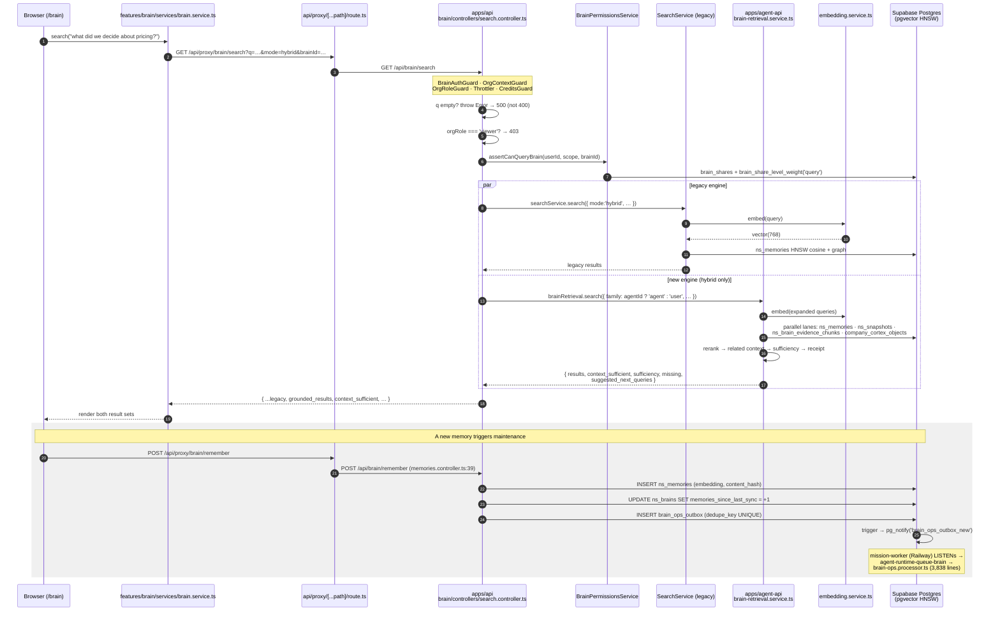

# Feature: Brain & Memory

> Read-only reverse-engineering, 2026-09-05. Evidence tags: **CONFIRMED** (read in code),
> **LIKELY** (one inference hop), **UNKNOWN** (needs runtime/dashboard access).

## Status

**PARTIALLY IMPLEMENTED — a well-built system whose predecessor was dropped but is still documented
as canonical, plus an unfinished search migration.** The live Brain (the `ns_*` table family,
pgvector HNSW, four search families, Brain Ops background maintenance, Brain Live voice) works and
is unusually well-factored on both frontend and backend. Two things stop this from being _WORKING_:
the pre-"NeuralSnap cutover" generation of tables was **`DROP TABLE`d** by
`supabase/migrations/015_remove_legacy_brain_tables.sql` yet `brains` and `snapshots` are still
presented as canonical in `supabase/schema.sql:43,55`; and `GET /api/brain/search` runs **two
independent retrieval engines on every hybrid query** and merges their results, because the
migration from the legacy searcher to `BrainRetrievalService` was never finished.

## Purpose

Durable, searchable, embedding-backed memory that survives conversations, so agents accumulate
knowledge instead of re-learning it. Everything the platform learns — a document, a meeting
transcript, a Slack thread, a customer call, an org decision — is normalised into a **memory** with a
768-dimension embedding, filed into a **brain** with a `scope`, then retrieved by lane-based hybrid
search at agent-turn time and cited back to the user as a retrieval receipt.

Above raw memories sit three synthesis layers: **snapshots** (crystallised 16-field "knowledge
crystals"), **Company Cortex** (an object/signal/edge graph built nightly by "dream" runs), and
**Customer Brain** (contact-anchored evidence with avatar synthesis).

## The Brain families, resolved

**CONFIRMED, and the repo's own `AGENTS.md` §8.1 is slightly off.**

`ns_brains.scope` (added `20260507142000_customer_brain_infra.sql:8`,
`text NOT NULL DEFAULT 'user'`) carries **five** values, backfilled by
`CASE WHEN agent_id IS NOT NULL THEN 'agent' WHEN campaign_id IS NOT NULL THEN 'campaign' ELSE 'user' END`
(lines 12-19), plus `'customer'` and `'company'` added by later work:

| `ns_brains.scope` | Discriminator                                   | Where the content lives                                                       | Searchable?                |
| ----------------- | ----------------------------------------------- | ----------------------------------------------------------------------------- | -------------------------- |
| `user`            | `owner_id`, no `agent_id`/`campaign_id`         | `ns_memories`, `ns_snapshots`                                                 | ✅                         |
| `agent`           | `ns_brains.agent_id` (TEXT)                     | `ns_memories`, `ns_snapshots`                                                 | ✅                         |
| `customer`        | `scope = 'customer'` + `contact_id` on memories | `ns_memories` + `ns_brain_evidence_chunks` + `customer_*` tables              | ✅                         |
| `company`         | `scope = 'company'`                             | `company_cortex_objects` / `_signals` / `_object_edges` (**separate tables**) | ✅                         |
| `campaign`        | `ns_brains.campaign_id`                         | `ns_memories`                                                                 | ❌ **not a search family** |

But `BrainSearchFamily` in `apps/agent-api/src/modules/artifacts/services/artifact-brain-search-input.ts:1`
is **only four values**:

```ts
export type BrainSearchFamily = 'user' | 'agent' | 'customer' | 'company'
```

and `familyForBrainScope(scope)` (same file, line 32) returns `null` for anything else — including
`'campaign'`. So **campaign-scoped brains can be created and written but not searched through the
family API.** Campaign/Space _context_ is a different subsystem entirely
(`space_semantic_chunks` / `_objects` / `_edges`, see
[`spaces-campaigns.md`](./spaces-campaigns.md)), reached via `campaign-brain-preload.ts` rather than
via brain search. `AGENTS.md` §8.1 lists "Space/Campaign context" alongside the four Brain families;
in the code it is a sibling system, not a family.

## User Capabilities

From `apps/web/src/features/brain` (the `/brain` route) and the API surface:

- **Remember something** — free text (`POST /api/brain/remember`), a link
  (`POST /api/brain/remember-link`), a document (`POST /api/brain/import-jobs/remember-document`).
- **Search the Brain** — `GET /api/brain/search?q=&mode=` with six modes: `semantic`, `graph`,
  `hybrid`, `summary`, `chain`, `auto` (`search.controller.ts:47`). Also **image search**
  (`POST /api/brain/search/image`).
- **Rate a search result** — `POST /api/brain/search/feedback`.
- **Browse and switch brains** — `GET /api/brain/brains`, with the scope picker in
  `hooks/use-brain-scope-nav-options.ts` (624 lines).
- **See the knowledge graph** — `GET /api/brain/graph`, rendered by `BrainVisualization.tsx` /
  `BrainVisualizationDock.tsx`.
- **Manage memories** — read/edit/delete (`GET|PATCH|DELETE /api/brain/memories/:id`), **connect**
  two memories (`POST /api/brain/memories/:id/connect`), delete a connection, and **transfer nodes
  between brains** (`POST /api/brain/nodes/transfer`).
- **Crystallise snapshots** — `POST /api/brain/snapshots/crystallize`, plus full snapshot CRUD and
  `POST /api/brain/snapshots/search`.
- **Approve or reject pending captures** — the agent proposes a memory, you accept it
  (`POST /api/brain/pending/:id/accept` / `…/reject`).
- **Accept or reject cross-brain suggestions** — `GET /api/brain/cross-suggestions`,
  `POST /api/brain/cross-suggestions/:id/accept|reject`.
- **Import a meeting or transcript** — Fathom (`…/import-jobs/fathom-meeting`), Fireflies
  (`…/fireflies-transcript`), plus campaign-scoped variants (`campaign-file`, `campaign-url`,
  `campaign-fathom`, `campaign-fireflies`).
- **Watch import progress** — `GET /api/brain/import-jobs/active`, notifications
  (`…/notifications/pending`, `…/notifications/ack`), retry (`POST …/:jobId/retry`), dismiss,
  delete.
- **Turn Cortex Max on for a brain** — `PATCH /api/brain/:brainId/cortex-max`, then
  `POST …/cortex-max/crystallize`; browse **timelines** and **narrative pages**.
- **Run Company Cortex** — status, settings, objects, signals, and triage a signal
  (`PATCH /api/brain/company/signals/:signalId`).
- **Enable and use Customer Brain** — `PATCH /api/brain/customer/enabled`, add a text or link memory
  about a customer, view `GET /api/brain/customer/view`.
- **Train a brain** — `TrainingPanel.tsx` / `training/TrainingModal.tsx`, gated by the `train`
  share level.
- **Manage a Skill/Knowledge (SK) corpus** — ingest text or a link (`POST /api/brain/sk/ingest`,
  `…/ingest-link`), list sources, search, see **gaps**, see stats, set **mastery**
  (`PATCH /api/brain/sk/mastery`), delete entries/sources.
- **Emotional intelligence** — `POST /api/brain/observe`, `GET /api/brain/emotional-profile`,
  detect and list belief **patterns**, list **perspectives** and **avatars**.
- **Talk to the Brain out loud (Brain Live)** — `POST /api/brain/live-session` returns a
  `wsUrl`, then a WebSocket voice session with live tool use and delegation
  (`hooks/use-brain-live-session.ts`, 637 lines).
- **Set recurring brain rules** — `services/recurring-rules.service.ts` (467 lines).

## Entry Points

### Frontend

| Path / module  | File                                                                                                                                          | Role                                                                                    |
| -------------- | --------------------------------------------------------------------------------------------------------------------------------------------- | --------------------------------------------------------------------------------------- |
| `/brain`       | `apps/web/src/app/(dashboard)/brain/page.tsx`                                                                                                 | The single Brain route                                                                  |
| feature root   | `apps/web/src/features/brain/`                                                                                                                | 10 folders; **largest file is 637 lines** — the best-factored large feature in the repo |
| Live voice     | `features/brain/hooks/use-brain-live-session.ts` (637)                                                                                        | Session POST → WebSocket → mic capture → tool events                                    |
| Scope picker   | `features/brain/hooks/use-brain-scope-nav-options.ts` (624)                                                                                   | Resolves which brains/scopes the user may pick                                          |
| Types          | `features/brain/types/brain.types.ts` (428)                                                                                                   | The client contract                                                                     |
| Services       | `features/brain/services/{brain,sk,knowledge-graph,recurring-rules,brain-cross-suggestions,user-brain-import,campaign-brain-icon}.service.ts` | Per-domain fetch layers                                                                 |
| Store          | `features/brain/store/use-brain-store.ts`                                                                                                     | Zustand state (with a co-located test)                                                  |
| WS URL builder | `apps/web/src/lib/brain/brain-live-ws-url.ts`                                                                                                 | `buildBrainLiveWsUrl(backendOrigin, sessionId, uid, machineId)`                         |
| Chat surface   | `components/global-chat/components/ChatCampaignBrainNudge.tsx`                                                                                | Nudges the user to feed the Brain                                                       |

### Backend

**`apps/api/src/modules/brain` — 18 controllers**, ~70 routes (the doc-wide figure of 82 includes the
agent-api brain controllers and `brain/sk`, `brain/pending`, `brain/snapshots` sub-paths; reconcile
against [`../05-api-map.md`](../05-api-map.md)):

| Controller                                                                               | Base path                           |
| ---------------------------------------------------------------------------------------- | ----------------------------------- |
| `memories.controller.ts`, `memories-crud.controller.ts`, `memories-status.controller.ts` | `brain`                             |
| `brain-cortex-max.controller.ts`, `graph.controller.ts`, `emotional.controller.ts`       | `brain`                             |
| `company-cortex.controller.ts`, `customer-brain.controller.ts`                           | `brain` (`company/*`, `customer/*`) |
| `search.controller.ts`                                                                   | `brain/search`                      |
| `snapshots.controller.ts`                                                                | `brain/snapshots`                   |
| `sk.controller.ts`, `sk-query.controller.ts`, `sk-mutations.controller.ts`               | `brain/sk`                          |
| `import-jobs.controller.ts`, `import-job-status.controller.ts`                           | `brain/import-jobs`                 |
| `pending-captures.controller.ts`                                                         | `brain/pending`                     |
| `brain-cross-suggestions.controller.ts`                                                  | `brain/cross-suggestions`           |
| `page-grader-client-import.controller.ts`                                                | `brain/page-grader`                 |

**`apps/agent-api/src/modules/brain`** — 2 controllers, 1 WebSocket gateway, 13 repositories,
**56 service files**:

- `controllers/brain-live.controller.ts` — `@Controller('brain')`, `POST live-session`
- `controllers/brain-eval-probe.controller.ts` — retrieval quality probe
- `gateways/brain-live.gateway.ts` — `@WebSocketGateway({ path: '/api/brain/live-ws' })`, 868 lines
- `guards/brain-auth.guard.ts`, `integrations/brain-live-openclaw-gateway.client.ts`

**`apps/mission-worker/src/modules/brain-ops`** — the maintenance engine:
`brain-ops.processor.ts` (**3,838 lines**), `brain-ops-outbox-dispatcher.service.ts` (378),
`brain-ops-night-janitor.service.ts` (183).

**Routing.** `apps/web/src/app/api/proxy/[...path]/route.ts:37` sets
`AGENT_SUBPATHS = ['brain/live-session']` — **the only non-`chat`/`apps`/`project-files` path routed
to the agent backend.** Everything else under `/api/brain/*` goes to `apps/api`.

**WebSocket adapter.** `apps/agent-api/src/main.ts:5,128` —
`import { WsAdapter } from '@nestjs/platform-ws'` + `app.useWebSocketAdapter(new WsAdapter(app))`.
Plain `ws`, not Socket.IO, so the browser connects with a bare `new WebSocket(url)`
(`use-brain-live-session.ts:216`).

## API Endpoints

The significant ones. Full inventory: [`../05-api-map.md`](../05-api-map.md).

| Method           | Route                                                                                                                                                                                 | Handler                                                            | Purpose                                                                        |
| ---------------- | ------------------------------------------------------------------------------------------------------------------------------------------------------------------------------------- | ------------------------------------------------------------------ | ------------------------------------------------------------------------------ |
| GET              | `/api/brain/search`                                                                                                                                                                   | `search.controller.ts:39` (+`CreditsGuard`)                        | Hybrid search — **runs two engines**, see [Known Problems](#known-problems) #2 |
| POST             | `/api/brain/search/feedback`                                                                                                                                                          | `search.controller.ts:93`                                          | Rate a result                                                                  |
| POST             | `/api/brain/search/image`                                                                                                                                                             | `search.controller.ts:112`                                         | Image search                                                                   |
| POST             | `/api/brain/remember`                                                                                                                                                                 | `memories.controller.ts:39`                                        | Store a memory                                                                 |
| POST             | `/api/brain/remember-link`                                                                                                                                                            | `memories.controller.ts:91`                                        | Store a URL                                                                    |
| POST             | `/api/brain/search`                                                                                                                                                                   | `memories.controller.ts:74`                                        | ⚠️ A **second** search route (POST vs GET)                                     |
| POST             | `/api/brain/process/conversation`                                                                                                                                                     | `memories.controller.ts:114`                                       | Mine a conversation for memories                                               |
| GET/PATCH/DELETE | `/api/brain/memories/:id`                                                                                                                                                             | `memories-crud.controller.ts:40,49,59`                             | Memory CRUD                                                                    |
| POST             | `/api/brain/memories/:id/connect` · DELETE `/api/brain/connections/:id`                                                                                                               | `memories-crud.controller.ts:69,81`                                | Graph edges                                                                    |
| POST             | `/api/brain/nodes/transfer`                                                                                                                                                           | `memories-crud.controller.ts:91`                                   | Move nodes between brains                                                      |
| GET              | `/api/brain/brains` · `/stats` · `/health` · `/health/batch`                                                                                                                          | `memories-status.controller.ts:25,36,47,62`                        | Brain list and health                                                          |
| GET              | `/api/brain/graph`                                                                                                                                                                    | `graph.controller.ts:26`                                           | Knowledge graph                                                                |
| POST/GET         | `/api/brain/snapshots`                                                                                                                                                                | `snapshots.controller.ts:38,49`                                    | Snapshot CRUD                                                                  |
| POST             | `/api/brain/snapshots/crystallize`                                                                                                                                                    | `snapshots.controller.ts:72`                                       | Memories → snapshot                                                            |
| POST             | `/api/brain/snapshots/search`                                                                                                                                                         | `snapshots.controller.ts:108`                                      | Snapshot search                                                                |
| PATCH            | `/api/brain/:brainId/cortex-max` · POST `…/cortex-max/crystallize`                                                                                                                    | `brain-cortex-max.controller.ts:49,66`                             | Cortex Max                                                                     |
| GET              | `/api/brain/:brainId/timelines[/:timelineId/items]` · `…/narrative-pages`                                                                                                             | `brain-cortex-max.controller.ts:86,101,118`                        | Temporal spine                                                                 |
| GET              | `/api/brain/company/status` · `/objects` · `/signals`                                                                                                                                 | `company-cortex.controller.ts:19,76,90`                            | Company Cortex                                                                 |
| PATCH            | `/api/brain/company/settings` · `…/signals/:signalId`                                                                                                                                 | `company-cortex.controller.ts:42,105`                              | Cortex config / signal triage                                                  |
| GET              | `/api/brain/customer/status` · `/view`                                                                                                                                                | `customer-brain.controller.ts:33,108`                              | Customer Brain                                                                 |
| POST             | `/api/brain/customer/memories/text` · `…/link`                                                                                                                                        | `customer-brain.controller.ts:58,79`                               | Customer memories                                                              |
| PATCH            | `/api/brain/customer/enabled`                                                                                                                                                         | `customer-brain.controller.ts:90`                                  | Feature switch                                                                 |
| POST             | `/api/brain/observe` · `/patterns/detect`                                                                                                                                             | `emotional.controller.ts:40,81`                                    | Emotional intelligence                                                         |
| GET              | `/api/brain/emotional-profile` · `/patterns` · `/perspectives` · `/avatars`                                                                                                           | `emotional.controller.ts:70,93,108,122`                            | EI reads                                                                       |
| POST             | `/api/brain/import-jobs/{remember-document,fathom-meeting,remember-link,fireflies-transcript,campaign-file,campaign-url,campaign-fathom,campaign-fireflies,sk-ingest,sk-ingest-link}` | `import-jobs.controller.ts:28-131`                                 | 10 ingestion entry points                                                      |
| GET              | `/api/brain/import-jobs/active` · `/:jobId` · `/notifications/pending`                                                                                                                | `import-job-status.controller.ts:40,113,31`                        | Job status                                                                     |
| POST/DELETE      | `/api/brain/import-jobs/:jobId/retry` · `/:jobId` · `/:jobId/dismiss`                                                                                                                 | `import-job-status.controller.ts:88,76,101`                        | Job control                                                                    |
| POST             | `/api/brain/pending` · `/:id/accept` · `/:id/reject`                                                                                                                                  | `pending-captures.controller.ts:20,30,41`                          | Capture review                                                                 |
| GET/POST         | `/api/brain/cross-suggestions[/:id/accept\|reject]`                                                                                                                                   | `brain-cross-suggestions.controller.ts:27,37,47`                   | Cross-brain suggestions                                                        |
| POST             | `/api/brain/sk/{extract-text,ingest,ingest-link}`                                                                                                                                     | `sk.controller.ts:39,93,141`                                       | SK ingestion                                                                   |
| GET              | `/api/brain/sk/{sources,search,gaps,stats}`                                                                                                                                           | `sk-query.controller.ts:24,36,54,66`                               | SK reads                                                                       |
| PATCH/DELETE     | `/api/brain/sk/mastery` · `/entries/:id` · `/sources/:id`                                                                                                                             | `sk-mutations.controller.ts:65,33,49`                              | SK mutations                                                                   |
| POST             | `/api/brain/page-grader/client-package`                                                                                                                                               | `page-grader-client-import.controller.ts:24`                       | Page-grader import                                                             |
| POST             | `/api/brain/live-session`                                                                                                                                                             | `apps/agent-api/.../brain-live.controller.ts:43` (+`CreditsGuard`) | **Agent backend.** Returns `{ sessionId, wsUrl, machineId, delegations }`      |
| WS               | `/api/brain/live-ws`                                                                                                                                                                  | `apps/agent-api/.../brain-live.gateway.ts:36`                      | Voice session socket                                                           |

## Main Files

| File                                                                                                                                                                                                                                      | Lines     | Responsibility                                                                                                                                                          |
| ----------------------------------------------------------------------------------------------------------------------------------------------------------------------------------------------------------------------------------------- | --------- | ----------------------------------------------------------------------------------------------------------------------------------------------------------------------- |
| `apps/mission-worker/src/modules/brain-ops/brain-ops.processor.ts`                                                                                                                                                                        | **3,838** | One BullMQ processor handling all 9 brain-ops event types. `@Processor(BRAIN_OPS_QUEUE, { concurrency, lockDuration: 5_000_000, stalledInterval: 120_000 })` (line 398) |
| `apps/mission-worker/src/modules/brain-ops/brain-ops-outbox-dispatcher.service.ts`                                                                                                                                                        | 378       | Drains `brain_ops_outbox` → BullMQ; **listens on `pg_notify('brain_ops_outbox_new')`**                                                                                  |
| `apps/mission-worker/src/modules/brain-ops/brain-ops-night-janitor.service.ts`                                                                                                                                                            | 183       | Nightly sweep                                                                                                                                                           |
| `apps/agent-api/src/modules/brain/gateways/brain-live.gateway.ts`                                                                                                                                                                         | 868       | Voice session lifecycle + **two near-duplicate event switches** (lines 384-457, 526-583)                                                                                |
| `apps/agent-api/src/modules/brain/services/brain-retrieval.service.ts` + `…-search-lane.service.ts` + `…-candidate-builder.ts` + `…-query-expansion.service.ts` + `…-related-context.service.ts` + `…-timing.service.ts` + `…-receipt.ts` | —         | The **new** retrieval pipeline: query expansion → parallel lanes → candidates → rerank → sufficiency → receipt                                                          |
| `apps/agent-api/src/modules/brain/services/brain-reranker.service.ts` + `brain-reranker-deterministic.ts`                                                                                                                                 | —         | Reranking, with a deterministic variant for tests                                                                                                                       |
| `apps/agent-api/src/modules/brain/services/brain-sufficiency.service.ts`                                                                                                                                                                  | —         | Decides `context_sufficient`, `missing`, `suggested_next_queries`                                                                                                       |
| `apps/agent-api/src/modules/brain/services/embedding.service.ts`                                                                                                                                                                          | —         | `gemini-embedding-2`, `EMBEDDING_DIMENSIONS = 768`, `EMBEDDING_MAX_ATTEMPTS = 4` (lines 7-13)                                                                           |
| `apps/agent-api/src/modules/brain/services/crystallization.service.ts`                                                                                                                                                                    | —         | Memories → snapshots                                                                                                                                                    |
| `apps/agent-api/src/modules/brain/services/company-context-compiler.service.ts`                                                                                                                                                           | —         | Company Cortex → agent context                                                                                                                                          |
| `apps/agent-api/src/modules/brain/services/campaign-brain-preload.ts`                                                                                                                                                                     | —         | Campaign context injection for turns                                                                                                                                    |
| `apps/agent-api/src/modules/brain/services/document-{extraction,ingestion}.service.ts`, `gemini-ocr.service.ts`, `link-extraction.service.ts`, `content-dedupe.service.ts`                                                                | —         | Ingestion pipeline                                                                                                                                                      |
| `apps/agent-api/src/modules/brain/services/brain-live-*.service.ts` (11 files)                                                                                                                                                            | —         | Voice: actions, delegation, delegation stream, documents, instructions, tool declarations, transcript                                                                   |
| `apps/agent-api/src/modules/brain/services/{emotional-intelligence,emotional-tagging,voice-assignment}.service.ts`                                                                                                                        | —         | EI layer                                                                                                                                                                |
| `apps/agent-api/src/modules/brain/services/scholar-context.service.ts` · `apps/agent-api/src/modules/artifacts/repositories/artifact-brain-scholar.repository.ts`                                                                         | —         | Agent-facing brain read path                                                                                                                                            |
| `apps/agent-api/src/modules/artifacts/services/artifact-brain-search-input.ts`                                                                                                                                                            | 37        | `BrainSearchFamily`, `parseBrainFamilies`, `familyForBrainScope`, `temporalSearchInput`                                                                                 |
| `apps/api/src/modules/brain/controllers/brain-controller-access.ts`                                                                                                                                                                       | 8         | `assertBrainFeatureAllowed` — viewers are blocked from Brain                                                                                                            |
| `scripts/import-user-brain/index.ts`                                                                                                                                                                                                      | 687       | One-off cross-project brain import: column filtering per table, batched `upsert(onConflict:'id')`                                                                       |
| `scripts/import-user-brain/backfill-embeddings.ts`                                                                                                                                                                                        | 351       | Re-embeds rows with `embedding IS NULL`                                                                                                                                 |

## Database Tables

Cross-reference [`../06-database-map.md`](../06-database-map.md).

### Live (`ns_*`) — CONFIRMED by access count

| Table                                                                                                                                     | Columns that matter                                                                                                                                                                                                                                                                                                                                                                                                                                                                                 |
| ----------------------------------------------------------------------------------------------------------------------------------------- | --------------------------------------------------------------------------------------------------------------------------------------------------------------------------------------------------------------------------------------------------------------------------------------------------------------------------------------------------------------------------------------------------------------------------------------------------------------------------------------------------- |
| `ns_brains`                                                                                                                               | `owner_id`, `name`, **`scope`** (`user\|agent\|customer\|company\|campaign`), `agent_id` TEXT, `campaign_id`, `org_id`, `is_default`, `snapshot_count`, `color`, `icon`, `tags[]`, `cortex_max`, and maintenance counters: `memories_since_last_sync`, `syncs_since_last_lint`, `pages_updated_since_last_analysis`, `customer_memories_since_last_avatar_pass`, `last_{library_sync,lint,pattern_analysis,avatar_synthesis}_at`. RLS: `owner_id = auth.uid()` (`047_brain_consolidation.sql:8-26`) |
| `ns_memories`                                                                                                                             | `brain_id`, `content`, `content_hash`, `memory_type`, `source_type`, `source_id`, `source_title`, `speaker`, `confidence`, `significance`, **`embedding vector(768)`**, `tags[]`, `metadata`, `source_emotion`, `emotional_valence`, `emotional_intensity`, `speaker_intent`, `recalled_count`, `last_recalled_at`. **HNSW index** `USING hnsw (embedding vector_cosine_ops) WHERE embedding IS NOT NULL` (`047_brain_consolidation.sql:29-60`)                                                     |
| `ns_snapshots`, `ns_snapshot_edges`                                                                                                       | Crystallised knowledge + graph                                                                                                                                                                                                                                                                                                                                                                                                                                                                      |
| `ns_memory_connections`, `ns_memory_sessions`, `ns_memory_versions`                                                                       | Graph edges, ingestion sessions, version history                                                                                                                                                                                                                                                                                                                                                                                                                                                    |
| `ns_brain_evidence_chunks`                                                                                                                | Chunked source evidence (`20260525110600_brain_evidence_chunks.sql`)                                                                                                                                                                                                                                                                                                                                                                                                                                |
| `ns_brain_log`                                                                                                                            | Brain activity log                                                                                                                                                                                                                                                                                                                                                                                                                                                                                  |
| `brain_shares`                                                                                                                            | `brain_id → ns_brains`, `org_id`, `entity_type ∈ {user, org, team}`, `entity_id`, **`level ∈ {view, query, train}`**, unique `(brain_id, entity_type, entity_id)` (`20260520210300_brain_access_control.sql:36-46`)                                                                                                                                                                                                                                                                                 |
| `org_brain_sharing`                                                                                                                       | Org-wide brain sharing defaults                                                                                                                                                                                                                                                                                                                                                                                                                                                                     |
| `brain_ops_outbox`                                                                                                                        | `brain_id → ns_brains`, `event_type`, **`dedupe_key text NOT NULL UNIQUE`**, `payload`, `status`, `attempts`/`max_attempts` (3), `next_attempt_at`, partial index on `(status, next_attempt_at) WHERE status='pending'`, `AFTER INSERT` trigger → `pg_notify('brain_ops_outbox_new')` (`20260407100000_brain_ops_outbox.sql`)                                                                                                                                                                       |
| `brain_import_jobs`                                                                                                                       | Ingestion job state behind `/api/brain/import-jobs/*`                                                                                                                                                                                                                                                                                                                                                                                                                                               |
| `brain_connections`, `brain_cross_suggestions`                                                                                            | Cross-brain graph and suggestions                                                                                                                                                                                                                                                                                                                                                                                                                                                                   |
| `ns_belief_patterns`, `ns_emotional_responses`, `ns_perspectives`                                                                         | The emotional-intelligence layer (`brain-emotional-intelligence.repository.ts`)                                                                                                                                                                                                                                                                                                                                                                                                                     |
| `company_cortex_objects`, `company_cortex_object_edges`, `company_cortex_signals`, `company_cortex_settings`, `company_cortex_dream_runs` | Company Brain — **not `ns_memories`**                                                                                                                                                                                                                                                                                                                                                                                                                                                               |
| `dream_ops_runs`                                                                                                                          | Shared dream ops (`20260624203000_shared_dream_ops.sql`)                                                                                                                                                                                                                                                                                                                                                                                                                                            |
| `slack_brain_mappings`                                                                                                                    | Slack channel → brain (`20260508140700_slack_brain_mappings.sql`)                                                                                                                                                                                                                                                                                                                                                                                                                                   |
| `customer_source_identities` + `customer_avatar` / `customer_unit_memberships`                                                            | Customer identity graph (`20260624110423`, `20260624112500`)                                                                                                                                                                                                                                                                                                                                                                                                                                        |
| `space_semantic_chunks` / `_objects` / `_edges`                                                                                           | **Space/Campaign retrieval — a sibling system.** See [`spaces-campaigns.md`](./spaces-campaigns.md)                                                                                                                                                                                                                                                                                                                                                                                                 |

### Legacy — dropped by migration, still documented

`supabase/migrations/015_remove_legacy_brain_tables.sql` ("Remove legacy Vibey brain tables/functions
after NeuralSnap cutover") does:

```sql
drop function if exists public.search_memories(...);
drop function if exists public.search_neural_snapshots(vector, integer);
drop table if exists public.memory_connections cascade;
drop table if exists public.memory_versions cascade;
drop table if exists public.memory_sessions cascade;
drop table if exists public.memories cascade;
drop table if exists public.neural_snapshots cascade;
drop table if exists public.brain_emotional_responses cascade;
drop table if exists public.brain_belief_patterns cascade;
drop table if exists public.brain_perspectives cascade;
```

The three `brain_*` emotional tables were created only by `005_brain_emotional_layers.sql` and are
**never recreated** — the emotional layer moved to `ns_belief_patterns` / `ns_emotional_responses` /
`ns_perspectives`. That part of the cutover is clean.

`memories` and `memory_*` are the messy part: dropped by `015_*`, then **recreated** by
`20260210191803_create_brain_memory_tables.sql`, which sorts _after_ `015_*` lexicographically. So
the table exists again, with `embedding vector(768)` and six indexes, and exactly one caller.

Access counts across `apps/api`, `apps/agent-api`, `apps/mission-worker` and `packages`:

| Table         | `.from()` count                                                           |
| ------------- | ------------------------------------------------------------------------- |
| `brains`      | **0**                                                                     |
| `snapshots`   | **0** (`snapshots.repository.ts:16` sets `TABLE = 'ns_snapshots'`)        |
| `memories`    | **1** — and it is the wrong one, see [Known Problems](#known-problems) #3 |
| `ns_brains`   | **163**                                                                   |
| `ns_memories` | **87**                                                                    |

DB functions: `brain_share_level_weight(text)` and the `min_level` access checks it powers
(`20260520210300_brain_access_control.sql:67-152`).

## Business Logic

**This is the best-layered feature in the repo, with one glaring exception.**

Correct placement:

- **Retrieval** is decomposed into single-purpose services — query expansion, lanes, candidate
  building, reranking, sufficiency, timing, receipts — each with a co-located test
  (`brain-retrieval.service.test.ts`, `brain-retrieval-search-lanes.service.test.ts`,
  `brain-reranker.service.test.ts`, `brain-sufficiency.service.test.ts`,
  `brain-retrieval-receipt.test.ts`, `brain-retrieval-snapshot.service.test.ts`).
- **13 repositories** in `apps/agent-api/src/modules/brain/repositories` keep Supabase access out of
  services.
- **Access control is in the database**, as SQL functions + RLS, not only in TypeScript.
- **The frontend is genuinely modular** — 39,661 lines across ten folders with a **637-line
  maximum**. Compare `features/studio` (2,993-line service) and `features/spaces` (2,664-line
  component).

The exception:

- 🔴 **`brain-ops.processor.ts` is 3,838 lines** handling **nine** event types
  (`brain_lint`, `brain_library_sync`, `brain_pattern_analysis`, `brain_timeline_synthesis`,
  `brain_avatar_synthesis`, `company_cortex_formation`, `company_daily_dream`,
  `company_context_rule_lint`, `customer_interaction_route`) in one class. Some runners _are_
  extracted (`CompanyDailyDreamRunnerService`, `CompanyCortexFormationService` are injected at
  lines 405-410) — the extraction was started and not finished.
- ⚠️ **Logic in a controller.** `search.controller.ts:39-90` does the viewer check, the permission
  assertion, **both** search calls and the result merge inline in the handler.

## Validation

- **Search**: `if (!query) throw new Error('q is required')` (`search.controller.ts:52`) — a bare
  `Error`, which NestJS renders as **500**, not 400. `limit` is `Number(limit)` with no bound.
- **Brain feature access**: `assertBrainFeatureAllowed(scope)` throws
  `ForbiddenException('Viewers cannot access Brain')` when `scope.orgId && scope.orgRole ===
'viewer'` (`brain-controller-access.ts:4-7`). `search.controller.ts:53-55` repeats the same check
  inline rather than calling the helper.
- **Per-brain permission**: `brainPermissions.assertCanQueryBrain(supabase, user.id, scope, brainId)`
  before any brain-scoped search (`search.controller.ts:57-59`), backed by `brain_shares` and
  `brain_share_level_weight`.
- **Family parsing**: `parseBrainFamilies` allow-lists `user|agent|customer|company` and silently
  drops anything else (`artifact-brain-search-input.ts:3-9`). `familyForBrainScope` returns `null`
  for unknown scopes rather than throwing.
- **Content dedupe**: `ns_memories.content_hash` + `content-dedupe.service.ts` prevent re-storing the
  same text.
- **Outbox dedupe**: `brain_ops_outbox.dedupe_key` is `UNIQUE`, so a duplicate maintenance event is a
  constraint violation rather than a second job — real idempotency, unlike the
  `Date.now()`-suffixed job IDs in [`spaces-campaigns.md`](./spaces-campaigns.md).
- **Embedding retries**: `EMBEDDING_MAX_ATTEMPTS = 4` (`embedding.service.ts:13`).
- **Import scripts** filter columns per target table before upserting
  (`scripts/import-user-brain/index.ts:292-330`), so a schema drift between source and target
  project does not blow up the insert.

## Permissions

| Layer        | Mechanism                                                                                                                                                                                                                   |
| ------------ | --------------------------------------------------------------------------------------------------------------------------------------------------------------------------------------------------------------------------- |
| Feature gate | Org **viewers cannot access Brain at all** (`brain-controller-access.ts`)                                                                                                                                                   |
| Guards       | `BrainAuthGuard` (`search.controller.ts:30`) or `AuthGuard`, plus `OrgContextGuard`, `OrgRoleGuard`, `ThrottlerGuard`; `CreditsGuard` on search, live sessions, and other LLM paths                                         |
| Per-brain    | `brain_shares.level ∈ {view, query, train}`, weighted by `brain_share_level_weight()`; enforced by `BrainPermissionsService.assertCanQueryBrain` and by RLS                                                                 |
| Retrieval    | `requiredAccess: 'query'` is passed into `brainRetrieval.search` (`search.controller.ts:74`), and `brain-retrieval-access.repository.ts` enforces it inside the lanes                                                       |
| Org sharing  | `org_brain_sharing`; `20260604184100_personal_brain_org_shares.sql`, `20260528152600_brain_train_shares_grant_train.sql`                                                                                                    |
| RLS          | `ns_brains`: `owner_id = auth.uid()`. `ns_memories` / `ns_memory_*` / `ns_snapshots`: `brain_id IN (SELECT id FROM ns_brains WHERE owner_id = auth.uid())` (`047_brain_consolidation.sql:26,61,79,94,108,149`)              |
| Live voice   | `AuthGuard, OrgContextGuard, OrgRoleGuard, ThrottlerGuard` + `CreditsGuard` on `POST live-session` (`brain-live.controller.ts:33,45`); the socket is authenticated by `sessionId`+`uid` in the URL (`brain-live-ws-url.ts`) |
| Agent-side   | `artifact-capability.policy.ts` decides which brain families an agent may read — see [`agents-and-teams.md`](./agents-and-teams.md)                                                                                         |

⚠️ Note the RLS is **owner-only**, so all sharing goes through the service-role path plus
`brain_shares`. That means Brain sharing correctness depends on the TypeScript checks, not on RLS.
See [`../08-auth-security.md`](../08-auth-security.md).

## External Dependencies

| Dependency                                             | Role                                                                                                                  |
| ------------------------------------------------------ | --------------------------------------------------------------------------------------------------------------------- |
| **Google Gemini** — `gemini-embedding-2`               | All embeddings, 768-d (`embedding.service.ts:7,10`)                                                                   |
| **Google Gemini** — `gemini-3.5-flash:generateContent` | Synthesis calls (`embedding.service.ts:9`)                                                                            |
| **Gemini OCR**                                         | `gemini-ocr.service.ts` — scanned documents                                                                           |
| **pgvector**                                           | `vector(768)` + HNSW `vector_cosine_ops`                                                                              |
| **Fathom**                                             | Meeting import (`import-jobs/fathom-meeting`, `campaign-fathom`)                                                      |
| **Fireflies**                                          | Transcript import (`fireflies-transcript`, `campaign-fireflies`)                                                      |
| **Slack**                                              | `slack_brain_mappings`, `20260720220000_slack_managed_person_brains.sql`, `20260724234000_slack_identity_aliases.sql` |
| **OpenClaw gateway**                                   | Brain Live tool execution (`brain-live-openclaw-gateway.client.ts`) and brain-ops LLM work (`MissionOpenclawGateway`) |
| **Fly.io**                                             | Brain Live pins to a specific machine (`FLY_MACHINE_ID`, `FLY_MACHINE_URL`, `fly-force-instance-id`)                  |
| **Redis / BullMQ**                                     | `agent-runtime-queue-brain`, `agent-runtime-queue-brain-import`                                                       |
| **Postgres LISTEN/NOTIFY**                             | `brain_ops_outbox_new`                                                                                                |
| **Web browser audio APIs**                             | Mic capture for Brain Live                                                                                            |

Details in [`../09-integrations.md`](../09-integrations.md).

## Background Jobs

Full picture in [`../10-background-processes.md`](../10-background-processes.md).

| Job                                                                                                                                                                                                       | Trigger                                                                                                                                                                           | Where it runs                                | Status                                                                                                                                                                 |
| --------------------------------------------------------------------------------------------------------------------------------------------------------------------------------------------------------- | --------------------------------------------------------------------------------------------------------------------------------------------------------------------------------- | -------------------------------------------- | ---------------------------------------------------------------------------------------------------------------------------------------------------------------------- |
| `agent-runtime-queue-brain` → `BrainOpsProcessor`                                                                                                                                                         | `brain_ops_outbox` rows drained by `brain-ops-outbox-dispatcher.service.ts`                                                                                                       | **`mission-worker` on Railway** (persistent) | ✅ Live                                                                                                                                                                |
| `pg_notify('brain_ops_outbox_new')`                                                                                                                                                                       | `AFTER INSERT ON brain_ops_outbox`                                                                                                                                                | Listener in the dispatcher                   | ✅ **Has a listener** — Railway can hold a `LISTEN` connection, unlike the Vercel-hosted `space_automation_notify` ([`spaces-campaigns.md`](./spaces-campaigns.md) #7) |
| `agent-runtime-queue-brain-import` → `agent-runtime-brain-import.processor.ts` (343)                                                                                                                      | `POST /api/brain/import-jobs/*`                                                                                                                                                   | `mission-worker`                             | ✅ Live                                                                                                                                                                |
| `brain-ops-night-janitor.service.ts`                                                                                                                                                                      | Nightly                                                                                                                                                                           | `mission-worker`                             | ✅ Live                                                                                                                                                                |
| `company_daily_dream`                                                                                                                                                                                     | `brain_ops_outbox` event → `CompanyDailyDreamRunnerService`; results in `company_cortex_dream_runs`                                                                               | `mission-worker`                             | ✅ Live                                                                                                                                                                |
| `brain_lint`, `brain_library_sync`, `brain_pattern_analysis`, `brain_timeline_synthesis`, `brain_avatar_synthesis`, `company_cortex_formation`, `company_context_rule_lint`, `customer_interaction_route` | Counter thresholds on `ns_brains` (`memories_since_last_sync`, `syncs_since_last_lint`, `pages_updated_since_last_analysis`, `customer_memories_since_last_avatar_pass`) → outbox | `mission-worker`                             | ✅ Live                                                                                                                                                                |
| `scripts/import-user-brain/backfill-embeddings.ts`                                                                                                                                                        | Manual                                                                                                                                                                            | Local                                        | Manual only — **there is no scheduled re-embedding sweep**                                                                                                             |

**Queue names** are centralised: `packages/api-shared/src/services/agent-runtime-queues.ts:21` →
`AGENT_RUNTIME_QUEUE_NAMES.brain = 'agent-runtime-queue-brain'`, with a drift test at
`agent-runtime-queues.test.ts:13-20`. Note the processor's `lockDuration: 5_000_000` ms (~83 minutes)
— brain ops are expected to be very long-running.

## Frontend Flow

Search from `/brain`:

```text
/brain page.tsx
 └─ features/brain containers
     ├─ use-brain-scope-nav-options.ts     → GET /api/proxy/brain/brains  (which brains + scopes)
     ├─ use-brain-store.ts                  active brainId + scope
     ├─ brain.service.ts                    → GET /api/proxy/brain/search?q=&mode=hybrid&brainId=
     │                                        renders legacy results AND grounded_results
     ├─ knowledge-graph.service.ts          → GET /api/proxy/brain/graph → BrainVisualization.tsx
     └─ TrainingPanel / TrainingModal        → POST /api/proxy/brain/import-jobs/* → poll
                                               GET /api/proxy/brain/import-jobs/active
```

Brain Live (voice), from `use-brain-live-session.ts`:

```text
1. POST /api/proxy/brain/live-session            (AGENT_SUBPATHS → agent backend)
     ← { sessionId, wsUrl, machineId, delegations }
2. buildBrainLiveWsUrl(backendOrigin, sessionId, uid, machineId)      (:214)
3. new WebSocket(wsUrl)                                               (:216)
4. micCaptureRef.current.setWebSocket(ws)                             (:242)
5. receive tool_start / tool_update / tool_end / content_delta /
   thinking_delta / ui_block / status / generation_* / delegation_complete
6. ws.send(...) to push task context back into the session            (:586,:614)
```

Note step 2 rebuilds the URL client-side using `machineId`, because the socket must reach **the same
Fly machine** that created the in-memory session.

## Backend Flow

Ingestion (a document becomes searchable memory):

```text
POST /api/brain/import-jobs/remember-document      import-jobs.controller.ts:28
  → insert brain_import_jobs (status pending)
  → enqueue agent-runtime-queue-brain-import
      mission-worker: agent-runtime-brain-import.processor.ts
        → document-extraction.service.ts / gemini-ocr.service.ts     (text out of the file)
        → link-extraction.service.ts                                  (URLs → sources)
        → content-dedupe.service.ts                                   (content_hash)
        → embedding.service.ts                                        (Gemini, 768-d, ≤4 attempts)
        → ns_memories insert (+ ns_brain_evidence_chunks)
        → emotional-tagging.service.ts                                (valence/intensity/intent)
        → bump ns_brains.memories_since_last_sync
        → threshold crossed? INSERT brain_ops_outbox (dedupe_key UNIQUE)
              → pg_notify('brain_ops_outbox_new')
              → brain-ops-outbox-dispatcher → agent-runtime-queue-brain
                  → BrainOpsProcessor: brain_lint | brain_library_sync |
                    brain_pattern_analysis | brain_timeline_synthesis | …
  → GET /api/brain/import-jobs/active reflects progress
```

Retrieval (the new engine):

```text
BrainRetrievalService.search({ family, brainId, agentKey, query, userId, orgId,
                               orgRole, requiredAccess: 'query', limit })
  → brain-retrieval-access.repository.ts        may this principal read this brain?
  → brain-retrieval-query-expansion.service.ts  broaden the query
  → brain-retrieval-search-lane.service.ts      parallel lanes over
                                                ns_memories (HNSW cosine),
                                                ns_snapshots, ns_brain_evidence_chunks,
                                                company_cortex_objects, timelines/pages
  → brain-retrieval-candidate-builder.ts        merge + dedupe
  → brain-reranker.service.ts                   rerank (deterministic variant in tests)
  → brain-retrieval-related-context.service.ts  pull graph neighbours
  → brain-sufficiency.service.ts                context_sufficient / missing /
                                                suggested_next_queries
  → brain-retrieval-receipt.ts                  the `retrieval_receipt` the chat UI renders
  → brain-retrieval-timing.service.ts           per-lane timings
```

## Full Request Flow



## Error Handling

| Failure                           | Behaviour                                                                                                                                                                                 | Evidence                                                                                                        |
| --------------------------------- | ----------------------------------------------------------------------------------------------------------------------------------------------------------------------------------------- | --------------------------------------------------------------------------------------------------------------- |
| Empty `q`                         | **500** from a bare `throw new Error('q is required')`                                                                                                                                    | `search.controller.ts:52`                                                                                       |
| Org viewer hits Brain             | 403 `'Viewers cannot access Brain'`                                                                                                                                                       | `brain-controller-access.ts:5`; `search.controller.ts:54`                                                       |
| No `query` share level on a brain | `assertCanQueryBrain` throws                                                                                                                                                              | `search.controller.ts:57-59`                                                                                    |
| Embedding API failure             | Retried up to 4 attempts, then the memory is stored with `embedding IS NULL` — the HNSW index is partial (`WHERE embedding IS NOT NULL`), so it is silently unsearchable until backfilled | `embedding.service.ts:13`; `047_brain_consolidation.sql:58`; `scripts/import-user-brain/backfill-embeddings.ts` |
| Brain-ops job failure             | `brain_ops_outbox.attempts` / `max_attempts = 3` / `error` / `next_attempt_at` — real retry state in the DB                                                                               | `20260407100000_brain_ops_outbox.sql`                                                                           |
| Duplicate maintenance event       | Rejected by `dedupe_key UNIQUE`                                                                                                                                                           | same                                                                                                            |
| Duplicate content                 | Rejected by `content_hash` + `content-dedupe.service.ts`                                                                                                                                  | `047_brain_consolidation.sql:38`                                                                                |
| Brain-ops job stalls              | `stalledInterval: 120_000`, `lockDuration: 5_000_000`                                                                                                                                     | `brain-ops.processor.ts:398-402`                                                                                |
| Import job fails                  | Surfaced in `GET /api/brain/import-jobs/active`; user can `retry` or `dismiss`                                                                                                            | `import-job-status.controller.ts:88,101`                                                                        |
| Brain Live: no resolvable machine | `resolveBrainLiveMachineWsUrl` returns **`null`** for `localhost`/`127.0.0.1`, so `wsUrl` is null and the socket cannot be opened                                                         | `brain-live-ws-url.ts:10-23`                                                                                    |
| Insufficient retrieved context    | Not an error — `brain-sufficiency.service.ts` returns `context_sufficient: false` plus `missing` and `suggested_next_queries` so the agent can ask another question                       | `search.controller.ts:82-88`                                                                                    |
| User-facing copy                  | `apps/web/src/features/brain/config/`                                                                                                                                                     | directory                                                                                                       |

## Test Scenarios

1. **Prove `ns_*` is the real Brain.** `rg -F "from('brains')" apps/` returns **nothing**;
   `rg -F "from('ns_brains')"` returns 163 hits. Then read
   `supabase/migrations/015_remove_legacy_brain_tables.sql` (which drops the old tables) next to
   `supabase/schema.sql:43,55` (which still presents them as canonical). This single check reframes
   the whole feature.
2. **Watch one search hit two engines.** `GET /api/brain/search?q=pricing&mode=hybrid` and inspect the
   response: it has both the legacy shape **and** `grounded_results` / `context_sufficient` /
   `sufficiency` / `missing` / `suggested_next_queries`. Now call it with `mode=semantic` and the
   `grounded_*` keys disappear — the second engine only runs for `hybrid`.
3. **Trigger the 500.** `GET /api/brain/search` with no `q`. You get a 500, not a 400
   (`search.controller.ts:52`). One-line fix, easy first PR.
4. **Confirm viewers are locked out.** Sign in as an org `viewer` and open `/brain`. Every endpoint
   403s via `assertBrainFeatureAllowed`.
5. **Exercise the share levels.** Create a `brain_shares` row at `view`, confirm search is refused;
   raise it to `query`, confirm search works; raise it to `train`, confirm `TrainingPanel` unlocks.
   `brain_share_level_weight()` is doing the comparison in SQL.
6. **Follow one document end-to-end.** `POST /api/brain/import-jobs/remember-document`, poll
   `GET /api/brain/import-jobs/active`, then query `ns_memories` for the new rows and check
   `embedding IS NOT NULL`, `content_hash`, and the emotional columns.
7. **Force the maintenance loop.** Add memories until `ns_brains.memories_since_last_sync` crosses
   its threshold, then watch a row appear in `brain_ops_outbox`, `pg_notify('brain_ops_outbox_new')`
   fire, and `BrainOpsProcessor` pick up `brain_library_sync` on the Railway `mission-worker`.
8. **Prove outbox idempotency.** Insert two `brain_ops_outbox` rows with the same `dedupe_key`. The
   second is rejected by the unique constraint. Contrast with the `Date.now()` job IDs in
   [`spaces-campaigns.md`](./spaces-campaigns.md) #9.
9. **Break an embedding on purpose.** Point `EMBEDDING_MODEL` at a bad value and store a memory. It
   persists with `embedding IS NULL` and never appears in search, because the HNSW index is partial.
   Then run `scripts/import-user-brain/backfill-embeddings.ts` and watch it become findable.
10. **Brain Live requires a real host.** `POST /api/brain/live-session` on localhost returns
    `wsUrl: null` (`brain-live-ws-url.ts:19-21`) — voice cannot be tested locally without a
    non-localhost host. On Fly, note that `machineId` is echoed back and the browser rebuilds the URL
    with it (`use-brain-live-session.ts:214`) so the socket lands on the machine holding the session.
11. **See a retrieval receipt in chat.** Ask the agent something answerable from the Brain and watch
    for a `retrieval_receipt` SSE event in `/studio` — that is `brain-retrieval-receipt.ts` output
    rendered by the chat UI. See [`agent-runtime-chat.md`](./agent-runtime-chat.md).
12. **Confirm `campaign` scope is unsearchable.** Find an `ns_brains` row with
    `scope = 'campaign'`, then try to reach it via the family API: `parseBrainFamilies(['campaign'])`
    returns `[]` and `familyForBrainScope('campaign')` returns `null`.

## Known Problems

| #   | Problem                                                                                                                                                                                                                                                                                                                                                                                                                                                                   | Severity                                                  | Evidence                                                                                                                                                                      |
| --- | ------------------------------------------------------------------------------------------------------------------------------------------------------------------------------------------------------------------------------------------------------------------------------------------------------------------------------------------------------------------------------------------------------------------------------------------------------------------------- | --------------------------------------------------------- | ----------------------------------------------------------------------------------------------------------------------------------------------------------------------------- |
| 1   | **`supabase/schema.sql` documents brain tables that a migration explicitly drops.** `015_remove_legacy_brain_tables.sql` drops `memories`, `memory_*`, `neural_snapshots` and the three `brain_*` emotional tables; `brains`/`snapshots` have **0** code accesses against `ns_brains`/`ns_memories`' 163/87 — yet `supabase/schema.sql:43,55` still presents `brains` and `snapshots` as the schema. Any new reader (or `06-database-map.md`) starts from the wrong model | **HIGH (misleading; replace-don't-accumulate)**           | `015_remove_legacy_brain_tables.sql`; `supabase/schema.sql:43,55`; `047_brain_consolidation.sql`; `rg -F "from('brains')"` = 0                                                |
| 2   | **`GET /api/brain/search` runs two retrieval engines per hybrid query** — `searchService.search()` (locally named `legacy`) _and_ `brainRetrieval.search()` — and merges them. Double embedding cost, double latency, two rankings shown to the user, and an unfinished migration                                                                                                                                                                                         | **HIGH (cost + correctness)**                             | `search.controller.ts:59,68-80,82-90`                                                                                                                                         |
| 3   | **The billing/user-data path reads the resurrected legacy `memories` table.** The only `from('memories')` in the entire backend is `apps/api/src/modules/billing/repositories/billing-user-data.repository.ts:108`. That table was dropped by `015_*` and recreated by `20260210191803_*`, and nothing writes to it — so whatever this feeds (data export, deletion, usage counting) sees **zero** memories while the real ones sit in `ns_memories`                      | **HIGH (data correctness; possible export/deletion gap)** | that line; `015_remove_legacy_brain_tables.sql`; the 87-vs-1 access split                                                                                                     |
| 4   | **`brain-ops.processor.ts` is 3,838 lines** handling 9 event types in one class, with extraction started (`CompanyDailyDreamRunnerService`, `CompanyCortexFormationService` injected) but abandoned                                                                                                                                                                                                                                                                       | **HIGH (maintainability)**                                | `wc -l`; `brain-ops.processor.ts:398-410`                                                                                                                                     |
| 5   | **The main search endpoint can only reach 2 of 4 families.** `family: agentId?.trim() ? 'agent' : 'user'` is hardcoded, so `customer` and `company` are unreachable through `GET /api/brain/search` — they need `/brain/customer/*` and `/brain/company/*` instead                                                                                                                                                                                                        | **MEDIUM-HIGH (feature gap)**                             | `search.controller.ts:70`                                                                                                                                                     |
| 6   | **`campaign`-scoped brains exist but are not searchable.** `ns_brains.scope` allows `'campaign'` and `20260408140000_backfill_campaign_brains.sql` created them, but `BrainSearchFamily` excludes it and `familyForBrainScope` returns `null`                                                                                                                                                                                                                             | **MEDIUM**                                                | `20260507142000_customer_brain_infra.sql:15`; `artifact-brain-search-input.ts:1,32-37`                                                                                        |
| 7   | **Two search routes on the same base path.** `GET /api/brain/search` (`search.controller.ts:39`) and `POST /api/brain/search` (`memories.controller.ts:74`) are different handlers in different controllers                                                                                                                                                                                                                                                               | MEDIUM                                                    | both files                                                                                                                                                                    |
| 8   | **`brain-live.gateway.ts` has two near-duplicate event switches** (lines 384-457 and 526-583) covering the same event types — the third instance of this pattern in the repo, after `chat.service.ts` (three switches) and the message-block switch split                                                                                                                                                                                                                 | MEDIUM                                                    | `rg "case '" brain-live.gateway.ts`                                                                                                                                           |
| 9   | **`throw new Error('q is required')` → 500.** Should be `BadRequestException`. `limit` is also unbounded (`Number(limit)` with no clamp), so `?limit=100000` is accepted by the controller                                                                                                                                                                                                                                                                                | MEDIUM                                                    | `search.controller.ts:52,62`                                                                                                                                                  |
| 10  | **The viewer check is duplicated** — once as the shared `assertBrainFeatureAllowed` helper, once inline in `search.controller.ts:53-55`                                                                                                                                                                                                                                                                                                                                   | LOW-MEDIUM                                                | both                                                                                                                                                                          |
| 11  | **RLS on the `ns_*` family is owner-only** (`owner_id = auth.uid()`), so _all_ sharing must go through service-role queries plus the `brain_shares` TypeScript checks. RLS is not a backstop for shared brains                                                                                                                                                                                                                                                            | MEDIUM                                                    | `047_brain_consolidation.sql:26,61,79,94,108,149`                                                                                                                             |
| 12  | **No scheduled re-embedding sweep.** `backfill-embeddings.ts` is a manual script, and a memory that failed all 4 embedding attempts is permanently invisible to search (partial HNSW index) with no automated repair                                                                                                                                                                                                                                                      | MEDIUM                                                    | `scripts/import-user-brain/backfill-embeddings.ts`; `047_brain_consolidation.sql:58`                                                                                          |
| 13  | **Brain Live sessions are in-process and machine-pinned.** `createSession` is synchronous in-memory state on one Fly machine; the client must rebuild the socket URL with `machineId` to reach it. A machine restart drops every live session                                                                                                                                                                                                                             | MEDIUM (by design, but fragile)                           | `brain-live.controller.ts:64-90`; `brain-live-ws-url.ts`; `use-brain-live-session.ts:214`                                                                                     |
| 14  | **Brain Live cannot run locally.** `resolveBrainLiveMachineWsUrl` returns `null` for `localhost`/`127.0.0.1`, so a local dev gets `wsUrl: null` with no explanatory error                                                                                                                                                                                                                                                                                                 | LOW-MEDIUM                                                | `brain-live-ws-url.ts:17-21`                                                                                                                                                  |
| 15  | **Company Brain does not live in `ns_memories`.** It is `company_cortex_objects` / `_signals` / `_object_edges` with its own compiler (`company-context-compiler.service.ts`), so "the Brain" is really two storage models behind one search façade                                                                                                                                                                                                                       | LOW (document it)                                         | those tables and services                                                                                                                                                     |
| 16  | **`lockDuration: 5_000_000` ms (~83 min)** on the brain-ops processor means a genuinely wedged job holds its lock for over an hour before BullMQ reclaims it                                                                                                                                                                                                                                                                                                              | LOW                                                       | `brain-ops.processor.ts:400`                                                                                                                                                  |
| 17  | **`047_brain_consolidation.sql` is committed twice** — once bare and once as `20260222122811_047_brain_consolidation.sql`, and the two files **differ**. Both will run (bare numeric names sort first). 60 migrations use the old bare-numeric convention alongside 800+ timestamped ones, so ordering between the two schemes is lexicographic accident, which is exactly how `memories` came back from the dead                                                         | MEDIUM                                                    | `diff supabase/migrations/047_brain_consolidation.sql supabase/migrations/20260222122811_047_brain_consolidation.sql`; `ls supabase/migrations \| rg -c '^0[0-9][0-9]_'` = 60 |
| 18  | **`20260513120300_perf_advisors_phase1b_rls_initplan.sql` still references `brain_belief_patterns`**, dropped four migrations' worth of history earlier                                                                                                                                                                                                                                                                                                                   | LOW                                                       | that file; `015_remove_legacy_brain_tables.sql`                                                                                                                               |

## Related Features

- [`agent-runtime-chat.md`](./agent-runtime-chat.md) — Brain content enters turns through
  `chat-stable-turn-context.service.ts` (see `chat-stable-turn-context.user-brain-access.test.ts`),
  and `retrieval_receipt` / `web_source` SSE events are `brain-retrieval-receipt.ts` output.
  `brain/live-session` is the only non-`chat` proxy path to the agent backend.
- [`agents-and-teams.md`](./agents-and-teams.md) — `ns_brains.agent_id` is the Agent Brain link;
  `artifact-capability.policy.ts` and `artifact-brain-{search,read}-actions.service.ts` decide which
  families an agent may read; `20260222174000_051_agent_brain_grace_deletion.sql` handles agent
  deletion.
- [`spaces-campaigns.md`](./spaces-campaigns.md) — `space_semantic_chunks`/`_objects`/`_edges` are
  the _sibling_ Space retrieval index (not a Brain family); the
  `add_brain_context_to_task` and `ingest_youtube_channel_to_agent_brain` automation actions write
  here.
- [`contacts-crm.md`](./contacts-crm.md) — Customer Brain is contact-anchored
  (`customer_source_identities`, `ns_memories.contact_id`).
- [`../10-background-processes.md`](../10-background-processes.md) — the brain-ops queue and outbox
  in the context of the full worker topology.
- [`../06-database-map.md`](../06-database-map.md) — but read problem #1 above first.

## Open Questions

1. **What still reads `apps/api/.../billing-user-data.repository.ts:108`?** If it is the account
   data-export or deletion path, it is silently missing every memory the user ever created.
2. **Do `brains` / `snapshots` / `memories` / `memory_*` actually exist in production?** The
   migration history says dropped-then-partly-recreated, but production may have diverged. Needs a
   row count and an `information_schema` check via Supabase MCP before anyone acts on it.
3. **Is the legacy searcher still needed?** If `brainRetrieval.search()` is strictly better, the
   `legacy` call in `search.controller.ts:59` is pure waste on every hybrid query. If it is _not_
   strictly better, which lanes is it covering that the new engine misses?
4. **How are `customer` and `company` brains actually searched by agents?** Not through
   `GET /api/brain/search`. **LIKELY** via `artifact-brain-search-actions.service.ts` with an
   explicit `families` array — needs a trace of one agent tool call.
5. **What are the `ns_brains` counter thresholds?** The columns exist
   (`memories_since_last_sync`, `syncs_since_last_lint`, …) but the trigger values live in code
   inside the 3,838-line processor. What actually schedules a `brain_lint`?
6. **Is there a `vector(768)` index on `ns_brain_evidence_chunks` and the `company_cortex_*`
   embeddings**, or only on `ns_memories`? Lane latency depends on it.
7. **Do `dream_ops_runs` and `company_cortex_dream_runs` overlap?** Two run-log tables for
   nightly synthesis.
8. **Is `scripts/import-user-brain/` a one-off migration or an ongoing tool?** 1,038 lines with
   per-table column filtering suggests it was used to move a real user's brain between Supabase
   projects — relevant to the legacy-vs-production DB warning in `AGENTS.md` §8.
9. **What is `page-grader/client-package`?** One route, one controller, no obvious frontend caller.
