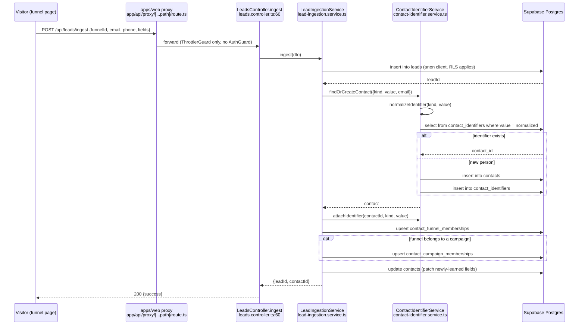

# Feature: Contacts & CRM

> Read-only reverse-engineering, 2026-09-05. Evidence tags: **CONFIRMED** (read in code),
> **LIKELY** (one inference hop), **UNKNOWN**.
> Scope: `apps/web/src/features/contacts`, `apps/web/src/features/properties`,
> `apps/api/src/modules/{leads,segments,custom-fields,entity-search}`,
> `apps/queue-worker/src/modules/crm-sync`.
> Cross-references: [`../05-api-map.md`](../05-api-map.md),
> [`../06-database-map.md`](../06-database-map.md),
> [`../08-auth-security.md`](../08-auth-security.md),
> [`../10-background-processes.md`](../10-background-processes.md).

## Status

**PARTIALLY IMPLEMENTED** — contact records, the activity timeline, custom fields, segments and
funnel-lead ingestion are all live and org-scoped, but the CRM-sync worker writes contacts with a
`NULL` `org_id` while every read path filters `org_id = :orgId`, so contacts imported from
ActiveCampaign/GoHighLevel are invisible to the org that imported them (evidence in
[Known Problems](#known-problems)); "lists" is a dead redirect and `contact_tags` has no
write path.

## Purpose

Store and work with **people** — leads captured by funnels, contacts imported from external CRMs,
and contacts created by hand or by an agent. The domain gives every person a canonical row, a
deduplicated identity, a chronological activity record, arbitrary user-defined fields, and
saved filter sets ("segments") used to slice the table and to target email sequences.

### The contacts-vs-leads question, resolved

**CONFIRMED: two tables, two different things, one NestJS module.**

```text
leads      = an immutable ingestion EVENT   (one row per funnel form submission)
contacts   = the canonical PERSON record    (deduplicated, mutable, the CRM entity)
```

The confusion is packaging, not modelling: both live in `apps/api/src/modules/leads`, and 20 of
that module's 22 routes are actually **contact** routes under the `leads/contacts/*` path prefix
(`apps/api/src/modules/leads/controllers/lead-contacts.controller.ts:16` declares
`@Controller('leads')` and then `@Get('contacts')`).

The linkage is written on ingest. `LeadIngestionService.ingest` first inserts the `leads` row
(`apps/api/src/modules/leads/services/lead-ingestion.service.ts:38`, `createLeadSecure`), then calls
`syncLeadContact` (`:54`) which delegates to
`ContactIdentifierService.findOrCreateContact` (`apps/api/src/modules/leads/services/contact-identifier.service.ts:106`).
That service normalises the identifier (`normalizeIdentifier`, `:80`), looks for an existing
`contact_identifiers` row, and either returns the existing contact or creates a new one. It then
attaches the identifier (`attachIdentifier`, `:173`) and the ingestion service upserts funnel and
campaign memberships (`:56`, `:59`).

So: **a lead always produces or updates exactly one contact.** A contact can have many leads.
Only `contacts` is ever shown in the CRM UI; `leads` is queryable per-funnel/per-campaign through
`GET /api/leads` for funnel analytics.

`contact_type` (`'lead' | 'customer'`) is a _column on `contacts`_, flipped by
`POST /api/leads/contacts/:id/reclassify`. That is the third meaning of the word "lead" in this
codebase and the reason the naming reads as duplicated.

## User Capabilities

- Browse a paginated, sortable, filterable contact table with per-column filters and multi-select
  logic (AND/OR) — `CrmContactsTable.tsx`, `CrmContactsFilterDrawer.tsx`.
- Open a contact detail panel (inline drawer or `/contacts/[id]` page) and edit name, email, phone,
  company, city/state/country, custom field values, and notes.
- Reclassify a contact between `lead` and `customer`.
- Read a merged activity timeline (form submissions, email sends/opens/clicks, notes, memberships).
- Read and open the emails sent to a contact, and link a chat conversation to a contact.
- Send a one-off email to a contact from the panel.
- Create a single contact by hand, or bulk-import a batch (deduplicated by lowercased email).
- Define custom fields (name, type, options) and set their values per contact.
- Create, edit, preview (live count) and delete segments — saved filter sets over campaigns,
  funnels, tags, contact type, country and a date range.
- Trigger a CRM sync job against a connected ActiveCampaign or GoHighLevel account and poll it.
- Import CRM contacts into a campaign.
- Global cross-entity search that includes contacts (`/api/entity-search`).

**Not available** (checked, absent): CSV/file export, third-party data enrichment (see
[Validation](#validation)), tag CRUD, contact merge/dedupe UI, contact deletion.

## Entry Points

### Frontend

| Route / surface       | File                                                                                                       | Notes                                                                             |
| --------------------- | ---------------------------------------------------------------------------------------------------------- | --------------------------------------------------------------------------------- |
| `/contacts`           | `apps/web/src/app/(dashboard)/contacts/page.tsx`                                                           | renders `CrmContactsContainer`                                                    |
| `/contacts/[id]`      | `apps/web/src/app/(dashboard)/contacts/[id]/page.tsx`                                                      | fetches via `fetchContact`, renders `ContactInfoPanel`                            |
| `/lists`              | `apps/web/src/app/(dashboard)/lists/page.tsx`                                                              | **`permanentRedirect('/spaces')`** — the "lists" concept was folded into Spaces   |
| Space contacts view   | `apps/web/src/features/spaces/components/contacts/ContactActivityTimeline.tsx`, `ContactsSegmentPanel.tsx` | the timeline component lives under `features/spaces`, **not** `features/contacts` |
| Settings → Properties | `apps/web/src/features/settings/components/settings-content/properties/segments/SegmentEditorDialog.tsx`   | segment authoring                                                                 |
| Funnel settings       | `apps/web/src/components/funnels/funnel-settings/use-distinct-contact-tags.ts`                             | tag picker sourced from distinct values                                           |

### Backend

| Controller prefix             | File                                                                         | Guards                                                   |
| ----------------------------- | ---------------------------------------------------------------------------- | -------------------------------------------------------- |
| `leads` (contacts CRUD)       | `apps/api/src/modules/leads/controllers/lead-contacts.controller.ts`         | `AuthGuard, OrgContextGuard, OrgRoleGuard`               |
| `leads` (timeline)            | `.../lead-contact-timeline.controller.ts`                                    | same                                                     |
| `leads` (actions/notes/email) | `.../lead-contact-actions.controller.ts`                                     | same                                                     |
| `leads` (imports)             | `.../lead-contact-imports.controller.ts`                                     | same                                                     |
| `leads` (CRM sync)            | `.../leads-crm.controller.ts`                                                | same                                                     |
| `leads` (ingest + list)       | `.../leads.controller.ts`                                                    | **per-route**: `ingest` = `ThrottlerGuard` only (public) |
| `internal/contacts`           | `.../internal-contacts.controller.ts`                                        | `InternalAuthGuard`                                      |
| `segments`                    | `apps/api/src/modules/segments/controllers/segments.controller.ts`           | `AuthGuard, OrgContextGuard, OrgRoleGuard`               |
| `custom-fields`               | `apps/api/src/modules/custom-fields/controllers/custom-fields.controller.ts` | same                                                     |
| `entity-search`               | `apps/api/src/modules/entity-search/controllers/entity-search.controller.ts` | + `ThrottlerGuard`                                       |

## API Endpoints

| Method | Route                                                        | Handler                         | Purpose                                          |
| ------ | ------------------------------------------------------------ | ------------------------------- | ------------------------------------------------ |
| GET    | `/api/leads/contacts`                                        | `LeadContactsController.list`   | paginated/filtered contact table                 |
| GET    | `/api/leads/contacts/basics`                                 | `LeadContactsController`        | minimal contact list (pickers)                   |
| GET    | `/api/leads/contacts/:id`                                    | `LeadContactsController`        | single contact                                   |
| PATCH  | `/api/leads/contacts/:id`                                    | `LeadContactsController`        | update contact fields                            |
| POST   | `/api/leads/contacts/:id/reclassify`                         | `LeadContactsController`        | flip `contact_type` lead↔customer                |
| GET    | `/api/leads/contacts/:id/activity`                           | `LeadContactTimelineController` | merged activity timeline                         |
| GET    | `/api/leads/contacts/:id/emails`                             | `LeadContactTimelineController` | emails sent to contact                           |
| GET    | `/api/leads/contacts/:id/emails/:emailId`                    | `LeadContactTimelineController` | one email body                                   |
| GET    | `/api/leads/contacts/:id/conversations`                      | `LeadContactTimelineController` | linked chat conversations                        |
| POST   | `/api/leads/contacts/:id/send-email`                         | `LeadContactActionsController`  | one-off outbound email                           |
| PATCH  | `/api/leads/contacts/:id/conversations/:conversationId/link` | `LeadContactActionsController`  | attach a conversation                            |
| POST   | `/api/leads/contacts/:id/notes`                              | `LeadContactActionsController`  | add note                                         |
| PATCH  | `/api/leads/contacts/:id/notes/:noteId`                      | `LeadContactActionsController`  | edit note                                        |
| POST   | `/api/leads/contacts`                                        | `LeadContactImportsController`  | create one contact                               |
| POST   | `/api/leads/contacts/import-batch`                           | `LeadContactImportsController`  | bulk import                                      |
| GET    | `/api/leads/crm/funnels`                                     | `LeadsCrmController`            | funnel list for the filter drawer                |
| GET    | `/api/leads/crm/list`                                        | `LeadsCrmController`            | CRM-shaped contact list                          |
| POST   | `/api/leads/campaign-import`                                 | `LeadsCrmController`            | import contacts into a campaign                  |
| POST   | `/api/leads/crm-sync`                                        | `LeadsCrmController`            | enqueue a CRM sync job                           |
| GET    | `/api/leads/crm-sync/:id`                                    | `LeadsCrmController`            | poll sync job status                             |
| GET    | `/api/leads`                                                 | `LeadsController.list`          | raw lead events by funnel/campaign               |
| POST   | `/api/leads/ingest`                                          | `LeadsController.ingest`        | **public** funnel form submission                |
| POST   | `/api/internal/contacts/resolve`                             | `InternalContactsController`    | agent/worker contact resolution                  |
| GET    | `/api/segments`                                              | `SegmentsController`            | list segments                                    |
| GET    | `/api/segments/filter-options`                               | `SegmentsController`            | available filter values                          |
| GET    | `/api/segments/:id`                                          | `SegmentsController`            | one segment                                      |
| POST   | `/api/segments`                                              | `SegmentsController`            | create                                           |
| PUT    | `/api/segments/:id`                                          | `SegmentsController`            | update                                           |
| POST   | `/api/segments/preview`                                      | `SegmentsController`            | live matching count                              |
| DELETE | `/api/segments/:id`                                          | `SegmentsController`            | delete                                           |
| GET    | `/api/custom-fields`                                         | `CustomFieldsController`        | list definitions                                 |
| GET    | `/api/custom-fields/:id`                                     | `CustomFieldsController`        | one definition                                   |
| POST   | `/api/custom-fields`                                         | `CustomFieldsController`        | create definition                                |
| PATCH  | `/api/custom-fields/:id`                                     | `CustomFieldsController`        | update definition                                |
| DELETE | `/api/custom-fields/:id`                                     | `CustomFieldsController`        | delete definition                                |
| GET    | `/api/entity-search`                                         | `EntitySearchController`        | cross-entity search (contacts + 24 other tables) |

## Main Files

| File                                                                                      | Responsibility                                                               |
| ----------------------------------------------------------------------------------------- | ---------------------------------------------------------------------------- |
| `apps/web/src/features/contacts/components/CrmContactsContainer.tsx`                      | page-level state: filters, sort, pagination, selection, drawer               |
| `apps/web/src/features/contacts/components/CrmContactsTable.tsx`                          | virtualised table rendering                                                  |
| `apps/web/src/features/contacts/components/CrmContactsFilterDrawer.tsx`                   | filter builder + segment application                                         |
| `apps/web/src/features/contacts/components/ContactInfoPanel.tsx`                          | detail/edit panel, notes, custom fields                                      |
| `apps/web/src/features/contacts/components/crm-contacts-container/CrmContactsToolbar.tsx` | search, bulk actions, sync trigger                                           |
| `apps/web/src/features/contacts/services/contacts-api.ts`                                 | thin re-export barrel over `@/lib/contacts/contacts-api`                     |
| `apps/web/src/features/contacts/services/crm-contacts-api.ts`                             | thin re-export barrel over `@/lib/contacts/crm-contacts-api`                 |
| `apps/web/src/lib/contacts/contacts-api.ts`                                               | actual fetch layer for contact CRUD                                          |
| `apps/web/src/lib/contacts/crm-contacts-api.ts`                                           | actual fetch layer for the CRM table                                         |
| `apps/web/src/lib/contacts/crm-import-api.ts`                                             | batch import + sync-job calls                                                |
| `apps/web/src/features/contacts/config/contacts-toast-errors.config.ts`                   | user-facing error copy                                                       |
| `apps/web/src/features/spaces/components/contacts/ContactActivityTimeline.tsx`            | timeline rendering (lives under `spaces`)                                    |
| `apps/web/src/features/properties/hooks/useSegments.ts`                                   | segment list/CRUD hook                                                       |
| `apps/web/src/features/properties/services/segments-api.ts`                               | segment fetch layer with a 60 s keyed cache                                  |
| `apps/web/src/lib/properties/segments.ts`                                                 | `SegmentFilters` type — the filter contract                                  |
| `apps/web/src/lib/properties/use-custom-fields.ts`                                        | custom-field hook (the `features/properties` copies are 1–3-line re-exports) |
| `apps/api/src/modules/leads/services/lead-ingestion.service.ts`                           | public ingest → lead row → contact sync → memberships                        |
| `apps/api/src/modules/leads/services/contact-identifier.service.ts`                       | identifier normalisation, dedupe, find-or-create                             |
| `apps/api/src/modules/leads/repositories/leads-repository-02.base.ts`                     | the contact list query (org filter at `:84`, note enrichment at `:302`)      |
| `apps/api/src/modules/leads/repositories/leads-repository-04.base.ts`                     | activity timeline reads                                                      |
| `apps/api/src/modules/leads/repositories/leads-repository-06.base.ts`                     | activity writes                                                              |
| `apps/api/src/modules/segments/services/segments.service.ts`                              | segment CRUD + `previewSegment`                                              |
| `apps/api/src/modules/segments/repositories/segments.repository.ts`                       | `segments`/`contact_tags` reads, `preview_segment_contacts` RPC              |
| `apps/api/src/modules/custom-fields/repositories/custom-fields.repository.ts`             | `contact_custom_field_definitions` CRUD                                      |
| `apps/queue-worker/src/modules/crm-sync/services/crm-sync.service.ts`                     | ActiveCampaign/GoHighLevel pull + contact insert                             |
| `apps/queue-worker/src/modules/crm-sync/services/crm-sync.scheduler.ts`                   | periodic job pickup                                                          |
| `apps/queue-worker/src/modules/crm-sync/processors/crm-sync.processor.ts`                 | BullMQ processor                                                             |

## Database Tables

Read from `from('…')` call sites in `apps/api/src/modules/leads/repositories/*` — see
[`../06-database-map.md`](../06-database-map.md) for column detail.

**Core**

- `contacts` — the canonical person. Has `user_id`, `org_id` (added by
  `supabase/migrations/20260327100001_add_org_id_to_existing_tables.sql`), `email`, `phone`,
  `first_name`, `last_name`, `company`, `city`/`state`/`country`, `contact_type`,
  `contact_source`, `source`, `tags` (text array), `is_archived`, timestamps.
- `contact_identifiers` — normalised (kind, value) → `contact_id`; the dedupe index.
- `leads` — the ingestion event, one per funnel submission.
- `contact_notes` — free-text notes, org-scoped.
- `contact_activity` — timeline rows.
- `contact_campaign_memberships`, `contact_funnel_memberships` — join tables.
- `contact_custom_field_definitions` — custom field schema
  (`custom-fields.repository.ts:8` sets `tableName`).
- `segments` — saved filters (JSONB `filters`).
- `contact_tags` — **read-only in practice**: referenced only by
  `apps/api/src/modules/segments/repositories/segments.repository.ts`; no insert/update path exists.
- `crm_sync_jobs` — sync job queue rows.

**Read/written alongside**: `campaigns`, `funnels`, `conversations`, `emails`, `email_sends`,
`email_events`, `sequence_emails`, `sequence_email_sends`, `email_sender_identities`,
`email_single_schedules`, `user_integrations`, `vault_secrets`, `profiles`, `ns_brains`,
`ns_memories`, `agents_registry`, `ad_sets`, `ads`, `campaign_workflow_edges`.

**RPC**: `preview_segment_contacts(p_filters jsonb)` — segment counting is done in Postgres, not
in TypeScript (`segments.repository.ts:90`).

## Business Logic

Mostly in the right place, with two exceptions.

**In services (correct):**

- Identifier normalisation and dedupe — `contact-identifier.service.ts`.
- Ingest orchestration (lead → contact → memberships) — `lead-ingestion.service.ts`.
- Segment CRUD and preview delegation — `segments.service.ts`.
- CRM provider fetch + import — `crm-sync.service.ts`.

**In repositories (borderline):** the contact list query in
`leads-repository-02.base.ts` builds filter semantics, archive defaults, campaign/funnel
membership joins **and** performs a second query to enrich note counts (`:302`–`:344`). That is
query-shaping plus business rules in the data layer, and it makes the org-scoping rule
(`:84`) hard to find.

**In Postgres:** segment matching lives entirely in the `preview_segment_contacts` RPC. The
filter contract is duplicated in TypeScript at `apps/web/src/lib/properties/segments.ts` with no
generated link between the two — a change to the RPC will not be caught by the type system.

**In components:** `CrmContactsContainer.tsx` owns all filter/sort/pagination/selection state and
composes the request itself; there is no store or hook for the contacts table (contrast with
segments, which do have `useSegments`).

## Validation

- **Zod at the boundary** for segments and custom fields — `ZodValidationPipe` on
  `segments.controller.ts` and `custom-fields.controller.ts`.
- **Public ingest** (`POST /api/leads/ingest`) is throttled (`ThrottlerGuard`) and validated
  before it touches the DB; the lead row is inserted through an **anon** client
  (`createLeadSecure`, `lead-ingestion.service.ts:38`) so RLS applies, and only afterwards does
  the service switch to a service-role client for contact sync.
- **Batch import** dedupes by lowercased trimmed email and skips emails that already exist for
  the user (`lead-contact-imports.controller.ts` → repository; mirrored in
  `crm-sync.service.ts:343` `importContactsBatchForUser`).
- **`enrich*` is not data enrichment.** The only `enrich` identifiers in the module
  (`leads-repository-02.base.ts:302`–`:362`) attach _note counts_ to contact rows. There is no
  Clearbit/Apollo-style enrichment anywhere in the contacts domain. **CONFIRMED.**

## Permissions

Every authenticated contact route carries `AuthGuard, OrgContextGuard, OrgRoleGuard`. No
`@RequireOrgRole` decorators appear on the contacts controllers, so within an org any member role
that passes `OrgContextGuard` can read and write contacts. Isolation is enforced by the
`org_id` predicate in the repository (`leads-repository-02.base.ts:84`):

```text
orgId === null  →  .is('org_id', null)      (personal contacts)
orgId === '…'   →  .eq('org_id', orgId)     (org contacts)
orgId undefined →  no filter at all
```

The third branch is why the `org_id`-less CRM-sync inserts matter — see
[Known Problems](#known-problems). Per
[`../08-auth-security.md`](../08-auth-security.md), `OrgRoleGuard` passes through when the
`x-org-id` header is absent; the contacts routes do not act on a path-param org id, so they are
not exposed to the org-takeover class of bug that billing is.

`POST /api/leads/ingest` is intentionally unauthenticated — it is the funnel form endpoint.
`POST /api/internal/contacts/resolve` is `InternalAuthGuard` (shared bearer token) for agent and
worker use.

## External Dependencies

- **Supabase** — Postgres (contacts + RLS), Auth, and the `preview_segment_contacts` RPC.
- **ActiveCampaign** — pulled by `crm-sync.service.ts` via
  `apps/api/src/modules/integrations/activecampaign`.
- **GoHighLevel** — same, via `apps/api/src/modules/integrations/gohighlevel`;
  `apps/queue-worker/src/modules/shared/helpers/ghl-email.helper.ts` reads its credentials
  straight out of `vault_secrets`.
- **Redis / BullMQ** — the CRM sync queue in `queue-worker`.
- **Email provider** — outbound contact email goes through the `email` module, not this one.
- Credentials for both CRMs come from the AES-256-GCM vault; see
  [`integrations-oauth.md`](./integrations-oauth.md) and [`../09-integrations.md`](../09-integrations.md).

## Background Jobs

| Job      | Runtime                       | Files                                                                   | Trigger                                                                            |
| -------- | ----------------------------- | ----------------------------------------------------------------------- | ---------------------------------------------------------------------------------- |
| CRM sync | `apps/queue-worker` (Railway) | `crm-sync.processor.ts`, `crm-sync.service.ts`, `crm-sync.scheduler.ts` | `POST /api/leads/crm-sync` writes a `crm_sync_jobs` row; the scheduler picks it up |

The service paginates the remote CRM (`startAfterId` cursor loop, `crm-sync.service.ts:336`) and
calls `importContactsBatchForUser` per page. Job state is tracked on `crm_sync_jobs` and polled by
`GET /api/leads/crm-sync/:id`. See [`../10-background-processes.md`](../10-background-processes.md)
for the queue inventory and the Redis-instance caveats.

## Frontend Flow

1. `/contacts` renders `CrmContactsContainer`.
2. The container holds filter/sort/page state and calls `listCrmContacts` from
   `@/lib/contacts/crm-contacts-api`, which issues `GET /api/leads/crm/list` through
   `backendGet` → the Next proxy.
3. `CrmContactsFilterDrawer` loads funnels (`GET /api/leads/crm/funnels`), segments
   (`useSegments` → `GET /api/segments`, 60 s cached) and filter options
   (`GET /api/segments/filter-options`). Applying a segment writes its `filters` into container
   state; it does not call the backend segment-preview path.
4. Selecting a row opens `ContactInfoPanel`, which fetches the contact, its custom fields and its
   notes, and (in the Spaces surface) `ContactActivityTimeline` fetches
   `GET /api/leads/contacts/:id/activity`.
5. Edits `PATCH /api/leads/contacts/:id` and update local state optimistically; failures surface
   through `contacts-toast-errors.config.ts`.
6. Import uses `crm-import-api.ts` → `POST /api/leads/contacts/import-batch`.
7. A CRM sync is fired from the toolbar → `POST /api/leads/crm-sync`, then polled with
   `GET /api/leads/crm-sync/:id`.

There is no react-query; caching is the hand-rolled `cachedFetch`/`invalidateCachedFetch` keyed
cache in `@/lib/cache/keyed-fetch-cache`, org-scoped through `getOrgScopedKey`.

## Backend Flow

**Read path.** `LeadContactsController.list` → service → `LeadsRepository` (the
`leads-repository-0N.base.ts` inheritance chain). `leads-repository-02.base.ts` composes the
select column list (adding `contact_campaign_memberships!inner` / `contact_funnel_memberships!inner`
when a campaign or funnel filter is present), applies the org predicate, archive default,
`contact_type`, then runs a second query to attach note counts.

**Ingest path.** `LeadsController.ingest` (throttled, unauthenticated) →
`LeadIngestionService.ingest`:
insert `leads` via anon client → `syncLeadContact` → `ContactIdentifierService.findOrCreateContact`
(normalise → look up `contact_identifiers` → reuse or create) → `attachIdentifier` →
`upsertFunnelMembership` → `upsertCampaignMembership` (when the funnel belongs to a campaign) →
`updateContact` patch with any newly-learned fields.

**Segment path.** `SegmentsController.preview` → `SegmentsService.previewSegment` →
`SegmentsRepository.previewSegmentContacts` → `supabase.rpc('preview_segment_contacts', { p_filters })`
→ returns an integer count.

## Full Request Flow

Public funnel submission, which is the only path that creates both a lead and a contact:



## Error Handling

- Repositories throw `new Error('DB error: ' + error.message)` on any Supabase error
  (`leads-repository-02.base.ts:322`, `crm-sync.service.ts:372`/`:394`) — raw Postgres messages
  reach the HTTP layer.
- Segments/custom fields use Nest exceptions from the service and Zod 400s from the pipe.
- Frontend copy is centralised per §7 of `AGENTS.md`:
  `apps/web/src/features/contacts/config/contacts-toast-errors.config.ts`,
  `apps/web/src/features/artifacts/config/*` for the neighbouring surfaces.
- The `/contacts/[id]` page renders its own inline error and not-found cards rather than throwing
  to the route error boundary.
- CRM sync failures are recorded on the `crm_sync_jobs` row and surfaced only through the polling
  endpoint; nothing pushes a notification.

## Test Scenarios

1. **Lead → contact dedupe.** Submit the same funnel form twice with the same email. Expect two
   `leads` rows, one `contacts` row, one `contact_identifiers` row.
2. **Case/whitespace dedupe.** Submit `Foo@Bar.com` then `foo@bar.com`. Expect one contact
   (`normalizeIdentifier` lowercases and trims).
3. **Phone-only lead.** Submit with a phone and no email. Expect a contact created via the `phone`
   identifier kind; check the fallback in `createUnknownContact`
   (`contact-identifier.service.ts:207`).
4. **Org isolation.** As a member of org A, create a contact. Switch to org B (change the
   `x-org-id` header) and list contacts. Expect the contact to be absent.
5. **CRM sync visibility (the bug).** Connect GoHighLevel, run `POST /api/leads/crm-sync` while in
   an org context, wait for the job to complete, then load `/contacts` in that org. Expect the
   imported contacts to be **missing**; confirm the rows exist with `org_id IS NULL`.
6. **Batch import skip.** Import a CSV batch containing one existing email and two new ones.
   Expect `{ imported: 2, skipped: 1 }`.
7. **Reclassify.** `POST /api/leads/contacts/:id/reclassify`, then filter the table by
   `contact_type=customer`. Expect the contact to move between buckets.
8. **Segment preview vs. table.** Create a segment with a campaign filter, hit
   `POST /api/segments/preview` and note the count, then apply the same segment in the filter
   drawer. The two counts should match; a mismatch means the TypeScript filter contract has drifted
   from the `preview_segment_contacts` RPC.
9. **Custom field lifecycle.** Create a definition, set a value on a contact, delete the
   definition, reload the contact. Confirm what happens to the orphaned value.
10. **Public ingest abuse.** Post to `/api/leads/ingest` in a tight loop without auth. Expect
    `ThrottlerGuard` 429s, and confirm the anon-client insert is refused for a funnel id the
    submitter should not be able to write to.

## Known Problems

**HIGH — CRM-synced contacts are written outside org scope, so they never appear.**
`apps/queue-worker/src/modules/crm-sync/services/crm-sync.service.ts:382`–`:391` builds insert rows
with `user_id`, `email`, names, `phone`, `source`, `contact_source`, `tags` — and **no `org_id`**.
The existence check at `:368`–`:371` also filters on `user_id` only. Every read path filters
`org_id` (`apps/api/src/modules/leads/repositories/leads-repository-02.base.ts:84`), so a sync run
performed while the user is in an org produces rows with `org_id IS NULL` that the org's contact
table will never return. The dedupe check is likewise cross-org, so the same person can be skipped
for the wrong reason. Fix at the source: thread the job's `org_id` through
`importContactsBatchForUser`.

**MEDIUM — `contact_tags` is a read-only table.**
Only `apps/api/src/modules/segments/repositories/segments.repository.ts` references it; there is no
controller, service or migration-side trigger that writes it. Segment tag filters therefore match
against `contacts.tags` (the array column) or against nothing. Either wire up tag CRUD or delete the
table (`AGENTS.md` §2, replace-don't-accumulate).

**MEDIUM — the contacts domain is named after the wrong entity.**
20 of the 22 routes in `apps/api/src/modules/leads` are contact routes served under a `leads/`
prefix, and the word "lead" simultaneously means an ingestion row, a `contact_type` value, and the
module name. Any new reader has to derive this. The fix is a module rename plus a route alias, which
is a breaking change and therefore not free.

**MEDIUM — the segment filter contract exists twice with no link.**
`apps/web/src/lib/properties/segments.ts` (`SegmentFilters`) and the `preview_segment_contacts`
Postgres function must agree, and nothing enforces it. Adding a filter key in TypeScript silently
does nothing until the RPC is changed.

**LOW — `/lists` is a permanent redirect to `/spaces`.**
`apps/web/src/app/(dashboard)/lists/page.tsx` is a three-line `permanentRedirect`. "Lists" as a
contacts concept no longer exists; it was absorbed by Spaces
(see [`spaces-campaigns.md`](./spaces-campaigns.md)).

**LOW — the activity timeline lives in the wrong feature.**
`ContactActivityTimeline.tsx` sits under `apps/web/src/features/spaces/components/contacts/`, so a
developer working in `features/contacts` cannot find it. Per
`documentation/frontend-shared-surfaces.md` this is a cross-feature import waiting to happen.

**LOW — raw Postgres error text is returned to clients.**
`throw new Error('DB error: ' + error.message)` in the leads repositories leaks column and
constraint names into HTTP responses.

**LOW — no export.** Import exists in three forms (single, batch, CRM sync); there is no export
route or CSV download anywhere in the module. Users who import cannot get their data back out.

## Related Features

- [`spaces-campaigns.md`](./spaces-campaigns.md) — campaign/funnel membership joins, the Spaces
  contacts view, and `/lists` → `/spaces`.
- [`integrations-oauth.md`](./integrations-oauth.md) — how the ActiveCampaign/GoHighLevel
  credentials that CRM sync consumes get into the vault.
- [`missions-and-tasks.md`](./missions-and-tasks.md) — agents read and write contacts through the
  artifact action registry (`contact_activity`, `contact_notes`, `contact_identifiers` all appear in
  `apps/agent-api/src/modules/artifacts/repositories/`).
- [`../09-integrations.md`](../09-integrations.md) — provider inventory.
- Email: `apps/api/src/modules/email` (28 routes) owns `email_sends`/`email_events`, which the
  contact timeline reads.

## Open Questions

1. Was the `org_id`-less CRM-sync insert a pre-org-model leftover, or is there an intentional
   "personal contacts only" rule for synced data? Nothing in the code or migrations says.
2. Is `contact_tags` dead, or is there an unshipped tag manager? `use-distinct-contact-tags.ts`
   suggests tags were meant to be a first-class table rather than a `text[]` column.
3. What happens to `contacts.<custom field>` values when a `contact_custom_field_definitions` row is
   deleted? No cascade is visible in `custom-fields.repository.ts`; needs a migration read.
4. Does `POST /api/internal/contacts/resolve` apply org scoping, or does it inherit the same
   `org_id`-optional behaviour as the worker? Not traced.
5. Is contact **deletion** deliberately absent, or handled elsewhere (e.g. a Space item delete that
   cascades)? Only `is_archived` was found.
6. `entity-search` reads 25 tables including `contacts` but not `leads` — is that intentional, or
   is lead search simply missing?
