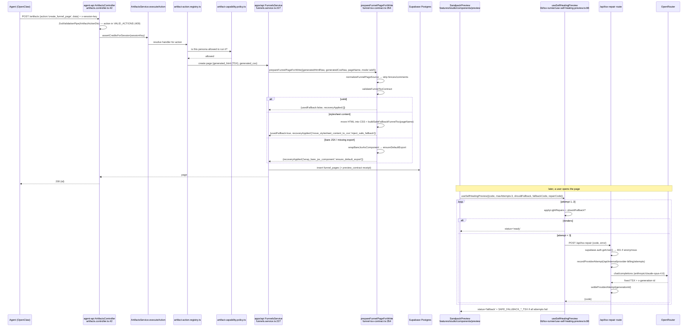

# Feature: Content, Artifacts & Studio

> Read-only reverse-engineering, 2026-09-05. Evidence tags: **CONFIRMED** (read in code),
> **LIKELY** (one inference hop), **UNKNOWN**.
> Scope: `apps/web/src/features/{studio,artifacts,composer}`,
> `apps/api/src/modules/{artifacts,campaigns,canvas,media,funnels}`,
> `apps/agent-api/src/modules/artifacts`, `packages/api-shared/src/services/funnel-tsx-contract.ts`.
> Cross-references: [`../03-architecture.md`](../03-architecture.md),
> [`../05-api-map.md`](../05-api-map.md), [`../06-database-map.md`](../06-database-map.md),
> [`../12-existing-tests.md`](../12-existing-tests.md),
> [`../16-code-health-findings.md`](../16-code-health-findings.md).

## Status

**WORKING but severely misnamed and mislocated** — the pipeline (agent action → artifact row →
TSX contract → Sandpack preview → self-healing repair) is live and coherent, but three of the four
directory names lie: `features/studio` is the **chat** feature (608 files) and its `/studio` route
redirects away; `features/composer` is a pasted-text clipboard widget, not an artifact composer;
and `apps/api/src/modules/artifacts` exposes exactly **one** route while the real artifact CRUD
lives in `apps/api/src/modules/campaigns`. One sophisticated repair function
(`programmaticTsxRepair`) is exported, tested and called by nothing.

## Purpose

Everything an agent or a user _produces_ is an artifact: a funnel page, a presentation, a document,
a blog post, an ad or social creative, an offer, an email sequence, a customer avatar, a canvas
node, a media asset. Artifacts are stored as **typed rows in their own tables** (there is no single
`artifacts` table), previewed by compiling generated TSX in a browser sandbox, and mutated almost
entirely through a 409-action agent registry rather than through per-entity REST endpoints.

### The studio / composer / artifacts overlap, resolved

**CONFIRMED. There is no overlap — the names are simply wrong.**

| Directory                              | Files          | What it actually is                                                                                                                                                                                                                                                                                      |
| -------------------------------------- | -------------- | -------------------------------------------------------------------------------------------------------------------------------------------------------------------------------------------------------------------------------------------------------------------------------------------------------- |
| `apps/web/src/features/studio`         | 608            | **The chat feature.** Contains `chat.service.ts`, `chat-resume-context.ts`, `stream-resilience.ts`, the conversation cache, _and_ every artifact editor/preview panel (`components/preview/Ad*.tsx`, `SandpackPreview.tsx`). `containers/StudioContainer.tsx` is the only container and is **orphaned**. |
| `apps/web/src/features/artifacts`      | 3              | **A search page only.** `GlobalArtifactsPage.tsx` plus two copy configs. It does not own artifacts; it queries `/api/entity-search?types=artifact`.                                                                                                                                                      |
| `apps/web/src/features/composer`       | 12             | **A clipboard widget.** Everything is under `pasted-text/` — `clipboard-paste.ts`, `PastedTextCard.tsx`, `pasted-text-storage.ts`. It turns a large paste into a collapsible chip in the chat input. Nothing to do with composing artifacts.                                                             |
| `apps/api/src/modules/artifacts`       | 5              | **One route**: `POST /api/artifacts/delete` (`artifacts.controller.ts:10`, `AuthGuard` only).                                                                                                                                                                                                            |
| `apps/api/src/modules/campaigns`       | 30 controllers | **The real artifact CRUD.** Eleven controllers are literally named `*-artifacts.controller.ts`.                                                                                                                                                                                                          |
| `apps/agent-api/src/modules/artifacts` | 278            | **The artifact engine.** 409 actions, a capability policy, an access policy — behind **4 HTTP routes**, all `InternalAuthGuard`.                                                                                                                                                                         |

So: user-facing artifact reads/writes go to `campaigns`; agent-driven artifact work goes to
`agent-api/artifacts`; the preview/edit UI lives in `studio`; deletion is the one thing
`api/artifacts` does.

## User Capabilities

- Chat with an agent and watch it produce artifacts inline (`features/studio`).
- Search every artifact across campaigns and spaces from `/artifacts`.
- Create offers, sequences, presentations, avatars, ad campaigns inside a campaign.
- Move or copy an artifact to another campaign (8 allowlisted tables), with copy-lineage
  duplicate detection.
- Funnels: create/reorder/move/delete pages, edit page TSX, publish/unpublish, browse page history.
- Presentations: edit files and assets, publish/unpublish, comment thread per presentation,
  download a bundle.
- Ads: edit an ad, duplicate it, clone to another ad set, publish to Meta, refresh Meta status,
  generate copy and creative concepts.
- Canvas: create/edit/delete nodes, generate, edit and vary node images, promote a node to a real
  ad, delegate a canvas to an agent, collaborate on a campaign whiteboard with operations + undo.
- Media: upload (direct, presigned, or URL import), browse assets, copy, delete, refresh signed
  URLs, generate images (streaming), edit images (streaming), hand off to Canva and import back.
- Paste a large block of text into chat and have it become an editable chip
  (`features/composer`).
- Watch a broken generated component repair itself in the preview, up to three attempts.

## Entry Points

### Frontend

| Route / surface     | File                                                                                           | Notes                                                               |
| ------------------- | ---------------------------------------------------------------------------------------------- | ------------------------------------------------------------------- | ------------------------------------- |
| `/artifacts`        | `apps/web/src/app/(dashboard)/artifacts/page.tsx`                                              | title `'All Artifacts                                               | ROAS'`, renders `GlobalArtifactsPage` |
| `/studio`           | `apps/web/src/app/(dashboard)/studio/page.tsx`                                                 | **redirects to `/team`**                                            |
| `/chats`            | `apps/web/src/app/(dashboard)/chats/page.tsx`                                                  | the chat surface that actually uses `features/studio`               |
| `/campaigns/[id]`   | `apps/web/src/app/(dashboard)/campaigns/[id]/page.tsx`                                         | campaign tabs host the artifact lists                               |
| `/spaces/[spaceId]` | `apps/web/src/app/(dashboard)/spaces/[spaceId]/page.tsx`                                       | artifact views inside a Space                                       |
| TSX repair          | `apps/web/src/app/api/tsx-repair/route.ts`                                                     | a **Next route handler**, not a NestJS route (`runtime = 'nodejs'`) |
| Preview             | `apps/web/src/features/studio/components/preview/SandpackPreview.tsx`, `AdSandpackPreview.tsx` | in-browser compile                                                  |

### Backend

| Controller                                                                                                                                                              | Prefix                                   | Guards                                                           |
| ----------------------------------------------------------------------------------------------------------------------------------------------------------------------- | ---------------------------------------- | ---------------------------------------------------------------- |
| `apps/api/src/modules/artifacts/controllers/artifacts.controller.ts`                                                                                                    | `artifacts`                              | `AuthGuard` only                                                 |
| `apps/api/src/modules/campaigns/controllers/artifacts.controller.ts`                                                                                                    | `@Controller()` (root)                   | `AuthGuard, ThrottlerGuard, OrgContextGuard, OrgRoleGuard`       |
| `.../campaigns/controllers/artifact-lists.controller.ts`                                                                                                                | `@Controller()`                          | same                                                             |
| `.../campaigns/controllers/artifact-resource-reads.controller.ts`                                                                                                       | `@Controller()`                          | same                                                             |
| `.../campaigns/controllers/presentation-{asset,lifecycle}-artifacts.controller.ts`                                                                                      | `@Controller()`                          | same                                                             |
| `.../campaigns/controllers/{ad,ad-campaign,ad-set,ad-set-lifecycle,ad-copy-generation,ad-generation}-artifacts.controller.ts`                                           | `@Controller()`                          | same                                                             |
| `.../campaigns/controllers/{document,document-list,blog-post,social-post,sequence-email,avatar-read,avatar-lifecycle,offer-sequence-lifecycle}-artifacts.controller.ts` | `@Controller()`                          | same                                                             |
| `apps/api/src/modules/funnels/controllers/*`                                                                                                                            | `funnels`, `preview`, `internal/funnels` | authenticated; `internal/funnels` = `InternalAuthGuard`          |
| `apps/api/src/modules/canvas/controllers/*`                                                                                                                             | `canvas`, `canvas/campaigns`             | authenticated                                                    |
| `apps/api/src/modules/media/controllers/*`                                                                                                                              | `media`                                  | authenticated                                                    |
| `apps/agent-api/src/modules/artifacts/controllers/artifacts.controller.ts`                                                                                              | `artifacts`                              | **`InternalAuthGuard, ThrottlerGuard`** + `SyncReadyInterceptor` |
| `apps/agent-api/src/modules/artifacts/controllers/artifact-openclaw-proxy.controller.ts`                                                                                | `artifacts/openclaw`                     | same                                                             |

## API Endpoints

| Method               | Route                                                                                  | Handler                                    | Purpose                                        |
| -------------------- | -------------------------------------------------------------------------------------- | ------------------------------------------ | ---------------------------------------------- |
| POST                 | `/api/artifacts/delete`                                                                | `ArtifactsController` (api/artifacts)      | the only route in the `artifacts` module       |
| POST                 | `/api/campaigns/:campaignId/offers`                                                    | `ArtifactsController` (campaigns)          | create offer                                   |
| POST                 | `/api/campaigns/:campaignId/sequences`                                                 | `ArtifactsController`                      | create email sequence                          |
| POST                 | `/api/campaigns/:campaignId/presentations`                                             | `ArtifactsController`                      | create presentation                            |
| POST                 | `/api/campaigns/:campaignId/avatars`                                                   | `ArtifactsController`                      | create customer avatar                         |
| GET                  | `/api/campaigns/:campaignId/assets/summary`                                            | `ArtifactsController`                      | counts for the delete dialog                   |
| PATCH                | `/api/artifacts/:table/:id/move`                                                       | `ArtifactsController`                      | move to another campaign (allowlisted `table`) |
| POST                 | `/api/artifacts/:table/:id/copy`                                                       | `ArtifactsController`                      | copy with lineage check                        |
| POST                 | `/api/artifacts/resolve-campaigns`                                                     | `ArtifactsController`                      | batch resolve copy lineage                     |
| GET                  | `/api/campaigns/:campaignId/{offers,sequences,presentations,avatars,ads,ad-campaigns}` | `ArtifactListsController`                  | per-type lists                                 |
| POST                 | `/api/campaigns/:campaignId/ad-campaigns`                                              | `ArtifactListsController`                  | create ad campaign                             |
| GET                  | `/api/presentations/:id`                                                               | `PresentationAssetArtifactsController`     | presentation detail                            |
| GET/PUT/DELETE       | `/api/presentations/:id/files`                                                         | `PresentationAssetArtifactsController`     | slide file set                                 |
| GET/POST/DELETE      | `/api/presentations/:id/assets`                                                        | `PresentationAssetArtifactsController`     | linked media                                   |
| GET                  | `/api/presentations/:id/bundle`                                                        | `PresentationAssetArtifactsController`     | downloadable bundle                            |
| GET/PUT/PATCH/DELETE | `/api/presentations/:id/comments[/:commentId]`                                         | `PresentationAssetArtifactsController`     | comment thread                                 |
| POST                 | `/api/presentations/:id/{publish,unpublish}`                                           | `PresentationLifecycleArtifactsController` | publish state                                  |
| PATCH/DELETE         | `/api/presentations/:id`                                                               | `PresentationLifecycleArtifactsController` | edit / delete                                  |
| GET/PATCH/DELETE     | `/api/funnels/:id`                                                                     | `FunnelsController`                        | funnel CRUD                                    |
| POST                 | `/api/funnels/:id/{publish,unpublish}`                                                 | `FunnelsController`                        | publish state                                  |
| POST                 | `/api/funnels/:id/pages`                                                               | `FunnelPagesController`                    | create page (runs the TSX write contract)      |
| GET                  | `/api/funnels/:id/pages/:pageId`                                                       | `FunnelPagesController`                    | page detail                                    |
| GET                  | `/api/funnels/:id/pages/:pageId/bundle`                                                | `FunnelPagesController`                    | page bundle                                    |
| PATCH                | `/api/funnels/:id/pages/:pageId`                                                       | `FunnelPagesController`                    | update page (TSX write contract)               |
| PATCH                | `/api/funnels/:id/pages/reorder`                                                       | `FunnelPagesController`                    | reorder                                        |
| PATCH                | `/api/funnels/:id/pages/:pageId/move`                                                  | `FunnelPagesController`                    | move to another funnel                         |
| DELETE               | `/api/funnels/:id/pages/:pageId`                                                       | `FunnelPagesController`                    | delete page                                    |
| PUT                  | `/api/funnels/:id/files`                                                               | `FunnelPagesController`                    | write funnel files                             |
| GET                  | `/api/preview/pages/:pageId`                                                           | `PreviewController`                        | server-rendered page preview                   |
| GET/PATCH            | `/api/canvas/ad-sets/:adSetId`                                                         | `CanvasController`                         | canvas for an ad set                           |
| POST/PATCH/DELETE    | `/api/canvas/nodes[/:nodeId]`                                                          | `CanvasController`                         | node CRUD                                      |
| POST                 | `/api/canvas/nodes/:nodeId/{generate,edit,variation,promote}`                          | `CanvasController`                         | image generation / promote to ad               |
| POST                 | `/api/canvas/delegate-to-agent`                                                        | `CanvasDelegationController`               | hand canvas to an agent                        |
| GET/POST             | `/api/canvas/campaigns/:campaignId/whiteboard[s]`                                      | `CampaignWhiteboardController`             | whiteboard CRUD                                |
| POST                 | `/api/canvas/campaigns/:campaignId/whiteboard[s]/[:boardId/]{operations,undo}`         | `CampaignWhiteboardController`             | collaborative ops + undo                       |
| POST                 | `/api/media/{upload,import-url,campaigns/upload,presign,confirm}`                      | `MediaUploadController`                    | five upload paths                              |
| GET/PATCH/DELETE     | `/api/media/assets[/:id]`                                                              | `MediaAssetsController`                    | asset CRUD                                     |
| GET                  | `/api/media/assets/resolve-by-url`                                                     | `MediaAssetsController`                    | reverse lookup                                 |
| POST                 | `/api/media/assets/:id/{copy,refresh-url}`                                             | `MediaAssetsController`                    | duplicate / re-sign                            |
| POST                 | `/api/media/{generate,generate-stream,edit-image-stream}`                              | `MediaImageGeneration/StreamController`    | image gen (SSE)                                |
| GET                  | `/api/media/generate/models`                                                           | `MediaImageGenerationController`           | available models                               |
| POST                 | `/api/media/generate-ad-concepts`                                                      | `MediaAdConceptsController`                | concept generation                             |
| POST                 | `/api/media/{cache-instagram-images,cache-social-images}`                              | `MediaSocialCacheController`               | social scrape cache                            |
| POST                 | `/api/media/assets/:id/canva-handoff`, `/api/media/canva/import`                       | `MediaCanvaController`                     | Canva round-trip                               |
| POST                 | `/artifacts` _(agent-api)_                                                             | `ArtifactsController.handleAction`         | **dispatch one of 409 actions**                |
| POST                 | `/artifacts/stream` _(agent-api)_                                                      | `ArtifactsController.handleActionStream`   | same, as SSE with progress events              |
| POST                 | `/artifacts/openclaw/{chat-completions,responses}` _(agent-api)_                       | `ArtifactOpenclawProxyController`          | LLM proxy for artifact generation              |
| POST                 | `/api/tsx-repair` _(Next route)_                                                       | `apps/web/src/app/api/tsx-repair/route.ts` | LLM repair of broken TSX                       |

## Main Files

| File                                                                                         | Responsibility                                                                                                                                                                                                                                                                 |
| -------------------------------------------------------------------------------------------- | ------------------------------------------------------------------------------------------------------------------------------------------------------------------------------------------------------------------------------------------------------------------------------ |
| `apps/agent-api/src/modules/artifacts/controllers/artifacts.controller.ts`                   | the two-route front door; logs `action`, duration, and result id; converts `success:false` into `BadRequestException`                                                                                                                                                          |
| `apps/agent-api/src/modules/artifacts/dtos/artifact-action.dto.ts`                           | `VALID_ACTIONS` — **409 entries**                                                                                                                                                                                                                                              |
| `apps/agent-api/src/modules/artifacts/services/artifact-action.registry.ts`                  | 734 lines mapping action → handler                                                                                                                                                                                                                                             |
| `apps/agent-api/src/modules/artifacts/services/artifact-capability.policy.ts`                | 1,437 lines of per-agent-persona allowlists (`DELEGATOR_ALLOWED_ACTIONS`, `FLOW_ALLOWED_ACTIONS`, `VIBEY_ALLOWED_ACTIONS`, `HR_ALLOWED_ACTIONS`, `BRAIN_SCHOLAR_ALLOWED_ACTIONS`, `BUILDER_ALLOWED_ACTIONS`, `CEO_ONLY_ACTIONS`, `SKILL_WRITE_ACTIONS`, `HR_AUDIT_ACTIONS`, …) |
| `apps/agent-api/src/modules/artifacts/services/artifact-access-policy-actions.ts`            | 22 lines — the org/user access gate                                                                                                                                                                                                                                            |
| `apps/agent-api/src/modules/artifacts/services/artifact-action-schemas.ts`                   | per-action payload schemas                                                                                                                                                                                                                                                     |
| `apps/agent-api/src/modules/artifacts/services/artifact-presentations.service.ts`            | presentation writes; calls `prepareFunnelPageForWrite` at `:60`                                                                                                                                                                                                                |
| `apps/agent-api/src/modules/artifacts/services/artifact-presentation-legacy-edit.service.ts` | the legacy presentation edit path                                                                                                                                                                                                                                              |
| `apps/agent-api/src/modules/artifacts/services/artifact-contacts.service.ts`                 | contact actions from an artifact context                                                                                                                                                                                                                                       |
| `packages/api-shared/src/services/funnel-tsx-contract.ts`                                    | 788 lines: validate → normalise → recover → write contract                                                                                                                                                                                                                     |
| `apps/api/src/modules/funnels/services/funnels.service.ts`                                   | calls `prepareFunnelPageForWrite` at `:227` and `:432`, stores a `preview_contract` receipt                                                                                                                                                                                    |
| `apps/api/src/modules/campaigns/services/artifacts-move.base.ts`                             | `MOVABLE_TABLES` allowlist (`:42`), move, copy, copy-lineage resolution                                                                                                                                                                                                        |
| `apps/api/src/modules/campaigns/repositories/campaign-artifact-move.repository.ts`           | the dynamic-table data access behind move/copy                                                                                                                                                                                                                                 |
| `apps/web/src/features/studio/services/artifact-preview.service.ts`                          | **1,348-line** frontend god-module: campaign file/artifact listing, signed URLs, create funnel/offer/sequence/presentation/avatar, funnel page CRUD, blog posts, ad CRUD, Meta publishing                                                                                      |
| `apps/web/src/features/studio/services/chat.service.ts`                                      | the actual chat transport                                                                                                                                                                                                                                                      |
| `apps/web/src/features/studio/components/preview/SandpackPreview.tsx`                        | funnel/page preview sandbox                                                                                                                                                                                                                                                    |
| `apps/web/src/features/studio/components/preview/AdSandpackPreview.tsx`                      | ad creative sandbox                                                                                                                                                                                                                                                            |
| `apps/web/src/features/studio/lib/use-self-healing-preview.ts`                               | 4-line re-export of the shared hook                                                                                                                                                                                                                                            |
| `apps/web/src/lib/tsx-runner/use-self-healing-preview.ts`                                    | the real hook: 3-attempt validate → repair → fallback loop                                                                                                                                                                                                                     |
| `apps/web/src/lib/tsx-runner/creative-tsx-validation.ts`                                     | `looksLikeInvalidCreativeTsx`, the two safe fallbacks, and `createCreativeRepairFn` (with a module-level circuit breaker)                                                                                                                                                      |
| `apps/web/src/app/api/tsx-repair/route.ts`                                                   | OpenRouter repair call + provider-billing attempt/settle                                                                                                                                                                                                                       |
| `apps/web/src/features/artifacts/components/GlobalArtifactsPage.tsx`                         | debounced multi-source artifact search                                                                                                                                                                                                                                         |
| `apps/web/src/lib/artifacts/global-artifacts-api.ts`                                         | fans out to `/api/entity-search`, `/api/campaigns`, `/api/spaces`, `/api/media/assets`                                                                                                                                                                                         |
| `apps/web/src/features/composer/pasted-text/*`                                               | the pasted-text chip (12 files)                                                                                                                                                                                                                                                |

## Database Tables

**There is no single `artifacts` table.** Every artifact type has its own table; "artifact" is a
naming convention, and `:table` is a runtime parameter validated against an allowlist.

**Artifact types** (from `MOVABLE_TABLES`, `artifacts-move.base.ts:42`):
`offers`, `funnels`, `forms`, `ads`, `sequences`, `presentations`, `avatars`, `emails`.

**Full set touched by `apps/agent-api/src/modules/artifacts/repositories/`** (70+ tables; the
content-relevant ones):
`funnels`, `funnel_pages`, `funnel_files`, `funnel_assets`, `funnel_conversion_points`,
`funnel_change_sets`, `funnel_change_items`, `blog_posts`, `presentations`, `forms`,
`form_responses`, `offers`, `sequences`, `sequence_emails`, `emails`, `email_sends`,
`ads`, `ad_sets`, `ad_campaigns`, `ad_creative_canvases`, `ad_creative_nodes`,
`canvas_items`, `canvas_connectors`, `campaign_canvases`, `campaign_strategy_nodes`,
`media`, `media_assets`, `media_generation_jobs`, `avatars`, `customer_avatars`,
`branding_themes`, `conversation_documents`, `mission_deliverables`, `conversations`,
`messages`, `campaigns`, `ai_usage_events`.

**Copy lineage** is tracked by a `copied_from_id` column on every movable table; the ancestry walk
in `resolveLineageCampaignIdsForRow` (`artifacts-move.base.ts:194`) climbs to the root then
breadth-first collects descendants.

**Contract receipt**: funnel pages carry a `preview_contract` JSONB with
`{ normalization_applied, recovery_applied, used_fallback }` (`funnels.service.ts:237`–`:241`),
plus a `source_mode` flag (`'html_bundle'` bypasses the TSX contract entirely, `:220`).

## Business Logic

**In agent-api services (correct, but enormous).** The artifact engine is properly layered:
controller → `ArtifactsService.executeAction` → registry → per-domain service → repository. The
problem is size, not placement: 409 actions and a 1,437-line policy file in one module.

**In `api-shared` (correct and reusable).** The TSX contract is a pure function library with no
I/O, shared between `apps/api` (funnels) and `apps/agent-api` (presentations). Exactly the right
shape for a `packages/` module.

**In the frontend service layer (wrong).**
`apps/web/src/features/studio/services/artifact-preview.service.ts` is 1,348 lines covering at
least eight unrelated domains — campaign files, signed URLs, artifact creation for five types,
funnel page CRUD, blog posts, ad CRUD, Meta ad-account and publishing calls. It is a network client
that has accumulated an entire product surface. This exceeds the LOC limits in
`.docs/guidelines/architecture/project-architecture.md`.

**In controllers (minor).** The campaigns artifact controllers do their own
`if (!body?.target_campaign_id) throw new BadRequestException(...)` inline
(`campaigns/controllers/artifacts.controller.ts:127`, `:151`) instead of using
`ZodValidationPipe` like the rest of the codebase.

**In the browser (deliberate).** Preview compilation and the self-healing loop run client-side in
Sandpack. `useSelfHealingPreview` owns the retry policy; the server only supplies the repair.

## Validation

**The TSX contract** (`packages/api-shared/src/services/funnel-tsx-contract.ts`) is the most
carefully specified validator in the repo. Six failure codes (`:16`):
`EMPTY`, `HTML_COMMENTS`, `MARKDOWN_FENCE`, `STYLESHEET_CONTENT`, `NOT_COMPONENT`,
`TSX_PARSE_ERROR`.

`prepareFunnelPageForWrite` (`:354`) is a four-stage ladder:

1. `normalizeFunnelPageSource` — strip fences/comments.
2. `validateFunnelTsxContract` — if valid, return immediately.
3. `recoverFunnelTsx` (`:320`) — if the "HTML" is actually a stylesheet, move it into the CSS
   column and inject `buildSafeFallbackFunnelTsx(pageName)`; otherwise
   `wrapBareJsxAsComponent` then `ensureDefaultExport`.
4. If still invalid and `mode === 'update'`, fall back to `previousValidHtml`; otherwise the safe
   fallback.

Every stage records what it did, and the receipt is persisted on the row — so a page's history of
automated rescues is auditable. **CONFIRMED.**

**The runtime validator** `looksLikeInvalidCreativeTsx`
(`apps/web/src/lib/tsx-runner/creative-tsx-validation.ts:6`) is a separate, cruder heuristic set
for ad/social creatives: reject empty, reject a leading `@import url(`, reject a leading CSS
selector block, reject `<style>` or `--custom-prop:` without a capitalised `function`, and require
either `function Xxx(` or `const Xxx =`.

**Agent action validation** is three-layered: `ZodValidationPipe(ArtifactActionDto)` at the
controller, per-action schemas in `artifact-action-schemas.ts`, and the persona allowlists in
`artifact-capability.policy.ts`. This is what `AGENTS.md` §8.5 mandates.

**Move/copy validation**: `MOVABLE_TABLES.includes(table)` guards the dynamic-table parameter on
all three routes (`artifacts-move.base.ts:59`, `:78`, `:248`), so `:table` is not an injection
vector. Copy additionally refuses same-lineage targets (`:88`) and refuses funnels outright
because pages would not be duplicated (`:92`).

## Permissions

- Campaign artifact routes: `AuthGuard, ThrottlerGuard, OrgContextGuard, OrgRoleGuard`, no
  `@RequireOrgRole`. Data access goes through the **request-scoped** Supabase client
  (`@Supabase() supabase`), so RLS is the effective boundary — several handlers explicitly ignore
  the scope (`@OrgContext() _scope`).
- `POST /api/artifacts/delete` carries **`AuthGuard` only** — no throttle, no org context.
- Agent-api artifact routes are `InternalAuthGuard` (shared bearer) + `ThrottlerGuard`.
  Per-caller authorisation is then the **session key**: `assertCreditsForSession(sessionKey)`
  followed by the capability policy. There is no user JWT on this path.
- `apps/web/src/app/api/tsx-repair/route.ts` does its own Supabase `auth.getUser()` check and
  401s without a user — it does not go through the NestJS guard chain at all, because it is a Next
  route handler.
- `GET /api/preview/pages/:pageId` (`funnels/controllers/preview.controller.ts`) is the public
  page renderer; see [`spaces-campaigns.md`](./spaces-campaigns.md) and
  [`../08-auth-security.md`](../08-auth-security.md) for the publish/domain model.

## External Dependencies

- **OpenRouter** — TSX repair (`DEFAULT_REPAIR_MODEL = 'anthropic/claude-opus-4.6'`,
  `tsx-repair/route.ts:8`) and, via the OpenClaw proxy, artifact generation.
- **Sandpack** (CodeSandbox) — in-browser TSX compilation for previews.
- **`react`, `framer-motion`, `lucide-react`** — the only import surface allowed in generated TSX
  (enforced by the repair prompt and by `programmaticTsxRepair`'s import fixer).
- **Tailwind** — generated components are instructed to use utility classes or inline style
  objects.
- **Meta Marketing API** — ad publishing from `artifact-preview.service.ts`.
- **Canva** — handoff/import via `media-canva.controller.ts`.
- **Google Docs** — deliverable export.
- **Supabase Storage** — media assets and signed URLs.
- **OpenClaw gateway** — `artifacts/openclaw/{chat-completions,responses}`.

## Background Jobs

No queue is owned by this feature. Related asynchrony:

| Mechanism                      | Where                 | Notes                                                                                                                                                                    |
| ------------------------------ | --------------------- | ------------------------------------------------------------------------------------------------------------------------------------------------------------------------ |
| `POST /artifacts/stream`       | agent-api             | SSE, not a queue: `res.write('data: …')` progress events during a long action                                                                                            |
| `media_generation_jobs`        | `media` module        | image generation job rows; the streaming endpoints (`generate-stream`, `edit-image-stream`) push progress directly                                                       |
| `AGENT_RUNTIME_ARTIFACT_QUEUE` | `packages/api-shared` | declared in the agent-runtime queue name list; consumed by the agent runtime, not by these modules                                                                       |
| Provider-billing settle        | `tsx-repair/route.ts` | `recordProviderAttempt` before the call, `settleProviderAttempt` after — reconciled later by `mission-worker` (see [`billing-and-credits.md`](./billing-and-credits.md)) |

## Frontend Flow

**Artifact search.** `/artifacts` → `GlobalArtifactsPage` debounces the query, then
`fetchGlobalArtifacts` (`apps/web/src/lib/artifacts/global-artifacts-api.ts:242`) issues **four
parallel requests** — `/api/entity-search?types=artifact&limit=50`, `/api/campaigns`,
`/api/spaces?limit=100`, and `/api/media/assets?limit=100` — and joins them client-side with an
`AbortController` for cancellation.

**Preview + self-healing.** A generated component reaches `SandpackPreview` (funnels) or
`AdSandpackPreview` (creatives). `useSelfHealingPreview`
(`apps/web/src/lib/tsx-runner/use-self-healing-preview.ts:86`) runs up to `maxAttempts = 3`:

```text
for i in 1..3:
  applyLightRepairs(code)
  if !shouldFallback(normalized): status='ready'; done
  status = (i === 1 ? 'validating' : 'fixing')
  if repairCode && i < maxAttempts:
      repaired = await repairCode(normalized, error, i)   // → POST /api/tsx-repair
      if repaired: code = repaired; continue
status = 'fallback'; code = fallbackCode
```

Note `i < maxAttempts`: the third iteration validates but never repairs, so there are at most
**two** network repair calls. `createCreativeRepairFn`
(`creative-tsx-validation.ts:45`) wraps this with a module-level circuit breaker — a 503 or a
`{ disabled: true }` response sets `repairServiceUnavailable = true` for the remaining page
lifetime and logs once.

**Chat.** `features/studio/services/chat.service.ts` streams; `stream-resilience.ts` handles
reconnect; `chat-resume-context.ts` restores a partially-streamed turn;
`space-conversations-cache.ts` is the local cache. `features/composer/pasted-text` intercepts large
pastes (`clipboard-paste.ts`) and stores them (`pasted-text-storage.ts`) as chips that
`merge-composer-content.ts` folds back into the outgoing message.

## Backend Flow

**Agent action (the primary write path).** OpenClaw/agent-api posts
`{ action, data }` with an `x-session-key` header. `ArtifactsController.handleAction`
(`apps/agent-api/.../artifacts.controller.ts:42`) validates against `ArtifactActionDto`, logs the
action and its data keys, calls `assertCreditsForSession(sessionKey)`, then
`ArtifactsService.executeAction(action, data, sessionKey)`. The registry resolves the handler; the
capability policy decides whether this agent persona may run it; the domain service writes the row.
A returned `{ success: false }` is re-thrown as a `BadRequestException` so the agent sees a
structured failure (`:63`–`:68`) — this is the chokepoint required by `AGENTS.md` §8.6.

**Funnel page write.** `POST/PATCH /api/funnels/:id/pages[/:pageId]` →
`FunnelsService`. If `source_mode === 'html_bundle'` the raw HTML/CSS is stored as-is
(`funnels.service.ts:220`). Otherwise `prepareFunnelPageForWrite` runs the four-stage ladder and the
service stores the original generated HTML **plus** the `preview_contract` receipt. Note: the
returned row keeps `page.generated_html`, not `safe.generatedHtml` — the contract result is used
for the receipt, and the repaired source is what the write path elsewhere persists.

**Move / copy.** `PATCH /api/artifacts/:table/:id/move` → allowlist check →
`campaign-artifact-move.repository.ts`. Copy is richer: allowlist → row fetch → lineage check →
funnels rejected → `buildArtifactCopyInsertPayload` (strips `id`/`created_at`/`updated_at`, sets
`campaign_id` and `copied_from_id`, regenerates `slug` with a random suffix, nulls
`published_url`/`domain_id`, drops `forms.share_token` so the DB default issues a fresh one) →
insert → then type-specific children: `sequences` copies its `sequence_emails`, `presentations`
copies its files and assets (`artifacts-move.base.ts:106`–`:147`).

**TSX repair.** `POST /api/tsx-repair` → Supabase `auth.getUser()` → `recordProviderAttempt` to
`${BACKEND_URL}/api/internal/provider-billing/attempts` (throws if `INTERNAL_API_TOKEN` or the
backend URL is unset) → OpenRouter chat completion with a strict "return only code" system prompt →
read `x-generation-id` → `settleProviderAttempt`. If `OPENROUTER_API_KEY` is missing the route
returns `{ disabled: true }` **before** authenticating, which is what trips the client-side circuit
breaker.

## Full Request Flow

An agent generating a funnel page, through the write contract and into a self-healing preview:



## Error Handling

- **Agent actions**: a handler returning `{ success:false }` becomes a `BadRequestException` whose
  body is the full result object, and the controller logs
  `[Artifact] action=… FAILED durationMs=…` (`artifacts.controller.ts:63`–`:67`). The streaming
  variant sends the failure as an SSE event instead of an HTTP status.
- **TSX generation**: failure is _never_ fatal — every path ends in either a repaired component or
  `buildSafeFallbackFunnelTsx` / `SAFE_FALLBACK_AD_TSX` / `SAFE_FALLBACK_SOCIAL_TSX`, which render
  "Creative could not render / Regenerate to fix".
- **Repair service outage**: `{ disabled: true }` when `OPENROUTER_API_KEY` is absent; HTTP 503
  trips the module-level circuit breaker in `createCreativeRepairFn` and logs
  `[creative-tsx-repair] Service unavailable, disabling further repair calls` once.
- **Upstream OpenRouter failure**: reported through `reportWebServerError` with
  `error_code: 'TSX_REPAIR_OPENROUTER_FAILED'`, upstream status and the first 500 chars of the body,
  then a generic `{ error: 'Repair failed' }` 500 to the client
  (`tsx-repair/route.ts:133`–`:152`).
- **Move/copy**: `BadRequestException` for a non-allowlisted table, same-lineage target, or funnel
  copy; `NotFoundException` for a missing row.
- **Frontend copy**: `apps/web/src/features/artifacts/config/artifact-library-errors.config.ts`
  and `artifact-library-messages.config.ts`.

## Test Scenarios

1. **Stylesheet-as-component recovery.** Create a funnel page whose `generated_html` is a CSS
   stylesheet. Expect the CSS to be appended to `generated_css`, the safe fallback component in
   `generated_html`, and `preview_contract.recovery_applied` to contain
   `move_stylesheet_content_to_css` and `inject_safe_fallback`.
2. **Markdown fence.** Submit TSX wrapped in ` ```tsx ` fences. Expect
   `normalization_applied` to be non-empty and the page to render.
3. **Bare JSX.** Submit `<div>hello</div>` with no component wrapper. Expect
   `wrap_bare_jsx_component` and `ensure_default_export` in the receipt.
4. **Update-mode fallback to previous.** Update a valid page with unrecoverable garbage. Expect the
   previous valid HTML to be retained (`mode === 'update'` branch,
   `funnel-tsx-contract.ts:397`), not the generic fallback.
5. **Self-healing attempt count.** Feed `useSelfHealingPreview` code that stays invalid and count
   the `/api/tsx-repair` requests. Expect exactly **two**, then `status='fallback'`.
6. **Repair circuit breaker.** Unset `OPENROUTER_API_KEY`, open two broken creatives. Expect one
   request returning `{ disabled: true }`, one console warning, and **no** further requests for
   the rest of the page session.
7. **Unauthenticated repair.** Call `POST /api/tsx-repair` with no session while
   `OPENROUTER_API_KEY` _is_ set. Expect 401. Then unset the key and repeat — expect
   `{ disabled: true }` with **no** auth check, and decide whether that ordering is acceptable.
8. **Table allowlist.** `PATCH /api/artifacts/user_profiles/<id>/move`. Expect
   `Cannot move artifacts from table: user_profiles`, not a database write.
9. **Copy lineage.** Copy an offer from campaign A to B, then try to copy the _original_ to B
   again. Expect `Artifact already exists in this campaign (same lineage)`.
10. **Presentation copy fidelity.** Copy a presentation with 5 files and 3 assets. Expect a new
    `presentations` row with a `-copy-xxxxxx` slug plus 5 file rows and 3 asset rows carrying the
    new `presentation_id`.
11. **Form copy token.** Copy a form. Expect a fresh `share_token` (the copy payload deletes it so
    the DB default fires), `published_url = null` and `status = 'draft'`.
12. **Artifact delete guard.** Call `POST /api/artifacts/delete` for an artifact in another org.
    That route has `AuthGuard` only, so RLS is the sole boundary — confirm it holds.
13. **Global search fan-out.** Load `/artifacts`, type quickly, and watch the network panel. Expect
    four parallel requests per settled query and aborted requests for superseded keystrokes.

## Known Problems

**HIGH — `apps/web/src/features/studio/services/artifact-preview.service.ts` is 1,348 lines
spanning eight domains.** Campaign file listing, signed URLs, creation of five artifact types,
funnel page CRUD, blog posts, ad CRUD, Meta ad-account lookup and Meta publishing all live in one
frontend module. Any change to ad publishing forces a reader through funnel-page code. This is the
single largest LOC violation in the content surface
(`.docs/guidelines/architecture/project-architecture.md`).

**HIGH — `programmaticTsxRepair` is dead code and its test is failing.**
`packages/api-shared/src/services/funnel-tsx-contract.ts:260` implements six real fixes
(`add_missing_react_hooks_import`, `add_missing_framer_motion_import`,
`add_missing_lucide_import`, `strip_typescript_annotations`, `dedupe_imports`,
`merge_duplicate_import_lines`) driven by parsing runtime error text for missing identifiers. It is
exported from `packages/api-shared/src/index.ts:138` and **called by nothing in any app** —
`recoverFunnelTsx` does not use it, and neither does `prepareFunnelPageForWrite`. Its only caller
is its own test, which currently fails with `programmaticTsxRepair is not a function` (documented
in [`../12-existing-tests.md`](../12-existing-tests.md) and
[`../16-code-health-findings.md`](../16-code-health-findings.md)). The LLM repair route
re-implements the same job by prompt. Either wire it into the recovery ladder as a free,
deterministic pre-LLM step — which would cut repair spend — or delete it per `AGENTS.md` §2.

**MEDIUM — three misleading directory names.** `features/studio` is chat (608 files),
`features/composer` is a clipboard chip (12 files, all `pasted-text/`), and
`apps/api/src/modules/artifacts` has one route while `modules/campaigns` holds eleven
`*-artifacts.controller.ts` files. A newcomer looking for the artifact API will find the wrong
module every time. `AGENTS.md` §9 forbids arbitrary renames, so this needs a deliberate decision
rather than a drive-by fix.

**MEDIUM — `StudioContainer.tsx` is orphaned and `/studio` redirects away.**
`apps/web/src/features/studio/containers/StudioContainer.tsx` is the directory's only container and
nothing imports it; `apps/web/src/app/(dashboard)/studio/page.tsx` redirects to `/team`. The 608
files are reached only through the chat and Spaces surfaces.

**MEDIUM — 409 actions and a 1,437-line policy file in one module.**
`artifact-capability.policy.ts` holds a dozen hand-maintained `Set<string>` allowlists
(`DELEGATOR_ALLOWED_ACTIONS` at `:282`, `FLOW_ALLOWED_ACTIONS` at `:311`,
`VIBEY_ALLOWED_ACTIONS` at `:633`, `HR_ALLOWED_ACTIONS` at `:737`,
`BRAIN_SCHOLAR_ALLOWED_ACTIONS` at `:752`, `BUILDER_ALLOWED_ACTIONS` at `:850`, …). Adding an
action means remembering which of those to touch, and nothing proves the union covers
`VALID_ACTIONS`. `AGENTS.md` §8.5 requires drift tests; the
[`capability-drift-audit`](../../.agents/skills/capability-drift-audit/SKILL.md) skill exists
precisely because this file drifts.

**MEDIUM — `/api/artifacts/delete` has `AuthGuard` only.**
`apps/api/src/modules/artifacts/controllers/artifacts.controller.ts:11` omits `ThrottlerGuard`,
`OrgContextGuard` and `OrgRoleGuard`, unlike every sibling artifact route. Deletion is the most
destructive operation in the feature and it has the weakest guard chain. RLS is the only backstop.

**MEDIUM — `/api/tsx-repair` returns `{ disabled: true }` before authenticating.**
`tsx-repair/route.ts:45`–`:48` checks `OPENROUTER_API_KEY` and returns early; the
`supabase.auth.getUser()` check is at `:50`–`:56`. When the key is absent, an anonymous caller
learns the route exists and that the feature is off. Low impact, but it is the wrong order.

**MEDIUM — two independent TSX validators with different rules.**
`validateFunnelTsxContract` (six typed codes, real parse attempt) is used server-side for funnels
and presentations. `looksLikeInvalidCreativeTsx` (five regex heuristics) is used client-side for ads
and social creatives. A creative that passes one can fail the other, and neither knows about the
other's fallback component.

**LOW — the safe fallbacks hardcode colours.**
`SAFE_FALLBACK_AD_TSX` and `SAFE_FALLBACK_SOCIAL_TSX`
(`creative-tsx-validation.ts:20`, `:31`) use `#18181b` and `#a1a1aa` in inline styles. This is a
legitimate exception under `AGENTS.md` §5.5 (a Sandpack iframe cannot see the host's utility
classes), but neither constant says so, so it reads as a token violation.

**LOW — `resolveArtifactCampaigns` is N+1 by construction.**
`artifacts-move.base.ts:253`–`:258` loops over every requested artifact and awaits
`resolveLineageCampaignIdsForRow` individually, and that function itself walks the lineage with one
query per ancestor and per child level. A batch request of 50 artifacts produces hundreds of
round trips.

**LOW — campaigns artifact controllers validate inline.**
`campaigns/controllers/artifacts.controller.ts:127` and `:151` throw
`BadRequestException('target_campaign_id is required')` by hand and take `@Body() body: { … }`
untyped by Zod, while `createPresentation` on the same controller does use
`CreatePresentationBodySchema`. Inconsistent within a single file.

## Related Features

- [`spaces-campaigns.md`](./spaces-campaigns.md) — campaigns own artifacts; Spaces render them;
  funnel publishing and domains live there.
- [`missions-and-tasks.md`](./missions-and-tasks.md) — `mission_deliverables` are artifacts, and
  the agent that creates them is driven by the same action registry.
- [`billing-and-credits.md`](./billing-and-credits.md) — `assertCreditsForSession` gates every
  agent action; the TSX repair route records and settles provider-billing attempts.
- [`contacts-crm.md`](./contacts-crm.md) — `artifact-contacts.service.ts` and
  `artifact-contact-timeline.repository.ts` let agents write contact data through this pipeline.
- [`integrations-oauth.md`](./integrations-oauth.md) — Meta ad publishing and Canva handoff depend
  on stored credentials.
- [`../12-existing-tests.md`](../12-existing-tests.md) — the `funnel-tsx-contract` test failures
  and the stale-`dist` root cause.

## Open Questions

1. Why is `programmaticTsxRepair` not in the recovery ladder? It is strictly cheaper than the LLM
   call and fixes the most common generated-code failure (missing imports). Was it wired in and
   removed, or never connected?
2. `funnels.service.ts:234`–`:242` returns `page.generated_html` (the raw input) while storing the
   contract receipt from `safe`. Is the repaired `safe.generatedHtml` persisted by a different
   code path, or does the receipt describe a repair whose output was discarded?
3. What does `source_mode = 'html_bundle'` mean, who sets it, and why does it bypass validation
   entirely (`funnels.service.ts:220`)?
4. Is the union of the persona allowlists in `artifact-capability.policy.ts` equal to
   `VALID_ACTIONS`? If not, some of the 409 actions are unreachable by every persona. A drift test
   would answer this; none was found.
5. `apps/api/src/modules/campaigns` has no `presentations` module, yet
   `@Controller()` with an empty prefix serves `/api/presentations/*` from inside `campaigns`. Was
   a presentations module planned and folded in, or is this intentional?
6. `apps/web/src/features/studio/lib/use-self-healing-preview.ts` is a 4-line re-export of
   `apps/web/src/lib/tsx-runner/use-self-healing-preview.ts`. Which is the intended import path for
   new code? `documentation/frontend-shared-surfaces.md` should say and does not.
7. Does anything consume `AGENT_RUNTIME_ARTIFACT_QUEUE`, or is artifact work entirely synchronous
   through `POST /artifacts`?
8. Are the two `artifacts/openclaw/*` proxy routes the only LLM path for artifact generation, or do
   some actions call providers directly?
