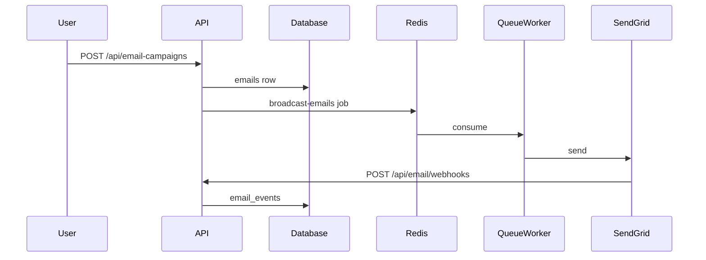

# Feature: Email, Sending Domains & Sequences

> Read-only reverse-engineering, 2026-09-06.

## Purpose

Send transactional and marketing email through SendGrid, with per-org sending-domain authentication (SPF/DKIM), sender identities, broadcast + single sends, drip sequences, and public unsubscribe.

## User Capabilities

- Add a sending domain; complete DNS; wait for verification.
- Create sender identities (from-addresses).
- Send a single email or a broadcast; inspect logs.
- Attach a drip sequence to a campaign/space.
- Unsubscribe via `/unsubscribe/[token]`.

## Entry Points

### Frontend

`apps/web/src/features/email/{domains,sender-identities}` inside the settings modal.
`features/settings/EmailLogsContent`, `EmailSettingsPageContent`.
Campaign/space sequence UI under `features/spaces` and `campaigns/[id]`.
Public: `app/unsubscribe/[token]`.

### Backend

`apps/api/src/modules/email/` (domains, sender identities, logs, webhooks, unsubscribe) plus `email-campaigns` and sequence controllers mounted from `modules/campaigns` at `/api/sequences`.

## API Endpoints

| Method | Route                             | Handler                                                | Purpose               |
| ------ | --------------------------------- | ------------------------------------------------------ | --------------------- |
| \*     | `/api/email/domains/**`           | `domains.controller.ts`, `domain-status.controller.ts` | Domain + DNS + verify |
| \*     | `/api/email/sender-identities/**` | `sender-identities.controller.ts`                      | From-addresses        |
| GET    | `/api/email/logs`                 | `email-logs.controller.ts`                             | Send log              |
| POST   | `/api/email/webhooks` / `inbound` | `webhooks.controller.ts`                               | SendGrid events       |
| \*     | `/api/email/unsubscribe/**`       | `unsubscribe.controller.ts`                            | Suppression           |
| \*     | `/api/email-campaigns/**`         | `email-campaigns` module                               | Broadcasts            |
| \*     | `/api/sequences/**`               | campaigns module                                       | Drip sequences        |

Sends themselves are enqueued; the HTTP API creates rows, `queue-worker` delivers.

## Main Files

| File                                                     | Responsibility                |
| -------------------------------------------------------- | ----------------------------- |
| `apps/api/src/modules/email/`                            | Domain/identity/logs/webhooks |
| `apps/queue-worker` `single-emails` / `broadcast-emails` | Actual SendGrid send          |
| `apps/web/src/features/email/`                           | Settings UI                   |

## Database Models / Tables

`email_domains`, `email_dns_records`, `email_sender_identities`, `emails`, `email_sends`, `email_events`, `email_single_schedules`, `email_suppressions`, `sequences`, `sequence_emails`.

**DEAD CODE CANDIDATE:** `email_provider_capabilities`, `email_provider_recipes`, `email_pending_sends` — no `.from()` access path.

## Business Logic

Verify domain at SendGrid + Cloudflare DNS → create sender → enqueue send → worker calls SendGrid → webhook writes `email_events`. Sequences are a campaign artifact (`sequence_emails` rows) processed on a schedule.

## Validation

Domain/identity controllers use AuthGuard + org context. Webhooks verify SendGrid signatures with `timingSafeEqual` (**CONFIRMED** in `08-auth-security.md` / `09-integrations.md`).

## Permissions

Authenticated org members manage domains/identities. Unsubscribe + inbound webhook are public (signature / token).

## External Dependencies

SendGrid, Cloudflare DNS.

## Background Jobs

| Queue              | Worker         | Input        |
| ------------------ | -------------- | ------------ |
| `single-emails`    | `queue-worker` | one-off send |
| `broadcast-emails` | `queue-worker` | list send    |

`queue-worker` email **org-scoping tests are 100% `todo`** — isolation unverified.

## Frontend Flow

Settings → domain add → DNS copy → poll status → compose → `POST /api/email/**` → row + queue.

## Backend Flow

API writes `emails`/`email_sends` → BullMQ → worker → SendGrid → webhook → `email_events`.

## Full Request Flow

## Error Handling

`SENDGRID_API_KEY` missing → boot warning, sends fail. Worker down → rows stay queued with no user-visible error.

## Test Scenarios

`apps/api` email module ~6 tests. Worker org-scoping: **todo**. Live send **not run**.

## Known Problems

1. Email org isolation untested (`queue-worker` todos).
2. Provider-abstraction tables never wired.
3. Sequences **IMPLEMENTED BUT UNVERIFIED**.
4. Inbound webhook **IMPLEMENTED BUT UNVERIFIED**.

## Related Features

Campaigns (sequences as artifacts), Contacts (recipients), Settings.

## Status

**WORKING** for domain auth + queued send. Sequences and inbound: **IMPLEMENTED BUT UNVERIFIED**. Isolation: **UNKNOWN**.
