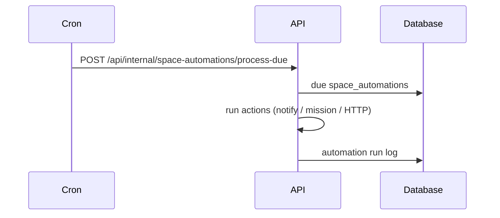

# Feature: Flows, Space Automations & Meetings

> Read-only reverse-engineering, 2026-09-06.

## Purpose

Three related but unequal capabilities:

1. **Space automations** — trigger → action rules on a Space. **WORKING**.
2. **Flow builder** (`/flows`) — agent-assisted authoring of automation blueprints. **PARTIALLY IMPLEMENTED** (authoring exists; install/publish tables are never read).
3. **Meetings** — recordings, snippets, extracted actions, token review links. **WORKING**, but meeting tables have **no RLS**.

## User Capabilities

- Attach automations to a Space; fire on item change / schedule / inbound webhook.
- Author a flow with clarifications + eval (`/flows`).
- Browse `/home/meetings`; review snippets; approve extracted actions.
- Send an external attendee `/meeting-review/[token]`.
- (Unverified) generate pre-call prep from Calendly / Google Calendar.

## Entry Points

### Frontend

| Path                      | Module                                           |
| ------------------------- | ------------------------------------------------ |
| Space automations panels  | `features/spaces`                                |
| `/flows`                  | `features/flows` (100 files)                     |
| `/home/meetings`          | `features/home/components/HomeMeetingDetailHost` |
| `/meeting-review/[token]` | `app/meeting-review/[token]`                     |

### Backend

`apps/api/src/modules/spaces/:id/automations` (34 combined), flow blueprint routes under the same module, `modules/meetings` (20 + 7 public).

## API Endpoints

| Method    | Route                                             | Purpose                         |
| --------- | ------------------------------------------------- | ------------------------------- |
| \*        | `/api/spaces/:id/automations/**`                  | Rules + runs                    |
| \*        | `/api/spaces/:id/automations/flows/blueprints/**` | Flow authoring                  |
| POST      | `/api/flow-webhooks/:publicToken`                 | Inbound trigger                 |
| POST      | `/api/internal/space-automations/process-due`     | Cron fan-out (~48/hour)         |
| \*        | `/api/meetings/**`                                | Recordings / snippets / actions |
| GET/PATCH | `/api/meetings/review/:token`                     | Public review (7 × `@Public()`) |
| POST      | `/api/internal/meeting-action-reconciliation/run` | Hourly cron                     |
| \*        | `/api/spaces/:id/precall-prep`                    | Pre-call brief                  |

## Main Files

| File                                                                       | Responsibility                                                           |
| -------------------------------------------------------------------------- | ------------------------------------------------------------------------ |
| `apps/api/src/modules/spaces/services/space-automation-service-0*.base.ts` | 20-class inheritance chain, **11,375 lines** — worst hotspot in the repo |
| `apps/web/src/features/flows/`                                             | Flow authoring UI                                                        |
| `apps/api/src/modules/meetings/`                                           | Meeting domain                                                           |

Automation **queue path is disabled on Vercel** (`space-automation-service-01.base.ts:510-516`). Cron HTTP fan-out is the live path.

## Database Models / Tables

**Automations:** `space_automations` + runtime tables.

**Flows (authoring):** `project_flow_action_blueprint`, `_version`, `project_flow_build_session`, `_clarification`, `_evaluation`.

**Flows (install — DEAD):** `flow_definitions`, `flow_definition_versions`, `flow_installations` — no `.from()` access path; the two definition tables form an FK cycle.

**Meetings:** `meeting_recordings`, `meeting_snippets`, `meeting_actions`, `meeting_context_links`, `meeting_workspaces` — **no RLS** (`06-database-map.md` HIGH #3).

## Business Logic

Automations: match trigger → run actions (create item, notify, start mission, HTTP). Due processor is a Vercel cron.

Flows: build session + clarifications persist; promotion/install was designed (`flow_definitions`) and never wired.

Meetings: webhook/import from Fathom/Fireflies → transcript (Deepgram) → snippets/actions → optional token review.

## Validation

Space-scoped AuthGuard. Inbound flow webhook is token-gated. Meeting review is unguessable-token `@Public()`.

## Permissions

Automations inherit Space access. Meeting tables rely entirely on the app layer (no RLS).

## External Dependencies

Fathom, Fireflies, Deepgram, Calendly, Google Calendar.

## Background Jobs

| Job                           | Trigger                        |
| ----------------------------- | ------------------------------ |
| `process-due` automations     | Vercel cron, ~48 fan-outs/hour |
| Meeting action reconciliation | Hourly cron                    |
| Transcript / import           | meeting + brain-import paths   |

`AGENT_RUNTIME_AUTOMATION_QUEUE_ENABLED` (if set on a persistent host) lands jobs on a queue **no Railway worker consumes**. UNKNOWN whether it is set in prod.

## Frontend Flow

Space settings → automations panel → `/api/spaces/:id/automations`. `/flows` → blueprint session APIs. Meetings home card → `/api/meetings`.

## Backend Flow

See `03-architecture.md` request lifecycle; automations specifically go controller → 20-file service chain → table / cron.

## Full Request Flow

## Error Handling

Queue path disabled on Vercel — failures would be silent if someone enabled the flag without a consumer. Meeting ingest degrades if Deepgram key is missing (boot warning).

## Test Scenarios

Spaces automations covered inside the large spaces suite. Flows: thin. Meetings: `api/modules/meetings` ~32 tests. Live Fathom ingest **not run**.

## Known Problems

1. Flow install half is dead (tables + FK cycle).
2. Automation service is an 11k-line inheritance chain.
3. Meeting tables have no RLS.
4. Calendly webhook controller is a no-op TODO (`04-feature-inventory.md`).
5. Autopilot / strategy tree (related, 6 files, 0 tests) is settings-only.

## Related Features

Spaces, Missions, Brain import, Home.

## Status

Automations **WORKING** (cron path). Flows **PARTIALLY IMPLEMENTED**. Meetings **WORKING** with a data-integrity hole (no RLS).
