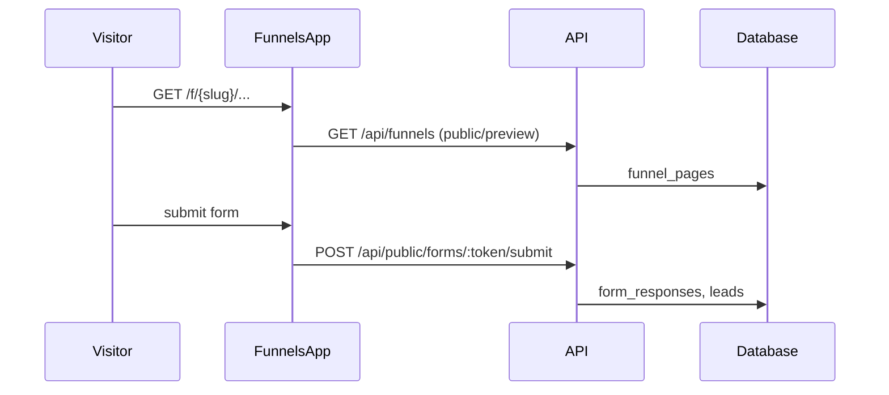

# Feature: Funnels, Forms & Custom Domains

> Read-only reverse-engineering, 2026-09-06.

## Purpose

Build landing-page funnels (blocks/sections/theme), publish them on ROAS slugs or customer domains, and collect leads via public forms. Rendering is a **separate Next.js app** (`apps/funnels`) so anonymous traffic does not hit the product app.

## User Capabilities

- Create/edit funnel pages and blocks; preview.
- Publish to `sites.roas.io` slugs or a verified custom domain.
- Collect form submissions (Turnstile-gated).
- Attach conversion points; view history/change-sets.
- Add a custom domain, create DNS records, wait for verify.

## Entry Points

### Frontend (builder)

`apps/web/src/components/funnels/` plus `features/studio/store/use-funnel-design-chat-store`.
`features/domains` is a **DEAD** shim; live code is `@/components/domains`.

### Frontend (public renderer)

`apps/funnels` routes: `/[slug]`, `/f/[funnelSlug]/[pageType]/[slug]`, `/p/[slug]`, `/lm/[slug]`, `/opt-in/[slug]`, `/thank-you/[slug]`, `/form/[formToken]`.

### Backend

`apps/api/src/modules/funnels/` (27 routes), `forms` (11), `domains` (13).

## API Endpoints

| Method | Route                                | Handler                                               | Purpose                                  |
| ------ | ------------------------------------ | ----------------------------------------------------- | ---------------------------------------- |
| \*     | `/api/funnels/**`                    | `funnels.controller.ts`, `funnel-pages.controller.ts` | CRUD                                     |
| \*     | `/api/funnels/:id/conversion-points` | `funnel-conversion-points.controller.ts`              | Conversion points                        |
| \*     | `/api/funnels/:id/history`           | `funnel-history.controller.ts`                        | Change-sets                              |
| GET    | `/api/preview/pages/:pageId`         | `preview.controller.ts`                               | **Unguarded** preview payload            |
| \*     | `/api/internal/funnels/**`           | `internal-funnels.controller.ts`                      | Worker/internal                          |
| \*     | `/api/public/forms/**`               | `modules/forms`                                       | Public submit                            |
| POST   | `/api/leads/ingest`                  | `modules/leads`                                       | Funnel lead ingest (throttle, CORS open) |
| \*     | `/api/domains/**`                    | `modules/domains`                                     | Custom domain + DNS                      |

`apps/funnels` also has its own Next handlers: `src/app/api/lead/route.ts`, `src/app/api/form-submit/route.ts`.

## Main Files

| File                                                                           | Responsibility                  |
| ------------------------------------------------------------------------------ | ------------------------------- |
| `apps/api/src/modules/funnels/services/`                                       | Page/block persistence          |
| `apps/web/src/components/funnels/`                                             | Builder UI                      |
| `apps/funnels/src/app/`                                                        | Public renderer                 |
| `apps/api/src/modules/domains/integrations/{cloudflare,vercel}.integration.ts` | DNS + host                      |
| `packages/api-shared/src/services/funnel-tsx-contract.ts`                      | Generated TSX contract + repair |

## Database Models / Tables

`funnels`, `funnel_pages`, `funnel_blocks`, `funnel_assets`, `funnel_change_sets`, `forms`, `form_responses`, `visitors_page_views`, `domains`, `domains_cache`, `leads`.

`funnels` has **no `CREATE TABLE` in the numbered migrations** — pre-migration-era table.

## Business Logic

Builder writes pages/blocks. Publish copies generated HTML/TSX. `apps/funnels` fetches by slug/domain and renders anonymously. Form submit → `POST /api/public/forms/:token/submit` → `form_responses` + optional lead ingest.

## Validation

Funnel module uses Zod on some controllers. Public form submit is Turnstile-gated. Preview page endpoint is unguarded — anyone with a `pageId` can fetch.

## Permissions

Builder routes: AuthGuard. Public renderer + form submit + lead ingest: anonymous. Domain verify: AuthGuard + org context.

## External Dependencies

Cloudflare DNS, Vercel domains API, Cloudflare Turnstile.

## Background Jobs

Domain verification polling (API cron / internal). No dedicated Railway queue for funnel publish.

## Frontend Flow

Builder in product app → `/api/proxy/funnels` → publish → public hit on `apps/funnels` → that app calls platform API.

## Backend Flow

Authenticated CRUD on `funnels`/`funnel_pages`. Public GET by slug. Lead ingest is throttle-only.

## Full Request Flow

## Error Handling

Missing Turnstile → submit rejected. Domain not verified → publish stays on `sites.roas.io`. TSX repair is a separate unauthenticated Next route (`/api/tsx-repair`) — **IMPLEMENTED BUT UNVERIFIED**.

## Test Scenarios

`apps/funnels` 10/10 unit tests PASS. `apps/api` funnels module ~7 tests. Public render was not hit in this session (`apps/funnels` not running).

## Known Problems

1. `apps/funnels` last commit 2026-07-28 — source may lag production.
2. Port collision with `apps/admin` (both 3002).
3. Unguarded `GET /api/preview/pages/:pageId`.
4. `features/domains` dead shim.
5. `funnel-tsx-contract` tests fail because stale `.js` in `packages/api-shared/src/` shadows `programmaticTsxRepair`.

## Related Features

Contacts (lead ingest), Themes (brand extract), Billing (credits on generation), Content/artifacts.

## Status

**WORKING** for builder + public render + forms. Preview + TSX-repair auth is weak. Funnel app source **STALE**.
