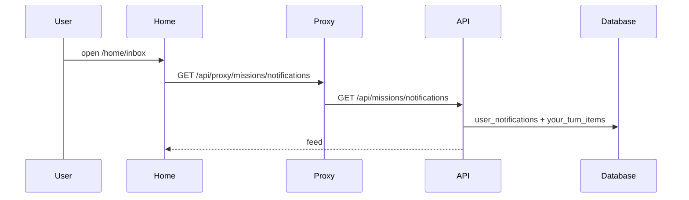

# Feature: Home, Inbox, Channels & Human DM

> Read-only reverse-engineering, 2026-09-06.

## Purpose

The post-login landing surface (`/home`) and three distinct communication systems that look similar but are not:

| Name         | What it actually is                         | Tables                                  |
| ------------ | ------------------------------------------- | --------------------------------------- |
| **Channels** | Slack-like rooms where agents participate   | `channels`, `channel_messages`, …       |
| **Human DM** | 1:1 human↔human                             | `human_dm_*`                            |
| **Inbox**    | Notifications + approvals + your-turn items | `user_notifications`, `your_turn_items` |

## User Capabilities

- See home cards: agenda, notifications, approvals, tasks, company-cortex signals.
- Open `/home/inbox`, `/home/channels`, `/home/channels/[id]`, `/home/meetings`, `/home/delegation-desk`.
- Post in a channel (humans + agents).
- DM a teammate.
- Connect Slack observation or Telegram as a channel bridge.

## Entry Points

### Frontend

| Path                  | Live component                                                  |
| --------------------- | --------------------------------------------------------------- |
| `/home`               | `features/home` (155 files) + `app/(dashboard)/home`            |
| `/home/inbox`         | `components/notifications/InboxFeed` — **not** `features/inbox` |
| `/home/channels`      | `features/channels` (91 files)                                  |
| `/` (dashboard index) | redirects to `/home`                                            |

**DEAD / unused containers:** `features/inbox/InboxContainer`, `features/my-work/MyWorkContainer`. `features/notifications` is used by one home card only.

### Backend

`apps/api/src/modules/home` (6), `channels` (22), `dm` (8), `missions/notifications` (14), `your-turn` (1), `slack` (56), `telegram` (9). Agent side: `agent-api/modules/channel-agent`.

## API Endpoints

| Method | Route                            | Purpose                              |
| ------ | -------------------------------- | ------------------------------------ |
| GET    | `/api/home/**`                   | Home cards / cortex                  |
| \*     | `/api/channels/**`               | Rooms + messages                     |
| \*     | `/api/dm/**`                     | Human DM                             |
| \*     | `/api/missions/notifications/**` | Inbox rows                           |
| GET    | `/api/your-turn`                 | UNION view of work awaiting the user |
| \*     | `/api/integrations/slack/**`     | Slack observe → Brain                |
| \*     | `/api/telegram/**`               | Telegram bot channel                 |

## Main Files

| File                                                                 | Responsibility             |
| -------------------------------------------------------------------- | -------------------------- |
| `apps/web/src/features/home/`                                        | Dashboard widgets          |
| `apps/web/src/components/notifications/InboxFeed.tsx`                | Live inbox                 |
| `apps/web/src/features/channels/containers/ChannelChatContainer.tsx` | Channel UI                 |
| `apps/web/src/features/team-2/containers/HumanDMContainer.tsx`       | DM UI                      |
| `apps/api/src/modules/channels/`                                     | Channel API                |
| `apps/queue-worker` `slack-sync`                                     | Slack observation pipeline |

## Database Models / Tables

`channels`, `channel_members`, `channel_memberships`, `channel_messages`, `channel_user_state`, `agent_channels`, `human_dm_conversations`, `human_dm_messages`, `human_dm_reads`, `user_notifications` (**no CREATE TABLE in migrations** — drift-recovery only), `your_turn_items` (view), `slack_observation_channels`, `slack_observation_events`, `slack_brain_mappings`, `action_recommendation_events`, `company_cortex_signals`.

## Business Logic

Home is a composer of other domains. Inbox is a feed over notifications + your-turn. Channels are first-class rooms; agents post via `channel-agent`. Slack observation is a **different** pipeline that writes Brain signals, not channel messages.

## Validation

Channel/DM routes use AuthGuard + org context. Slack/Telegram webhooks use signature verification.

## Permissions

Org-scoped. Channel membership is its own table. Agent participation is policy-gated (`agent-policy`).

## External Dependencies

Slack, Telegram Bot API. Optional Fathom/Fireflies on `/home/meetings` (see flows/meetings feature).

## Background Jobs

`queue-worker` `slack-sync`. Channel agent replies go through the agent runtime, not a dedicated queue.

## Frontend Flow

`/home` loads cards in parallel via `/api/proxy/home/*`. Inbox page renders `InboxFeed`. Channel page opens a realtime-ish message list (Supabase Realtime is used elsewhere in the app; whether channels subscribe is **LIKELY** but not re-verified this session).

## Backend Flow

Standard Nest module → repository → `channels` / `human_dm_*` / `user_notifications`.

## Full Request Flow

## Error Handling

Missing notification table in a given environment → inbox empty/errors. `user_notifications` exists only via drift-recovery SQL.

## Test Scenarios

`features/channels` ~10 FE tests, `api/modules/channels` ~4, `api/modules/dm` 1, `InboxFeed.test.tsx`. Home cards have tests under `features/home`. Authenticated home **not opened** this session (servers down).

## Known Problems

1. Three inbox implementations; one route.
2. `user_notifications` has no migration CREATE TABLE.
3. `features/inbox` / `my-work` dead containers.
4. `/home/my-tasks` is a legacy redirect to `/all-tasks`.

## Related Features

Missions (your-turn), Meetings, Slack→Brain, Team DM.

## Status

**WORKING** for home + channels + DM + the `InboxFeed` path. Inbox table provenance is fragile.
