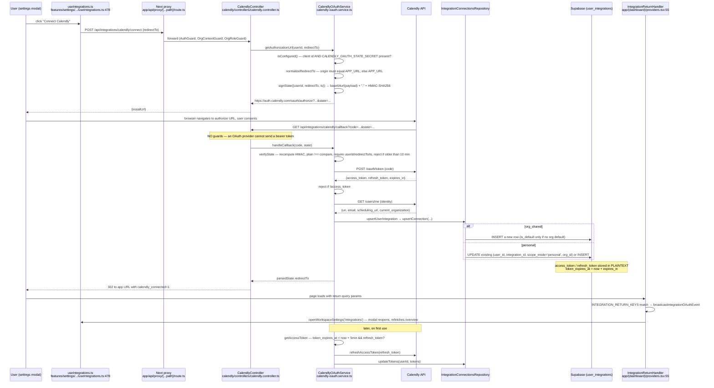

# Feature: Integrations & OAuth (mechanics)

> Read-only reverse-engineering, 2026-09-05. Evidence tags: **CONFIRMED** (read in code),
> **LIKELY** (one inference hop), **UNKNOWN**.
> This document covers the **shared machinery**: registration, OAuth initiation and callback,
> credential storage, token refresh, failure surfacing, and the settings UI.
> **The provider inventory is not repeated here** — see
> [`../09-integrations.md`](../09-integrations.md).
> Other cross-references: [`../05-api-map.md`](../05-api-map.md),
> [`../06-database-map.md`](../06-database-map.md),
> [`../08-auth-security.md`](../08-auth-security.md),
> [`../11-configuration.md`](../11-configuration.md).

## Status

**PARTIALLY IMPLEMENTED / DUPLICATED** — 546 routes across 87 controllers in 27 provider
directories, and the answer to "is it generic?" is **no**: one genuinely shared brokered path
(Composio) coexists with **eleven independent, copy-pasted OAuth implementations** that each
re-derive HMAC state signing, redirect normalisation and token upsert, and store their tokens in
plaintext in `user_integrations` while an AES-256-GCM vault sits unused next to them.

### Is it generic, or 40 bespoke implementations wearing a trench coat?

**CONFIRMED: two coats, one of which is a trench coat.**

**Coat 1 — genuinely generic (Composio-brokered).** One flow handles any Composio toolkit:
`POST /api/integrations/composio/connect` →
`IntegrationsComposioService.connectWithComposio` (`integrations-composio.service.ts:23`) →
`initiateConnectedAccount(user.id, config.auth_config_id, …)` (`:117`) → the returned
`redirectUrl` is handed to the browser → `GET /api/integrations/composio/callback`
(`integrations-composio-bridge.controller.ts:19`) → `buildComposioCallbackRedirectUrl`. Adding a
provider here is a database row (`auth_config_id`), not code.

**Coat 2 — the trench coat (bespoke).** Ten `*-oauth.service.ts` files plus
`wordpress.service.ts` — Calendly, Dropbox, Fathom, GitHub, Higgsfield, Meta, OpenAI Codex,
PayPal, Stripe, Supabase, WordPress. The evidence they are clones rather than a family:

- **Eleven separate `signState` / `verifyState` pairs.** Every one of the eleven files defines its
  own; none extends a base class or imports a shared helper.
- **Nine separate `normalizeRedirectTo` implementations**, all doing the same
  `new URL(redirectTo).origin !== new URL(APP_URL).origin ? APP_URL : redirectTo` check.
- **Eleven separate state-secret env vars** — `CALENDLY_OAUTH_STATE_SECRET`,
  `GITHUB_OAUTH_STATE_SECRET`, `META_OAUTH_STATE_SECRET`, `STRIPE_CONNECT_STATE_SECRET`, … one per
  provider, each independently defaulting to `''`.
- **Identical import blocks.** Eight of the files open with the _same seven lines_:
  `createHmac` from `crypto`, `BadRequestException, Injectable` from `@nestjs/common`,
  `ConfigService`, `SupabaseClient`, `IntegrationConnectionsRepository`,
  `<Provider>Integration`, `<Provider>UserIntegration` types.
- **The only shared code is data access**: `IntegrationConnectionsRepository`
  (12 methods: `getStatus`, `getSimpleStatus`, `markDisconnectedById`, `markPersonalDisconnected`,
  `markPersonalDisconnectedWithClient`, `updateTokens`, `updatePersonalTokens`,
  `updateServiceTokensById`, `upsertConnection`, `ensureAvailable`, `markMetaDataDeleted`,
  `updateLeadGhlContactId`). One repository, eleven services.

So the shared machinery is exactly: **one table (`user_integrations`), one repository, one
overview/status service pair, and one Composio broker.** Everything above that line is per-provider
code, and the security posture varies between copies — see [Known Problems](#known-problems).

## Purpose

Let a user (or an org) connect third-party accounts so agents and workers can act on their behalf:
read a calendar, publish a Meta ad, pull CRM contacts, push a WordPress post, fetch a meeting
transcript, run a Composio tool. The mechanics have to cover: which providers exist, whether a
connection is personal or org-shared, where the credential lives, how it is refreshed, and how a
broken connection becomes visible to the user.

## User Capabilities

- See every available integration and its connection state in one grid
  (`GET /api/integrations/overview`).
- Connect via OAuth redirect (bespoke providers), via Composio (brokered), or by pasting an API
  key / API URL pair.
- Hold **multiple connections per provider** and pick a default
  (`PATCH /api/integrations/connection/default`).
- Change a connection's scope between `personal` and `org_shared`
  (`PATCH /api/integrations/connection/scope`).
- Re-label a connection (`PATCH /api/integrations/connection/label`).
- Toggle whether agents may use a given integration
  (`GET/PATCH /api/integrations/agent-toggle[s]`).
- Disconnect, or remove a connection entirely.
- Browse and search the Composio toolkit catalogue and execute a Composio tool directly.
- List and delete secrets held in the vault (`GET/DELETE /api/vault/secrets`).
- Platform admins can re-sync the toolkit catalogue, re-sync capabilities, and backfill labels.

## Entry Points

### Frontend

| Surface                         | File                                                                            | Notes                                                                     |
| ------------------------------- | ------------------------------------------------------------------------------- | ------------------------------------------------------------------------- |
| Settings → Integrations (modal) | `apps/web/src/features/settings/components/settings-content/useIntegrations.ts` | **872 lines**, the whole client-side flow                                 |
| Settings deep link              | `apps/web/src/app/(dashboard)/settings/page.tsx`                                | hosts `IntegrationReturnHandler`                                          |
| OAuth return handler            | `apps/web/src/app/(dashboard)/providers.tsx:55`                                 | reads 13 return query keys, broadcasts an event, opens the settings modal |
| Composio bridge page            | `apps/web/src/app/(auth)/integrations/connected/page.tsx`                       | the popup lands here, then broadcasts back to the opener                  |
| Cross-tab event bus             | `apps/web/src/lib/integrations/composio-oauth.ts`                               | `BroadcastChannel` + `localStorage` fallback                              |
| Generic OAuth callback page     | `apps/web/src/app/(auth)/oauth-callback/page.tsx`                               |                                                                           |

**There is no `/settings/integrations` route.** Settings is a modal
(`apps/web/src/features/settings/containers/AccountSettingsModal.tsx`), which is why
`buildComposioCallbackRedirectUrl` comments _"Settings is a modal, not a route — land on home so
IntegrationReturnHandler can open it"_ and defaults to `/home?tab=manage`.

### Backend

| Controller                                                   | Prefix                      | Notes                                                                                                      |
| ------------------------------------------------------------ | --------------------------- | ---------------------------------------------------------------------------------------------------------- |
| `integrations.controller.ts`                                 | `integrations`              | overview, status, agent toggles, connection default/scope/label. **Guards are per-route**, not class-level |
| `integrations-composio.controller.ts`                        | `integrations`              | connect, accounts, toolkit search/sync, execute, disconnect, remove                                        |
| `integrations-composio-bridge.controller.ts`                 | `integrations`              | `GET composio/callback` — **unguarded**, this is the OAuth return                                          |
| `integrations-calendar.controller.ts`                        | calendar                    | unified calendar across providers                                                                          |
| `integrations-campaign.controller.ts`                        | campaign-scoped connections |                                                                                                            |
| `integrations-social.controller.ts`                          | social                      |                                                                                                            |
| `<provider>/controllers/*.controller.ts` × 81                | `integrations/<provider>`   | per-provider status / install / callback / disconnect                                                      |
| `apps/api/src/modules/vault/controllers/vault.controller.ts` | `vault`                     | list + delete secrets                                                                                      |

## API Endpoints

The shared machinery only. Per-provider routes are in
[`../05-api-map.md`](../05-api-map.md) and [`../09-integrations.md`](../09-integrations.md).

| Method | Route                                                    | Handler                                | Purpose                                 |
| ------ | -------------------------------------------------------- | -------------------------------------- | --------------------------------------- |
| GET    | `/api/integrations/overview`                             | `IntegrationsController`               | every integration + grouped connections |
| GET    | `/api/integrations/status/:integrationId`                | `IntegrationsController`               | one integration's live status           |
| GET    | `/api/integrations/org/connected-accounts`               | `IntegrationsController`               | org-shared connections                  |
| GET    | `/api/integrations/agent-toggles`                        | `IntegrationsController`               | per-integration agent permission        |
| PATCH  | `/api/integrations/agent-toggle`                         | `IntegrationsController`               | flip agent permission                   |
| PATCH  | `/api/integrations/connection/default`                   | `IntegrationsController`               | choose the default connection           |
| PATCH  | `/api/integrations/connection/scope`                     | `IntegrationsController`               | personal ↔ org_shared                   |
| PATCH  | `/api/integrations/connection/label`                     | `IntegrationsController`               | rename a connection                     |
| POST   | `/api/integrations/backfill-labels`                      | `IntegrationsController`               | admin (`RoleGuard`)                     |
| POST   | `/api/integrations/composio/connect`                     | `IntegrationsComposioController`       | start a brokered connection             |
| GET    | `/api/integrations/composio/callback`                    | `IntegrationsComposioBridgeController` | **unguarded** OAuth return              |
| GET    | `/api/integrations/composio/accounts`                    | `IntegrationsComposioController`       | list connected accounts                 |
| GET    | `/api/integrations/composio/toolkits/search`             | `IntegrationsComposioController`       | catalogue search                        |
| POST   | `/api/integrations/composio/toolkits/sync`               | `IntegrationsComposioController`       | admin catalogue sync                    |
| POST   | `/api/integrations/capabilities/sync`                    | `IntegrationsComposioController`       | admin capability sync                   |
| POST   | `/api/integrations/composio/execute`                     | `IntegrationsComposioController`       | run a Composio tool                     |
| POST   | `/api/integrations/composio/disconnect`                  | `IntegrationsComposioController`       | disconnect                              |
| DELETE | `/api/integrations/remove/:integrationId`                | `IntegrationsComposioController`       | remove all connections                  |
| DELETE | `/api/integrations/remove-connection/:userIntegrationId` | `IntegrationsComposioController`       | remove one                              |
| GET    | `/api/vault/secrets`                                     | `VaultController`                      | list secret metadata (never values)     |
| DELETE | `/api/vault/secrets/:provider/:label`                    | `VaultController`                      | delete a secret                         |
| GET    | `/api/integrations/<provider>/status`                    | per-provider controller                | the universal per-provider shape        |
| POST   | `/api/integrations/<provider>/install` (or `/connect`)   | per-provider controller                | build the authorize URL                 |
| GET    | `/api/integrations/<provider>/callback`                  | per-provider controller                | **unguarded**, verifies signed state    |
| POST   | `/api/integrations/<provider>/disconnect`                | per-provider controller                | revoke + mark disconnected              |

## Main Files

| File                                                                                         | Responsibility                                                                                                                                                                                                           |
| -------------------------------------------------------------------------------------------- | ------------------------------------------------------------------------------------------------------------------------------------------------------------------------------------------------------------------------ |
| `apps/api/src/modules/integrations/repositories/integration-connections.repository.ts`       | **the one piece of shared machinery** — all `user_integrations` reads/writes, including the personal-vs-org-shared upsert logic                                                                                          |
| `apps/api/src/modules/integrations/repositories/integrations.repository.ts`                  | generic table accessor (`table(supabase, name)`)                                                                                                                                                                         |
| `apps/api/src/modules/integrations/services/integrations-core.service.ts`                    | connection resolution for consumers                                                                                                                                                                                      |
| `apps/api/src/modules/integrations/services/integrations-status.service.ts`                  | per-provider live status; queries `user_integrations` then falls through to provider-specific probes and `vault.hasSecret` checks                                                                                        |
| `apps/api/src/modules/integrations/services/integrations-overview.service.ts`                | the grid payload                                                                                                                                                                                                         |
| `apps/api/src/modules/integrations/services/integrations-overview-groups.ts`                 | `buildGroupedIntegrations` — groups rows by `integration_id`                                                                                                                                                             |
| `apps/api/src/modules/integrations/services/integrations-overview-composio-row.ts`           | shapes a Composio account into an overview row                                                                                                                                                                           |
| `apps/api/src/modules/integrations/services/integrations-overview-personal-composio-sync.ts` | reconciles Composio-side state into local rows                                                                                                                                                                           |
| `apps/api/src/modules/integrations/services/integrations-composio.service.ts`                | the brokered flow: `connectWithComposio` (`:23`), `listComposioAccounts` (`:181`), `executeComposioTool` (`:291`), `disconnectComposio` (`:348`), `removeIntegration` (`:430`), `setOrgSharedDefaultConnection` (`:509`) |
| `apps/api/src/modules/integrations/services/integrations-composio-callback-url.ts`           | the only origin-checked redirect builder                                                                                                                                                                                 |
| `apps/api/src/modules/integrations/services/integrations-composio-webhook.service.ts`        | inbound Composio webhooks                                                                                                                                                                                                |
| `apps/api/src/modules/integrations/services/integrations-composio-health.service.ts`         | connection health probes                                                                                                                                                                                                 |
| `apps/api/src/modules/integrations/services/personal-cross-context-providers.ts`             | which providers may be used across org contexts                                                                                                                                                                          |
| `apps/api/src/modules/integrations/services/integrations-calendar*.ts` (10 files)            | the unified calendar layer over Google/Calendly/etc.                                                                                                                                                                     |
| `apps/api/src/modules/vault/services/vault.service.ts`                                       | AES-256-GCM encrypt/decrypt + `storeSecret`/`getSecret`/`hasSecret`/`deleteSecret`                                                                                                                                       |
| `apps/api/src/modules/vault/repositories/vault.repository.ts`                                | `vault_secrets` access, **service-role client, `user_id`-scoped only**                                                                                                                                                   |
| `apps/queue-worker/src/lib/services/vault-decrypt.ts`                                        | standalone `decryptVaultValue` so the worker can read vault rows without NestJS                                                                                                                                          |
| `apps/api/src/modules/integrations/<provider>/services/<provider>-oauth.service.ts` × 10     | the bespoke flows                                                                                                                                                                                                        |
| `apps/api/src/modules/integrations/wordpress/services/wordpress.service.ts`                  | eleventh bespoke flow (OAuth _and_ application-password)                                                                                                                                                                 |
| `apps/web/src/features/settings/components/settings-content/useIntegrations.ts`              | the client-side switchboard                                                                                                                                                                                              |
| `apps/web/src/lib/integrations/composio-oauth.ts`                                            | bridge URL builders + `BroadcastChannel`/`localStorage` event bus                                                                                                                                                        |
| `apps/web/src/app/(dashboard)/providers.tsx:40`–`:85`                                        | `INTEGRATION_RETURN_KEYS` and `IntegrationReturnHandler`                                                                                                                                                                 |
| `apps/web/src/features/settings/config/settings-toast-errors.config.ts`                      | user-facing failure copy                                                                                                                                                                                                 |

## Database Tables

- **`user_integrations`** — the connection record and, for most providers, **the token store**.
  Columns exercised by the shared repository: `id`, `user_id`, `org_id`, `integration_id`,
  `status`, `connected_at`, `updated_at`, `metadata` (JSONB), `scope_mode`
  (`'personal' | 'org_shared'`), `is_default`, `access_token`, `refresh_token`,
  `token_expires_at`.
- **`integrations_available`** — the provider catalogue, upserted by
  `ensureAvailable(row)` with `onConflict: 'id'`. This is the "registration" step:
  a provider becomes visible by writing a row here.
- **`vault_secrets`** — `user_id`, `provider`, `label`, `secret_type`, `encrypted_value`,
  `metadata`, `created_at`, `updated_at`. Unique on `(user_id, provider, label)`.
- **`integration_capabilities`** — synced capability descriptors (agent-api side).
- **`campaign_integration_connections`** — campaign-scoped connection selection.
- **`project_composio_toolkit_config`**, **`project_mcp_servers`** — per-project tool config.
- **`org_person_calendar_identities`**, **`space_drive_folder_mappings`**,
  **`space_drive_push_channels`**, **`meeting_recordings`**, **`cursor_webhook_events`**,
  **`github_repos`**, **`project_repos`** — provider-specific side tables.

See [`../06-database-map.md`](../06-database-map.md) for the full column list.

## Business Logic

**Shared and in the right place:** the connection lifecycle in
`IntegrationConnectionsRepository`, the overview/status composition in
`integrations-overview.service.ts` / `integrations-status.service.ts`, and encryption in
`VaultService`.

**Per-provider and duplicated:** the OAuth dance. Each `*-oauth.service.ts` owns
`getAuthorizationUrl`, `handleCallback`, `getStatus`, `disconnect`, `getAccessToken`,
`signState`, `verifyState`, `normalizeRedirectTo` and `upsertUserIntegration` — the same nine
responsibilities, eleven times. `IntegrationConnectionsRepository` is injected but only for
persistence; no behaviour is shared.

**In a React hook (wrong):** `useIntegrations.ts` is 872 lines containing **three parallel
provider if-else ladders**:

- API-key connect — `slack`, `gohighlevel`, `active_campaign`, `page_grader`, `openai_codex`,
  `anthropic_claude`, `higgsfield` (`:337`–`:411`).
- OAuth connect — `stripe`, `paypal`, `meta`, `calendly`, `dropbox`, `fathom`, `wordpress`,
  `fireflies`, `cursor`, `fanbasis`, `google_workspace`, `supabase` (`:478`–`:567`).
- Disconnect — the same twelve again (`:645`–`:667`), plus four more special cases at
  `:596`–`:614`.

The Composio branch is a single `if (mode === 'composio')` (`:436`, `:631`). That contrast — one
branch for N providers versus twelve branches for twelve providers — is the whole story in one
file.

**Business logic in a redirect builder (acceptable but surprising):**
`integrations-composio-callback-url.ts` decides where the user lands, sanitises `redirect_to`, and
encodes success/error into query params. It is pure and tested-shaped, but it is the only place the
success/failure contract with the frontend is written down.

## Validation

**OAuth state.** The canonical shape (Calendly, `calendly-oauth.service.ts:172`–`:190`) is:

```text
payload = { userId, redirectTo, ts }
encoded = base64url(JSON.stringify(payload))
state   = `${encoded}.${base64url(HMAC-SHA256(stateSecret, encoded))}`
```

Verification splits on `.`, recomputes the HMAC, checks the three required fields, and enforces a
**10-minute expiry** (`Date.now() - decoded.ts > 10 * 60 * 1000`). This is a well-formed
signed-state design: it binds the callback to a user, carries the return URL, and expires.

**Comparison safety is inconsistent.** Nine of the eleven use
`if (expected !== sig) throw new BadRequestException('Invalid state')` — a plain string compare.
Two use constant-time compare: `higgsfield-oauth.service.ts:259` and
`openai-codex-oauth.service.ts:193` both do
`actual.length !== expected.length || !timingSafeEqual(actual, expected)`. So the repo _knows_ the
correct pattern and applies it in 2 of 11 places. (Note: webhook signature verification is
correctly `timingSafeEqual` throughout — Stripe, Meta, Slack, SendGrid, Composio, WordPress,
Cursor — per [`../08-auth-security.md`](../08-auth-security.md). It is only _OAuth state_ that is
inconsistent.)

**Open-redirect protection.** `normalizeRedirectTo` (nine copies, e.g.
`calendly-oauth.service.ts:161`–`:166`) parses `redirectTo`, compares `.origin` against
`APP_URL`'s, and falls back to `APP_URL` on mismatch or parse failure.
`buildComposioCallbackRedirectUrl` does the equivalent for the brokered path. **Correct in every
copy found.**

**Configuration gating.** Each service exposes `isConfigured()` returning
`provider.isConfigured() && !!this.stateSecret` — a provider with no state secret cannot start a
flow at all, rather than starting one with an empty HMAC key. Good.

**Vault key validation.** `VaultService.parseEncryptionKey` (`vault.service.ts:31`) requires
`/^[a-f0-9]{64}$/i` **and** a 32-byte decode; anything else yields `null` and the first
encrypt/decrypt throws `InternalServerErrorException('Vault encryption is not configured')`.
The worker's standalone copy throws
`'VAULT_ENCRYPTION_KEY must be 64 hex characters (32 bytes)'`
(`apps/queue-worker/src/lib/services/vault-decrypt.ts:9`). This is why `AGENTS.md` insists the key
be byte-identical across `apps/api/.env` and `apps/agent-api/.env`.

**Zod** is applied to the composio and connection-mutation DTOs
(`apps/api/src/modules/integrations/dto`), not uniformly across the 81 provider controllers.

## Permissions

- `integrations.controller.ts` applies guards **per route**, not at class level: every route gets
  `AuthGuard, OrgContextGuard, OrgRoleGuard`, and `backfill-labels` additionally gets `RoleGuard`
  (platform admin). Same pattern in `integrations-composio.controller.ts`, where
  `composio/toolkits/sync` and `capabilities/sync` require `RoleGuard`.
- **Callbacks are deliberately unguarded.** `GET /api/integrations/composio/callback` and every
  `GET /api/integrations/<provider>/callback` carry no `@UseGuards` — an OAuth provider cannot send
  a bearer token. Authorisation is the signed `state` (or, for GitHub App installs, the
  `installation_id` plus signed state). `github.controller.ts:77`–`:99` is the reference
  implementation: no guards, verify state, redirect, and on failure
  `res.status(400).send(msg)`.
- **Scope model.** `upsertConnection`
  (`integration-connections.repository.ts:130`–`:181`) branches:
  - `orgId && scopeMode === 'org_shared'` → **always inserts a new row**, setting `is_default`
    only if no org default exists yet.
  - otherwise → looks for an existing `(user_id, integration_id, scope_mode='personal', org_id)`
    row and updates it, else inserts with `is_default: false`.

  Note the org branch never de-duplicates: repeated org-shared connects accumulate rows.

- **Reads are org-scoped.** `integrations-status.service.ts:62`–`:69`:
  `scope.orgId` present → `.eq('org_id', orgId)`; absent → `.eq('user_id', userId).is('org_id', null)`.
- **The vault is not org-scoped.** `VaultRepository` filters and writes on `user_id`, `provider`,
  `label` only — no `org_id` in `upsertSecret`, `findEncryptedSecret`, `listSecretsByProvider`,
  `listSecrets`, `deleteSecret` or `hasSecret`, even though
  `supabase/migrations/20260327100001_add_org_id_to_existing_tables.sql` added the column. All
  writes go through a **service-role** client (`getAdminClient()`), so RLS does not apply either.
  See [Known Problems](#known-problems).
- Agent access is a separate gate: `agent-toggle` / `agent-toggles` decide whether an agent may use
  a connection at all.

## External Dependencies

- **Composio** — the broker for the generic path; also sends webhooks
  (`integrations-composio-webhook.service.ts`).
- **27 provider APIs** — see [`../09-integrations.md`](../09-integrations.md).
- **Supabase** — `user_integrations`, `integrations_available`, `vault_secrets`; the vault
  repository uses the service-role key.
- **`APP_URL`** — the origin that every `normalizeRedirectTo` and the Composio bridge validate
  against. Misconfiguring it silently redirects users to the wrong host after every OAuth flow.
- **`VAULT_ENCRYPTION_KEY`** — 64 hex chars, must match across `apps/api`, `apps/agent-api` and
  `apps/queue-worker`.
- **Eleven `*_STATE_SECRET` env vars** — see [`../11-configuration.md`](../11-configuration.md).
- **`BroadcastChannel`** — cross-tab OAuth completion signalling, with a `localStorage` `storage`
  event fallback.

## Background Jobs

Integrations own no queue. Adjacent asynchrony:

| Mechanism                   | Where                                                                         | Notes                                                                                                 |
| --------------------------- | ----------------------------------------------------------------------------- | ----------------------------------------------------------------------------------------------------- |
| Composio catalogue sync     | `POST /api/integrations/composio/toolkits/sync`                               | admin-triggered, synchronous                                                                          |
| Capability sync             | `POST /api/integrations/capabilities/sync`                                    | admin-triggered, writes `integration_capabilities`                                                    |
| Label backfill              | `integrations-label-backfill.ts` via `POST /api/integrations/backfill-labels` | admin-triggered migration helper                                                                      |
| Health probes               | `integrations-composio-health.service.ts`                                     | called from the overview path, not scheduled                                                          |
| Personal Composio reconcile | `integrations-overview-personal-composio-sync.ts`                             | runs inside the overview request                                                                      |
| CRM sync                    | `apps/queue-worker/src/modules/crm-sync`                                      | the only real queue that consumes integration credentials; see [`contacts-crm.md`](./contacts-crm.md) |
| Drive push channels         | `space_drive_push_channels`                                                   | Google Drive webhook subscriptions renewed elsewhere                                                  |

Note the pattern: the reconcile and health work happens **inside the overview HTTP request**, so
`GET /api/integrations/overview` fans out to Composio and to provider APIs before responding.

## Frontend Flow

**Connect (bespoke OAuth).** `useIntegrations.ts` hits the provider's own if-branch, calls
`POST /api/integrations/<provider>/install`, receives an `installUrl`/`redirect_url`, and navigates
(or opens a popup) to the provider. The provider redirects to
`GET /api/integrations/<provider>/callback`, which verifies state and 302s to the
`redirectTo` captured inside the state — a URL on the app's own origin carrying
`<provider>_connected=1`. `IntegrationReturnHandler`
(`apps/web/src/app/(dashboard)/providers.tsx:55`) sees one of the 13
`INTEGRATION_RETURN_KEYS`, broadcasts an `{ type: 'connected' }` event and calls
`openWorkspaceSettings('integrations')` so the modal reopens on the right tab.

**Connect (Composio).** `buildComposioProxyCallbackUrl`
(`composio-oauth.ts:13`) constructs a **double-hop** return URL:
`/api/proxy/integrations/composio/callback?redirect_to=<bridge>&integration_id=<id>` where
`<bridge>` is `/integrations/connected?redirect_to=<original page>`. So the flow is
provider → API callback → `/integrations/connected` (a popup-friendly page) → the original page.
The bridge page calls `broadcastIntegrationOAuthEvent`, which posts on a `BroadcastChannel` and
_also_ writes `localStorage['vibey-integration-oauth-event']` so a browser without
`BroadcastChannel` still signals the opener via the `storage` event.

**API-key connect.** No redirect at all: `useIntegrations` posts the key to the provider's connect
route, which stores it (vault for 11 providers, `user_integrations` for the rest) and marks the row
connected.

**Failure surfacing.** Three different channels, depending on path:

1. Composio errors arrive as `?composio_error=…&composio_error_message=…`, become an
   `{ type: 'error', message }` broadcast event, and the settings modal renders them.
2. Bespoke callback failures do **not** redirect — `github.controller.ts:97` returns
   `res.status(400).send(msg)`, so the user sees a bare browser error page with the raw
   exception message, outside the app shell.
3. In-app API failures use `SETTINGS_TOAST_ERRORS`
   (`apps/web/src/features/settings/config/settings-toast-errors.config.ts`, imported at
   `useIntegrations.ts:13`).

## Backend Flow

**Registration.** A provider exists once a row exists in `integrations_available`
(`ensureAvailable`, `integration-connections.repository.ts:183`) and a controller directory exists
under `apps/api/src/modules/integrations/<provider>/`. For a Composio toolkit, only the former plus
an `auth_config_id` is needed — no code.

**Initiate.** `POST /api/integrations/<provider>/install` (guarded) → the provider's OAuth service:
`normalizeRedirectTo(redirectTo)` → `signState({ userId, redirectTo, ts })` → build the provider
authorize URL with `state` and the provider's own `client_id`/scopes → return the URL.

**Callback.** `GET /api/integrations/<provider>/callback` (unguarded) →
`verifyState(state)` (HMAC + fields + 10-minute expiry) → exchange `code` for tokens against the
provider → fetch the provider's user/account identity (e.g.
`calendly.getCurrentUser(tokens.access_token)`, `calendly-oauth.service.ts:55`) →
`upsertUserIntegration` → 302 to `parsedState.redirectTo`.

**Storage.** Two destinations, chosen per provider with no rule visible in code:

| Destination                                         | Providers (from `VaultService` consumers)                                                                                                                            | Encryption                                   |
| --------------------------------------------------- | -------------------------------------------------------------------------------------------------------------------------------------------------------------------- | -------------------------------------------- |
| `vault_secrets`                                     | ActiveCampaign, Anthropic Claude, Fanbasis, Fireflies, GoHighLevel, Google Workspace, OpenAI Codex, Page Grader, WordPress, plus browser sessions and space webhooks | **AES-256-GCM**, `iv:authTag:ciphertext` hex |
| `user_integrations.access_token` / `.refresh_token` | Calendly, Cursor, Dropbox, Fathom, GitHub, Google Drive, Higgsfield, Meta, PayPal, Stripe, Supabase                                                                  | **plaintext**                                |

**Refresh.** Lazy and per-provider, at read time. The canonical shape
(`calendly-oauth.service.ts:141`–`:158`):

```text
getAccessToken(supabase, userId):
  integration = load row
  if !access_token: throw
  expiresAt = integration.token_expires_at ? Date.parse(...) : null
  if expiresAt && expiresAt < now + 5min && integration.refresh_token:
      tokens = await provider.refreshAccessToken(refresh_token)
      await updateTokens(userId, tokens)      // writes new expiry
      return tokens.access_token
  return integration.access_token
```

There is no background refresh job and no `refresh_token` rotation check — if nothing calls
`getAccessToken` before the refresh token itself expires, the connection dies silently and only
surfaces on the next use.

**Status.** `integrations-status.service.ts:52` loads all matching `user_integrations` rows
(org-scoped), picks the default/most-recent, then runs provider-specific liveness logic — for
LinkedIn it derives an author URN and writes it back into `metadata`; for ActiveCampaign it treats
the integration as connected only if **both** `vault.hasSecret(user.id, 'active_campaign', 'api_url')`
and `…, 'api_key')` are true (`:201`–`:203`). So "connected" is computed, not just read.

**Direct table access bypassing the vault service.** Nine files read `vault_secrets` directly
rather than through `VaultService`:
`apps/agent-api/src/modules/mcp/repositories/mcp.repository.ts`,
`apps/api/src/modules/integrations/higgsfield/higgsfield.repository.ts`,
`apps/api/src/modules/integrations/page-grader/services/page-grader-mcp-bootstrap.service.ts`,
`apps/api/src/modules/leads/repositories/leads-runtime.repository.ts`,
`apps/api/src/modules/mcp/repositories/mcp-servers.repository.ts`,
`apps/api/src/modules/models/repositories/models.repository.ts`,
`apps/queue-worker/src/modules/crm-sync/services/crm-sync.service.ts`,
`apps/queue-worker/src/modules/shared/helpers/ghl-email.helper.ts`,
plus `vault.repository.ts` itself. The worker ones are legitimate (no NestJS DI, hence
`vault-decrypt.ts`); the `apps/api` ones are not.

## Full Request Flow

A bespoke OAuth connect, end to end — the path that eleven providers each re-implement:



## Error Handling

- **State failures** throw `BadRequestException('Invalid state')` or `'State expired'`. The
  controller catches and, for GitHub, returns `res.status(400).send(msg)` — the raw message, as a
  plain-text page.
- **Token exchange** failures throw with a provider-prefixed message, e.g.
  `'Calendly token exchange failed: missing access_token'`
  (`calendly-oauth.service.ts:52`).
- **Composio failures** are the only ones with a designed user path: encoded into
  `composio_error` / `composio_error_message` query params by
  `buildComposioCallbackRedirectUrl`, converted into a broadcast event, rendered by the settings
  modal.
- **Vault misconfiguration** throws `InternalServerErrorException('Vault encryption is not configured')`
  on first use rather than at boot, so a missing key is discovered by a user action, not by a
  health check.
- **Malformed ciphertext** → `BadRequestException('Invalid encrypted value format')`
  (`vault.service.ts:58`).
- **Disconnect** is best-effort: Calendly deletes its webhook subscription first if
  `metadata.webhook_subscription_uri` exists (`calendly-oauth.service.ts:113`), then marks the row
  disconnected — a failed provider-side revoke does not block the local disconnect.
- **Frontend**: `SETTINGS_TOAST_ERRORS` for in-app calls; nothing catches a bespoke callback that
  400s outside the app shell.

## Test Scenarios

1. **Happy path, bespoke.** Connect Calendly. Verify the `user_integrations` row has
   `status='connected'`, `token_expires_at` ≈ now + `expires_in`, `scope_mode='personal'`,
   `is_default=false`, and that the modal reopens on the Integrations tab.
2. **Replayed state.** Capture a callback URL and re-request it 11 minutes later. Expect
   `'State expired'`.
3. **Tampered state.** Flip one character of the HMAC segment. Expect `'Invalid state'`.
4. **Cross-provider state.** Take a valid Calendly `state` and send it to
   `/api/integrations/github/callback`. Expect rejection — different `*_STATE_SECRET` values are
   the only thing preventing this, so confirm the two secrets are actually different in the
   environment.
5. **Open redirect.** Call `install` with `redirectTo=https://evil.example/`. Expect the state to
   carry `APP_URL` instead, and the post-callback 302 to land on your own origin.
6. **Missing state secret.** Unset `META_OAUTH_STATE_SECRET`. Expect `isConfigured()` to be false
   and the connect attempt to fail cleanly rather than signing with an empty key.
7. **Refresh window.** Set `token_expires_at` to 2 minutes from now and trigger a provider call.
   Expect one refresh request and an updated row. Then set it to 30 minutes and confirm **no**
   refresh happens.
8. **Dead refresh token.** Set `token_expires_at` in the past and invalidate the refresh token
   provider-side. Confirm how the failure surfaces — a toast, a status flip, or a silent throw.
9. **Org-shared duplication.** Connect the same provider as `org_shared` three times. Expect three
   `user_integrations` rows (`upsertConnection` inserts unconditionally on that branch) and
   `is_default=true` on only the first.
10. **Vault cross-org read.** As a user who belongs to orgs A and B, store an ActiveCampaign key
    while in org A, then switch to org B and call
    `GET /api/integrations/status/active_campaign`. Because `vault.hasSecret` ignores `org_id`, the
    org-B status is expected to report connected — confirm and decide whether that is intended.
11. **Vault key mismatch.** Set a different `VAULT_ENCRYPTION_KEY` in `apps/queue-worker` and run a
    CRM sync. Expect a GCM auth-tag failure, and check whether it is reported or swallowed.
12. **Composio bridge without `BroadcastChannel`.** Disable `BroadcastChannel` and complete a
    Composio connect in a popup. Expect the `localStorage` `storage`-event fallback to close the
    loop.
13. **Composio error path.** Force a Composio failure and confirm the user sees a rendered error in
    the settings modal rather than a blank page.
14. **Overview latency.** Time `GET /api/integrations/overview` with ten connected providers. It
    fans out to Composio and provider APIs inline, so this is the request to watch for timeouts.

## Known Problems

**HIGH — OAuth tokens for eleven providers are stored in plaintext next to an unused
AES-256-GCM vault.** `VaultService` (`apps/api/src/modules/vault/services/vault.service.ts`)
implements correct AES-256-GCM with a random 12-byte IV and an auth tag, and is used by 11
providers. The other eleven — Calendly, Cursor, Dropbox, Fathom, GitHub, Google Drive, Higgsfield,
Meta, PayPal, Stripe, Supabase — write `access_token` and `refresh_token` as columns on
`user_integrations` (`integration-connections.repository.ts:98`–`:128`,
`calendly-oauth.service.ts:210`–`:212`). A database dump or an RLS gap exposes live Meta Ads and
Stripe Connect credentials in the clear. There is no comment or migration explaining the split.

**HIGH — `VaultRepository` ignores `org_id` and bypasses RLS.**
Every method filters and writes on `user_id` only — `upsertSecret` (`onConflict:
'user_id,provider,label'`), `findEncryptedSecret`, `listSecretsByProvider`, `listSecrets`,
`deleteSecret`, `hasSecret` — despite
`supabase/migrations/20260327100001_add_org_id_to_existing_tables.sql` adding `org_id` to
`vault_secrets`. Five of six methods also use `getAdminClient()` (service role), so RLS provides no
backstop. Consequences: a secret stored in org A is visible from org B for the same user; there is
no way to store two different keys for the same provider in two orgs under one label; and
`integrations-status.service.ts:201` reports ActiveCampaign as connected in **every** org context.

**MEDIUM — nine of eleven OAuth state comparisons are not constant-time.**
`stripe-oauth.service.ts:156`, `meta-oauth.service.ts:219`, `dropbox-oauth.service.ts:138`,
`fathom-oauth.service.ts:414`, `calendly-oauth.service.ts:182`, `paypal-oauth.service.ts:219`,
`supabase-oauth.service.ts:235`, `github-oauth.service.ts:171` all use `expected !== sig`.
`higgsfield-oauth.service.ts:259` and `openai-codex-oauth.service.ts:193` use `timingSafeEqual`.
Practical exploitability is low (an attacker must forge an HMAC over a payload they control while
measuring a network round trip), but the correct pattern already exists in the same directory two
files over, and the repo applies it consistently for webhooks.

**MEDIUM — eleven copy-pasted OAuth services with no shared base.**
`{calendly,dropbox,fathom,github,higgsfield,meta,openai-codex,paypal,stripe,supabase}-oauth.service.ts`
plus `wordpress.service.ts` each define `signState`, `verifyState` and (nine of them)
`normalizeRedirectTo`. The consequences are already visible: the timing-safety fix landed in 2 of
11 copies. A `BaseOAuthService` holding state signing, redirect normalisation and token upsert
would collapse ~11× the same 60 lines and make security fixes single-site.

**MEDIUM — `useIntegrations.ts` is 872 lines with three parallel provider ladders.**
Adding a provider means editing three separate if-else chains in one file
(`:337`–`:411` API-key connect, `:478`–`:567` OAuth connect, `:596`–`:667` disconnect), and
forgetting one produces a provider that connects but cannot disconnect. Compare the single
`if (mode === 'composio')` branch that serves every brokered provider.

**MEDIUM — bespoke callback failures escape the application shell.**
`github.controller.ts:85` and `:97` return `res.status(400).send(msg)` with the raw exception
text. The user, mid-OAuth, gets a white page containing an internal error string and no way back.
The Composio path already solves this correctly via `buildComposioCallbackRedirectUrl`; the
bespoke paths should redirect through the same mechanism.

**MEDIUM — `upsertConnection` never de-duplicates org-shared connections.**
`integration-connections.repository.ts:141`–`:154`: when `orgId && scopeMode === 'org_shared'` it
runs an unconditional `INSERT` after only checking whether an `is_default` row exists. Reconnecting
an org-shared integration accumulates rows, and `buildGroupedIntegrations` will show them all.

**MEDIUM — `GET /api/integrations/overview` does network fan-out inline.**
`integrations-overview-personal-composio-sync.ts` and
`integrations-composio-health.service.ts` are invoked during the request, so the settings grid's
latency is the sum of Composio plus every connected provider's API. Any one slow provider degrades
the whole page.

**LOW — six `apps/api` files read `vault_secrets` directly instead of using `VaultService`.**
`higgsfield.repository.ts`, `page-grader-mcp-bootstrap.service.ts`,
`leads-runtime.repository.ts`, `mcp-servers.repository.ts`, `models.repository.ts`, and
`apps/agent-api/.../mcp.repository.ts`. Each must reimplement decryption or handle ciphertext, and
each is a place a future change to the encryption format will break silently. (The two
`queue-worker` files are justified — `vault-decrypt.ts` exists precisely because the worker has no
NestJS DI container.)

**LOW — eleven independent state secrets with no validation that they differ.**
Nothing checks that `CALENDLY_OAUTH_STATE_SECRET !== GITHUB_OAUTH_STATE_SECRET`. If an operator
sets them all to the same value, a state signed for one provider verifies against another, and the
callback would then bind a foreign provider's `code` to the state's `userId`.

**LOW — no background token refresh.** Refresh happens only inside `getAccessToken`. A connection
that is not used for longer than its refresh-token lifetime dies without any status change, and the
user discovers it when an agent action fails.

**LOW — `integrations-status.service.ts` writes on read.** The LinkedIn branch
(`:167`–`:196`) derives `linkedin_author_urn` and persists it plus `status: 'connected'` during a
`GET`. A status query mutating state is surprising and makes the endpoint non-idempotent.

## Related Features

- [`../09-integrations.md`](../09-integrations.md) — **the provider inventory**, Composio-vs-legacy
  classification, LLM provider routing and cost tracking. Read that first for "which providers";
  read this document for "how".
- [`../08-auth-security.md`](../08-auth-security.md) — the guard chain, webhook
  `timingSafeEqual` verification, and the `OrgRoleGuard` pass-through issue.
- [`../11-configuration.md`](../11-configuration.md) — `APP_URL`, `VAULT_ENCRYPTION_KEY`, and the
  eleven `*_STATE_SECRET` variables.
- [`contacts-crm.md`](./contacts-crm.md) — the CRM-sync worker is the main consumer of vault
  credentials.
- [`content-artifacts-studio.md`](./content-artifacts-studio.md) — Meta ad publishing and Canva
  handoff consume these connections.
- [`billing-and-credits.md`](./billing-and-credits.md) — Stripe appears twice in this repo: as the
  platform's own billing processor and as a _connectable integration_
  (`integrations/stripe/services/stripe-oauth.service.ts`, Stripe Connect). They are unrelated code
  paths.
- [`missions-and-tasks.md`](./missions-and-tasks.md) — Page Grader and Telegram.

## Open Questions

1. What decides whether a provider uses the vault or plaintext `user_integrations` columns? The
   split does not track OAuth-vs-API-key (WordPress and Google Workspace are OAuth _and_ use the
   vault; Calendly is OAuth and does not). No rule was found in code, docs or migrations.
2. Was `org_id` on `vault_secrets` added in anticipation of a repository change that never landed,
   or is per-user-only scoping intentional? The migration exists; the code does not use it.
3. Is there a migration path planned for the eleven plaintext providers, and would it require
   re-consenting every user or can tokens be encrypted in place?
4. Are the eleven `*_STATE_SECRET` values actually distinct in production? Only an environment
   audit can answer this; it matters because it is the sole cross-provider isolation.
5. Why do `manager`-style admin routes (`toolkits/sync`, `capabilities/sync`, `backfill-labels`)
   use `RoleGuard` while the rest use only `OrgRoleGuard`? Is `RoleGuard` platform-admin or
   org-admin?
6. `personal-cross-context-providers.ts` allowlists providers usable across org contexts — is that
   the intended fix for the vault's missing `org_id`, or an unrelated feature?
7. How does a user learn that a connection has silently expired? No status-sweep job was found, and
   `getStatus` is only called when the settings grid is open.
8. Does `GET /api/integrations/composio/callback` validate anything beyond the Composio-side
   session — i.e. can a third party trigger it with a crafted `redirect_to`? The origin check
   constrains the _destination_, but the route itself is unguarded.
