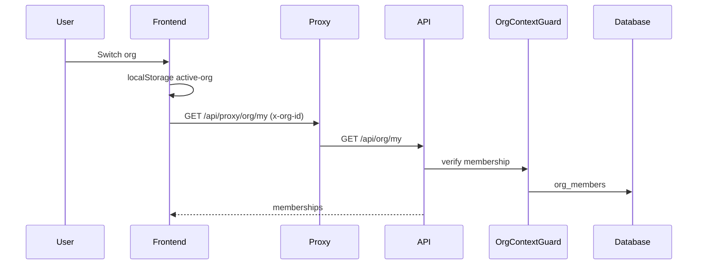

# Feature: Organizations, Teams & Permissions

> Read-only reverse-engineering, 2026-09-06.

## Purpose

`organizations` is the tenant root (164 inbound FKs). A user may belong to many orgs plus a personal scope (`org_id IS NULL`). Human teams and agent teams share `agent_teams` — a self-referencing tree — which is why the UI lives under `/team/teams`.

## User Capabilities

- Create an org, switch active org (stored in `localStorage`, sent as `x-org-id`).
- Invite members; accept via `/invite/:token` (public).
- Assign org roles: `owner` / `admin` / `creator` / `editor` / `viewer`.
- Build a team tree of humans + agents; grant team access.
- Move/copy entities between personal and org scope (`/api/transfer`).
- Superadmin impersonation (separate feature; banner in `features/impersonation`).

## Entry Points

### Frontend

| Path                                  | File                                           |
| ------------------------------------- | ---------------------------------------------- |
| Org switcher                          | `apps/web/src/features/org` (74 external refs) |
| Members / invites                     | `features/settings/settings-content`           |
| `/team`                               | `features/team-2` — agent roster               |
| `/team/teams`, `/team/teams/[teamId]` | `features/team-2/components/teams`             |
| `/team/skills`                        | settings skills page                           |

`features/team` (161 files) has **no route** and survives as a parts bin. `features/agent-teams` is a **DEAD** shim barrel.

### Backend

`apps/api/src/modules/org/` (10 controllers, 42 routes), `agent-teams` (21), `team-roster` (4), `sidebar` (2), `transfer` (2).

## API Endpoints

| Method | Route                          | Handler                         | Purpose                              |
| ------ | ------------------------------ | ------------------------------- | ------------------------------------ |
| POST   | `/api/org`                     | `org.controller.ts:40`          | Create org                           |
| GET    | `/api/org/my`                  | `:58`                           | List memberships                     |
| GET    | `/api/org/:orgId`              | `:64`                           | Get org                              |
| PATCH  | `/api/org/:orgId`              | `:73`                           | Update (owner)                       |
| DELETE | `/api/org/:orgId`              | remainder                       | Delete (owner)                       |
| \*     | `/api/org/:orgId/members/**`   | `org-members.controller.ts`     | Roster + roles                       |
| \*     | `/api/org/invitations/**`      | `org-invitations.controller.ts` | Invite CRUD; `:token` is `@Public()` |
| \*     | `/api/org/:orgId/billing/**`   | `org-billing-*.ts`              | See billing feature                  |
| \*     | `/api/agent-teams/**`          | `modules/agent-teams`           | Team tree + grants                   |
| GET    | `/api/sidebar/team2-bootstrap` | `modules/sidebar`               | Sidebar payload                      |

Class-level guards on `OrgController`: `AuthGuard, ThrottlerGuard, OrgContextGuard, OrgRoleGuard`.

## Main Files

| File                                                  | Responsibility                                   |
| ----------------------------------------------------- | ------------------------------------------------ |
| `packages/api-shared/src/guards/org-context.guard.ts` | `x-org-id` → active membership → `request.orgId` |
| `packages/api-shared/src/guards/org-role.guard.ts`    | Hierarchy; **pass-through if `orgId` null**      |
| `apps/api/src/modules/org/services/org.service.ts`    | CRUD                                             |
| `apps/web/src/lib/org/`                               | Active-org persistence                           |
| `apps/web/src/features/team-2/`                       | Live roster UI                                   |
| `apps/web/src/features/team/`                         | LEGACY parts bin                                 |

## Database Models / Tables

| Table                                                    | Purpose                                    |
| -------------------------------------------------------- | ------------------------------------------ |
| `organizations`                                          | Tenant; `account_type` = `team \| agency`  |
| `org_members`                                            | Membership + org role                      |
| `org_invitations`                                        | Invite tokens                              |
| `user_roles`                                             | Platform role (separate from org role)     |
| `agent_teams`, `agent_team_members`, `agent_team_grants` | Team tree                                  |
| `team_roster`                                            | View — documented as environment-divergent |
| `superadmin_audit_log`                                   | Impersonation (control plane only)         |

## Business Logic

Active org is a **client** concern (`localStorage` + header). Backend trusts `x-org-id` only after `OrgContextGuard` confirms an **active** `org_members` row. Personal scope is the sentinel `org_id IS NULL` (`20260508123331_normalize_personal_org_scope.sql`).

## Validation

Org create/update/id params use Zod (`CreateOrgSchema`, `UpdateOrgSchema`, `OrgIdParamSchema`). Duplicate slug → 409.

## Permissions

| Layer    | Mechanism                                                               |
| -------- | ----------------------------------------------------------------------- |
| Platform | `RoleGuard` + `@Roles()` — `admin`/`superadmin` short-circuit allow-all |
| Org      | `OrgRoleGuard` + `@RequireOrgRole()`                                    |
| Agent    | `packages/agent-policy` + `agent_team_grants`                           |

**CONFIRMED hole:** `OrgRoleGuard` allows the request when `request.orgId` is missing, so a handler that then reads `:orgId` from the path on a service-role client is unprotected.

## External Dependencies

None for core org CRUD. Impersonation uses Supabase GoTrue admin APIs.

## Background Jobs

None for membership. Invite expiry is checked lazily at accept time — **no sweeper** (UNKNOWN whether tokens are single-use).

## Frontend Flow

Switcher writes `localStorage` → subsequent `backend-client` calls send `x-org-id` → sidebar re-bootstraps via `GET /api/sidebar/team2-bootstrap`.

## Backend Flow

`OrgContextGuard` → membership lookup → `request.orgId`/`orgRole` → service uses either user-scoped or service-role client (inconsistent per method).

## Full Request Flow

## Error Handling

Create slug collision → 409. Generic create failure → 500 with `'Failed to create organization'`. Missing membership → guard 403.

## Test Scenarios

Org module tests exist under `apps/api`. Cross-tenant isolation is the highest-value unrun scenario — see `13-testing-scenarios.md`. **Not run** (would write to the configured DB).

## Known Problems

1. CRITICAL OrgRoleGuard pass-through (see billing).
2. `team` vs `team-2` dual trees (~55k LOC).
3. `team_roster` view environment-divergent.
4. `features/agent-teams` and `features/transfer` are dead shims.
5. Invite token entropy / reuse: UNKNOWN.

## Related Features

Authentication, Billing, Agent runtime, Impersonation, Agency clients (`account_type = agency` only flips UI).

## Status

**WORKING** for create/switch/invite/roster. Permission boundary is **inconsistent** on service-role org-id paths.
