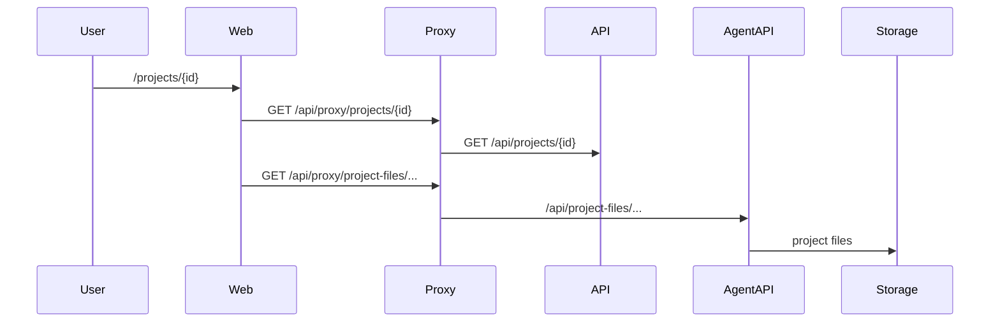

# Feature: Projects (AI App Builder)

> Read-only reverse-engineering, 2026-09-06.

## Purpose

A Lovable/Bolt-style **app builder**, not project-management. A `projects` row is a generated web app with a file tree, Sandpack editor, live preview, optional GitHub import, optional user-Supabase binding, and a (dormant) publish path to `{slug}-app.roas.io`.

Do not confuse with Spaces / Campaigns / Programs.

## User Capabilities

- Open `/projects/[id]` — editor + preview + agent chat pane.
- Import a GitHub repo.
- Bind a personal Supabase project.
- (Intended) publish / unpublish the app.

**There is no `/projects` index.** The path is in `middleware.ts` `dashboardPaths`, so auth runs, then Next 404s. **BROKEN**.

## Entry Points

### Frontend

`apps/web/src/features/projects/` (30 files) → `app/(dashboard)/projects/[id]/page.tsx`.
`RepoImportModal`, `ProjectSupabasePanel`, `DatabaseBrowser`.

### Backend

`apps/api/src/modules/projects/` — `projects.controller.ts`, `projects-files.controller.ts`, `projects-publishing.controller.ts`, `project-sdk-proxy.controller.ts`.
`apps/agent-api/src/modules/project-runtime/` (run/restart/agent-call).
`packages/vibey-sdk` for published-app calls.

## API Endpoints

| Method | Route                                     | Handler                             | Auth                                      |
| ------ | ----------------------------------------- | ----------------------------------- | ----------------------------------------- |
| \*     | `/api/projects/**`                        | `projects.controller.ts`            | AuthGuard                                 |
| \*     | `/api/projects/:id/files/**`              | `projects-files.controller.ts`      | AuthGuard                                 |
| POST   | `/api/projects/:id/publish` / `unpublish` | `projects-publishing.controller.ts` | AuthGuard                                 |
| ALL    | `/api/sdk-proxy/:projectId/*`             | `project-sdk-proxy.controller.ts`   | published-app bridge                      |
| POST   | `/api/projects/import/github`             | projects module                     | AuthGuard                                 |
| \*     | `/api/apps/**` (agent tier)               | `project-runtime`                   | mixed                                     |
| POST   | `/api/apps/:projectId/agent-call`         | agent-api                           | **NO guard on class or method** — UNKNOWN |

Proxy `AGENT_PATHS` includes `apps` and `project-files`, so those prefixes go to `apps/agent-api`.

## Main Files

| File                                                        | Responsibility                                        |
| ----------------------------------------------------------- | ----------------------------------------------------- |
| `apps/web/src/features/projects/components/ProjectPage.tsx` | Editor shell                                          |
| `apps/api/src/modules/projects/`                            | Metadata + files + publish                            |
| `apps/agent-api/src/modules/project-runtime/`               | Runtime + agent-call                                  |
| `workers/apps-proxy` `handleAppRoute`                       | `{slug}-app.roas.io` — **dormant** in `wrangler.toml` |
| `apps/api/src/modules/sandboxes/`                           | Modal.com compute                                     |

## Database Models / Tables

`projects`, `project_repos`, `github_repos`. File blobs in Storage (`project_files`). **`projects` has no RLS.**

## Business Logic

Create project → files in storage → agent edits via `project-files` on the agent tier → Sandpack preview. Publish would register a slug on the Cloudflare worker; that DNS/route is **not enabled**.

## Validation

Thin. `POST /api/apps/:projectId/agent-call` has no guard and no inline secret check (`05-api-map.md`).

## Permissions

AuthGuard on platform project routes. Published SDK proxy is a different trust model (project-scoped). Agent-call is effectively public if the Fly hostname is reachable.

## External Dependencies

GitHub App, Supabase Management API, Modal.com sandboxes, Fly, Vercel, Cloudflare (dormant).

## Background Jobs

None dedicated. Sandbox lifecycle is request-driven.

## Frontend Flow

Navigate to `/projects/{id}` (must already know the id) → load project + files → Sandpack. `/projects` 404s.

## Backend Flow

Platform API owns metadata; agent-api owns runtime file ops because the proxy routes `project-files` / `apps` to the agent tier.

## Full Request Flow

## Error Handling

Missing project → 404. Dormant publish → UI may still expose the action (**UNKNOWN** whether the button is hidden).

## Test Scenarios

`api/modules/projects` 2 tests, `features/projects` 1 test. **Prototype-grade.**

## Known Problems

1. No index route; middleware lists `/projects` anyway.
2. No RLS on `projects`.
3. Unguarded `agent-call`.
4. Published-app hosting implemented and disabled.
5. `@vibey/sdk` has only 3 import sites.

## Related Features

Integrations (GitHub, Supabase), Sandboxes, Public widgets (different: agents, not apps).

## Status

**PARTIALLY IMPLEMENTED.** Editor path exists. Hosting and index do not. Security of `agent-call` is **UNKNOWN / likely BROKEN** if Fly is public.
