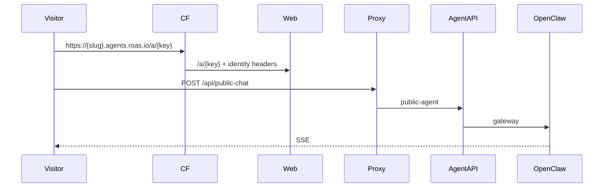

# Feature: Public Agent Pages & Widgets

> Read-only reverse-engineering, 2026-09-06.

## Purpose

Let a customer put an AI employee on the public internet: a page at `/a/[agentKey]` (and `{userSlug}.agents.roas.io/a/{agentKey}`) plus an embeddable widget. Anonymous visitors chat without a ROAS account. The Cloudflare worker mints `x-public-agent-token`; the agent-api public-agent module accepts it.

## User Capabilities

- Open `/a/{agentKey}` as a visitor and chat.
- (Owner) configure the widget in `WidgetBuilderModal` (`features/team`).
- MCP clients can also talk to ROAS as a tool provider (`/mcp/consent`) — related but separate (`modules/mcp`).

## Entry Points

### Frontend

| Path                            | File                                                          |
| ------------------------------- | ------------------------------------------------------------- |
| `/a/[agentKey]`                 | `apps/web/src/features/public-agent/PublicAgentContainer.tsx` |
| `{userSlug}.agents.roas.io/...` | same page, identity headers from `workers/apps-proxy`         |
| Widget builder                  | `features/team/containers/WidgetBuilderModal`                 |

Verified in test-run-01: `GET /a/test` → **404** `Page not found | ROAS` (no such agent). First compile 43.6 s.

### Backend

`apps/agent-api/src/modules/public-agent/` (4 controllers).
`workers/apps-proxy/src/index.ts` injects `x-vibey-agent-name` / `x-vibey-agent-role`.
MCP: `apps/api/src/modules/mcp` (16) + `/.well-known/oauth-authorization-server` (**200** verified).

## API Endpoints

| Method | Route                                     | Handler             | Auth                                       |
| ------ | ----------------------------------------- | ------------------- | ------------------------------------------ |
| POST   | `/api/public-chat`                        | public-agent module | `x-public-agent-token`                     |
| \*     | `/api/public-agent/**`                    | public-agent        | token                                      |
| GET    | `/.well-known/oauth-authorization-server` | mcp                 | public — **200 verified**                  |
| \*     | `/api/mcp/oauth/**`                       | mcp                 | OAuth 2.1 + PKCE                           |
| GET    | `/.well-known/oauth-protected-resource`   | —                   | **404** — RFC 9728 clients may expect this |

`GET /api/auth/session` (Next handler, not Nest) returns raw access + refresh tokens to same-origin scripts for the Chrome extension.

## Main Files

| File                                            | Responsibility                  |
| ----------------------------------------------- | ------------------------------- |
| `apps/web/src/features/public-agent/`           | Public page                     |
| `apps/agent-api/src/modules/public-agent/`      | Token-gated chat                |
| `workers/apps-proxy/src/index.ts`               | Host routing + identity headers |
| `apps/api/src/modules/mcp/`                     | ROAS-as-MCP-server              |
| `apps/web/src/app/(auth)/mcp/{consent,success}` | OAuth consent                   |

## Database Models / Tables

`conversations`, `messages`, `agent_definitions`, `user_widgets`, `user_widget_folders`, `mcp_oauth_clients`, `mcp_oauth_tokens`, `mcp_oauth_consents`, `mcp_oauth_authorization_codes`, `mcp_oauth_authorization_requests`.

## Business Logic

Worker resolves slug → agent → mints public token → web page streams chat like the logged-in path but without a user JWT. Widget is a configured subset of the same agent.

## Validation

Token must be present. Agent key must exist or the page 404s (verified with `/a/test`).

## Permissions

Anonymous visitor scoped to that agent. No org header. MCP scopes advertised: 20 (verified in OAuth metadata).

## External Dependencies

Cloudflare Worker. OpenClaw / OpenRouter for the actual turn. MCP clients (Claude, Cursor).

## Background Jobs

None. Chat is SSE like the authenticated path (may still warm a Fly machine).

## Frontend Flow

Visitor hits `/a/{key}` or custom agent host → `PublicAgentContainer` → `POST /api/public-chat` (via proxy or worker).

## Backend Flow

Token check → same chat pipeline with a public-agent policy slice.

## Full Request Flow

## Error Handling

Unknown agent → 404. Worker down → custom host fails; `/a/{key}` on `app.roas.io` may still work. Failed chat still HTTP 200 with in-band error (same as authenticated chat).

## Test Scenarios

`features/public-agent` 4 tests. `api/modules/mcp` 5 tests. Runtime: `/a/test` 404 verified; OAuth well-known 200 verified. Real public chat **not run**.

## Known Problems

1. Widget builder **IMPLEMENTED BUT UNVERIFIED**.
2. Missing `oauth-protected-resource` well-known.
3. `GET /api/auth/session` exposes refresh token to any XSS on the product origin.
4. Published-apps branch of the same worker is dormant (not this feature, but same file).

## Related Features

Agent runtime chat, Integrations (MCP), Chrome extension.

## Status

**WORKING** for the public page path. Widget config unverified. MCP metadata live; protected-resource doc missing.
